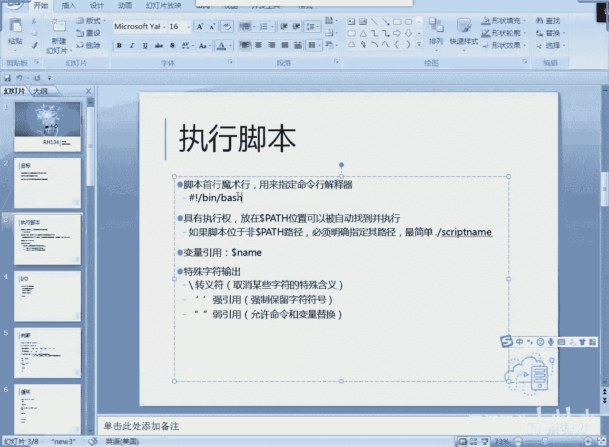
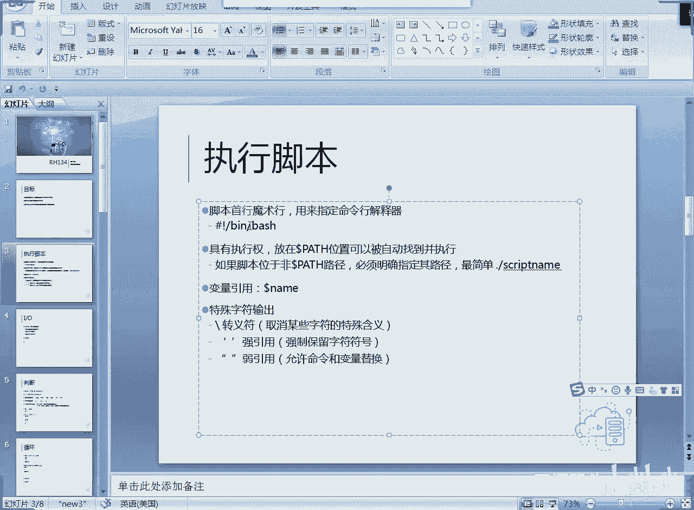
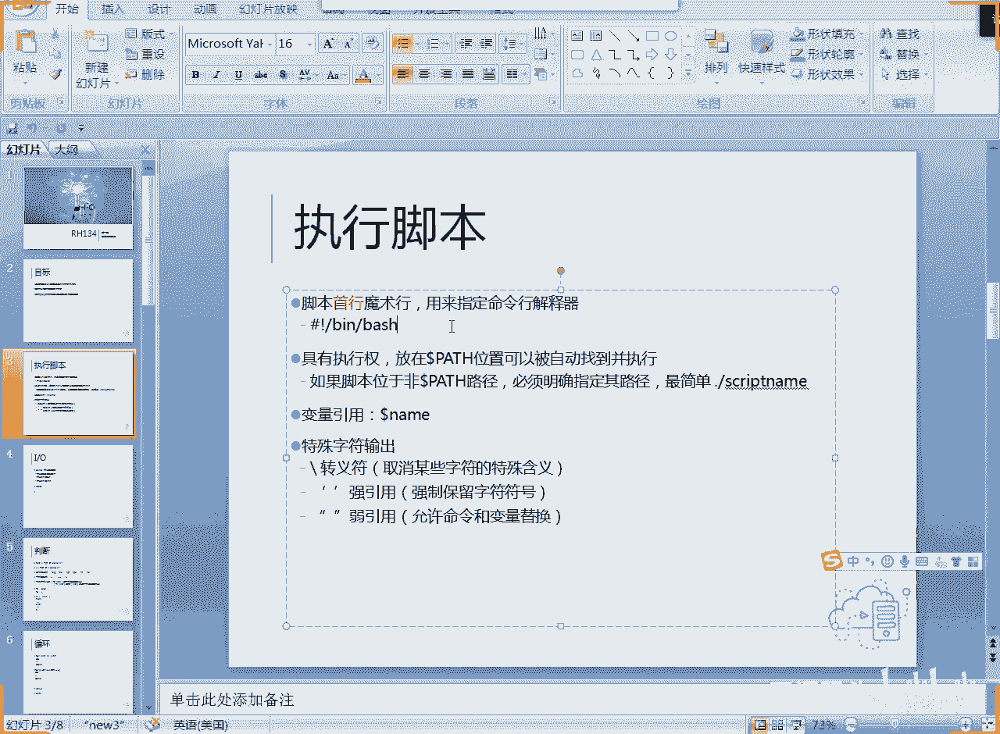

# RH134之linux shell脚本编程1IO和判断(1) - P1 - 开源码头 - BV1YP4y1f7TD

好呃，第一章的内容呢是利用呃80 shell的脚本呢来提高我们的一个工作效率啊，实际上就是把我们平常要做的一些任务呢，所需要输入的大量的命令编到一个文件里面，然后呢让sll呢去呃自动化的按需执行。

这样提高命令的运行效率啊，减少我们的劳动强度。OK我们来看这章的内容啊，总共分三个部分。第一部分呢。啊，就是呃脚本的一个基本概念。再一个就是利用各种这个呃循环或者是呃判断来提高我们这个运行效率啊。

再一个就是正策表达式，总共三个内容啊，那么嗯实际上说到这个呃。就是编程的个概念的话呢，其实我们的计算机啊，其实我们的这个计算机从诞生到现在啊，所有的呃工作逻辑都不外乎就是判断和循环啊。

因为我们计算机现在表现出来的，就是它的能力最大的这种体现，或者是最集中的这种表现啊，我们人要利用它的能力的地方，其实就是两个啊，一个就是循环对吧？呃，就是我们让他不断的重复做事情啊。

计算机肯定是没有没血没弱也没感情，你要他以超高速的这种方式循环循环做一些事情的话啊，它会变得非常的就是给力，他做的事情非常的呃就是比我们人呢要做循环方面要强很多对吧？

所以说计算机的第一个优势就是做循环啊，那么计计算机的第二个优势是什么呢？其实就是做判断。啊，就是判断一下我们的这个逻辑关系啊，是说白了就是所谓的什么鱼或飞呀啊。

或者是什么呃大于等于小于啊这些逻辑判断对吧？当我们进行了这个逻辑判断之后呢，我们就可以让计算机具备一定的这种智能性。啊，一定要智能性啊。

在我们的现在这个人工智能的算法很没有达到一个很完善的这么一个结果之前啊，我们的计算机到目前为止。啊，所有的智能表现无非就是一个a for that。啊，所以说呃所有的编程语言啊，包括你们学过的。

还有没学过的，只不过就是一种不一样的语法习惯。所有的高级语言，它最终实现不外乎就是我刚才讲的这两个道理，对吧？所以你不管拿什么C语言，还有什么java语言，还有什么可能的勾语言，python语言。啊。

这些语言最终它的就是优势。啊，它主要体现的是什么？是计算机的优势。那么计算机的优势，其实我们让它提供一定的逻辑判断，它就是啊能够实现一定的智能性。然后呢，让他重复的做很多事情，重复性的做一些。

我们不愿意人嘛一旦重复了就没意思了。但是计算机呢越重复，它的执行效率越好，对吧？就是说我们可以正好跟人形成一个互补啊，所以说其实所有的编程语言，大致上就这么2块就完事了。那么有些有些人呢可能会呃聊过。

可能会说啊，那java呢是面向呃什么对象的是吧？C语言是面向过程的啊，C加加是面向对象的是吧？各种各样面向过程和面向呃面向这个呃对象。那么这种。只是一种什么呢？只是一种我们的语法习惯，对吧？

就是我们喜欢用什么样的逻辑思路来嗯驱动计算机去工作。但是所有的计算机工作无非就是。就是这两套是吧，一个是桥件判断，一个是循环。那么从计算机诞生到现在，所有的计算机的优势都体现集中的体现到这两个方面。

所以说我们所有的高级语言其实都是围绕这个东西去做的，只不过就是量上发生的变化。那么随着量的变化呢，我们的个程序所能实现的这种什么就是它的能力啊慢慢的量变到什么到质变，所以就会发生什么简单的面向过程的有。

到达我们现在的啊就是面向对象的是吧？所以这个东西只不过是人的一种思想工具啊，不管是面向过程，面向对象还是面向什么各种这方各种这个思路啊，这只是人在驱动计算机工作的时候呢。

一种啊为了让人驱动更更加简单化的一种什么啊，一种习惯或者一种思路。但是最终还是要用计算机的A。对吧for这些东西。那么我们其实bus也可以去理解它的精髓。我们通过bush的这种编程啊，就是脚本啊。

我们用这种方式其实也可以去。

理解到计算机的精髓啊，只不过呢我们这里主要的一个任务是用来做什么？做系统的管理。

啊，做比如说我们的权限的规划啦，是吧任务的规划啦，还有什么嗯服务的规划啦等等等等啊，那我们都可以把我们的要做的事情呢放到一个文本文件里面，然后赋予它什么呢？执行权，对吧？赋予它的一定一定的执行权啊。

就是首先呢我们把我们的命令序列放到一个文件里，然后赋予它这个文件的执行权。那么这里面的命令呢就会一行一行不一解释执行。啊，那么我们知道呢从我们的一个习惯来讲啊，就是解释型的这种这种语言呢，效率都不高啊。

那么效率高的是什么呢？啊，是直接把它编译成我们的CPU指令。

那当然效率高了，因为它很直接嘛，对吧？但是呢。

又很晦涩啊，就是监涩难懂的这种呃这种语句是吧？那但凡解释型的我们一般都是什么呢？都是哎效率要求不是那么太高啊，就是本身指令的效率要求不是太高啊，但是呢功能很强啊，你像那个嗯还有一种就是pyython。

你看这个python这种语言，它既可以做解释执行，又可以做什么呢？又可以做编译执行。那，这就看我们具体怎么去操作它，对吧？所以说呃。按照命令行一行一行的去解释运行，这是一种办法啊。

另外呢就是把这个命令行直接编译成CPU可以直接识别的这种二级制指令。

对吧可想而知那编译好的那个执学效率要高是吧？解释执行的肯定是要慢一点。

那最终呢功能肯定是实现，对吧？好，那我们的就是嗯。呃，我们的linux里面呢也是就是我们可以把我们的命令当成一个一个的什么指令。让我们的这个解释器帮我们解释执行就可以了。啊，那么就说就像我们所知道的。

我们所有的命令其实都是谁来解释的，bu是来解释的，对不对？哎，所以说我们一般呢在编脚本的时候，我们第一行。

啊，第一行我们一般呢把它叫做呃魔术行啊，魔术行就是警号惊叹号打头。井号金叹号打头，从井号的角度来讲，这是一行注释啊，但实际上呢它是有作用的，所以说称其为魔术行啊，这个作用是什么呢？

就是用来指定我下面的那些命令，用什么解释器来执行。

那作为我们目前到目前为止，我们肯定是80，对吧？那有些人说我写python语句，可不可以？我我用python来解释这行。当然可以啊，那么你如果说一个文本文件里写的都是一行一行的python的指令。

那你这个地方就写个什么，写个python就可以了。啊，就是魔术行，后面加上这是一个python解释的指令。那么这个时候呢，我们底下的肯定就是pyython的语句了，然后它照样是正常运行的啊。

所以说我们一般脚本的不只是bu式脚本啊，我们还可以。

使用其他这个语言的这种。脚本，那么说说什么是脚本，就是。

我们把一些命令序列。

啊，按顺序写到一个文文文件里，它就构成了一个什么脚本。啊，但。要有什么执行权？啊，要有执行权。就是给他给这个文件赋予执行权。啊，那么再一个呢就是我们把这个文件呢放在什么？放在pass位置。

指定的那些位置。那那么放在这个位置的话，就可以被自动找到并执行。就是我们用户随便打一个这个脚本的名字，这个脚本呢就会被执行啊，那我们现在呢来做一个最简单的脚本，好吧。

