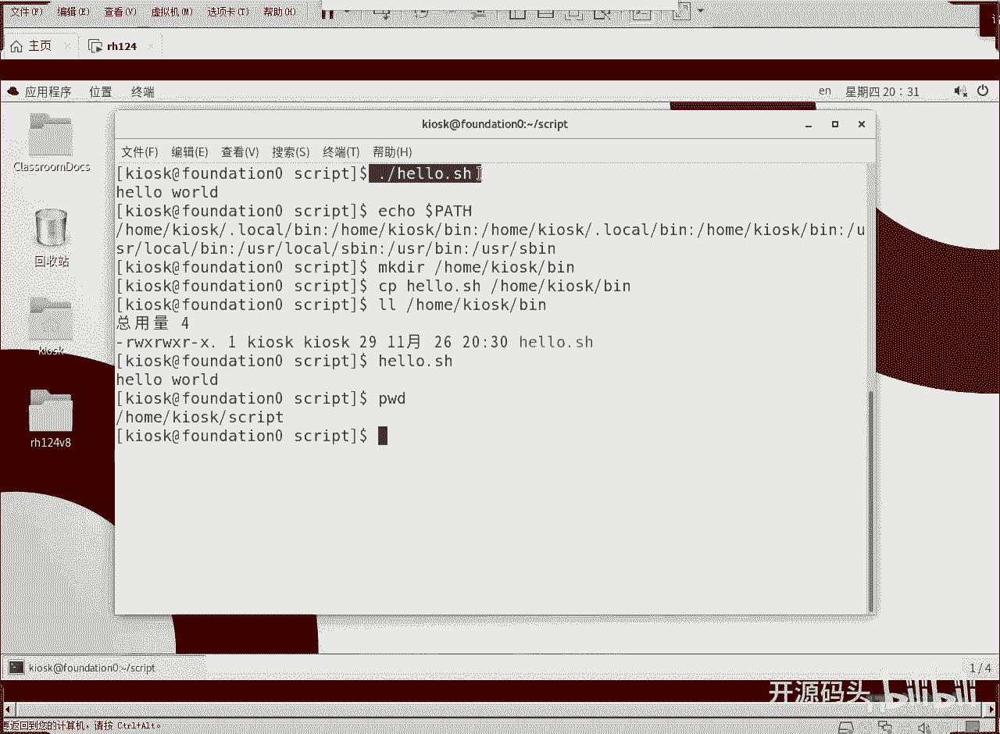

# RH134之linux shell脚本编程1IO和判断(2) - P1：1 脚本编程1IO和判断(2) - 开源码头 - BV1ga411V7BC

因为我们那个脚本呢，它的运行环境就是我们的linux的这个命令卡环境啊，所以说呢不需要像C语言一样写非常多的这种呃包含呀include呀是吧？还有什么调用库调用库呀或者调用头文件呀，不需要写这些东西啊。

嗯，我们可以呢嗯make。当这是桌面哈，现在这个位置在桌面上我进入加目录，好吧。然后还是在真机上啊make122啊一个目录啊，比如说SCRIPT。对吧我们进入这个目录。PWD啊这个目录。然后呢。

我们自己编辑一个文本文件VM啊，比如说hello。点SH。啊，这个扩展名呢最好是写上啊，为什么呢？因为你写上扩展名之后呢，我们的VIM呢一看哦，你是SHshall型的。

它就会给我们做那个基于shall的语法验证并染色啊。所以说我们这个还是比较好的，加上这个扩展名，当然不加扩展名会不会影响效果不会啊。好，那么第一行什么魔术行井号金叹号撇。BIN下面的什么bu。对吧？好。

这是那个魔术行啊，那么这个魔术行开始之后呢，你告诉这个外界啊，告诉运行这个脚本的啊这个呃运行脚本的那个主体啊，或者叫做外部环境，告诉他我以下的指令是由bu士指令。组成的啊，就用bu来解释它就可以了。好。

我们做一个最简单的EQhello word。啊，这样吧，我们不要写双引号。啊，不要写双号。好，WQ存盘啊。Hello hello， hello。你看。默认权限是没有执行权的是吧？

默认权限是不是没有谁哪一个主体都没有X是吧？好，我们加一下chan着mod偷懒了啊，直接加X。那，默认情况就是所有的主体都要加X。好，加完之后呢，我们能看到UGO3主体都有了执行权了。啊。

那么怎么样去执行它呢？啊，首先我们应该知道一下ECHO dollararPAATH。啊，我们linux里面所有的变量都是由doer打头的啊，我们要看的这个路径变量啊，看一下啊。

这就是我们当前用户的所处的环境里面的呃pass这个变量。这个变量呢。它预示着我们在寻找可执行文件的时候的位置。比如说home下的KLZK下面点local目录下的BIN。

KSSK下面的BIN或者home面下的KSK下面的点lock下面的这是又是一个重复了是吧？这是可能是因为多次执行那个初始化脚本，它把这个pass一直往上累积，最后有一些呃有一些不完美呃，不完美是吧？

它是有点。那个重复和前面第一个是好像是重复的对吧？好，最重要的有这么几个啊，通用的位置。你看USR下面的SBIN和US下面BIN。这两个位置其实就是我们的一个系统系统命令和什么和用户命令的两个位置。

对不对？啊，这两个位置呢其实呃包含了我们linux里面几乎大的几乎所有的命令，就是我们常用的这些命令都是在这两个目录下啊，一个是系统类的命令，一个是用户类的命令啊，就全有了啊。

那么我们现在这个路径在不在pass范围内呢。不在吧，哎，那么怎么办呢？啊，那我们只能写上路径了啊。比如说啊我们HELO。你看退保键都引不出来，但是点点是什么？当前目录，当前目录下是hello。

t别它就引出来了吧，回车对，它给我们就显示一口啊，一口命令就显示一个呃嗯hello word。对吧啊就是把一个字符串显示到屏幕上而已啊。就把这个字符串显示到屏幕上啊，那这个呢就是所谓的脚本的概念啊。

我们根据需要把我们的命令写到一个文本文件里面。当然，第一行一定要尽量去写。有人说我不写也能执行啊，那是因为我们默认情况下是这个啊，默认情况下你不写，他都认为是这个。

啊，那么赋予执行权change mode加X是不是就可以了，是吧？好。那么所有的变量引用呢都得前面加do了啊，你不能直接写变量名啊，你看这个doll了 pass啊，系统变量啊也是这样。到了pass啊。

就是路径。我们刚才已经eco到了pas了，看到它指定的位置啊，那有人说我这个哈lo可不可以放到那个位置去，当然可以是吧？我们ECHO。

到了。Pass。我们随便把它放到哪里，放到。我们把刚才我们编的hello放到后放到呃这个目录下，行不行？放在这个目录下行吧啊，就是。Make可迪R。然后呢，在这创建一个这个目录啊。

然后拷贝hello到这个目录。啊，然后LL。检查一下是不是已经考过去了吧，考过去之后呢，你发现考过去后执行权还在啊。好，我们现在还用的着加点撇嘛？不用了，为什么？

因为它在我们的pass路径里指定的其中之一的位置上吧，那我们就直接写了hello。回车。这样就不需要写点撇了啊，为什么？因为它现在处在了home下的开O下的BIN。啊。

而我们当前路径呢是scrape下面的。对吧在KLX下面scriptcr啊，OK好，这就是我们那个呃可执行文件的调用，对吧？可执行文件调用，如果在pass范围内，那你直接写名字，直接写名字好了。对吧？

如果不在这个pass范围内的话，那你就必须加什么加路径，不管是绝对路径还是相对路径，都需要加路径的。

okK好，这就是我们的一个bush的一个整体调用。如何调用，就这样去做就可以了啊。好，那我们来把我们的。

这个剧本呢改一下。诶。脚本改一下啊，然后我们后面加一个什么，加个金叹号。给他前面加一个什么加一个井号。几号。好，我们想输出的这个井号加静叹号，可运行一下。你会发现它输出不了了啊，输出不了什么原因呢？啊。

井号呢代表是吧？注释是吧，注释你显示的是一个空东西，井号后面其实是个注释，对不对？那么我就想显示井号hellowood怎么办呢？哎，我们可以试一下这个。用双引号把它们引住。

是不是井号hello world静叹号是不是就出来了啊，那么这种情况称为什么呢？称为一就是字符串引用。我们用双引号把这个字符串引住。那么在一al的时候呢，我们依al后面的元素用双引号引住了。啊。

这样的话我们就可以显示出来。但如果说我们不去用双引号引柱的时候呢。啊，那意思就会变成什么？变成eal一个空东西。然后呢。后面是啊。注释。啊，所是有些特殊字符呢，我们就需要把它什么。😊，把它引住啊。

把它用双引双引号给它引住啊。

双引号引住的时候呢叫弱引用。为什么叫弱引用呢？啊，我们可以在命在它那个字符串里面。显示命令或者是变量替换什么意思？

来。我们先给它来一个变量赋值，好吧，变量赋值比如说嗯。I就写就写个I吧。A等于。嗯，张三。啊，A等于加3。啊，甚至于什么呢？我们不需要用这个不需要用这个双引号引也可以啊，I等于张3。啊。这是个变量赋值。

然后我们在这里。应该是什么井号就不井号就暂时不管它了。我们来看一下这个变量引用的概念啊。我们在这里呢把一把变量显示过来。Dollar哎。啊，到了张三hello word是吧？啊，我们试一下。

这个我们双我们还是用双引号把它引住，表表示一个完整的含义，是吧？双引号。好。WQ啊，然后呢运行一下当前目录。看一下。这个时候运行的时候，张三就被替换到了hello我的之前。对吧当然。

这说明我们的双引号呢可以把井号呢保持原字符串，原字符输出。但是呢它把doI呢不是按字符输出的。啊，特殊字符。特殊符号它不及它就原样显示出来。但是对于变量。

可以被解释执行的，就是变量是可以被解释的，就是这句话，允许。变量替换或者是允许执行命令。啊。那我们可以呢。再来试一下这个呃命令替换。

EC抽。好，那么这是不是一个命令？对不对？这是一个命令。然后我们eco的时候呢，你觉得它会把这个原字符串e扣出去呢，还是把这个呃命令执行完的结果给它显示出来呢？来看一下啊，WQ啊，我们为了验证。

我们先来看一下ET下的这个。这个文件这个文件里就这么个东西啊，就这么一个内容。好，我们现在运行我们的hello。看第一行I肯定是被替换掉了吧。那后面这个呢。是不是把这个文件。

把这个命令的内容结果显示出来了。

对不对？好，这个意思就这样啊，就是在双引号里面，它是允许进行命令和变量的替换的。啊，允许性面临令很变变量的这种替换操作啊，所以说我们把它叫什么叫弱引用。啊，那么现在问题来了，如果我一定要显示这个。

我想把这个。这个字符串就。do了A不要给我解释，我就要显示出一个do了I。是吧还有doll了 cut，我就显示这么一个明确的字符串出来，并不是要什么呢？要。你执行或者解释这个命令。

或者是执行解释这个什么这个变量。好，我们加一个强引用，强引用什么呢？叫单引号。单也好。用单引号把它引住。这个时候就是强引用。这时候呢里面的东西任何字符都是原字符，不做任何解释。好，看一下。

是不是就是我们单一号引住的那个字符原样被输出出来了，并没有被执行，对吧？哎，这就是我们这个。

啊，我们这里所说的那个强引用弱引用的概念，对吧？所以有时候我们如果说在输出的内容里面啊，因为它里面有很多空格或者特殊字符，啊，要输出，对吧？我们要把特殊字符也要按按字符的方式来输出哎。

这个是我们用弱引用啊，它可以呢。插入一些变量或者是命令。那我们就会看到这个变量和命令的结果。并且呢由于双引号引住了，整个这个语法呢显得非常的标准，而且漂亮啊，而且里面的变量呢会被替换多好是吧？

所以双引号比较常用啊，那还有另外一种方法叫转移符。转移符的意思是什么呢？啊，就是不要去解释这个字符啊，你比如说刚才的井号，井号代表的是注释。你别把它解释成注释呀，对吧？因为我想把它当字符输出。

所以说这个那称为什么称为转移符，取消那些字符的特殊含义，让它就按照纯粹的字符去显示，对吧？那我们可以这样。

来。还是VIM哈lo是吧？这个时候呢我们就不说什么强引用这些头啊，把强引用给它。去掉啊，然后把刀的前面给他加个什么，加个捺。一旦刀了变成纯粹的字符以后，它后面的东西是不是就是纯字符了，对吧？

它就不会把它当变量去解释。啊，然后一样的道理。一样的道理是吧？好，我们试一下。哦。第一行没有问题。到了哎hellowood这行显示出来了是吧？第一行没有问题。后面为什么？显示有问题呢。

你看他说括号附近有问题，也就是说括号对于我们的这个解释执行来讲。也是特殊符号啊，你看括号这个东西，它也是特殊特殊功能是吧？我们给它什么，按照标准的括号给它去。显示就可以了。再来。这次是不是就可以了？

cutt一下，直接看一下这个。这个。语句的特点啊。这说明什么doller是一个特殊字符，是不是括号也是特殊字符？单括号的这个意义在于什么呢？它里面应该是一组命令，形成一个进程啊。如果说有好几个命令。

我们想把它当成一个进程，那么用单括号把它括起来。啊，所以说括号也是一种特殊符，那我们就把特殊符的那个意义给你去掉。前面加个大就代表你后面再特殊，你也是一个字符，不能解释不解释是吧？好，这是一种什么呢？

叫做。转移符啊，如果有大量的这种特殊符号在一个字符串里面，那就不推荐你用这个转移符了，是吧？转移符你像这个就比较好，这一行里面只用了一个转移符，是不是就？比较简单一些，但你这行里面用了多少个转移服？

用了三个吧，那就不如像以前一样用什么，用强引用，直接单引号把它引住就行了，里头也不需要加什么转移符。因为单引号引住的部分。完全就是字符，对吧？好，这个部分呢我我们记住一下就可以了啊，就是说。

就跟我刚才我在调试的过程当中一样，就说你在就说。不太明确它这个结果输出的时候呢，你就让他执行一下，执行一下，结果马上就明确了是吧？啊像呃。

一开始我们可能不知道这个括号是特殊符号。对不对？是我们解释就是bush解释的一些特殊符号。那我们就是呃输出的时候，他就报错。对不对？他就报错了啊，那报错呢我们就把括号呢也给它做成转移啊，做一下转移。

做成转移之后呢，它就成为纯字符，就没有这个bu式解释的那个。作用了是吧。好了啊，那我们呢呃这是我们。

啊，执行脚本所要懂得的一些道理啊，需要用到输字符输出的时候，哎，我们应该。知道有些东西呢。特殊字符它是有含义的。如果一行里头只有极少量的特殊字符，我们用转一符就可以把这个用捺这个转一符就可以把它转成。

标准字符啊，转就是取消你的特殊含义啊，取消bus的解释。啊，那如果说一行里头这种特殊字符太多，每个前面都加个那，感觉的很费劲儿。那你干脆直接在拿什么单引号，把这个串耳字符全部给他是么引住，这个时候就是。

强引用啊，因为它强制保留每个字符作为符号来显示，而不是什么。不是有特殊含义。啊，那若应用的话呢，允许我们进行命令和变量的替换。啊，其实这样的话呢更好啊，这样的话呢我们感觉呃。

就是说我们的那个字符串呢会变得特别智能，对吧？哎，本来是一个字符串，哎，结果呢里面的某一部分还能被解释出来。多好的一个操作啊。再多加一句话是吧？就是特殊字符呢呃。不解释啊。允许命令和变量替换。但是呢。

特殊字符不解释啊特殊字符。取消。含语啊。啊，特殊字符是被取消含义的，但是呢命令行和变量是可以被替换的，是吧？好，eco命令呢我们用起来就这个样子是吧？

