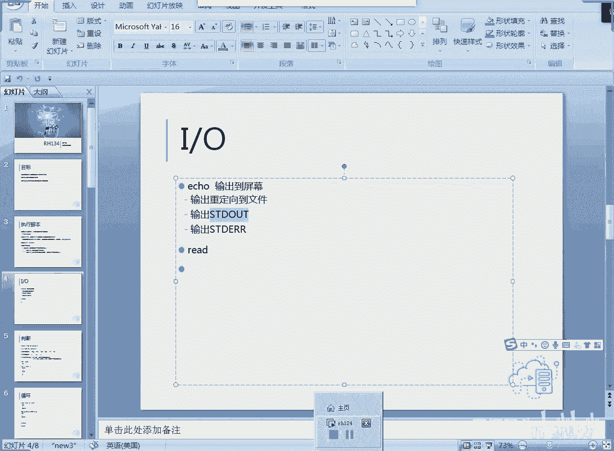
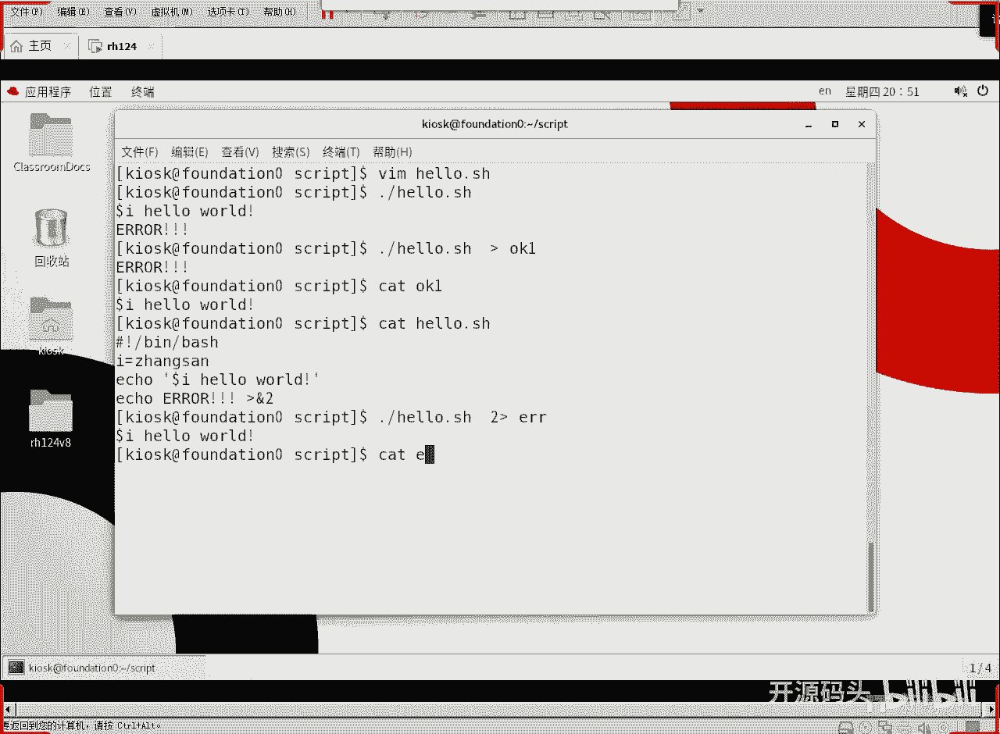
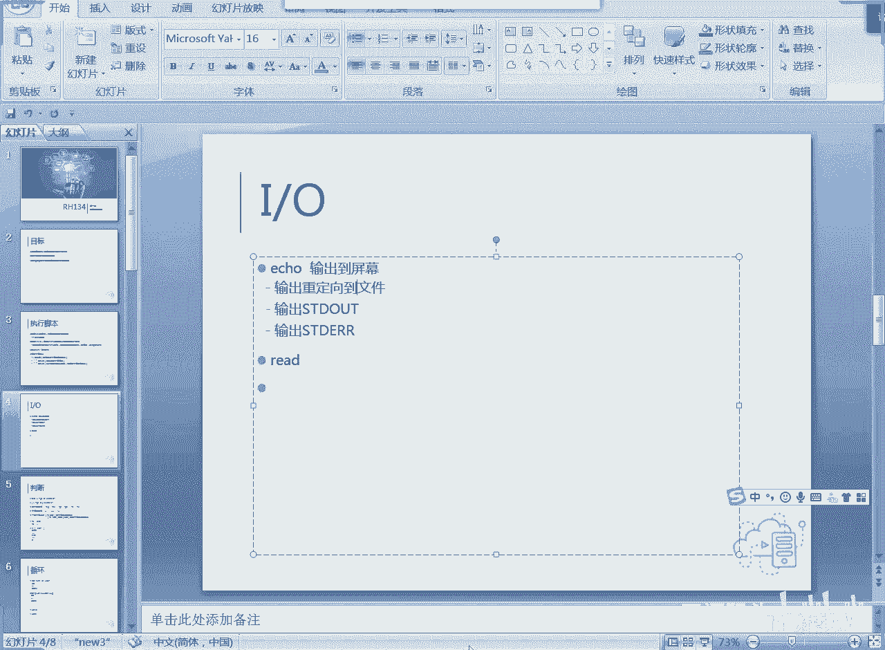
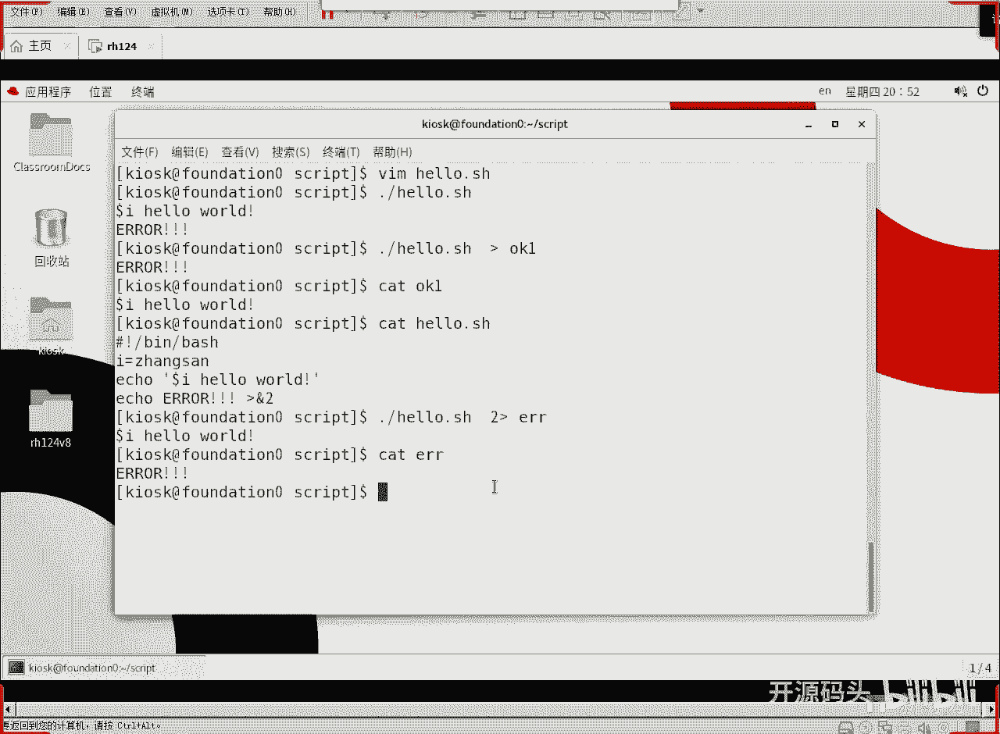
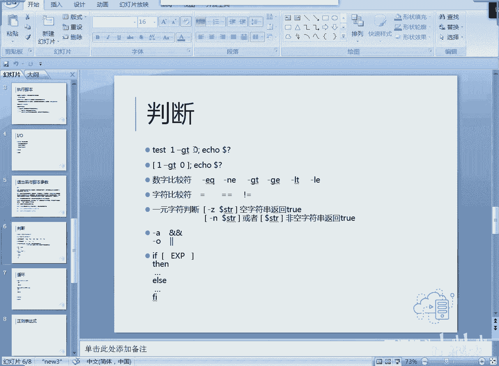

# RH134之linux shell脚本编程1IO和判断(3) - P1 - 开源码头 - BV1re4y1Z7rb

但是我们之前在第一本书的时候，其实聊到一个话题，就是一口输出的东西，它不是它是不是是标准的输出啊，如果说我们想把它作为一个标准的错误呢，那我们就是把它重定向到什么，重定向到一个余二上，对不对。

这个部分的话，我我们还需要解释吗。

还是我们这个hello吧，然后我们去掉一行，我们就显示一个东西啊，我们要显示一个东西啊，然后呢我们再来显示一个东西，再来显示一个e r o r我们也不要做判断啊，第一个是标准显示。

第二个呢我们要把它定到于二，这个是必须是靠住的啊，不应该加空格，那么显示到屏幕的时候感觉是一样的，对不对，显示屏幕的时候是两行，各显是各的对吧，但如果说我们在重新下载个文件的时候。

比如说我要把结果输出到一个文件啊，输出到一个呃，ok这个文件吧，o k e吧好吧，回车，但你会发现hello world这一行呢不见了是吧，但是错误这一行留下来了啊，因为我们这个默认的是一结构好。

是不是一个所谓的叫做标准输出啊，我们来看一下k1 ，这是一个标准输出吧，啊那么标准输出我们会把它重新下走，但是并没有把标准错误重新下走，对不对，哎那么因为什么它就成了标准错误了呢，我们来看一下。

hello，这个是不是我们把它重定向到余二，余二实际上就是2号啊，2号呃就是i o的那个编号二对吧，作为标准错误，我把它重叠相成标准错误了，所以说这一行出来的东西其实是按错误走的啊。

那我们可以怎么可以把这个把错误给它定走啊，二啊，然后122，然后我们把它定成把二呢输出重定向到error这个文件里面回车，你看错误不显示hello的，显示出来了，那个error没有显示出来，因为什么。

因为我把错误重定向到error文件里，那我们看看error。

就说我们用echo呢输出啊，默认都是输出到屏幕的，但实际上呢我们的标准的输出和标准的错误啊，我们是可以把它重定向到不同的文件里的，那怎么样去产生一个标准的错误呢。

就是把字符串重定向到什么余二这个位置上啊，除非像余二这个时候呢，它就成为一个什么，就成为一个所谓的叫错误信息是吧，标准错误，那我们从这个重定向上就可以看出来啊，我要把错误重定向到erroid这个文件里。

所以说只有正确的显示，而错误呢被重定向到文件里了，所以是不是可以区分开的对吧。

ok好这是我们的剧本的一个脚本的一个输出的一个概念对吧，我们如果需要的话，我们是可以把它输出成标准输出或者标准错误的啊，就是把它重定向到鱼案上好，那么输入怎么输入，那输入有两种啊，一种是什么呢。

read一种是什么呢，参数啊，就是我们给这个给这个脚本呢加参数，就脚本运行的时候，我们后面给它加个参数，就相当于输入了，我们可以试一下。

vm点，hello，a等于张三不要了啊，read杠p，what's your name，然后呢read一个i，啊后面这个错误的就不管了，哎呦啊不管了，我们还没有做判断的啊，好，好。

那么这个read呢就是读读什么，读your name，然后呢你后面写上一个i，那这个读到的内容就付给i，然后这个它这个地方呢把i显示出来是吧，那我们想调用变量的话。

是不是用双引号或者是不用任何引号都可以，是不是我们用双引号是因变量在这里面是可以被解释的是吧，好开始运行了，dp，hello，回车，your name，your name，张三啊，他就回答张三。

hello world对吧，那同样的道理，your name李四，那这个时候他就是李四，hello啊，很简单，就是一个什么书，他就提示一个字符串是吧，print提示一个字符串，然后呢读一个变量啊。

把键盘输入的东西读到这个变量i里面啊，下一步就是dollar i hello world，对不对，这是交互式操作对吧，那么同样的道理呢，我们输入的内容呢，我们用参数的方式来实现怎么做呢，写一个。

参数的脚本吧，要不然我们这个脚本最后变得一直保持不了，一直保留不下来是吧，井号惊叹号编下面的boss，我们这样来啊，就是呃e e c h o还是dollar 1 hello world，走啊。

change model加x参数，然后呢我们来调用一下点撇参数回车，它是不是光显示，hello word啊，那我们可以后面加参数了啊，张三回车，然后再加李四回车，是不是变成什么呢。

就是说我们在这个调用这个命令的时候呢，后面给它加上什么，加上参数，它直接就把参数显示到我们的那个输出里面了啊，这个操作呢就是参数传递，那么很简单，到了一刀了一就是第一个参数啊，刀了一就是第一个参数啊。

然后呃看看我们这能不能输入中文，还可以输入中文是吧啊，那我们可以呢把这个把这个剧本变得更加有趣一些啊，比如说脚本啊，脚本变得非常缺钱啊，然后o啊，然后e c h o什么呢，然后我们再来一个。

是不是也可以有第二个变量对吧，第二个变量你，别，加热闹，好车盘退出啊，好那我们调用的时候呢，就这样，第一遍参数，然后第一个是张三，第二个是李四，两个参数啊，回车张三，hello world，李四。

你别加热了啊，这就两个参数就被各自调用了，是不是，到了一到了二依此类推，如果有第三个参数呢，那就到了三对啊，这样的话，那我们就可以把这个程序就是输入的参数的，除了我们刚刚那个read。

啊用瑞的命令进行交互式的获取参数之外，我们还可以呢啊用这个传递参数的方式来实现是吧，参数传递的方式，把这些啊把我们那个脚本后面可以允许加参数啊，那我们刚刚这个参数这个脚本如果后面不加这些参数的话呢。

它大不了什么，它不显示那个那个位置，那个材料，因为它是空的嘛，它不显示是吧，hello word，你别加热了，就成了这个歌给你，ok好，这就是我们的那个呃io啊。

程序呢一旦有了i o那我们就比较简单了啊，就是我们就可以呢让这个程序变得具有什么具有趣味性啊，它可以根据你的输入啊，然后决定一些输出啊，这我们还没有讲什么呢，还没有讲判断对吧，那当我们讲开。

当我们把这个判断说了之后呢，我们可以让程序的这个表现的更加更加灵活，表现出更加呃我们说的呃有趣的这个啊，或者是功能更强的这个方面，好刚才那个dollar dollar数字啊，到了零到了一到了二到了三。

它的作用就是这个，dollar 0就是这个bus文件本名啊，这是我我是我这个名字叫参数对吧，那我就是参数啊，然后额个位数的话直接就到了参数字，但是如果说是你的参数达到十个以上的话。

那你就知道什么到了大括号括住啊，用大括号把这个这个因为他有歧义了嘛，你到底是到了一后面是零还是到了十是吧，所以最好是把那个用大号把它括住之后呢，啊就没有歧义了，后面到了本质上来讲。

这都是都是我们约定好的这些变量啊，我们后面呢根据需要我们不断的增加，我们把它叫做特殊变量出来呃，脚本参数的概念是吧，脚本参数到了零，ok还有一个到了问号，待会我们就聊是吧，那么现在呢我们来看一下判断。

一开始我就给大家讲了是吧，就是说呃所有的编程语言，它不外乎就是一个判断，一个循环，那么从冯诺依曼计算机诞生到现在，计算机的最大的优势就体现在这两个环境上了对吧，判断让我们的程序具备智能，具备智商啊。

具备一定的这种就是判断能力吧，啊好像跟一个有有思想的人一样，其实对于计算机本身来讲，他理解不了这个含义，但是它可以根据你的条件呢给你做不同的什么方向，给你去不同的结果，所以说判断呢就表现出一个智能性啊。

但是这个智能性到现在为止啊，我们虽然说现在也在搞人工智能对吧，但人工智能呢只不过是一些模拟这种呃思维逻辑判断的流程，但他真正这个人工智能也会有自我意识吗，这些东西可能还会还会很久远啊。

就说让一个呃冷冰冰的计算机，或者是让一套算法，它能够得自我认识自己，就像我们人一样，他有自我意识啊，甚至于什么，哪怕你出一些，表面上看上去是感情的一个东西，没有啊。

就是人工智能都发展到我们现在今天也是一个判断的概念，最终也是一个判断的概念是吧，他还没有达到那个所谓的叫啊，我们像人一样是具备一定的这种智能出来是吧，他说他的所有算法的智能性都体现在一个判断上。

根据条件来出一个结果就行了啊，现在大数据大数据的判断也是什么，也是一种基于大量数据统计下的一种判断啊，他大大概率的判断你想买什么东西啊，或者大概率的判断，就是说啊什么多少人会买什么东西，都是判断啊。

只不过就是规模数据规模更大了而已，所以说我们计算机的本质其实就是判断加循环，计算机在只不过在忠实地反映编程者的一个思想，对吧啊，计算机本身并没有任何思想。

包括现在人工智能出来也是一种什么大概率的判断的概念是吧，好我们来看一下判断啊，一个判断的最直接的用法就是test test一杠g t，great对吧，就是一大于大于一大于零啊，然后一大于零。

那么它一口到了问号啊，这个到了问号，我们就来判断一下，我们把退出码放在i o后面对吧，我们刚才在呃在这个i o的时候呢，呃我们做参数传递的时候就碰到这个刀了，数字以及到了问号的概念是吧。

到了问号就是什么退出马就是一个去一个命令，他执行完了啊，它的结果是我是处，那就是零，那么只有零代表正确，那非零代表各种各样的错误，我们一个一个剧本，一个程序可以返回代码啊。

返回如果说我们在编编这个呃java的时候啊，我们希望呢就是说当出现错误之后呢，我们为了表达出这个错误的这个不同，我们可以给不同的错误呢编不同的编号啊，然后如果是正确的结果，那就返回零啊。

我们所有的已编好的命令基本上都是这个样子的，test就是后面是一个表达式，这个表达式呢一大于零吗，eq到了问号就是看一下test命令执行完的结果是true还是false。

