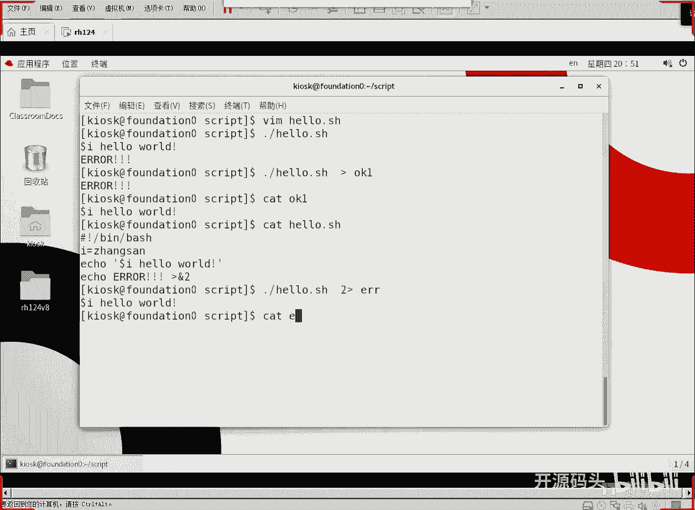
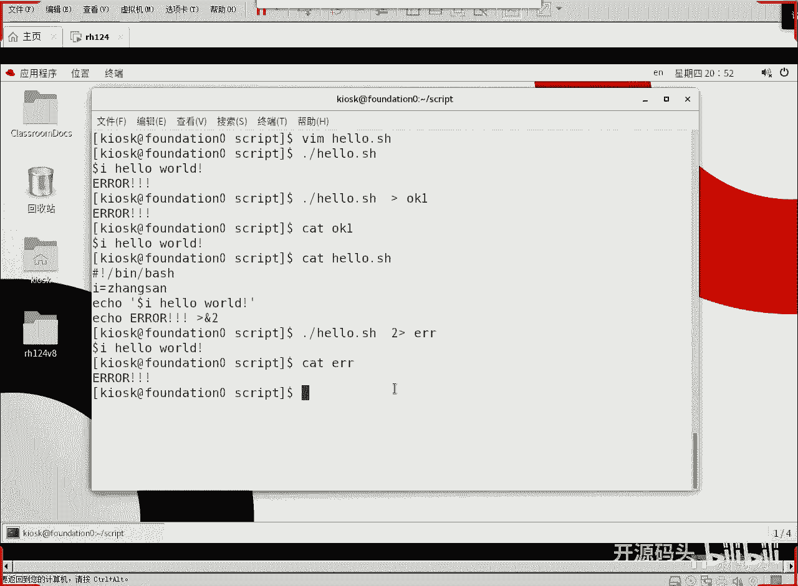
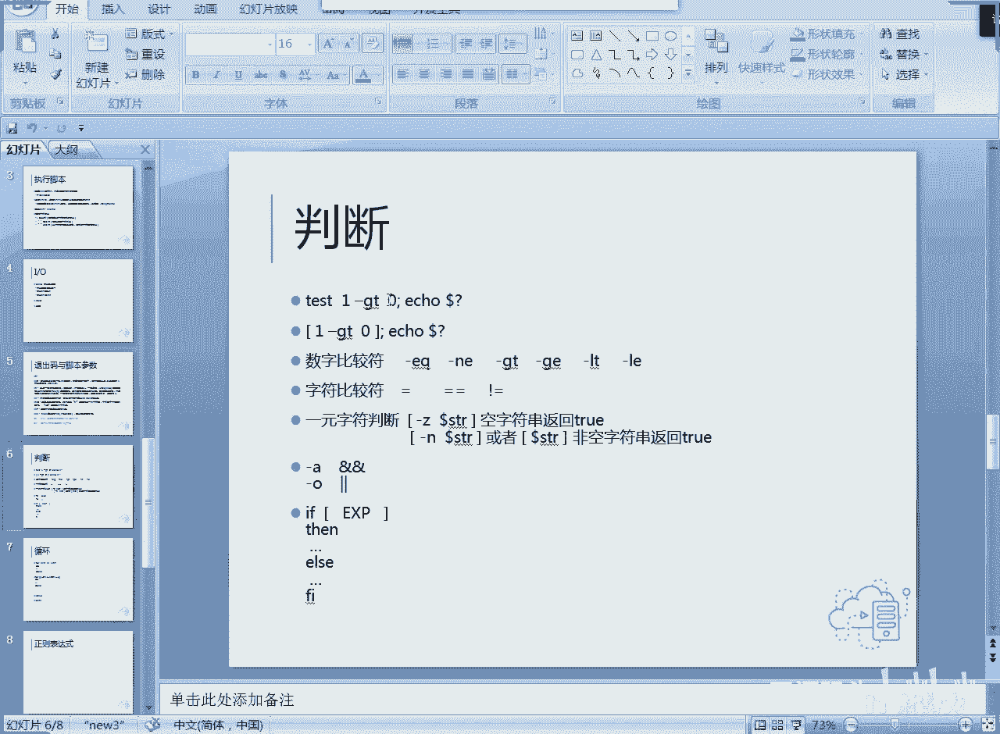

# Linux Shell脚本编程：1.3：IO与判断 🐚


在本节课中，我们将学习Shell脚本中的输入/输出（IO）操作和条件判断。这是让脚本变得“智能”和交互性的关键。我们将从如何区分标准输出和错误输出开始，然后学习如何从用户那里获取输入，最后深入探讨条件判断的基本语法。

## 标准输出与标准错误 🔄

上一节我们介绍了基本的脚本结构，本节中我们来看看如何控制脚本的输出。在Linux中，命令的输出分为两种：标准输出（stdout）和标准错误（stderr）。默认情况下，它们都显示在屏幕上，但我们可以将它们重定向到不同的地方。

以下是一个演示脚本，它同时产生标准输出和标准错误：

```bash
#!/bin/bash
echo "Hello World"          # 这是标准输出
echo "Error Message" 1>&2   # 这是标准错误，重定向到文件描述符2
```

运行这个脚本时，两行信息都会显示在屏幕上。但如果我们使用重定向操作符 `>` 将输出保存到文件，情况就不同了：

```bash
# 运行脚本并将输出重定向到文件
./hello.sh > output.txt
```



执行后，只有 “Hello World” 被写入 `output.txt` 文件，而 “Error Message” 仍然显示在屏幕上。这是因为 `>` 默认只重定向**标准输出**。


如果我们想把**标准错误**也重定向到文件，可以这样做：

```bash
# 将标准错误重定向到 error.log 文件
./hello.sh 2> error.log
```



此时，“Error Message” 会被写入 `error.log` 文件，而 “Hello World” 显示在屏幕上。`2>` 中的 `2` 代表标准错误的文件描述符编号。

**核心概念**：在Shell中，文件描述符 `1` 代表标准输出，`2` 代表标准错误。重定向操作 `>` 等价于 `1>`。


## 脚本的输入方式 ⌨️

了解了输出，我们来看看脚本如何接收输入。主要有两种方式：交互式的 `read` 命令和通过运行参数传递。

### 使用 `read` 命令交互式输入

`read` 命令会等待用户从键盘输入，并将输入的内容赋值给一个变量。

以下是使用 `read` 的示例脚本：

```bash
#!/bin/bash
read -p "What's your name? " name
echo "Hello, $name!"
```

运行这个脚本，它会提示 “What‘s your name?”，等待你输入（例如“张三”）后，就会输出 “Hello, 张三!”。

### 通过参数传递输入

另一种更常见的方式是在运行脚本时直接传递参数。脚本内部通过特殊变量来获取这些参数。

以下是通过参数接收输入的示例脚本：

```bash
#!/bin/bash
echo "Hello, $1!"
echo "Don‘t be noisy, $2!"
```

运行脚本并传递两个参数：


```bash
./greeting.sh 张三 李四
```

输出结果为：
```
Hello, 张三!
Don‘t be noisy, 李四!
```

**核心概念**：
*   `$0`：脚本本身的名称。
*   `$1`, `$2`, `$3`...：分别代表第1、2、3...个参数。
*   `$#`：传递给脚本的参数个数。
*   `$@` 或 `$*`：代表所有参数。

当参数超过9个时，获取第10个参数应使用 `${10}` 而非 `$10`，以避免歧义。

## 条件判断：让脚本具备“智能” 🧠

程序真正的“智能”体现在条件判断上。它允许脚本根据不同的情况执行不同的操作。在Shell中，我们常用 `test` 命令或 `[ ]` 符号来进行条件测试。

`test` 命令的退出状态码（保存在 `$?` 变量中）表示测试结果：`0` 代表真（True），非 `0` 代表假（False）。

让我们看一个简单的数值比较示例：

```bash
#!/bin/bash
# 测试 1 是否大于 0
test 1 -gt 0
echo "Exit code for ‘1 > 0‘ is: $?"
```

运行后，`$?` 的值会是 `0`，因为 `1 -gt 0`（1大于0）这个判断为真。

**核心概念**：在Shell的世界里，**退出状态码 `0` 代表成功/真，任何非零值都代表失败/假**。这是所有Linux命令和条件判断的基础逻辑。

条件判断通常与 `if` 语句结合使用，其基本结构如下：

```bash
if [ condition ]; then
    # 条件为真时执行的命令
else
    # 条件为假时执行的命令
fi
```

例如，一个检查参数是否提供的脚本：

```bash
#!/bin/bash
if [ $# -eq 0 ]; then
    echo "No arguments provided."
else
    echo "The first argument is: $1"
fi
```

---



本节课中我们一起学习了Shell脚本编程中至关重要的IO操作与条件判断基础。我们掌握了如何区分并重定向标准输出和标准错误，学会了通过 `read` 命令和脚本参数两种方式获取用户输入，并理解了条件判断的核心机制——基于退出状态码的真假逻辑。这些是构建更复杂、更智能脚本的基石。在接下来的课程中，我们将利用判断语句，让脚本能够根据不同的输入做出不同的反应。