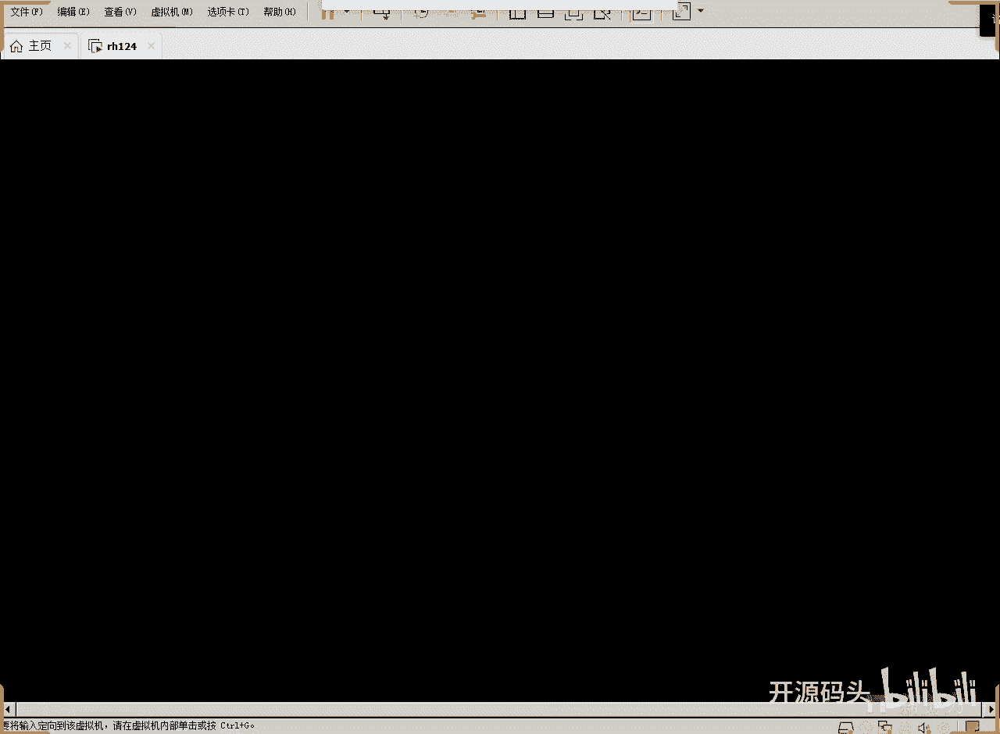
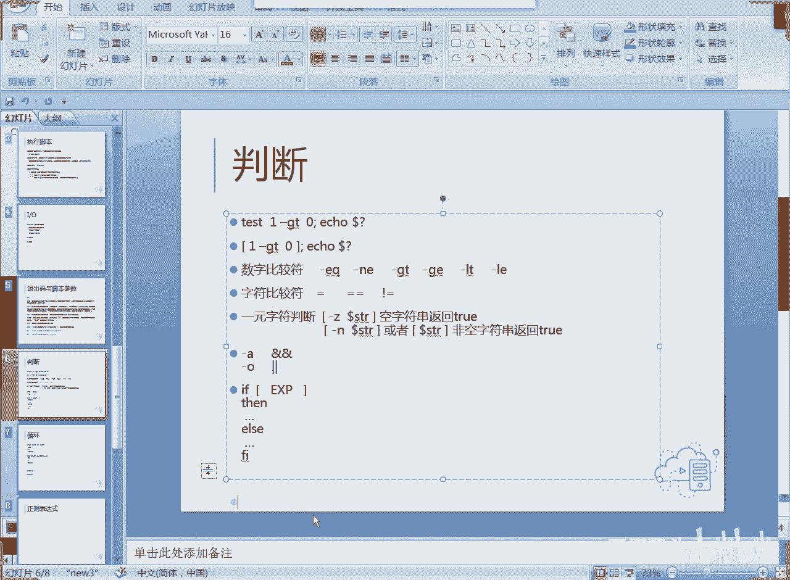

# RH134之linux shell脚本编程1IO和判断(4) - P1：1.脚本编程1IO和判断(4) - 开源码头 - BV1Xt4y1E7h9

Test。一。杠g0。看。没有结果，对不对？但是呢上一条命令执行结果用doller什么问号就搞定了。00说明是处是正确的啊，然后我们再来个一大于3，回撤再来一下。看它是什么一吧啊它的值是一。啊。

这个就是所谓的翻回码，任何一个命令或者脚本都应该有返回码啊。当然如果说你没有翻回码，默认返回码是几？当然是零喽，对吧？啊，如果你为了表达出不同错误，那你就在代码里面就要体现出来。啊。

就是说我们出现什么错误了，我们给它返回一个什么值。对吧返回个什么值啊，我们可以简单尝试一下，好吧，但是我们这个呃我们这章节里面书里面是没讲啊吧，我们可以试可以简单的试一下，好吧，VM。呃，我们来一个。

判断吧。嗯，t或 force点SH好吧。好，还是那个概念，井号惊叹号撇BIN。下面的什么？Bs。好，然后我们可以做一些。诶。判断啊read杠P啊，然后呢呃。你要怎么写？你的您的姓名。好，这是我们要呃。

提示的东西啊，给这一个变量哎。啊，用户输入一个姓名对吧？啊，然后呢我们呃。给他判断一下啊。衣服。中括号括住里面就是test的test就是用中号括住就代表test。所以说我们的t测就可以不写了啊。

中括扩住，然后呢嗯。Doer。はい。Dyu。哎，我们洗个明星吧，明星是谁？明天写给谁？Xminime。你们喜欢谁？好吧，如果说啊这个刀了来等于范冰冰啊，然后呢我们就开始。That。开始执行啊。啊。

这些什么无非就是表达一下嘛啊，对吧？啊表达一下啊。是个好名字。我们中文还去不掉。这是中文的银号，不管用的啊，中文银号肯定不行啊。我们也得用英文的引号，然后啊这是个好名字。啊，然后呢否则呢。一Q。嗯。

不好。嗯。这不是名字是吧？这。不是。我喜欢的名字。但是现在呢我需我我是认为这是就执行错误了对吧？然后我们加一个什么EXIT。Yi。然后fi。啊，你可以看到我刚才打的时候，有些同学已经注意到。

就说我们打的这些命令呢，它好像是这个呃自动做的缩进啊，我没有打缩进，它这个缩进都是他做的。这说明我们写扩展名的好处啊，你写了扩展名，我们的VIM它能认出来，它会自动的给我们做缩进。

然后保证我们的那个内内容看上去很漂亮是吧？那就是什么概念？就是说你的姓名，如果是范冰冰，这是个好名字，我们没有输出啊，就是没有这个翻回值，没有翻回值，默认就是0。但是我现在如果你不是范冰冰，我不喜欢啊。

这不是我喜欢的名字。然后呢。代表一个错误，代表你答的不对，好吧，O。Ch只猫的。加X。TF。是吧，加上执行权。点撇TF。回去。啊点HH回车您的姓名啊，范。冰冰。好，回车。哇，这个什么意思？第三行。嗯嗯。

难道我们的引号有问题了吗？果然哈这个运算符左右都必须空开啊，要不然这就成了一个字符了，是吧？成了1元了啊，OK。好，再来一下。走。算。是不是你们觉得这个这个明星不好啊？对吧回车这是个好面子。

eay关键是我们要什么我们EQ到来。啊。重来一下。太累了。范冰冰。回车，这是个好名字。主要的我们要看他的什么，看它的三回码啊，刀了什么问号吧。是不是零啊？好，我们让他犯一下脾气。啊。什么黑牛。

这两个人是不是已经那啥了？已经不在一起了是吧，回撤。这不是我喜欢的名字你爱喜欢不喜欢，我主要看翻回码，一口叨了什么问好。是不是翻回码不是零了啊，就说我在代码里面可以控制什么，控制返回值。如果正确。

我就让你翻回0。啊，然后这就代表正确的结果。那如果说你不正确，那我就给你翻回一个不正确的编号啊，非零就代表。程序没有正常执行完。当然我们我们是按逻辑方式处理的啊，呃，整个这个操作就是按逻辑处理啊。

那这个到了问候就代表什么呢？上一个命令啊，它运行完的结果是正确还是不正确啊，因为我就喜欢出这么一个名字啊，只要你不是这个名字，我都按不正确处理啊，比如说我后面可以这么做对吧？我后面可以这么做。Mhmm。

VM。啊，比如说我后面可以继续判断啊，如果是黑牛，啊你真讨厌，然后翻回者是一啊，如果是其他的。那我们就是。啊，这不是个好好的名字，然后我翻回只是2。对吧那一就代表什么？😡，啊。

特别讨厌的人二就代表什么呢？一般讨厌的人是吧，你可以给他翻回不同的值。那我们一般情况下我们这样做了以后呢，我们就不用什么。不用去具体看这个剧本到底你是什么呃，你你的人名或者是具体的逻辑细节。

我只需要看一下你的刀了问号，我就知道你这个程序运行是正确了还是错误了。对吧啊通过这种逻辑，在程序当中用程用逻辑代码来做一下这个。判断好吧，来看啊，判断语句啊，数字比较符啊，数字比较符啊，这是equ是吧？

等于那NE呢就是不等于啊GT呢大于GE呢大于等于LT小于LE。小于等于。啊，然后字符比较的话，我们刚刚用了一个字符比较啊，等不等范冰冰是不是哎等不等范冰冰啊，一个等号和两个等号是等价的啊啊。

但是我喜欢用两个等号，因为两个等号它表示去逻辑判断，而不是负值。啊，如果说我们写一个等号的话，它有歧义，这到底是个负值还是一个判断等于。但如果你写到一个中括号里面，那肯定是判断，对吧？

写到这个中括号里面。那肯定是判断，对不对啊，注意啊，中括号前后必须都有空格啊，不能粘到一起。你就想这里面的比这个指令都是由bus来解释的。你如果把两个字符合起来，它是两个元素，你把它合起来。

那bush就认为这是一个字符串，这是一个元素，是不是？所以说中括号代表判断啊，然后呢前后都必须加空格啊，中括号前都必须加空格啊，刚才我就忘了，那等于范冰冰那个等于后面没空格是吧？那他就认为这是一个整串。

并不是一个等于符号啊，这是等号啊，所以不要用单等啊，虽然应该是没有什么大问题啊，但是我一眼看上去可能会有歧义啊，这个是不等于。啊，然后还有什么呢？还有啊杠Z空串zerozero空串。

然后杠NZNZ的非空串。对吧杠Z后面这个字符串，如果这个字符串是空的那就翻回出。那么杠N的话，如果这个字符串是非空的再翻回出。啊，飞空这个zero啊，就是代表空的零呃，字符串是零长度，对吧？

这这因为只有一个一个判断式，所以是叫1元运算符啊，因为只判断这个字符叫1元。那么等于这个左边是不是有个参数，右边是不是有个参数，那就这这个就叫2元运算符是吧？2元判断符。好。

还有一些什么杠A杠A代表什么于就是and杠O代表or或啊，你可以用这个来代表于。啊，用杠A。代表and啊，或者是用一个双语代表。and用双竖杠代表或。这个都可以啊。

呃我们呢呃可以把判断语句写到一个if for的中括号里面。啊，写到if中考里面的一个判断式是吧？然后我们就可以如果为 true就再执行这部分啊，否则呢al执行这部分啊吧。

然后最后结束的时候是fo把if反过来写，就代表if完成了fo啊，就是这样就算是一个判断的一个操作啊。那么如果我们把这个语把这个程序判断做的很漂亮的话啊，程序逻辑做的用判断给它判断的很完美的话。

那你这个程序的趣味性就会增加，对吧？好呃。这节课呢我们先讲到这里啊呃。判断语句啊呃后面呢我们还会涉及到循环啊，还有这个呃多项判断。这个呢我们在呃下次课呢接着聊。O。好，拜拜。😔。

