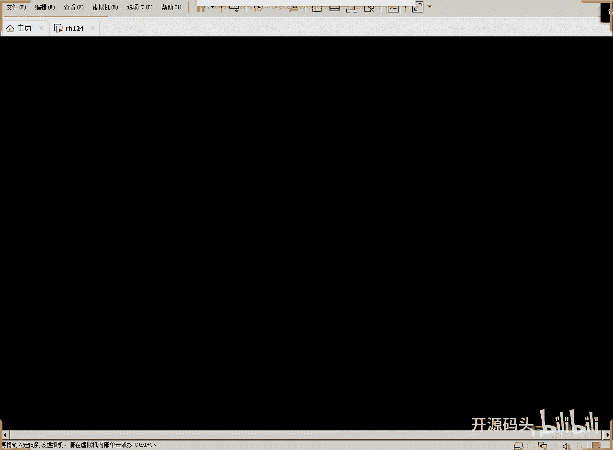

# Linux Shell脚本编程：1.4：IO与判断语句



在本节课中，我们将学习Shell脚本编程中的两个核心概念：如何获取命令的**返回码**，以及如何使用**判断语句**来控制程序流程。理解这些是编写逻辑清晰、功能完善的脚本的基础。

## 返回码的概念

上一节我们介绍了命令的输入与输出，本节中我们来看看命令执行后的另一个重要信息：返回码。

在Linux中，任何一个命令或脚本执行完毕后，都会向系统返回一个数字，这个数字称为**返回码**或**退出状态**。返回码为`0`通常表示命令**成功执行**，而非零值（通常是1, 2, 127等）则表示执行过程中**出现了某种错误**。

我们可以通过特殊变量 `$?` 来获取上一个命令的返回码。

```bash
# 执行一个成功命令
ls
echo $?  # 输出 0

# 执行一个失败命令（例如，列出一个不存在的文件）
ls /nonexistent_file
echo $?  # 输出一个非零值，例如 2
```

如果脚本中没有明确指定返回码，则默认返回`0`。但我们可以通过 `exit` 命令在脚本中主动设置返回码，以表达不同的执行结果或错误类型。

## 使用判断语句

了解了如何判断命令的成功与否后，我们就可以在脚本中使用**判断语句**来根据不同的条件执行不同的代码块。这是实现程序逻辑的核心。

在Shell中，最常用的判断语句是 `if` 语句。其基本结构如下：

```bash
if [ 条件判断式 ]; then
    # 条件为真时执行的命令
else
    # 条件为假时执行的命令
fi
```

其中，`[ 条件判断式 ]` 等同于 `test 条件判断式`，用于进行条件测试。**注意**：方括号 `[` 和 `]` 前后都必须有空格。

### 常用的比较运算符

以下是判断语句中常用的比较运算符。

**1. 数值比较：**
*   `-eq`：等于 (equal)
*   `-ne`：不等于 (not equal)
*   `-gt`：大于 (greater than)
*   `-ge`：大于等于 (greater than or equal)
*   `-lt`：小于 (less than)
*   `-le`：小于等于 (less than or equal)

**2. 字符串比较：**
*   `=` 或 `==`：字符串相等。建议使用 `==` 以避免与赋值操作混淆。
*   `!=`：字符串不相等。
*   `-z “字符串”`：检查字符串长度是否为零（为空）。为空则返回真。
*   `-n “字符串”`：检查字符串长度是否非零（非空）。非空则返回真。

**3. 逻辑运算符：**
*   `-a` 或 `&&`：逻辑“与”(AND)。两个条件都为真时，结果为真。
*   `-o` 或 `||`：逻辑“或”(OR)。两个条件有一个为真时，结果为真。
*   `!`：逻辑“非”(NOT)。对条件结果取反。

### 实践示例：一个简单的交互脚本

让我们通过一个完整的脚本来实践以上概念。这个脚本会询问用户姓名，并根据输入给出不同的回应和返回码。

```bash
#!/bin/bash

# 提示用户输入，并将输入保存到变量 `name` 中
read -p “请输入您的姓名：” name

# 使用 if 语句进行判断
if [ “$name” == “范冰冰” ]; then
    echo “这是个好名字。”
    # 默认返回码为 0，代表成功/喜欢
else
    echo “这不是我喜欢的名字。”
    exit 1 # 主动设置返回码为 1，代表“答案不对”或一般错误
fi
```

**脚本说明：**
1.  `#!/bin/bash` 指定了解释器。
2.  `read -p` 用于显示提示信息并等待用户输入。
3.  `if [ “$name” == “范冰冰” ]` 判断变量 `name` 的值是否等于“范冰冰”。**注意变量要用双引号括起来**，以防止输入内容包含空格导致语法错误。
4.  如果条件成立，输出“这是个好名字。”，脚本正常结束（返回码0）。
5.  如果条件不成立，执行 `else` 部分的命令：输出“这不是我喜欢的名字。”，然后通过 `exit 1` 强制脚本以返回码`1`退出，表示一个预设的“错误”状态。
6.  `fi` 标志着 `if` 语句的结束。

**运行与测试：**
1.  将脚本保存为 `test_name.sh`。
2.  添加执行权限：`chmod +x test_name.sh`。
3.  运行脚本：`./test_name.sh`。
4.  输入“范冰冰”，观察输出和返回码（`echo $?` 应为 `0`）。
5.  输入其他名字，观察输出和返回码（`echo $?` 应为 `1`）。

通过检查 `$?`，后续的脚本或命令可以知道这个脚本的执行结果是“喜欢”（0）还是“不喜欢”（非0），从而做出进一步的反应，无需解析脚本的具体输出内容。

## 总结

本节课中我们一起学习了Shell脚本编程的两个关键部分：
1.  **返回码 (`$?`)**：每个命令执行后都会有一个返回码，`0`表示成功，非`0`表示失败或特定状态。我们可以用 `exit` 命令在脚本中自定义返回码。
2.  **判断语句 (`if`)**：使用 `if [ condition ]; then ... else ... fi` 结构可以根据条件执行不同的代码路径。我们学习了数值比较（`-eq`, `-gt`等）、字符串比较（`==`, `-z`等）和逻辑运算符（`-a`, `-o`, `!`）的使用方法。


掌握这些知识，你就能编写出具有基本逻辑判断能力的Shell脚本了。下一节，我们将探讨更复杂的流程控制，例如多分支判断和循环结构。