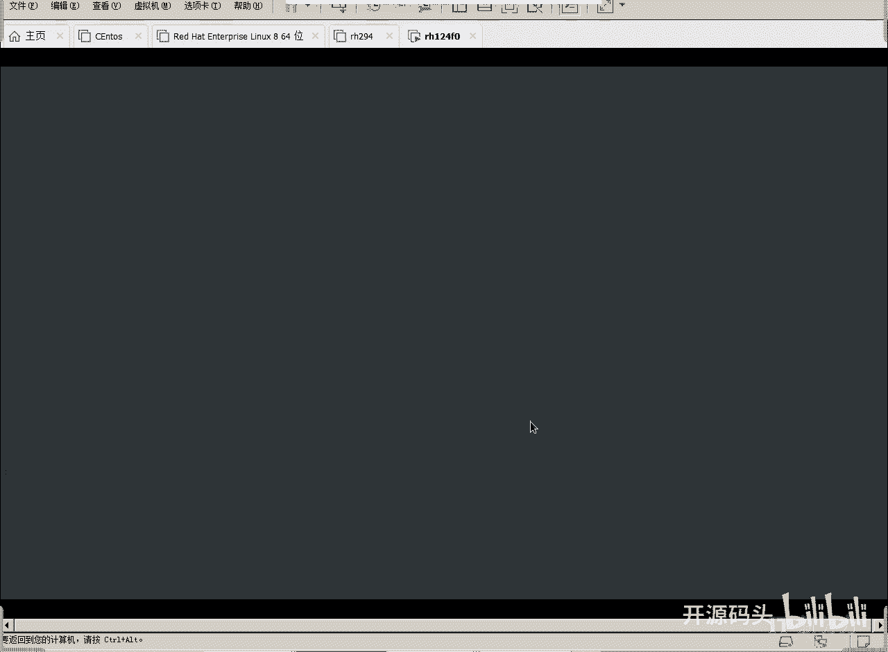

# RHCE RH124 之1.2 Linux虚拟机的使用 - P1 - 开源码头 - BV1ba411d7J4

好我们的这个web已经看已经导入进来了是吧，我们看一下啊，编辑虚拟机设置啊，只是看一下就可以了啊，我已经把它做好了啊，我因为大部分同学的机器呢，都是8G的内存是吧，所以说呢我们这个虚机占了6G啊。

这是六点几G无所谓啊，占了6G啊，我这个机器呢是16个G啊，我把它可以放到十几个G上啊，我也因为我们要统一环境，所以说我们尽量都统一，然后呢处理器是一个啊，但是呢我们需要什么呢。

需要这个需要虚拟化的英呃，英特尔的VT啊，呃虚拟化技术的这么一个特征，或者是AMD是什么呢，RRVI啊，这种特征啊，这个就相当于什么呢，开启了我们处理器的虚拟化指令，必须要打这个对勾的啊。

但是你不需要打了啊，因为你OVA过去这些跟我是一模一样的啊，你把ova打开了啊，这些这些内容也都复制到你的机器上，我们只需要理解一下就可以了，好吧啊，内存根据你的机器的去调一下，如果你的内机器只有4G。

那你用6。5G肯定是有点大的啊，当然4G的话，我们这个环境估计是运气不好啊，最少都得有8G处理器啊，个数没关系，虚拟化指令一定要开啊，计数器这个东西想开也开开啊，然后磁盘大小呢是250个G啊。

这是我们的一个呃环境的一个基本要求，但实际上它占不了这么大啊，实际上占不了这么大啊，网络输出网呢啊我们这是默认的啊，我没改啊，呃也能用啊，好CD呢自动检测啊，就是光盘光驱啊，嗯其他的无所谓了啊。

好还有个显示器，显示器这个地方呢3D加速这个功，这个东西呢我是刻意把它去掉啊，因为好像我们的一个8。0的版本，使用了一个最新版本新版的一个图形界面啊，对这个one world。

这个3D图加速能力好像不是太兼容啊，可能会死卡死，就是图形界面卡死，所以我们还是把它去掉了啊，呃我估计啊，呃在8。28。3的这个新版上的啊，这个特性会会会会弥补啊，这个特性会弥补啊。

但现在的话我们把它关掉啊，这个需要注意的，我给大家讲点到就可以了啊，不需要你去改的啊，因为你在机器里面打开以后，和我这边点开的是一样的啊，因为这个东西也复制到你的机器上去了啊，好确定。

然后我们就可以呃打开这个续集啊，那么还有一个功能需要注意一下啊，如果说你的操作，想在这个我们的第一层的续集里面去操作啊。

刚才我们这个图啊，刚才我们这个图你像我们刚才说的五个机器啊，Classroom1 basic 2voyage，345，a Sol b4和五，总共这五个机器运行在哪里呢。

就运行在我们给大家提供的这个续集里面啊，就运行这个虚机里面，所以说我们现在面临的环境是什么，虚机里面欠虚积本身这个U24这个虚F0，这个虚机啊，反对是零啊，就是F0的这个续集本身就是个续集。

那么它里面还要运行五台续集啊，所以说可想而知啊，工作效率是不高的对吧，当然我们也没有办法，我们环境就这样啊。

嗯开启续集啊，还有一个功能是什么呢，就是在虚机上点右键，这里有个快照是吧，如果说我们想在不开舞台虚机，直接就在这个虚机里面去操作也是可以的啊。

直接就在我们的这个呃F0这个机器啊，机器里面去操作也是可以的啊，这个时候你需要做什么，需要在这里点右键，有个什么有个快照功能，拍摄快照啊，拍摄快照的意思，就是把我们这个呃整个这个虚机呢留一个什么。

留一个现场，那以后如果你把这个虚机做坏了，你可以什么恢复快照啊，恢复快照就又恢复到你做快照，当时的这个状态了，是吧好这个界面出来了啊，界面出来以后呢，我可以把左侧的这个状态块给它关掉啊。

这让它这个桌面显示的更大一点，默认的用户是KSK啊，这就是我们以后做实验的一个，最基本的一个用户啊，然后呢在它上面打回车啊，然后密码是red hat啊，就是红帽底下有啊，red hat啊，都是小写啊。

都是小写密码就是react，你照着下面打一下就可以了啊，然后呢我们登录，这是我的首次登录啊。

登录进来之后呢，我们就可以看一下那几台虚机的情况，好吧，啊这就是我们的win8的界面啊，说实话这个界面有点那个太黑了啊。

当然呃那个呃逼格很高啊。

好我们可以去换啊，可以去换。

比如说换一个稍微明亮一点的背景好吧。

back ground啊，换一下。

看这就是图形界面，有点稍微有点迟疑啊，好这个活动点开啊，这个感觉哈和那个win8挺像的啊，这个感觉跟win8挺像的，或者是跟我们的手机那个风格也是折中的是吧，那这个界面呢可能很多人不习惯啊。

不习惯没关系啊，包括就跟我们使用win8的人很少一样是吧，好多人就是要么就是win7，要么就是win10啊，win8这个界面这种风格其实其实不好啊，这个风格好像要手指头点的那种戳的那种感觉。

但实际上PC是这种界面是不舒服的，是不是，所以说我们可以改换，改换一下这个这个呃界面的一个风格啊，我们可以注销KS，可以用户上点一下logo out logo out注销啊。

注销logo out注销掉之后呢。

就是从我们这个环境里面就出来，出来以后呢，我们可以这么说，我们选择经典界面CSK啊，Red heart，密码照打了不要打回去了，不要先不要登录，在登录的左边呢有一个轮子，点一下这个轮子啊。

我们能看到呢有这个标准的微量的显示服务，对吧啊，或者是经典的啊，classic经典的X11的显示服务啊，我们说呢8。0这个版本的，正好是X11的老板，那个老板的这种图形服务啊。

就是我们显示图形界面这个东西它就叫一台图，就叫一个图形符，老板的X11的图形服务，像蔚蓝的，蔚蓝的这个图形服务呢更替的过程当中，虽然说微软的呢呃现在还有点不太稳定啊，包括我刚才替换这个桌面背景的时候。

他竟然没有反应过来是吧，但是下一次登录肯定就反应过来了啊，呃他好像有点小小的缺陷，但是呢它是未来啊，X11呢呃将会被淘汰掉啊，以后的版本就是图形的这个功能，还是交由微软的这个呃显示服务。

来负责去渲染的啊，负责去做这套就是这个图形的显示，所以说我们要选的话尽量去选啊，就是未来的东西啊，虽然说X11稳定啊经典，但是呢嗯他可能慢慢的就会被淘汰，所以我们就选微软的。

但是这两种进去之后其实是没有差异的，图形界面的显示是没有差异的啊，只不过就是底层的驱动，底层的一个工作流程发生了变化啊，但是微软的呢就是未来啊，就是我们以后可能的，就是慢慢的就会把X11淘汰掉啊。

其实为什么叫X11啊，X呢比windows的W更偏厚是吧啊比如说CC语言，D语言，F语言是吧，那我们的windows叫W系统，那我们就是X系统啊，X等这个来源呢，这个原因呢也不是很深奥。

就是我就比你windows更高级是吧，但是X11呢，现在呃经过了若干年的这个使用之后呢，啊又在他在这个图形渲染这方面呢，呃做了一些改进啊，就升级为这个微软版本，微辣的呢就要代替X11。

因为这是两个社区做出来的啊，两个社区做出来，虽然他们显示的桌面的那个图像，是基本上是一模一样的啊，但是呢底层驱动不一样，我们就选这个经典版好吧，选择classic啊，选择好之后注意啊。

选了选了看SC微软的啊，然后再登录，这个时候你会发现它和windows的界面就和win7啊，win10界面就很像啊。

你看一下啊，左上角啊。

最起码有什么有当前用户的这个文档啊，KISK当前用户的文档双击就可以打开啊，跟我们windows里的这个逻辑是一样的啊，啊这是我们的一个教室文档啊。

然后呢应用程序点开啊，是不是收藏夹附件啊，这是我们上课用到的东西啊，education教育用到的东西，它不是LINUX原生的东西啊，这是我们这个教学环境里是已经装好的啊，这是教学环境。

如果说正常的前半它是没有这个education的，好internet啊，一个是远程连接别人的桌面，一个是远程连接这个，这是FIREFOX浏览器是吧，等同于我们那个火狐浏览器360浏览器啊。

这些啊声音和视图啊，这是一些视频处理或者声音处理的一些软件啊，啊包括系统工具啊等等等等啊，这个东西是不是跟我们的一个windows的开始一样，只不过windows开始是在左下角。

而LINUX开始是呵在这个左上角是吧啊，就是这么一个变化啊，当然整个来讲跟微软的使用思路是，使用概念是一样的，但是微软也不是最正宗的，最正宗的其实是苹果啊。

微软的windows是学的苹果的windows啊，所以说这个东西就是你学我我学你啊，就跟嗯所有的汽车方向盘都是圆的啊，比尔盖茨的原话啊，比尔盖茨的原画啊，乔布斯闲着在在训斥他。

说是你为什么要要要盗用我的windows的这个创意，比尔盖茨说了说啊，那我你的汽车的方向盘是圆的，难道我的汽车方向盘就必须做成方的吗，对吧，所以说这个所有的这个PC机的系统，都应该是这个样子的啊。

这就跟方向盘必须是圆的啊，这这就是机器的一个系统，就都应该是这个样子，是天经地义的，你就像用windows一样，用它就可以了，好吧好好，还有个呃所谓的一个位置啊，你要打开什么位置啊。

然后一开始看到这些东西时候，好多人就头晕了啊，这个东西英文的不太好理解啊，我们第一个事情就先把它变成中文。

