# RHCE RH124 之1.4 Linux教学虚机与基础命令 - P1 - 开源码头 - BV16N4y1F7Tt

呃。下面呢我们再给大家看一下我们的环教学环境啊，教学环境里面在图形界面里面是可以从教育这个分支上去看到我们所有的5台机器啊。一台、两台、三台、四台、5台、五台虚机啊，这5台虚机的网络环境都已经做好了啊。

我们不需要去改它啊，那呃这这5个虚机呢，任何时候克拉入姆这个机器。都必须是开启的。啊，所以你可以从这个图形上去剪，但是我不喜欢啊，因为我有更好的命令啊，这个命令是什么呢？RHTRHT打头的命令都是我们。

这个试验环境定制化的命令，它不是呃linux的原生命令啊。HT的意思就是redhead training就是虹帽的培训体系啊。HTHT呢，然后后面是什么wem controll，就是虚机控制。啊。

实际控制start。star大就是开始嘛，开始谁呢？开始class room会车。啊，这个classroom呢就启动了，他说已经启动了啊，已经启动了吗？

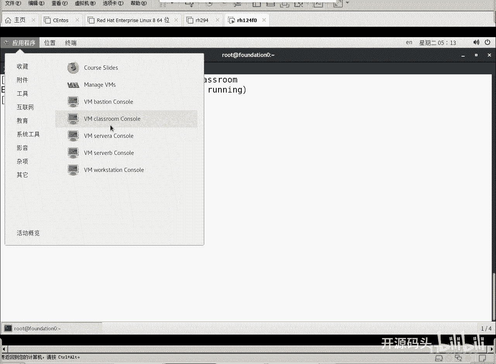

啊，我们点开，这是它的控制台是吧？点开控制台看一下哦，它已经启动了啊，它已经启动了。

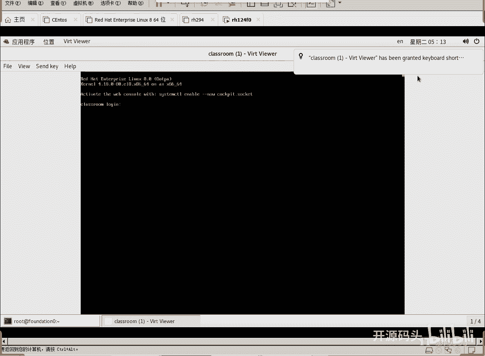

啊，如果想看的话，也可以啊。IGT杠VMvis。HGT打头的都是我们教学环境定制化的命令啊，并不是呃原生命令啊。然后vis什查看查看谁，查看class room会车。啊。

他说呃当前rom呢是当前这个root呢是没有办法去启动这个图形界面的啊，因为我们是从KSK的图形界面钻过来的，是吧？啊，然后我们。用KSK来看，好吧，还是这个命令啊。

IRTvis class room啊呃另一个里面有一个非常好的功能啊，就是鼠标的滚轮。我们好多同学的鼠标中间是不是有个滚轮？平常是不是都不用，对吧？它能它能在那个浏览器浏览页面的时候上下滚动是吧？

在这里linux里面可以什么复制我们选中的字符啊。摁一下就出来了啊，鼠标滚轮啊就是选中上面的字符，然后摁一下滚轮，那么它就会出现在我们。光光标闪烁的这个位置。啊，好，我们开启看一下是不是又开启了这个。

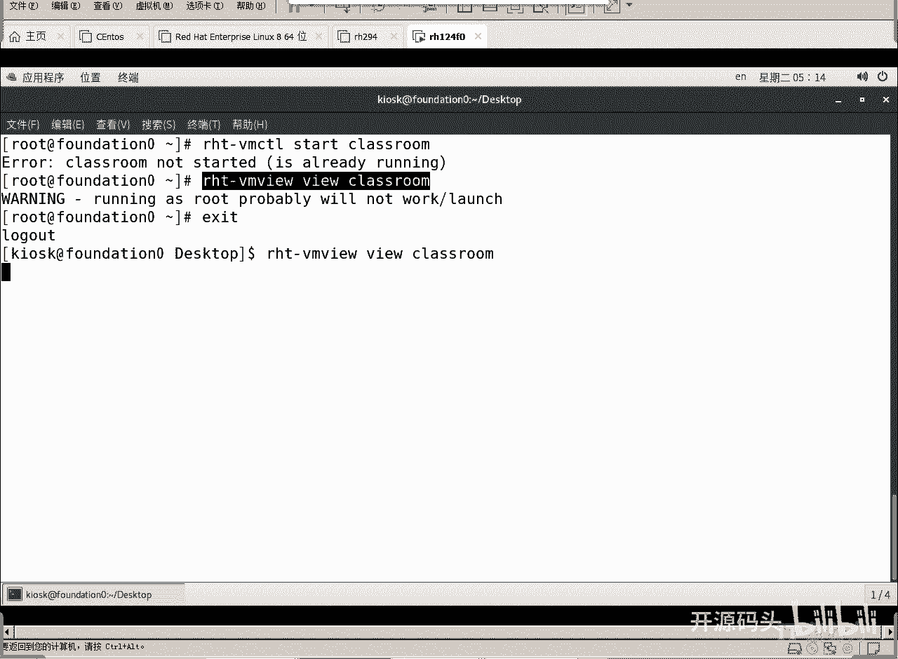

通过命令行开启了他的。

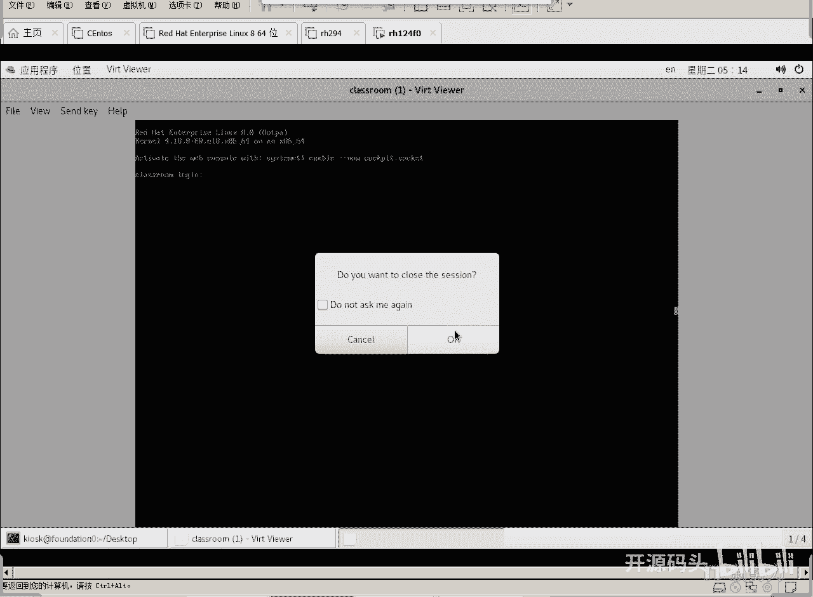

控制台界面是吧？class room呢也不需要进去啊，classroom它的密码也是这个密码。当然你我们整个这个教学环境当中，不需要我们去登录看 room，只需要保证它是开的就可以了。

因为它提供了我们所有教学的资源啊。好，同样的道理，RRT杠VM controllstar or。你在你的机器上运行这个命令的时候要小心了啊，它就会把所有的其他4个虚机都开开啊。

你得保证你的虚机呢足够的6G多的内存是足够的啊。如果不够的话呢，它会有一些机器是开不了的。啊，第一次运行的时候呢，他发现这些机器不存在，它正在创建这个虚机。

创建这个虚机的一个重要的过程就是下载这个虚机的这个磁盘映像啊，下载虚机的磁盘映像从哪下呢？就从我们刚才那个class room里面去下的啊。所以说你在做这个命令之前。启动所有的虚机之前呢。

应该先把class拉 room先起了啊，先把class拉 room起了。好，他就下载。这个每一个虚机的这个磁盘影像啊，也就是这个虚机的磁续机里面是定制好的内容啊。啊，其中就包括了啊basin。

worktationserv A以及serv B啊，那么servve A呢有2块硬盘啊，serv B呢啊不止2块啊，4块ABCD啊VDD啊serv B的VDAserv B的VDDVDBVDCVD是吧？

也就是说每一个服务器里面都有几块硬盘的啊，虚拟磁盘啊，wach desk虚拟磁盘A虚拟磁盘B虚拟磁盘C虚拟磁盘D啊，每一块每个服务器都有每个serv都有4块硬盘啊。

所以说我们实验环境还是比较内容还是比较丰富的啊，就是一个速度慢啊，就是个虚际嵌逃太多了。OK好，这个时候我们可以呢用ID杠VM states。哦，看一下所有虚积的这个运行状态啊，所有续机运行状态。

因为这个机器呢启动需要时间，所以说它默认呃，我们还是没有还是没有呃。马上是登录不进去的啊。如果想关闭一台虚机，怎么关呢？啊，你记住这个命令就可wewebctrl回车，它就有什么帮助啊。

或者叫杠H或者杠杠help啊。lin开里面所有的命令几乎都有这个这个选项。就是杠杠啊，横杠。横杠起头的这个东西就是什么呢？就是这个命令的可选项。啊，就跟我们图形界面上一个功能底下有个对有个什么呃复选框。

选这个功能，选那个功能，选那个功能啊，这个杠杠后面就是它的选项啊，好多东西是不需要记的。虽然说感觉是需要记好的东西，但实际上呢帮助都可以出来。是吧杠H或者杠杠help就可以出现这个帮助啊。

甚至于你不去写任何选项，它都会出来。那其中呢刚才我们看了啊start启动是吧？还有stop停止一个虚机。停止一个运行的虚机啊，虚拟机的名字啊，后面跟的是虚机的名字。啊。

这个命令格式就是这样啊呃回答yes no的时候，杠外就代表yes啊，然后呢虚机的命令虚机命令就是前面这个后面就跟着虚机的名字，虚机名字就是classroom啊serv a 啊，servB啊这些名字啊。

然后re重启这个机器power of power of是强制停止这个虚机啊。如果说你确定是通过stop关不了它啊stop呢就是这个从虚拟机的这个控制平台就是从我们的foition这个机器上给它发送一个。

停机的信号，如果他收到了，它会停。如果他收到以后呢，或者是不没有收到，那就不会停，不会停，我们干脆强制啊，强制就是power off啊，就强制停止一台续机，这个是绝对会关了它的好吧啊。

reit也有很有用，reet什么意思呢？是重置这个机器。如果说我的机器被我做乱了啊，包括里面的分区啊，什么乱七八糟都弄乱了我想还原到这个呃之前的状态。啊，那么reset就可以了啊。

reset server a啊，这个时候servA就会被重置啊嗯。比较好的一点是什么呢？它是秒秒还原的啊，就是你说重置它三三两秒钟啊，三两秒钟还是关机的这个时间啊，就如果说你已经机器本身就是关机状态。

那就是秒还原啊，一秒不到，我们的虚机就还原成原始状态了啊。它有它的技术支撑啊，我们在讲虚拟化的时候再说好吧，它有它的技术支撑。就是说如果说我们机器是关机状态，你直接reset一个机器的话。

它一秒钟就还原成原始状态了啊，就就还原成我们没有做实验时候的状态。Okay。

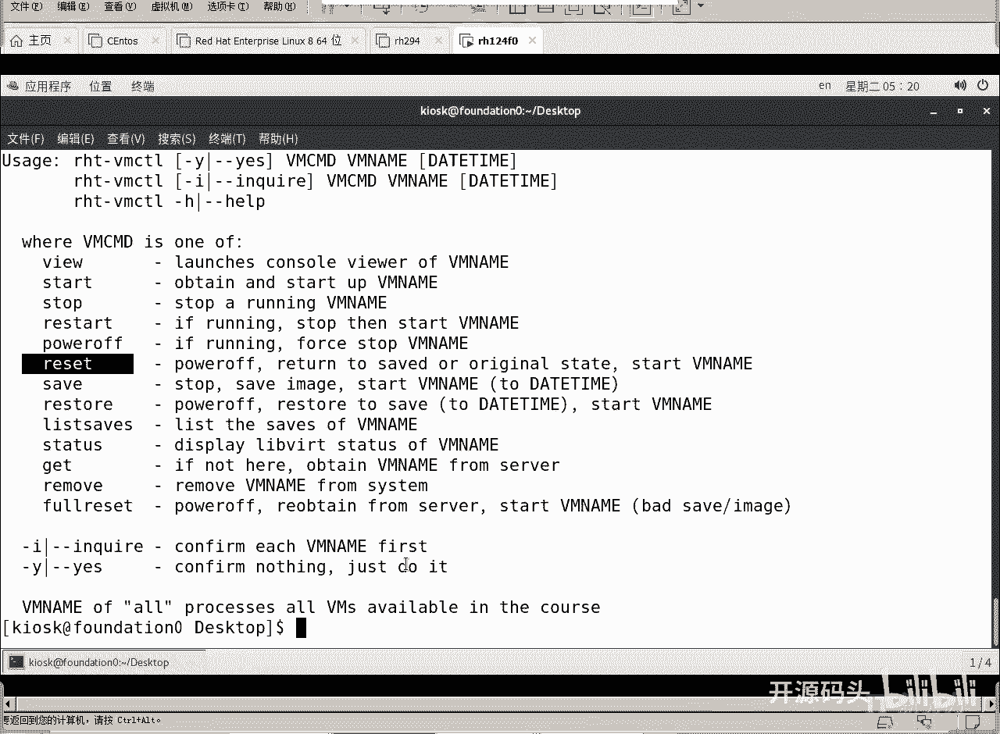

超气。没下课是。好，那呃今天呢就是先我们先了解一下这个环境，好吧，了解一下这个环境和使用啊，我们这个系统呢就是这么用啊。

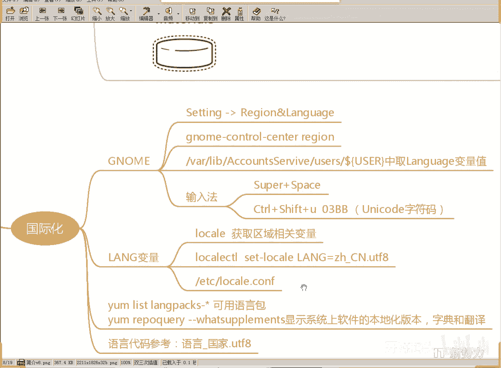

比如说HT杠VM controltl啊，stop。哦，看出来了吧，stop谁呢？sve B。你看它就给以servb呢发送一个关机的信号。然后servb呢收到关机信号之后呢，它就会自动关闭啊。

然后我们再来IRT杠VM controll。搜我毕。你就会发现它是deeffinund啊，就是它没开，它是定义了，但是没有开啊。如果说ons defined连定义都没定义，那我们就得什么啊。

就得star或者什么东西就激活它的定义啊，就这台虚机是有的，已经被定义好了，但是呢它没开啊，我们也可以用or这个关键词啊哦。你看baction what stationsoA都是运行的。

soB呢是关闭的，我们就用s到文面就可以把它关掉。就是给他发送一个关机的指令，搜病呢收到关机指令就自动关机啊，就这样去。就开了。好吧，呃，我们做实验的时候就会用到哪个机器，就就开哪个机器。好吧，呃。

baase这个机器呢也是必须开的啊。因为从我们的top图来讲的话，呃，baase这个机器呢，它是将我们的一个试验的三台机器连到class room这个资源服务器的这么一个路由器角色啊，它也需用。

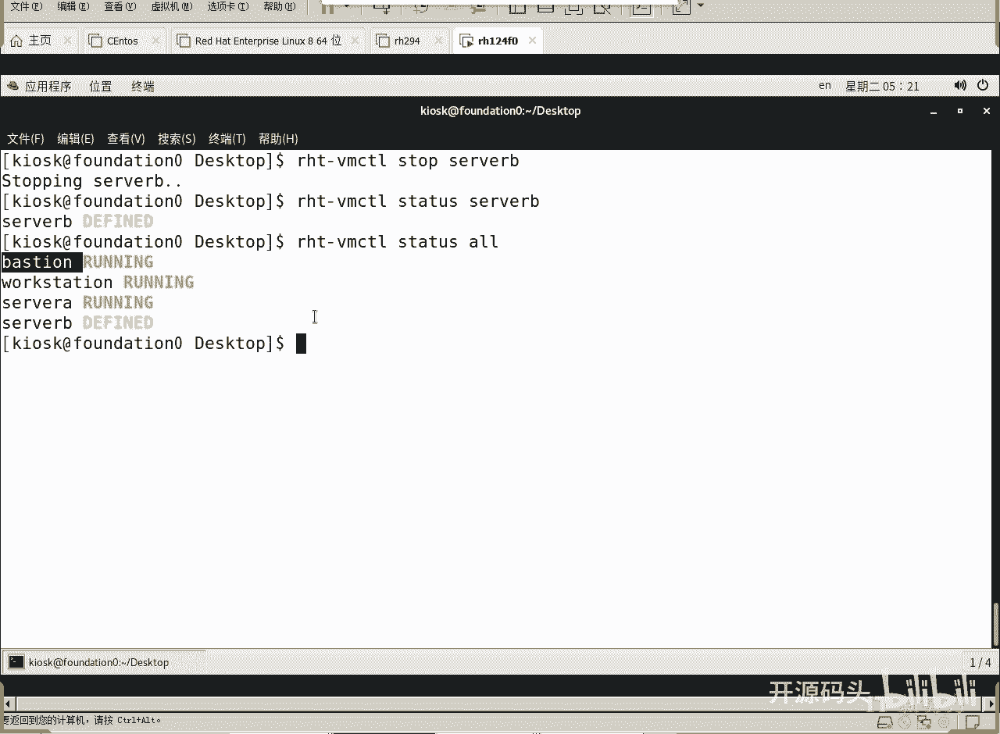

如果有人对这里面感兴趣，你可以登录进去去研究一下啊。我们后期呢根据我们学内容的深入，我们一步一步来聊，好吧，一步来聊这个环节。OK好，那么这个呢我们基本上就。呃，大概的一个介绍环境我们就介绍完了啊。

1124这个课我们后期就是这么去做。呃，我因为这个124学的内容呢都是比较浅显的东西啊，124134基本上都是比较浅显的东西。所以说有很多这个演示呃为了工作效率快一点，就工工作速度快一点啊。

我们呢呃有时候不开它啊，不开这些续机啊，我们我直接就在这个当前这个机器上。

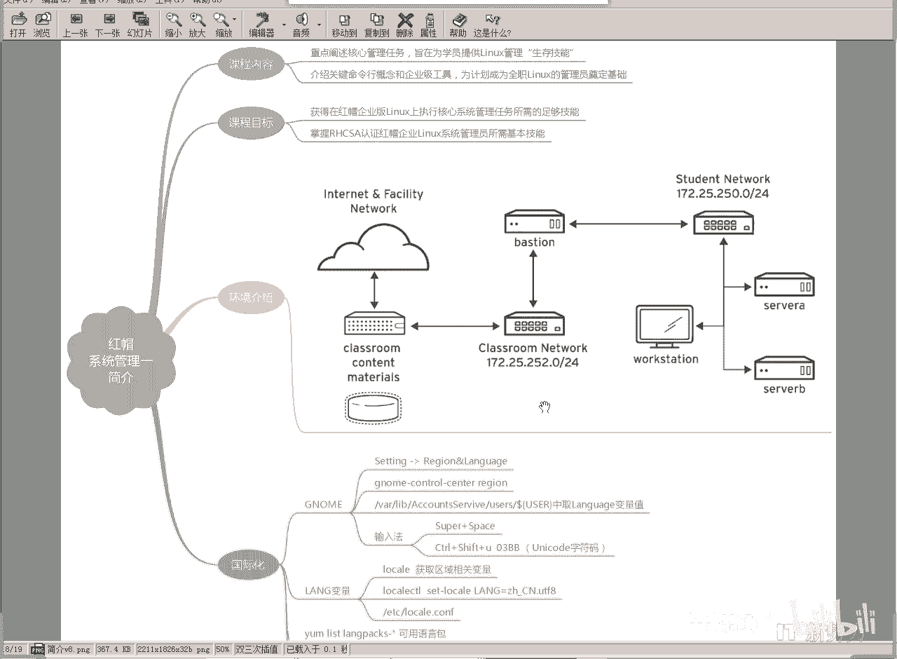

去演示啊哎这个提示符给大家再聊一聊啊，这个提示符你看提示符的中括号扩制的对吧？中号扩制啊呃那么。里面的东西呢是。KRSK这个用户在fodition0这个机器上啊，我们cost name看一下。

我们当前这个机器的全名叫fu0点ILT点example点com对吧？那我们这里呢会显示这个机器的短名，这个机器的短名就是第一个字段对吧？第一个呃。文字段啊，后面是它的预后缀，预后缀就不管了。好吧。

这里个地方显示的是机器名。所以说一开始我们看到的就是什么？这个机器上的当前用户。是吧然后呢，这个呢是当前所在的位置，或者是当前所在的文件夹。啊，linux呢它里面的那个。

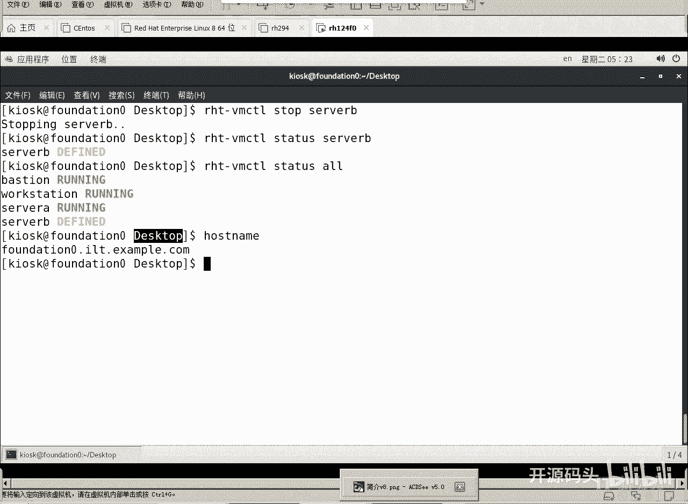

文件的组织结构跟我们windows是非常相似的啊，就是什么树状结构啊，我们看一下第。以第二章吧。第二章。第二章介绍的这些命令啊啊我给大家看一个那个树状，看一个这个。概述里面啊。

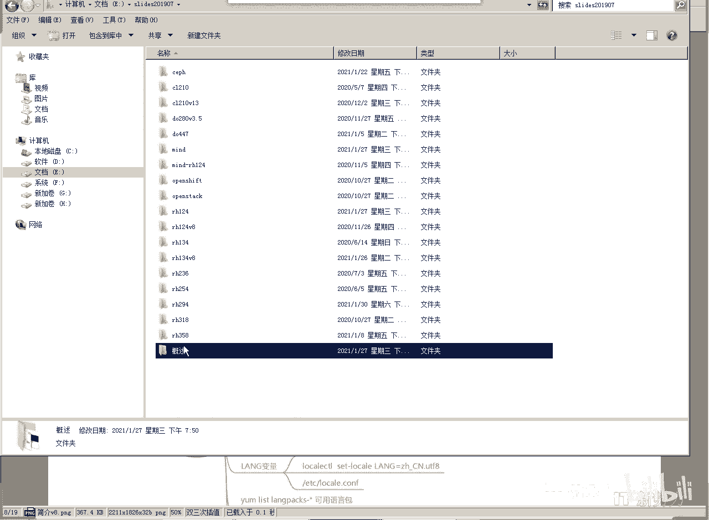

linux的目录。你好。linux里面它是这样的，不管哪个版本lininux，它这是一个工业标准啊，这个标准呢所有的lininux版本都必须遵守啊，就是说。树呃资源呢都是一个树状结构的一个组织。

然后我们在这个linux里面呢，呃每一个呃文件都是处在这个数状结构里的某一个分支下面的。所以说我们有时候把这个东西叫什么叫目录啊，这个目录指的就是文件所在的容器啊，文件目录啊，文件目录。

文件的一个列表啊，呃目录这个东西呢就是罗列是吧？我们书是不是有数的目录打开你的通讯录是不是有你的那个联系人目录对吧？所有的这个内容列表就是一个目录那我们的文件列表也是在目录结构中啊。

它有什么这个我们就把这个东西叫目录，包含文件的这个容器就叫目录啊，文件呢最最小的单元是吧？文件包放在一个目录里，那么整个这个结构就是一个数状结构啊，这是一种表示方法是吧？还有一种表示方法呢是这个样子。

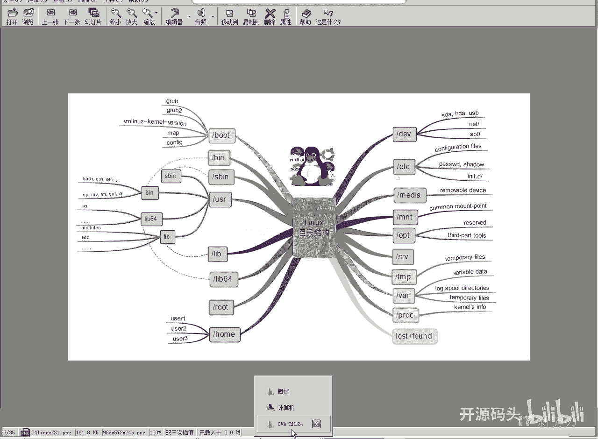

这个看上去是不是更像树状结构？从一个树根儿开始啊，这个撇儿就代表树根儿。从树根开始呢是。有很多这个文件夹windows的术语就叫文件夹。但是linux的术语叫什么？叫目录啊，就是包含文件的容器。

就是目录。那么树状结构啊，根目录下面有BIN目录SBI目录ETC目录第一个目录这个目录里面呢包含了若干文件，对吧？包含了若干文件。那么我们当前处在这个提示符。

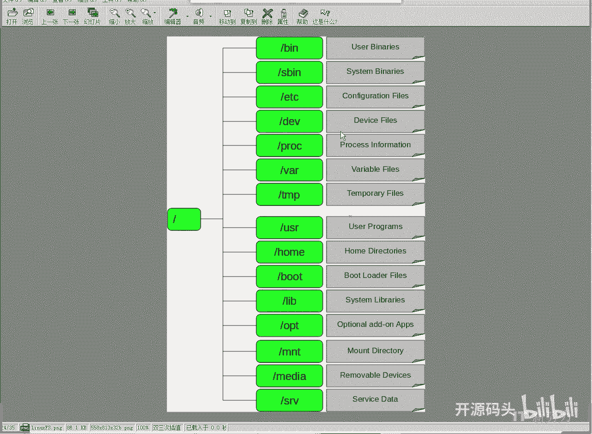

处在哪个目录下是非常重要的。啊，PWD呢能够显示出我当前在那个目录下，当前就是在根目录下的后目录下，又有1个KIK的目录，然后又有个桌面的目录，对吧？其实这个地方就是桌面啊，对应的就是桌面。

那我们就当前就在这个dtop。这个目录里面，所以这个提示符包含的这个信息也不少是吧？包含了当前用户在哪个机器上，然后当前的目录又在哪里啊，当前我的目录位置啊，这个文件夹的这个目录位置在哪里啊。

文件夹就是目录目录就是文件夹好吧啊，当然也后面可以可能再分支，再分支啊，不止两层啊，不止说树根和第一层，后面还有第二层，第三层一直可以嵌到下去啊，就像就像这个图一样，对吧？你看UUSR下面还有什么？

还有BINla64啊，一层一层。

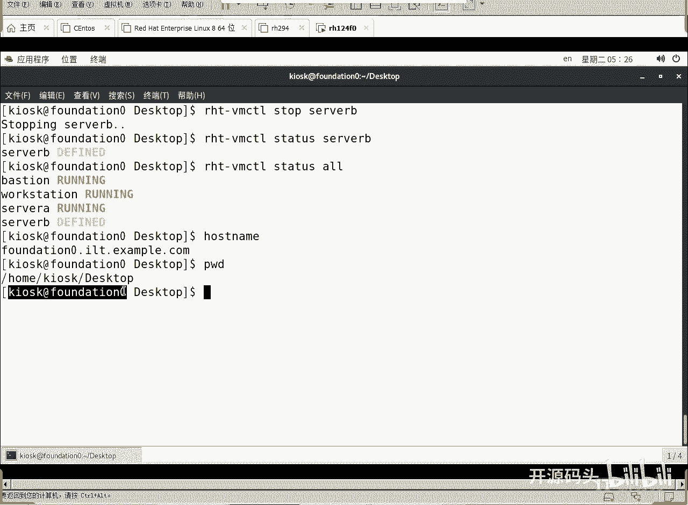

嵌他下去，就整个这个文件的组织，就是用这个树状的这个容器结构去组织的。所以我们把每一个包含文件的这个。文件夹叫做什么叫做目录。那，当然在windows里面把它直接叫文件夹了，是吧？包含文件的这个容器。

就叫目录或者文件夹都可以啊。好，那我们这个提示符呢就能提出这么多东西啊，ctroll再看一下啊，切换到超级用户。

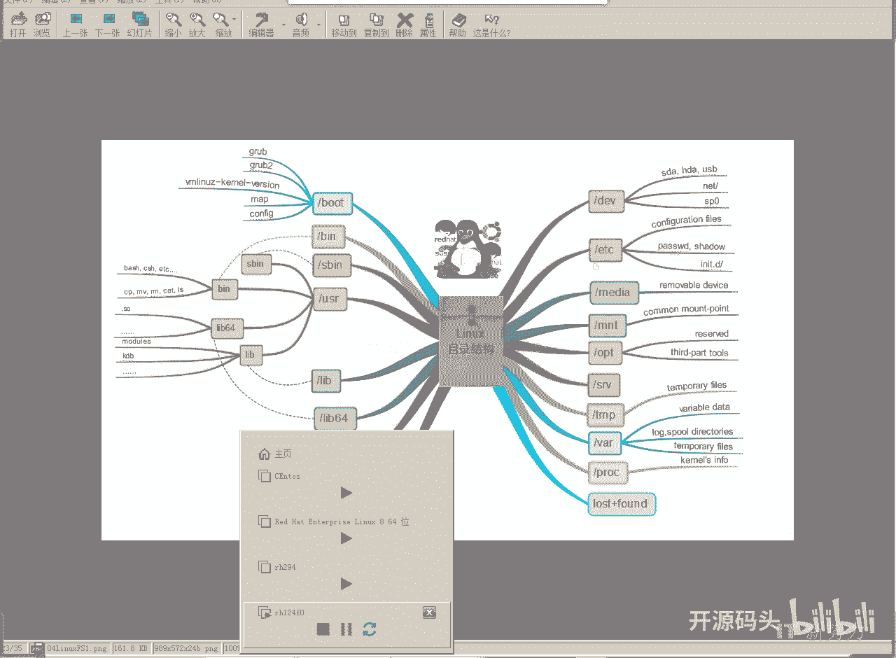

啊，树杠啊super euro，然后呢带环境。回撤，然后ASIMOV密码打了之后，你看当前用户是不是就不是KSK了，当前用户是不是变成root了，但它还在这个fination0这个机器上吧。唉。

波浪号是什么意思？波浪号代表用户自己的。主目录或者叫加目录啊。我们CD撇ho下面的KLK。啊，下面的desktop注意大小写啊，linux是区分大小写的，大写就是大写，小写就是小写。

回撤是不是我又回到了。又回到了。刚才KSK所在的那个桌面目录。对不对？啊，好，然后。看着我的桌面好吧。这这是KSK当前用户的桌面，对不对？好，我打一条命令，你看一下啊。Touch。File。然后大括号。

Yi。点1点点100。回cha。当我用touch命令。touch命令的是创建或者是刷新一个文件。fi，然后大括号里面写的是1到100。你会发现我的桌面上呢出来非常多的图标。

fill1fi2fi4fi3在这儿啊，fi5fi6fi9，fi11总共是到fi多少呢？我创建了100个fi，fi1到fi100。

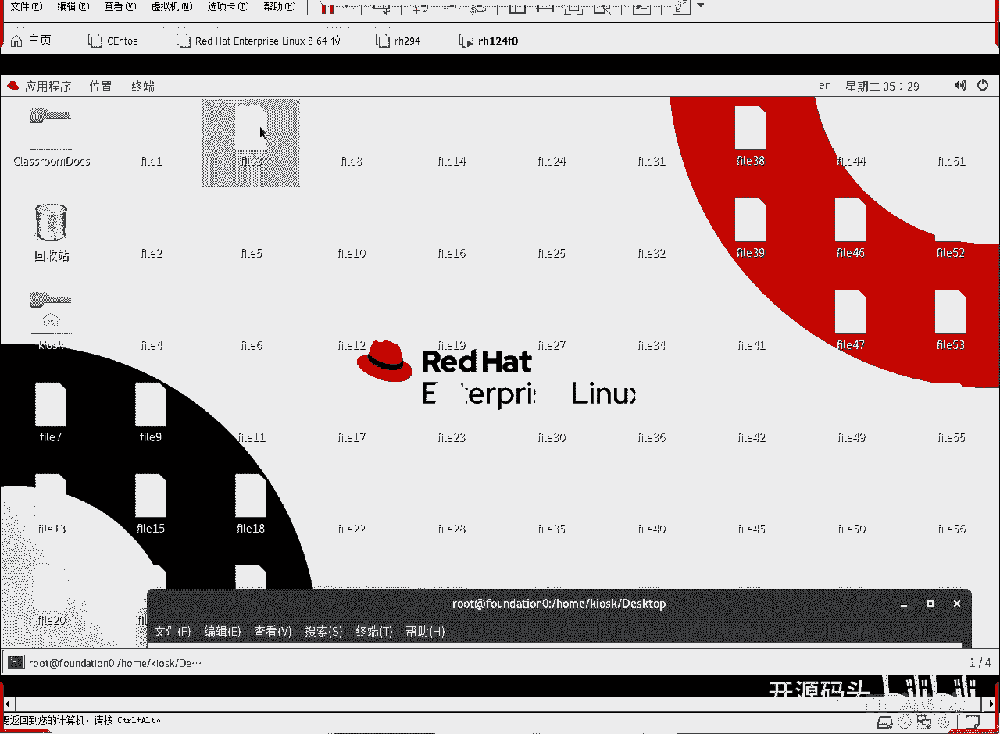

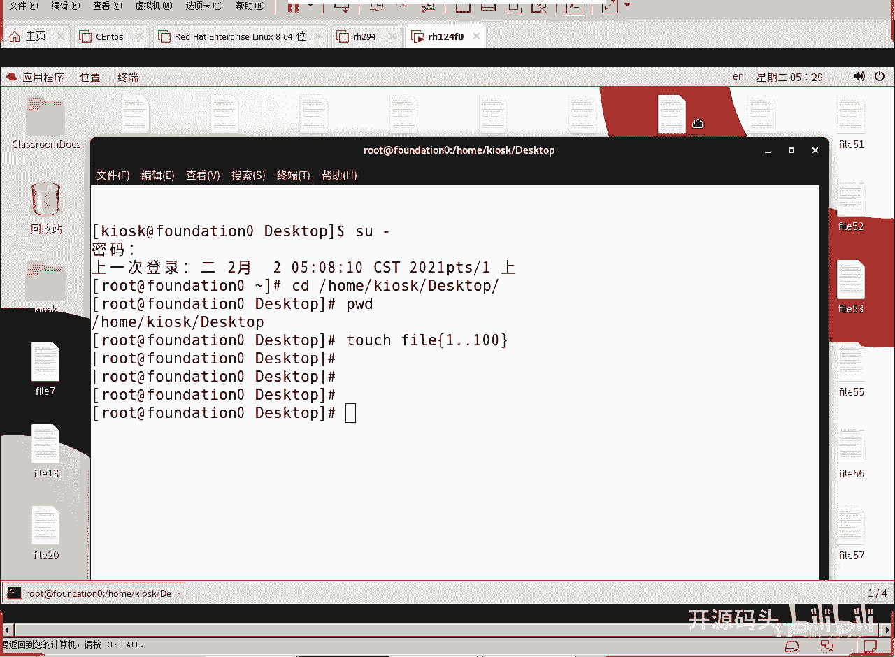

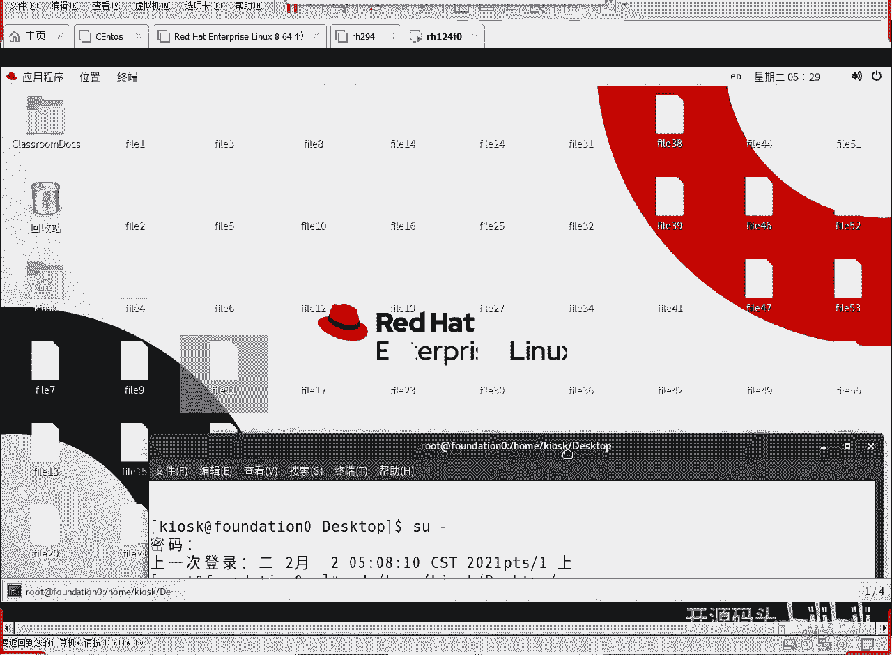

啊，就用一个一条指令，一下子创建了100个文件。啊，一下创建了100个文件啊。那这个操作呢，windows里是没有的啊，windows里是认为这是一种导弹啊，这是一种。呃，呃就是写。嗯。

无无意义的操作对吧？但其实这个东西是非常有意义的。啊，touch就是创建新文件，或者是刷新老文件。啊，fi，然后后面有个1到100啊，当然我们说啊这个东西想删掉怎么办呢？removeRM啊。

然后呢照样是fi1到100推车啊，他说你要删除fi一吗？yes。那F一上了又是F2F23是吧？ctrol C哎呀，这个回答太麻烦了，加个什么杠F。啊，这个杠是RM这个命令的什么选项。

这个选项我们尽量写到参数的前面啊，这个选项呢是什么foralse。就强制。好，当我们这条命令打完之后呢。

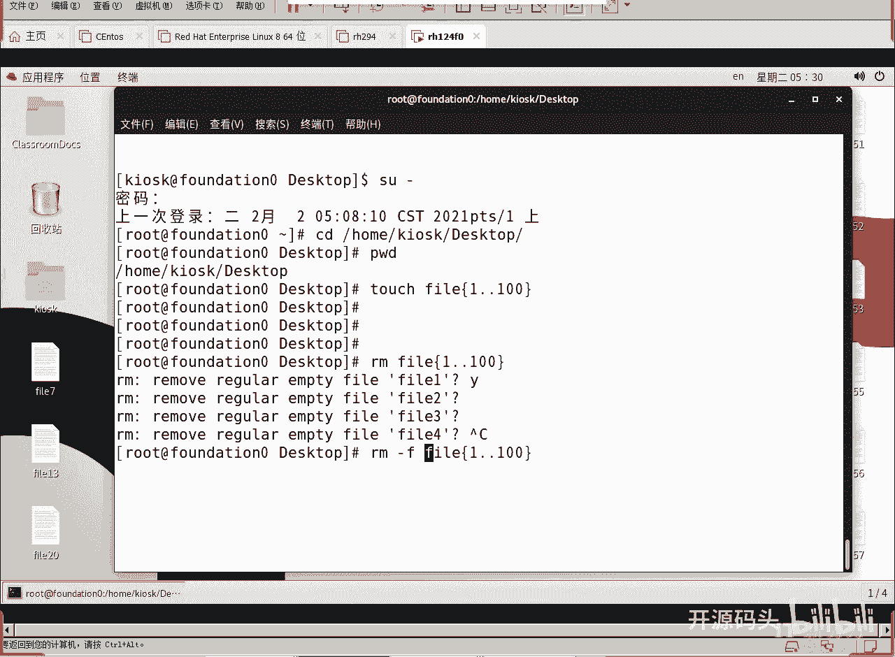

你发现桌面上100文件就没了，对不对啊。

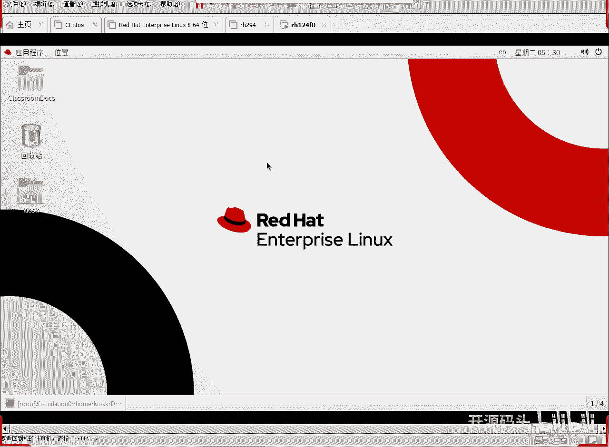

所以说我们对应的这个desktop。

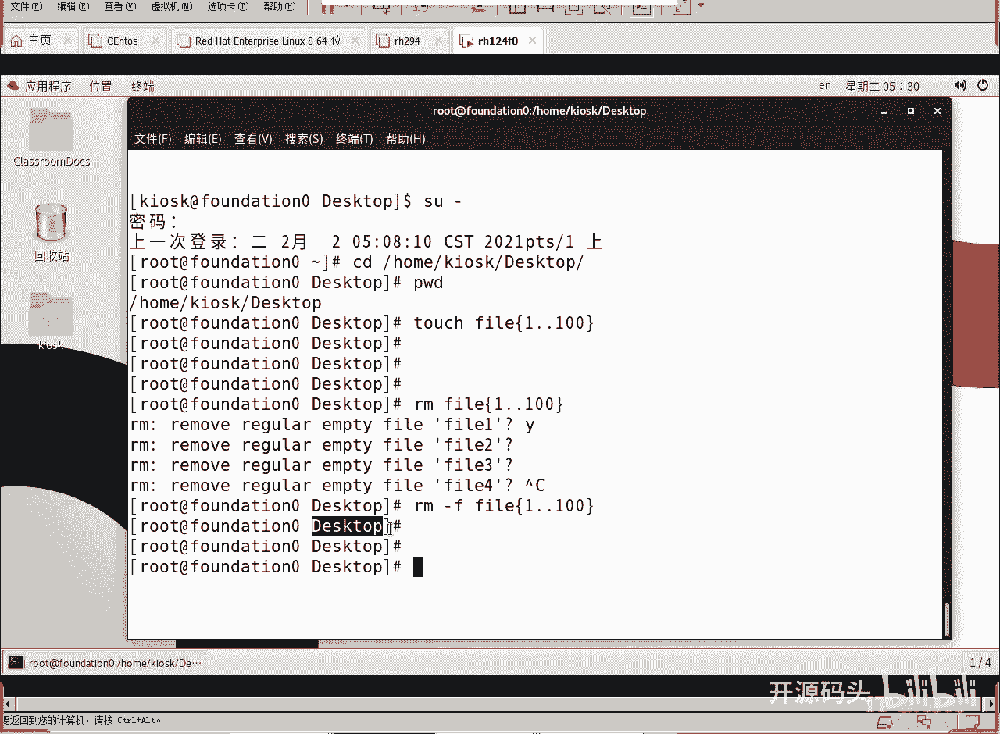

这个目录其实它就对应的是我们桌面上的是什么桌面上的这么一个显示。当我们在这个目录里创建了100个文件的时候，桌面上自然也就出现了100个文件的那个提示图标提示，对吧？

那我们也可以通过IM的方式呢把它删掉。

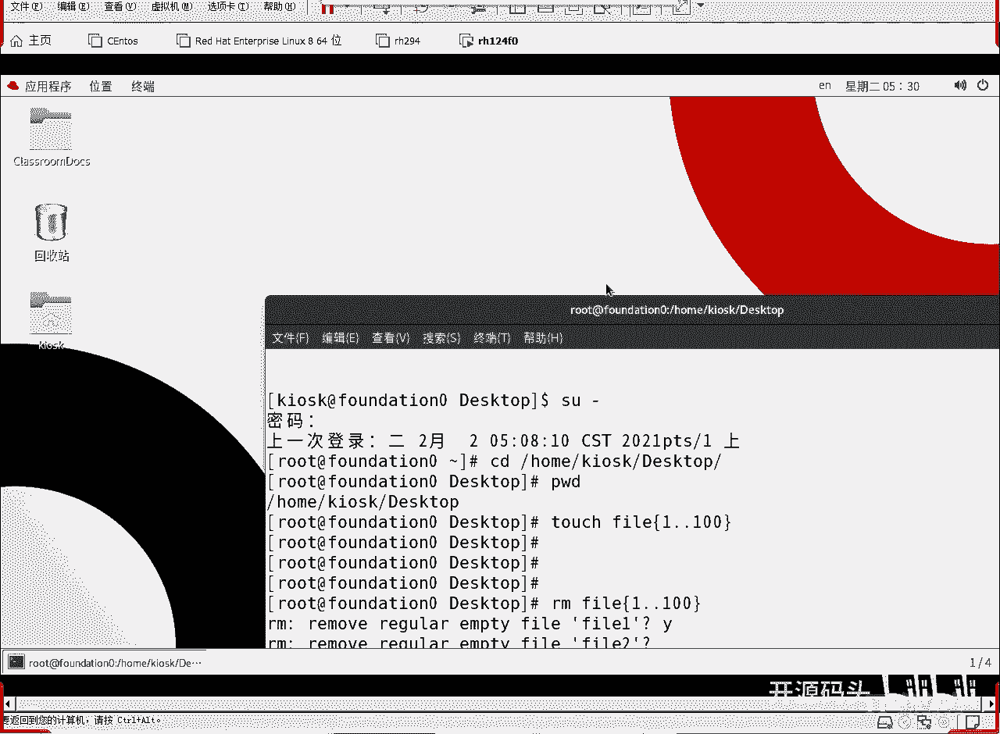

啊，把它删掉啊，可以创建。

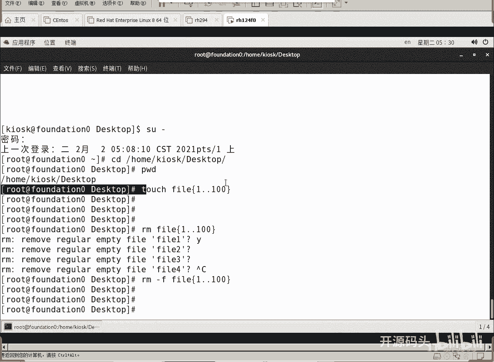

啊，也可以删掉啊，这个时候你就发现linux的命令功能是非常强大的，是不是强大的什么呢？就是我们可以用我们的描述。来让计算机做非常多的任务。啊，但是windows里我就不知道为什么。

windows里一直没有这个这种命令啊。windows里一旦涉及到这种批量性大批量这种呃操作的时候呢，它总是要我们再掌握一些更更高级的技术啊，最基本的命令，它就不提供啊。

而且呢我们现在windows里有好多命令呃，尤其是360什么呃什么安全安全什么专家，什么360的那些东西上去这后，他竟然把一些。甚至于就是列目录的这些命令啊，什么命令都给我们去了。

就是命令行里其实是很很多东西都做不成啊，他他认为这是黑客的东西啊，但实际上这是一个操作系统最基本的功能吧，对吧？啊，所以说我们其实打的这个dtop所造的这个目录，看上去是一个目录。但是很明显。

这个目录里的东西映射的就是我们这个桌面上的这个东西。对对？啊，你你在这个目录下创建文件啊，它就会在桌面上显示出这些文件来。

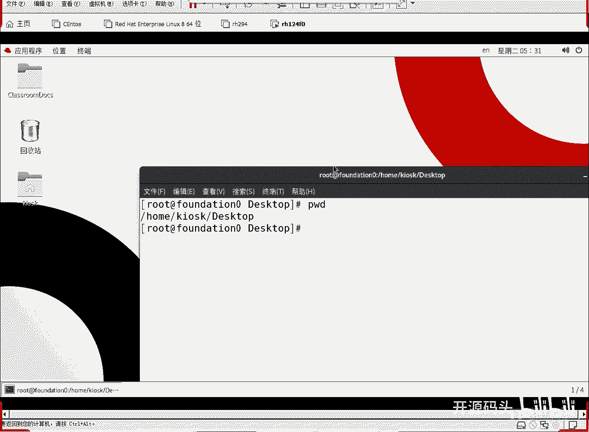

对不对啊。makeDR创建目录啊，创建DRR。大括号1到100互乘。看到没？满桌面。都是第二啊第二第二是吧？好。那我们从当前目录下可不可以看，也可以看。啊，这就是我们所刚才创建的100个目录，对不对啊。

看出来啊，如果想删除目录怎么办呢？RMDR。对吧。MMDR，然后还是那个什么DRR大括号1到100回去了。

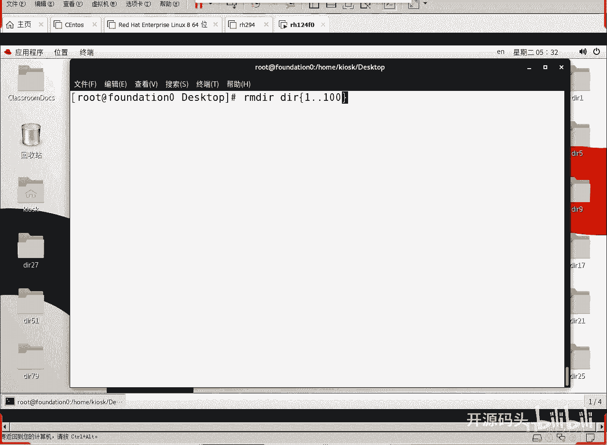

Yi。直接把100目录就删掉了吧，是不是哎，这个东西表面上看上去，我们在创建目录或者创建文件。但实际上呢啊我们反映的桌面上就是另外一种场景了啊，你本质上你的操作在干什么？

但实际上它表现出来的样子是什么样子，这就是我们设计的一种什么？就是后台逻辑和前台的表现，是不是？其实计算机本身就是这么一个呈现这种逻辑的一个机器啊，所以说我们要掌握好这个规律的话。

这个机器学这个学起来就比较简单了啊control l history查看一下我刚才打过的命令，好吧，查看一下刚才打过命令。你看touch啊，先进入先呃。这个是竖杠的root以后的事情啊。先进入到一个。

一个人的桌面啊，进到一个用户的桌面。进到这个桌面的目录之后呢，我们看上去是我们进入了一个文件夹。然后呢，我们在这个文件夹里创建了一个版文件，或者是创建100个目录啊，都可以啊。然后呢。

它表现出来的样子就是在桌面上出现了大量的图标，大量的文件或者目录是吧？然后我们又可以把它删掉，用remove命令的缩写啊RMremove啊，呃，一个一个删的话，一个一个提问非常烦。

我们加个杠F它强制全删，根本不会问我们了啊。好，那删目录也是啊RMDIR哎，有些同学就说哎，其实这个东西了解起来也是蛮简单的，是吧？哎，对，你要掌握住这个呃写窍门或者是掌握它的它的这个感觉以后。嗯。

操作起来也是蛮顺的啊，remove的缩写以及remove direct是吧？目录的缩写。所以我们把这些东西叫目录啊。我们虽然表现出来我们虽然实质操作的是文件是吧？创建文件创建目录。

但是它表现出来就是桌面满了啊，桌面的图标放满了，是不是啊？有些人说我想往这个文件里写不同的内容进去，可不可以？当然可以，对吧啊。比如说啊ECHO。Hello。😊，啊，显示一个hello。

然后双肩括号啊到fi1111。有有有。那么这个命令就是什么呢？显示哈lo，然后呢，通过这个双尖括号的这个呃这个提示符就是追加啊，双间号代表追加追加到fi111里面。我们桌面上出来一个fi111。

双击打开里面是不是显示的一个hello。对吧哎，我们是可以用这个东西呢往这个文件里往一些。

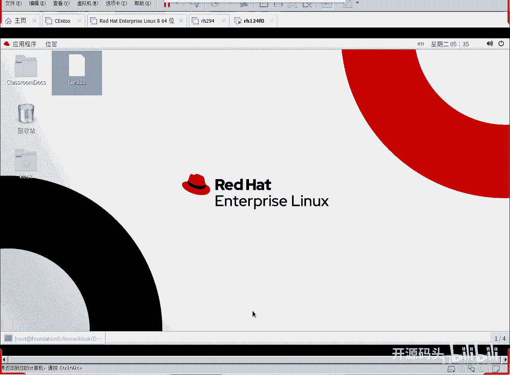

把一些本来显示到屏常的东西，把它什么显示到把它追加到一些文件里面的。啊。这就是命令行操作一些什么小技巧也不是小技巧了，就是常规性的操作吧啊，它表现出来的和我们我们后台操作的它表现出来的效果啊。

就有一个映射啊，其实我们机器我们的计算机整个就是在做这些表现啊，我们后台给他什么一个逻辑，它表现到前台是一个什么样的现象。啊命令呢去后台操作，前台呢就会不断的去呈现啊。

就会产生一个非常奇妙的这么一个效果是吧？啊，O好呃，命令行操作呢，我们也给大家简单的演示一下，你呢在你的机器里面也可以去这么做，对吧？啊，包括这个虚机的启动啊，虚机的界面的虚机界面的开启啊。

虚机界面也可以从这开啊，也可以从这个教育里面去开啊，但是我还是不推荐，因为图形界面一开啊，还是效率还会还是很低，卡的不行是吧？有人说我的桌面上可不可以删，当然是啊，这和winds一样是吧？

点右键点右键是吧？remove。木头嗯这叫什么垃圾箱是吧？系。回收站就个就把它删到回收站里面了啊，然后把回收站再清空。那是不是就删掉了是吧？彻底就删掉了。OK好，呃，图形也可以操作，命令行也可以操作啊。

但你在windows里是很难享受到这种。有趣的这个效果。因为什么？因为windows它不会让你玩这些东西啊，他觉得啊你们玩这些东西的话，就感觉你们的效率太高了吧。我个人是这么感觉的啊。

就是你在wind度里做一些特别高效的操作的时候，他往往不让你去做啊，他嫌他可能觉得啊你你玩的太高了啊。啊。O好吧，今天我们就聊这么多啊，就是我们环境的使用和和一些基本的一个感觉啊，有些是我们教育环境。

就是我们这个制定定制好的这个教育环境的一些命令，对吧？但有些呢就是原生的啊。你像这个CD啊CD就是改变目录到哪里我们把我们把当前目录切换到哪个目录里啊，我切换的目录的目的是为了让大家显示的那个提示符。

这个提示符这个这个地方显示的就是这个目录的最后一个段啊？主机名显示的是没有后缀啊，这个也是没有前面的那个呃副目录是吧，只有最底层的这个目录啊，我们在哪个目录里是很重要的。

你像刚才我们touch呀make做些东西时候，它都是在当前目录下操作的是吧？它不会操作到root自己的桌面上，它是操作到了K的桌面上了。啊，因为这我们进的是KSK的这个桌面目录啊。

我们也可以进到root的目录下，给root去做啊，我们可以也可以，我从我这里登录到你的机器上，给你的桌面去做。我这个操作呢你看不到，但是你的你忽然间感看到你的桌面上出来100个图标，怎么出现呢？哎。

其实是我登我可以通过远程网络过去，直接就打这么一条命令。你的桌面就变化了是吧？啊，这些东西呢都是有一些常规的操作，但是它表现出来的形象。就会体现的非常非常漂亮啊，包括以后我们会开启很多服务了，对吧？

我们起一个外部服务做一个页面啊，做好之后呢，让别人去访问等等等等啊，这些东西都是一些操作啊，我们今天也其实也涉及到很多命令CD命令啊，改变目录PWD查看当前在哪个目录啊，touch啊。

创建或者刷新一一些文件makeDR创建一些什么目录啊，那么remove删除一些文件。remove DII删除一些目录啊，这些东西其实最常用也也比较常用啊，以后我们会多用好吧，今天我们就到这里吧。

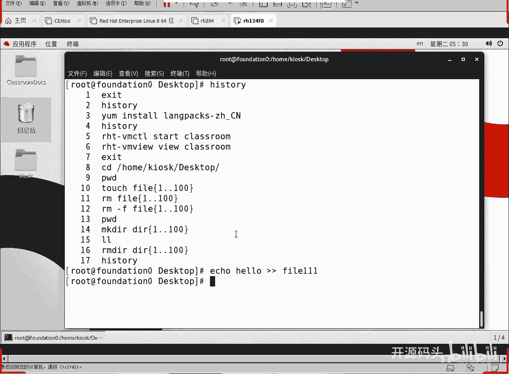