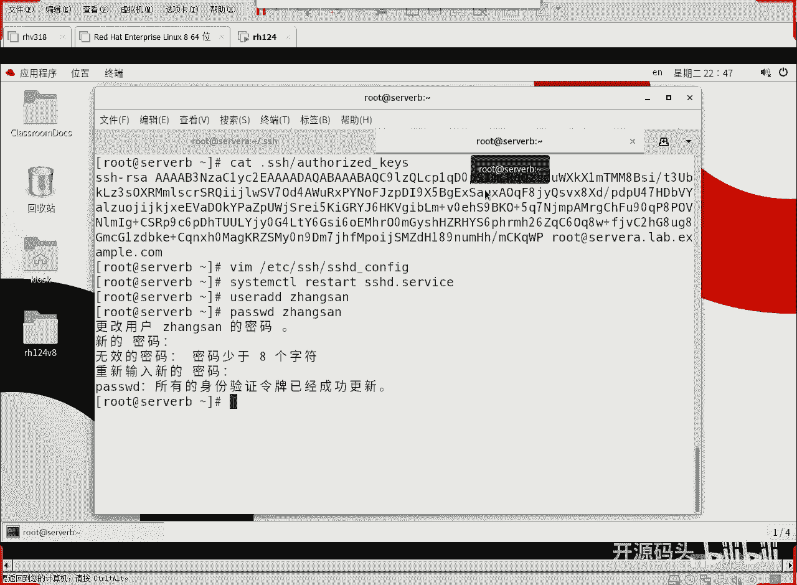

# RHCE RH124 之10 Linux ssh服务(2).mp4 - P1 - 开源码头 - BV1SG4y1a7pC

啊，当然pa伯这个东西应该稍微松一点啊，你看一下pa伯的权限稍微松一点，所有的人都可以读，是不是啊？所以说从权限角度来讲。这个是还是比较安全的啊。呃，有人说啊我有个我我我拿手机在这一照。

你拿手机从我后面一照。那你一照这个私钥就算是暴露了啊，所以私钥永远都不要暴露。好吧，我这种操作也仅仅是做试验用，实际生产环境当中，千万不要把这把私钥给暴露成这个样子啊。你暴露这个样子。

那后面如果有摄像头或者有有有这个手机，你这个私钥就保不准了。

啊，是要永远都不会不要告诉第二个人。

那有些同学就会问，如果我这个serv变成重装了以后。

这个私药还在吗？重装之后，如果你没有保存的话，私钥匙不可能找回来了啊，所以说这个东西是一次性的啊，就是你系统只要不重装，它就在，但是系统一重装，不可能再生成一模一样的1一堆钥匙啊。好了。

这是那个呃所谓的公钥私钥的概念。好吧，那客户端就是第一次登录的时候，把它的公钥下下来，用来验证以后它不会被替换。再一个呢，我跟对方跟服务器通讯的时候。

我就用这个东西来加密给服务器传服务器呢就用这个东西来解密。

是不是就得。拿着就能解开我给他传的东西，别人能解开吗？别人哪有哪能知道这个钥匙呀。

所以说别人就解不开。

啊，OK这就实现了所谓的安全加密是吧？那我们在SH这里面打的命令，刚才我们登录上去打的wherel什么命令都是经过加密传到CB的。啊，所以说它是安全的对吧？好，我们现在呢来做一个更有趣的实验。

就是服务器在验证客户端的时候，不要验证用户名密码。而是验证用户的呃密钥，也就是说让用户生成一对钥匙。然后和服务器互相验证这个公钥。就可以了。好吧。好，我们。开始做了啊。SSH杠Kgan。我们来。

主动的由当前用户生成一对钥匙。回车他说啊你你的密钥要存到这里吗？注意啊，是当前用户的加目录底下的点SS这个目录下面。IDIC啊，我说默认回车就可以。是的，然后这个私钥需要保护保护的钥是吗？

空或者是空代表你不需要保护，那我就不保护了是吧？空空两次。然后就成功了啊，你的。标识已经被存到这个地方。然后对应的公钥存到了这个地方，其实一个就是没有点pub，一个带着一个点pubop。对吧？OK好。

这样的话呢，我们呃就已经呃生成了一对钥匙。从客户端生成呢，我们ca一下ca一下。这个钥匙。这是私钥还是公钥？这个是私钥吧。好，回车。好长啊。这么长是吧？你说这个安全还是密密码安全，对吧？

最起码从长度上是比密码安全多了，是不是啊？你要是猜这么大个数字想猜出来，我估计得一万年吧。OK这是私钥啊，这是priva key的。Begin private kid and。是吧这整个中间是私要。好。

我们再来看一下公钥。后面加上点pub就是它的功效。公要相对来讲是比较短。那么这个算法是什么算法呢？是RSA的啊，不是那个我们刚才的那个以什么ECS的那个是吧啊，算法不一样而已啊。

OK那我们当时在做这个生成这个钥式的时候呢，我们还看到了它的长度。就是2048。

看到没啊，这个C钥呃密钥的运算的时候，它的位数是2048位啊，就你要说是试的话，在这个区间内去试出一个值来是很难试的啊。

okK好，呃，那么这就是客户端生成了。客户端生成之后呢，为了跟服务器进行对打，所以说客户端应该把它的功钥是不是拷到服务器上？OK开始拷贝啊。SSH杠。拷贝ID到哪里呢？到缩B的root。这个用户上。

也就是说我这边登录对登录过去就是对方的root啊，我把它拷给对方的root用户啊。好了，S是拷ba回车。啊，因为。拷贝的话要进行身辨认证，所以说还是要回答密码的是吧？readd hat就这。好。

他说一个K已经拷过去了啊，那么服务器上我们找一下客户端的K在哪里。

L呃cut吧，直接看了啊，点SSH目录下的什么呢？就是有一个au taste key啊，回撤我们能看到啊root server a上的这个用户呢，已经在我当前root用户的加目录里面放入了它的公钥。

啊，有人说是不是啊？看一下啊MCKQWP看到吗？就找几个位置比一下就可以了。PMCKQWP然后再看看刚才公钥是不是撇WC。

呃PMCKQWP对吧？看一下。肯定是一个吧，整个就不比了。就是说已经把客户端的公钥也发到服务器上了。好，下面我们去看一个奇见证奇迹的时刻，SS是root art serve B。然。

回车你会发现他不用打密码就过去了。啊，不用打密码就去登录serv B了。为什么？因为默认情况下，我们的密钥就是基于公钥的这种身份验证，比基于密码的身份验证的优先级高。因为它的安全性比密码高，对吧？啊。

我们servilA上呢。

紧记着把这个。把这个文件给他什么保护好，这个文件就是你登录serverb的什么凭证啊，因为你只有有了它，你才能解开服务器，用公钥建用你的公钥加密信息给你传回来，你只能用它来解。对不对？

这个时候对话才能完成。okK好，那么做到这里的时候呢啊我们就可以把服务器上的什么密码验证干脆给它关掉。啊，VAMEZ下载SSH下面的什么呢？SSHD。confire，然后在这里面我们找一条配置命令。

叫什么呢？叫呃。密码验证。

看密码身份验证是yes的，我给他改成什么？改成no得了。唉，密码身份验证就不启用了是吧？好，当我把服务器的配置改变之后，我们就需要什么重启一下服务了。

是不是ct controltrlrestar SSD点service。为什么后面有个D呢？😡，服务器端的程序几乎都带个D，这个D就代表什么？de曼守护守候进程是吧？守护进程。好，那我们重启了服务之后。

啊，我们这边登录正常。试一下。因为我们就没有用密码登录，对不对？啊，呃，如果我们这边建了一个用户啊，比如说u如and张3。啊，然后给张三设置一个密码。是red hat。 redd hat。好。

我们已经给张三设置密码。然后我们从这边登录一下SH张三艾特啊sve be。走啊，yes密码你看还不用回答密码就被禁了，看到没？权限被禁啊，权限被禁的原因很简单。

服务器根本不会接收非密就是密码形式的验证啊，它要接收的全是基于密钥的。

如果有非法用户嗯想使用呃暴力破解工具，尝试张三的密码去登录server币的。这种情况是吧就完全不可能了啊，很明确嘛，你我这边就不用不验密码的。对吧平常默认是验密码，但是现在我不见了，因为我用K。

我验的都K，所以张三就永远登录不了COB了啊。因为张三他。他用密码的方式登录是不可能的。要想让张三正常登录，还得给张三也生成一对KE，然后呢还得拷到服务器闭上。

关键是我服务器B已经把密码验证阻止了，你就拷贝ID你也拷不过来。

啊，因为你考ID。是不是还得回答一次密码才能拷过来？是不是哎，但是你我也不认命嘛啊，这样的话soB就安全性得到极大提高。只有有谁的人才能正常通行。只有有了那个私钥的那个人。

啊，只有有这个有。搜B场。只有有这个文件的人。才能够登录到servB没有这个文件的人登录不了。啊，这就达到了一种极其安全的这种通信啊要求啊。好，那还有一种情况。

就是有些人会觉得啊root登录的话呢会比较会不安全。能不能就是说让普通用户登录进去，让一个普通用户登录。

啊，好，我们现在呢重新改回来配置啊。

改回来配置，把这个密码又又得开开啊，为什么要开开呢？因为我们要用张三呀，要要用张三这种普通身份来登录登录服务器了啊，又允许他啊，然后呢，我们把root登录给他什么关掉。

这里面有个permit rootot logo印啊，允许root登录，我们给他来一个no。允许ro的登录是不允许了。好，还是。配置一改要重启什么？重启这个服务是吧。

stem controll restart服务。然后我们现在用root视频登录一下啊，ctlL用root视频登录色B。你看他又装模作样，又回答密码了。red hand。即使我回答正确的密码也不行。

其实这个人是不让他登录了，对吧？像这种情况，如果你在暴力式破解，你就是试上1万次。你也登录不过去，因为。它不允许root登录。对吧这密码是装模作样的东西是吧？OK好，那么张三是可以登录了。

因为我们servb上的密码验证放开了。SH张三艾塔sB。张涛的密码是re hand。是不是登录进去了？啊，OK好，那么啊我现在是想什么呢？想让root用户。登录的servB是用张三身份去登录。

S S H。拷贝，我把这个拷ID呢再拷给。服务器上的张三。回车回答张三的密码，redhead。哎，我现在把我刚才生成的那个公钥呢，不但拷给对方的root，也拷给了对方的张三。那我登录的时候呢。

我就可以选择我是用张三还是用root，对吧？因为这两个用户我我的K都过去了。啊，我root刚才生成了一对K嘛，我的K都都已经拷过去了，所拷给张三了，那我以后可以用张三登录。啊，还才一起。SSH张。

3阿尔塔serv我B。登录。是不是不需要密码了？张三登录进去是没有问题的，因为它只允只不允许root登录是吧？我张三进去，张三进去之后呢，再通过苏杠来切换到root。这个时候呢是可以了是吧？

但是就是直接登录，是不允许用root身份登录的啊，这个方式在一定程度上也起到一定的安全性啊。或者是呢也不用速啊，我们直接在张三的示范下呢用速度啊，这样的话呢安全性更高一些啊。

OK我们今天呢啊讲了一个SSH服务，呃，其实是以SH服务为例，讲了一个服务的一个概念。我们后面呢还要教很多很多服务。那这些服务的话几乎都是这样。第一，修改它的配置文件可以对它的功能进行微调。

对吧然后配置文件修改完之后，我们需要及时的把这个新的配置重启一下来，起作用。啊，那么其实也是CTMD的一个功能，就是它对它里面的所有的服务都是这样的，重启就可以起到。重新验证作用。

当然我们顺便的讲讲SSH呢，它的工要验证的一个基础理论啊，然后我们顺便的让这个客户端也实现了基于公钥的验证，对吧？

OK我们今天就聊这么多。😊。