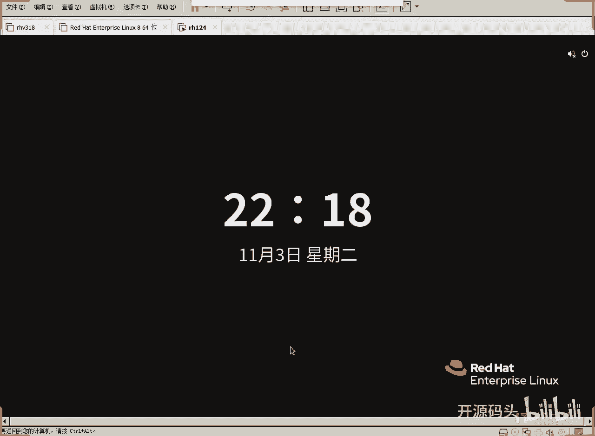
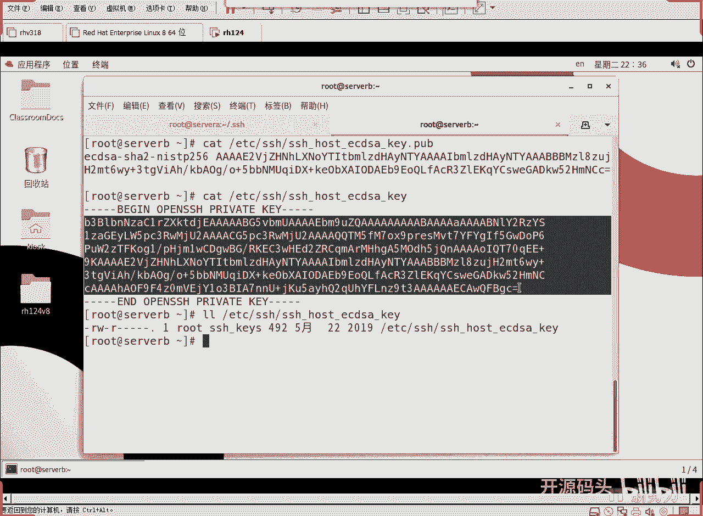

# RHCE RH124 之10 Linuxvssh服务(3).mp4 - P1 - 开源码头 - BV1ft4y1J7iv

我们来。呃，做一个做一个这个servve a到serv B的通信，好吧，ctl L啊，然后SSHroot art，我们用root登录进去啊，ser a。我现在登录的设备A。好。

ctrol shift t再开一个终端SHroot at seven B。有些同学说哎。你登录servAB，竟然不回答密码就可以进去。是的，我今天就要解密这个东西啊。

我们去今天就SSHSSH利用公钥来保障的东西，比用户名密码还安全是吧？好，我们今天来看一下sve As B两个机器是吧？好，我们回到serv A。SSH rootot。阿塔s B。

我们从sever A到servever B回车。注意了啊。啊，这个呃身份验证主机250。11，就是说servb的IP地址它也测出来了啊，它不能完成。为什么呢？这里面有一个什么ECDSA的密钥指纹。

是啊它给了我一个密钥的一个序列号啊，那这个是什么算法呢？这个是第三种算法，我们今天已经说了两种算法了，一个是非对称式加密，一个是对称式加密，这个算法呢？sha的算法，散列算法，这种算法是什么呢？

叫散列运算，这种散列运算只能用来进行什么验证。数据有没有被动过？啊，它是散列算法，散列算法的特点就是不管你的元数据有多大，最后它总是能得到一个固定长度的一个特征码。这个特征码呢。

标识着你这个数据的那个样本是那个样子。如果你把原数据变了一个小数点。那么结果序列呢会全部变，它会把你原数据的一丁点的变化。散到所有的结果里面去，就这种算法就叫散列算法啊，然后这种算法呢可以有效的使用。

用来做什么呢？做验证你的文件是否被人动过，就是你的原文件有没有被人改过啊，所以说经常用它来做什么指纹。啊，做一个文件的指纹特征，你的文件是8个G，一部蓝呃蓝光电影是吧？啊，8个G的一个文件。

但是我算出来的1256。就这么长。如果你的文件是一个一个比特位的文件，算出来的1256还是这么长。它就是表示你的你的这个原数据。特征是什么样子的？如果你的原数据变了，哪怕一丁点东西，那么它。

结果序列呢就会完全变样。啊，所以说用它来什么来验证数据的完整性。那我们的私药工药很长，所以说他不会把这个公药呢。直接显示出来，他只把公钥的特征码显示出来，明白了吗？这是第三种算法了。

我们今天聊的这个叫散列算法，散列算法不能还原数据，但是可以验证数据是否被改动过。啊，所以说经常把这种散列算法用作指纹。那么我们互联网上最常用的一种散联算法是什么呢？就是MD5啊，我们这里用的是1256。

那还有一个叫MD5，这都是散联算法啊。互联网上你要下载东西，经常性会碰到这个东西是吧？比如说我们平常呃。哎呀，我们今天这个时间稍微有点紧张是吧？比如我们平常上互联网。我们要下载一个什么呃ghost是吧？

我们百度一下啊JHOSTgst什么呃win7。gst win7啊，你看一下，这是你看啊它这个玩意是广告啊。人家让你装系统，给你盗版系统，白给你还自己还掏钱做的广告。你你想想他这个系统里面是什么样子。

你可以看看啊，我这里只是给大家说一下啊，来。系统支架下载一些。下载一个系统啊，你看它每个系统里面是不是还给我们带的MD5的序列值。最后面。一般都会给我们。看到没有？这个文件是叫这个名字是吧？下载。

然后我们可以下载啊，下载完之后呢，它给你一个序列啊，一个是CRC32，这个叫冗余校验序列啊，冗余校验序列是做什么的？

做呃即有就是极有校验验证这个文件在下载过程当中肯定没有没有什么没有里头的位置和外头就是下完之后，它的冗余值是这个。那么MD5是这么一个值。啊，如果说这个包你下下来之后，它里头有一个位置下错了啊。

当然这种概率是非常非常之低的啊，亿分之1或10亿分之1的可能性甚至于都不大啊。所以说你拿你拿这个文件通过MD5呢算出一个散列值，如果算出来，它和它是一样的。O这个文件从。网站到我手里没有人改过。

或者用上一这种算法也可以。我们刚刚看到的SH是用的什么算法？1二多少256是吧？好啊，我们做一个文件，好吧，VIMAAA。然后AA文件里面我写一个东西啊，写成写一个OOO。好。

我们要抽去他的MD5MD5summerAAA会车。啊，然后M呃少。256。啊，上256summary，然后呢AAA。看这个AA这个文件里的内容，用MD5算出来的序列和用12256算出来的序列。

对吧现在我们给它做一个小小的修改啊，VMAA然后我这里头呢给它把一个O变成一个什么？变成一个零吧。只悄悄的改一下，然后我们用MD5算再算一次，再用12256再算一次，你看一样吗？一下就看出来不一样了吧。

MD5原来的MD5是这个值，现在MD5是这个值。是吧原来是上面这一行，现在是这么这两行一看完全不一样，这就说明AAA是不是被人动过了。图到底这个也啥。256原来的256是这么一串数字。

结果现在呢成了这么一串数字了。一眼就看出来是不一样的这就说明什么。😡，这个AAA和我现在这个AAA。文件被人改过了。我们把这种特性称为什么完整性遭到破坏，就是数据已经不是原来的数据了，肯定被人动过。

被人动过手脚是吧？我们平常在下载一些互联网上下载一些文件的时候，他经常也会给我们加这些东西。就是说你下下来之后，你自己也这么算一下。如果得到的值是这个，这就说明他给你的和你拿到手上的是完全一样的东西。

如果你算的值和他给的这个值不一样，这就说明这个里面已经被人动过了。对吧这就是完整性校验。好吧，所以说这是这个文件的什么指纹。这种算法算出来的指纹信息啊，sha算法算出来的指纹信息啊，各种算法。

啊这这它就保证这个东西啊。好，至于说这个系统到底是。它本身就是个盗版系统，它还免费给你，他还打上广告让你下。你想他要他要做什么，你知道了吧，哼。午餐好吃吗？免费的午餐对吧？好。

你所以说以后用这种系统的话啊，小心一点就行了。好，我们现在呢目的是什么呢？看出来啊，我们的目的是为了说明一个道理，就是说哎我们这里已经拿到了服务器的公钥了啊，我们这里已经拿到了serverB的公钥了。

servve A在登录server B啊。第一次登录的时候呢，公钥过来机器肯定是不会判断这个公钥是不是server币的。他会就他就问管理员了，管理员，你认可他吗？你认可这个serv币的公钥吗？

只问一次就够了啊。管理员说是的，这次我觉得serv币是真的啊，他的IP和服务器是对应的，没问题。好，yes，这就存下来了啊，这就存下来了。啊，然后这时间超长了，重来一下。你看他现在是不是不问了。

为什么不问了？serv B的公钥已经存到我本机了。😡，啊，如果说serv币被换掉了。他就会报错，他就会说哎，社B的公钥不是原来那个公钥了。警告你啊，有可能搜币是假的了啊，反正不是你上次那个了。😡。

他现在有警告吗？没有，这说明我这次的CB和上次的CB是不是一个。啊，因为他没有发现功钥发生变化是吧？好，我登录了啊red hat。登录过去啊，正常的登录就是这样的。

他把我的用户名密码通过servb的公钥加密传给servbservb呢用自己的私钥解开我的用户名和密码一比对我是合法的，我的密码是对的，就让我登录了。这个时候我我所做的任何事情。都是发生在什么上的。

发生在s币上的。比如说我发了一个hello，发了一个hello的这么一个广告，那s币上呢也会收到。啊，sb上的任何人都会收到我的广播。因为我是在serv币上广告啊，发一个广播。hello。

那s币上的所有的人都能收到啊。好吧，好，那我现在的目的并不是为了这个我退回来了啊。😊，好，我们检查一下设臂的那个功钥在哪里CD。加目录底下的点SSH这个目录。啊，这里面我们有一个文件叫做。

No hosts。已知主机。就说我登录过一次serverB，servb呢就会在我的已知主机里面保存下来。Ay。看到了吗？最后应该是往后后加的吧，你看这是127250250。

这个是servB是不是servB11它的它的公钥算法是1ECDSA。啊，那这就是他的所谓的公钥。啊，这是它的公钥啊，所以说serv币的公钥就是这个。如果说so第二我下一次登录的时候。

servb给我的公钥不是这个公钥了。Now。机器就会告我。😡，这次的serv备的公钥指纹不一样了，和原来不一样了。你确定还是要登录吗？那就说明服务器被人替换了是吧？啊，它的服务器给我功效不一样。

可和我第一次的最起码是不一样的，是吧？第一次是我自己打y承认的啊，第一次是我管理员刚才打了ys承认了。那么以后如果跟管理员打ys承认的那个不一样。那就是错了。那就是假服务器是吧？OK好。

这是服务器的公钥。那么我在设备上登录任何一台服务器。都会被记录在。都会被记录在nohouse这个机器里面，用来以后做验证了啊，所以说只用打一次yes就可以了。就是第一次登录的时候。

把服务器的公钥下载下来，我客户端就一直把它保存住了以后还可以作为服务器的真伪验证啊。如果服务器在第二次同1个IP，同1个serverserv币是吧？公钥不一样，那就是假的了是吧？OK好，这就是所谓验证。

那有人又会问，哎，这个公钥服务器在哪存的？对吧好，我们到服务器这边看一下啊，ctl。VMET下的SSHD下滑杠configer啊，SHHD下面的SHH。SACC这个目录啊。

这个文件啊这个文件其实就是服务器的配置。这是所有的服务共同的规律啊，每一个服务器都有自己的配置文件啊，用来对这个服务器的功能进行微调。那么这个配置文件呢就决定了我们的公钥私要在哪里放看一下啊。

打开服务器边的公钥啊，这个配置文件我们来看一下啊host key看到没？hos key主机的K啊，其中呢公钥算法有这么几种啊，RSA是一种算法。ECDSA是一种什么？ED25519是一种算法。

反正三种算法的公钥都有啊，那么我们呃客户连的时候呢，我们已经看到了客户用的是EECDSA的这种算法的功效，没有用它也没有用它。那有人说可不可以用它，当然可以哪个都可以，只要是公效算法都可以啊。

公效算法还有好几种，对不对？好，在什么位置，ETC下的SH的目录下是吧？然后呢，SH的主机，然后它的算法的名字下方个K好，我们看一下好吧。Q退出。Cut。😡，ET下载SSH下面的什么SSH下完杠hos。

然后呢，EC这个文件吧。啊，一个是K，一个是K点pbble。我们先来看K点pop。这就是公钥。哎，看一下和我客户端记的这个是不是一样的。呃，我们给他呃怎么做一下啊，我们cttrol L重来一下。

这边也来一个controrl L呃。这个一下出三个是吧，这个这个一下出3个，我们用GREP给它抽一下GREPERVRB这一行好吧。好，我们看一下两边一样不一样。这肯定是一样的。呃，我们抽最后两几个字母。

52HMACCC看一下。52HMACCC是不是啊，这说明什么？这说明服务器和呃服务器的功钥已经正确的传到了客户端。那么服务器这边的私钥在哪里？次要就是不带p的这个文件。啊。

这是它的begin openen SIH的pri key。对吧这是我们这个软件叫开源的SSH啊。私要。私钥的开始私钥的结束啊，私钥开始，也就是说这就是那对钥匙。这就是那个钥匙，这是公钥，这是对应的私钥。

私钥相对来讲是不是还长一点点，对吧？哎，这就是一对钥匙，有些人说这一点都不安全啊，其实从系统的角度来讲，这个已经足够安全了。你看这个文件只能被谁访问，只能被root进行可写式的访问。

只能被SSH的这个进程所在的组进行只读式的访问，而其他任何人都没有权限。因为root在这里是什么不受任何限制的，所以说我们能能随意的去看这些东西。但是如果说一旦出了root这个呃这个权限之后。

这个东西就几乎就没人能动它了。

