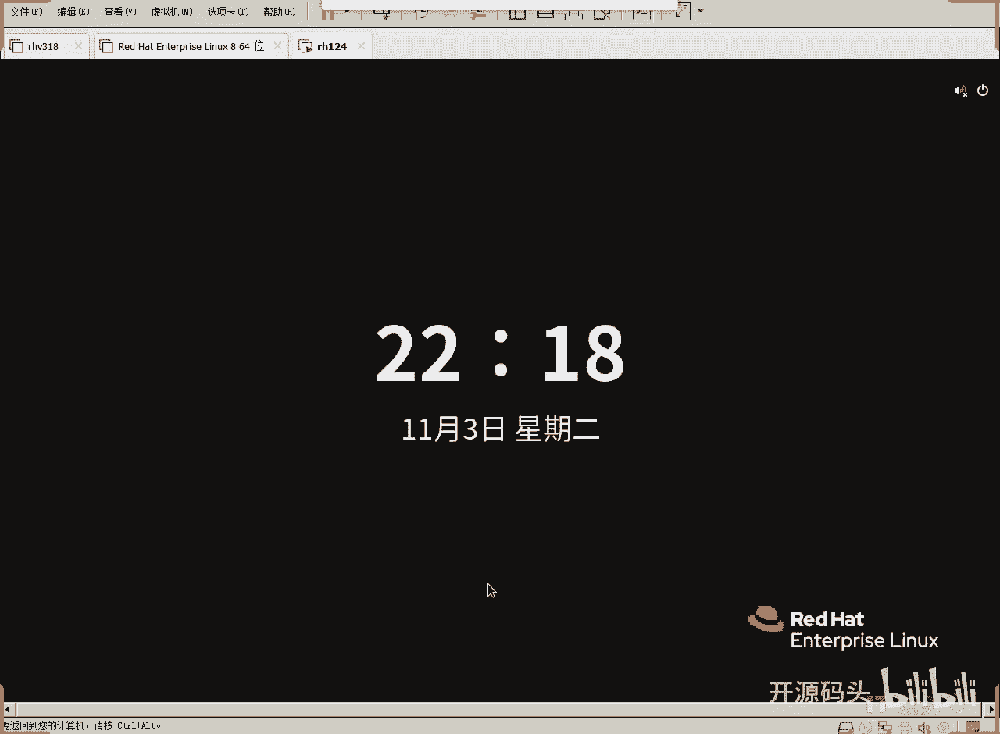
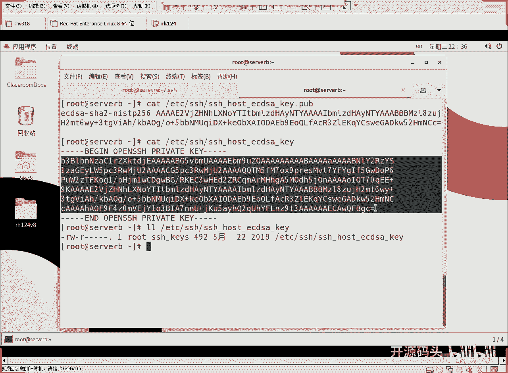

# RHCE RH124 课程：10：SSH 服务（3）🔐



在本节课中，我们将学习 SSH 连接中涉及的第三种关键算法——散列算法，并深入理解 SSH 如何利用公钥和私钥机制来验证服务器身份，从而保障连接的安全性。

---

上一节我们介绍了对称加密和非对称加密，本节中我们来看看 SSH 连接过程中用于验证数据完整性的第三种算法。

当我们首次尝试从一台服务器（Server A）通过 SSH 连接到另一台服务器（Server B）时，客户端会收到一个警告，提示无法确认主机的真实性，并显示一个“ECDSA 密钥指纹”。这个指纹就是由散列算法生成的。

散列算法（如 SHA-256、MD5）是一种单向加密函数。它的核心特点是：无论输入数据有多大，算法都会生成一个固定长度的、唯一的“特征码”（也称为哈希值或摘要）。如果原始数据发生任何微小的改变，计算出的哈希值将变得完全不同。因此，它常被用来验证数据的完整性，确保文件在传输或存储过程中未被篡改。

以下是散列算法的核心特性，可以用一个简单的公式来描述其不可逆性：
`哈希值 = Hash(原始数据)`
这个过程是单向的，无法从`哈希值`反推出`原始数据`。

为了更直观地理解，我们可以通过一个命令行示例来观察文件内容变化对哈希值的影响：

以下是使用 `md5sum` 和 `sha256sum` 命令验证文件完整性的步骤：
1.  创建一个测试文件并计算其初始哈希值。
    ```bash
    echo "OOO" > aaa.txt
    md5sum aaa.txt
    sha256sum aaa.txt
    ```
2.  轻微修改文件内容，例如将一个字母‘O’改为数字‘0’。
    ```bash
    sed -i 's/O/0/' aaa.txt
    ```
3.  再次计算哈希值，会发现结果与之前完全不同。
    ```bash
    md5sum aaa.txt
    sha256sum aaa.txt
    ```

这个实验清晰地展示了散列算法的“雪崩效应”：输入的微小变化会导致输出结果的巨大差异。因此，在首次SSH连接时，系统提示的“密钥指纹”就是服务器公钥的哈希值，用于让你确认正在连接的服务器是否是你期望的那一台。

---

理解了散列算法的作用后，我们回到SSH连接的场景。当客户端首次连接服务器时，它会收到服务器的公钥。客户端无法自行判断这个公钥的真伪，因此会询问用户（管理员）是否信任这个指纹。

如果用户输入 `yes` 确认，客户端的SSH程序就会将这个服务器的公钥保存到本地 `~/.ssh/known_hosts` 文件中。这个文件充当了一个“可信服务器名单”。

以下是 `known_hosts` 文件的作用和工作流程：
1.  **首次连接**：用户手动验证服务器公钥指纹后，信息被记录。
2.  **后续连接**：客户端再次连接同一台服务器时，会将其发送的公钥指纹与 `known_hosts` 文件中保存的记录进行比对。
3.  **验证成功**：如果指纹匹配，则建立连接，不再询问用户。
4.  **验证失败**：如果指纹不匹配（例如服务器重装系统或遭遇中间人攻击），客户端会发出严重警告，提示主机密钥已更改，可能存在安全风险。

这个机制有效防止了“中间人攻击”，确保了后续连接的安全性。

---

那么，服务器端的这些密钥存放在哪里呢？它们由SSH服务端软件（`sshd`）管理。

SSH服务端的配置文件通常位于 `/etc/ssh/sshd_config`。在这个文件中，可以找到主机密钥的存储路径设置。默认情况下，服务器的公私钥对存放在 `/etc/ssh/` 目录下。

以下是服务器端密钥文件的常见命名和用途：
*   `ssh_host_*_key`：这是服务器的**私钥**文件。它必须被严格保护，通常权限设置为仅 `root` 用户可读。
*   `ssh_host_*_key.pub`：这是与上述私钥对应的**公钥**文件。它在首次连接时被发送给客户端。

例如，我们之前连接时使用的 ECDSA 算法，其对应的密钥文件可能就是 `ssh_host_ecdsa_key`（私钥）和 `ssh_host_ecdsa_key.pub`（公钥）。客户端 `known_hosts` 文件中保存的正是来自 `.pub` 文件的内容。

---

本节课中我们一起学习了SSH安全体系的另一个基石——散列算法，并完整梳理了SSH基于密钥的身份验证流程。我们了解到：
1.  散列算法（如SHA-256）用于生成数据的唯一“指纹”，以验证完整性。
2.  首次SSH连接时，需要用户手动确认服务器公钥指纹，该指纹随后被保存在客户端的 `~/.ssh/known_hosts` 文件中。
3.  后续连接会通过比对 `known_hosts` 文件中的记录来自动验证服务器身份，从而防范假冒服务器。
4.  服务器的公私钥对存放在 `/etc/ssh/` 目录下，私钥的保密性至关重要。



通过“非对称加密”、“对称加密”和“散列算法”这三者的结合，SSH协议为我们提供了安全、可靠的远程登录和数据传输通道。