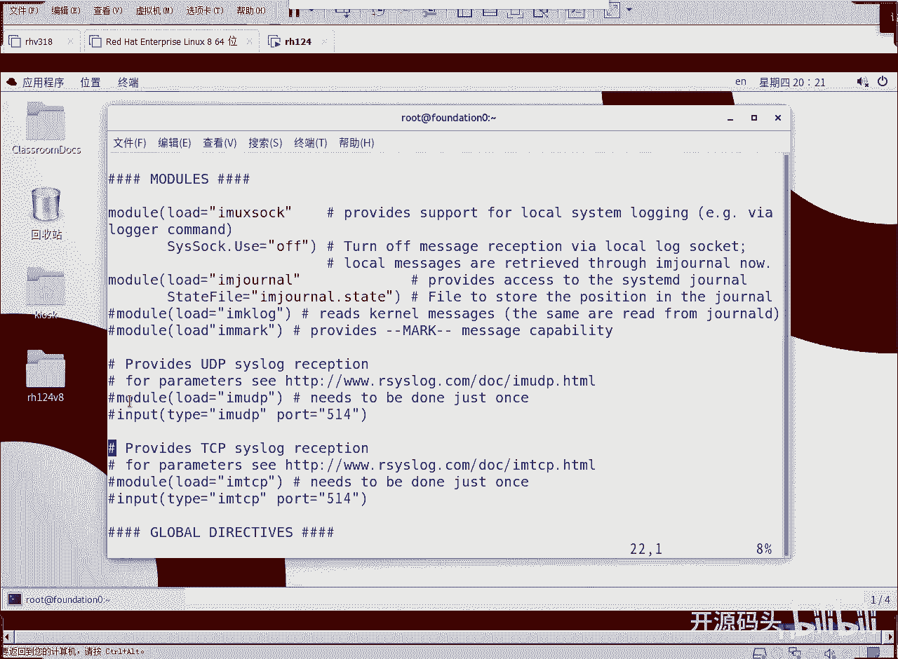
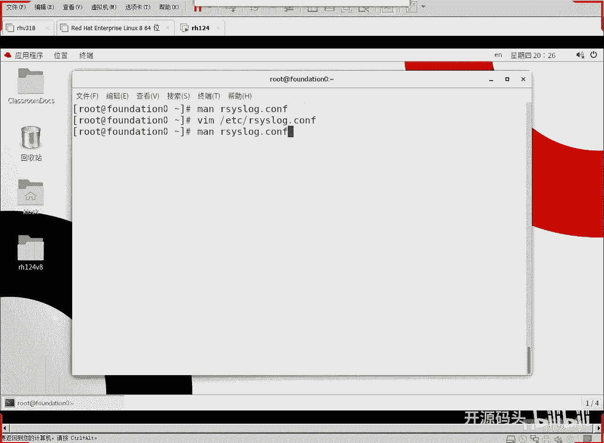

# RHCE RH124 之11 Linux日志与时钟同步(2) - P1 - 开源码头 - BV14t4y1J7WA

M你。啊，然后呢ISYSLOG点CONF。

那这个呢就是一个关于这个日志配置文件的一个说明，对吧？日志配置文件的说明。那这个配置文件呢里面就给我们提示了这些这些内容啊，比如说我们查询一下，比如说查一下er。

啊，这里面有有描述是吧，这个描述是什么样子啊，一开始啊，这是这个优先级呢是以下的关键字之一啊，优先级就是以下关键字之一啊，其中是什么呢？按照这个顺序啊。

按照顺序第八个 in notice run run这两个是一样的啊，你写完整的run和一个单ron是一样的啊，这两个是一级啊，都是4啊，都是4级啊，7654是吧，都是4级。

那122和 error这是三级是吧？然后呢，great a lot。emer emergency是吧，这都是属于什么呃和这个啊这都属于最严重疾别。啊，就是这是所谓的呃优先级的什么？

排序啊或者叫严重级别吧啊严重级别啊。那么还有呢就是生成这种事件的子系统啊，就这个事件到底是什么子系统生成的，或者是哪一个程序生成的。啊，应该加上什么，加上子系统的类别啊，你看这里面啊这个叫什么？

设备是吧或者叫设施是哪一个设施产生的这些级别的日志呢？啊，facility啊，就是所谓的设备或者是子系统。啊，这里面包括了下列的。关键字啊一个或者呃以下关键字之一是吧？啊，比如说这个很明显。

这是一个什么什么子系统身份验证吧，对吧？啊，就是AUTH是吧？身份验证啊，这个什么啊，身份验证的特权使用，这个主要是针对root的行为。

或者是有人想做root比如说有人用速啊SU用速命令呢要用root身份或者速度的方式实行执行root的命令啊？这个呢就会被记录成这种事件，这叫。这叫特权鉴定啊特权鉴定。这个呢是crol啊。

这个是计划任务啊，deman服务服务级别的日志是吧？服务类型，各种服务啊。然后内核、打印机邮箱啊等等等等，还有安全是吧？安全等同于oss啊，身份验证和安全是一码事，对不对？还有日志本身啊吧，用户啊。

像这些东西，各种各样的啊，像我们的那个呃系统启动的时候，不同级别的这个呃不同层次的这种所谓的系统发生的这种事件，loc口零至loc口7。所以说这些东西呢，我们可以看着这些东西。

我们都发现了系统当中但凡发生的一些各种各样的这种系统使用过程当中问题啊，就会被作为什么作为日志的什么起源，或者叫日志的设施，是哪一块，哪个子系统，哪个设施产生的这个问题了，对不对？项目有很多是吧？

类型也非常多，对不对？啊，最终呢我们就会呃。看到一个这么一个东西啊。

我们看一下。啊，类似于这个样子啊。哎，我们还是直接看配置文件得了，好吧。

VMET下载RSSSlogo点COF这个配置文件好吧。

这里面其实也有很多解释啊，我们只要呃细细的看一下这个解释呢，其实也能理解的差不多。

呃，首先呢是moding啊，就是这是我们的日志需要加载的一些模块。就是有些呃有些日志呢。

呃，它是需要加载起模块之后呢，才能跟它产生对话，才能把它的日志拿过来啊吧？那还有这个。啊，这个是什么东西呢？这个就是远程接收日志啊，远程接收日志。

呃，我在我的514号端口上接收别人用UDP发过来的这种日志，或者是用别人用TCP发过来的这种日志。

启动模块加上input这个标识，这样的话我就可以接收别的设备，通过标准的SS log这种格式发过来的日志。

对吧OK那么前面呢其实都是配置啊，后面呢我们就要了解一下，这是规则是吧？下面就是规则了啊，我们就会看到这样的情况。比如说啊这当然这个是注释的啊，科闹点心。前面是什么？前面这个字段是什么？是不是设氏啊？

内核这部分设施是吧，或者内核这个子系统啊，新任意级别啊新任意级别就是呃相当于是呃从零级到7级全部包含了是吧？好，那么把它记录在什么c索上。也就是说内核的日志呢将会直接显示到屏幕上。啊。

将会直接显示到csl控制台这种设备上，对吧？就是直接显示到屏幕上啊，当然这一行是注释掉的啊，这一行注释掉的。

okK还有星点音符。啊，这个星点inflow是什么意思呢？就是各种各样的这种设施。只要是info以上级别的。啊，infer是几级infer是6级吧啊，第bu个是7级，我们尽量不要用第bug。

不要记录第bug。因为这个这个东西。产生的内容太多了啊，没必要，而且它都是无关紧要的这种情况，对吧？那像我们自己编程的时候，是不是我们编程去排错的时候才会用到这个。调试啊第八个信息啊对吧？啊。

所以说我们系统正常运行的情况下，尽量不要第bu个级别的就不要记了。所以说我们记录的是什么6级以上的啊，iner级别以上的任何子系统info级别以上的。记录在这个日志里面。啊，记录在这个文件里面吧。

mail点n这个n代表什么意思呢？代表不记录。也就是说啊我你不是说任何级别的任何。设施所产生的信息级别以上都要记录吗？但是要除掉什么呢？除掉邮箱的除掉什么呢？特权应用的啊，除掉什么呢？计划任务的。啊。

我们后面还会聊计划任务是吧？计划任务就是让他在固定的时间，或者我们指定的时间去运行一个什么东西。我们人不在，但是它在运行啊，这种叫计划任务啊，那像这些东西呢，这三个东西是排除在外的啊。

也就是说我们任何信息级别以项的日志，除了邮件特权使用以及。这个计划任务之外的这个呃信息或者叫日志都会被记录在这个日志文件里。那么既然上面不记，那么下面意思就是要单独记是吧哎。

特权使用那特权使用把它记录在这个。Sreary。啊，这个文件里面啊嗯登录所呃呃记录所有的邮件信息在。一个位置啊在一个位置mailile点心，就是邮件这个子系统啊发出的啊任何级别，包括第8个啊。

就是他的这些信息啊，全部都什么呢？都被记录在这个面。啊，都被记录在这这里啊，前面的横杠呢代表是E步式记录啊，因为内容很多，不需要立即反映到邮件日志里面。

这个位置。

好，这是那个什么计划任务的这个比较重要，这个是什么最高级别的错误了吧啊，最高级别错误。这个日志发到输出模块用户消息，然后给星星代表所有用户。啊，所有用控台，其实这个时候系统已经几乎就丧失功能了是吧？

几乎就快崩溃了啊，所以说它有可能就显示不出来啊。但是但是一旦有有这种条件，它就会显示出来啊，任何人都会获得这个信息啊，不管你是从哪个终端过来的，我都会获得啊这种最高级别的错误发生的这种情况的警报信息。

那还有这些其他的是吧，其他的各种各样的日志啊，这个local7loc7这种代表着什么呢？代表着引导信息啊，就是我们呃内核启动C的启动过程当中所发生的一些事件都是属于loc7。

啊，这些日志。啊，这个规则呢基本上就。呃，我们懂了这个规则之后呢，我们就可以去啊根据需要把某一部分功能的信息或者某一个加上某个级别以上的信息，把它记录在我们指定的另外一个文件里面。对吧好。

okK这是所谓的日志配置文件啊，那么相关的这个呃。

内容描述我们可以从manu啊RSlog点CFG这个配置文件里面啊，能看到相应的信息是吧？我刚才已经给大家解示了一下那些常用的配置语法。这个主要是什么啊，就是两个参数是要理解的是吧？第一个参数是什么？

设施第二个参是什么呢？优先级啊，哪一个设施或者哪一个子系统所产生的什么级别的这种问题啊，这样的话我们就会呃对这个事件呢就有了有了这种呃紧急疏密之分，对吧？

