# RHCE RH124 之2.1 Linux虚机管理 - P1 - 开源码头 - BV1nN4y1V71E

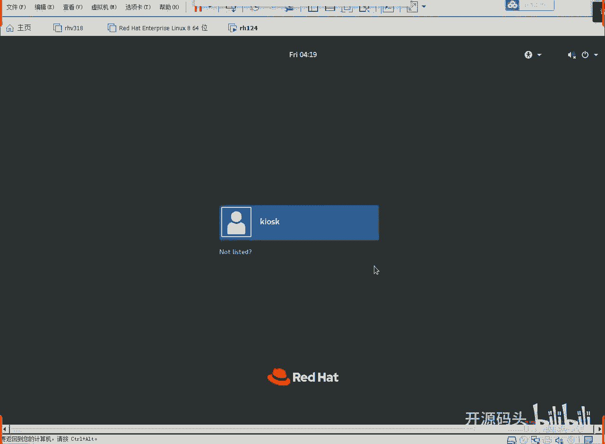

好使用当前k4 k的用户登录密码red hd回车登录，啊桌面显示出来啊。

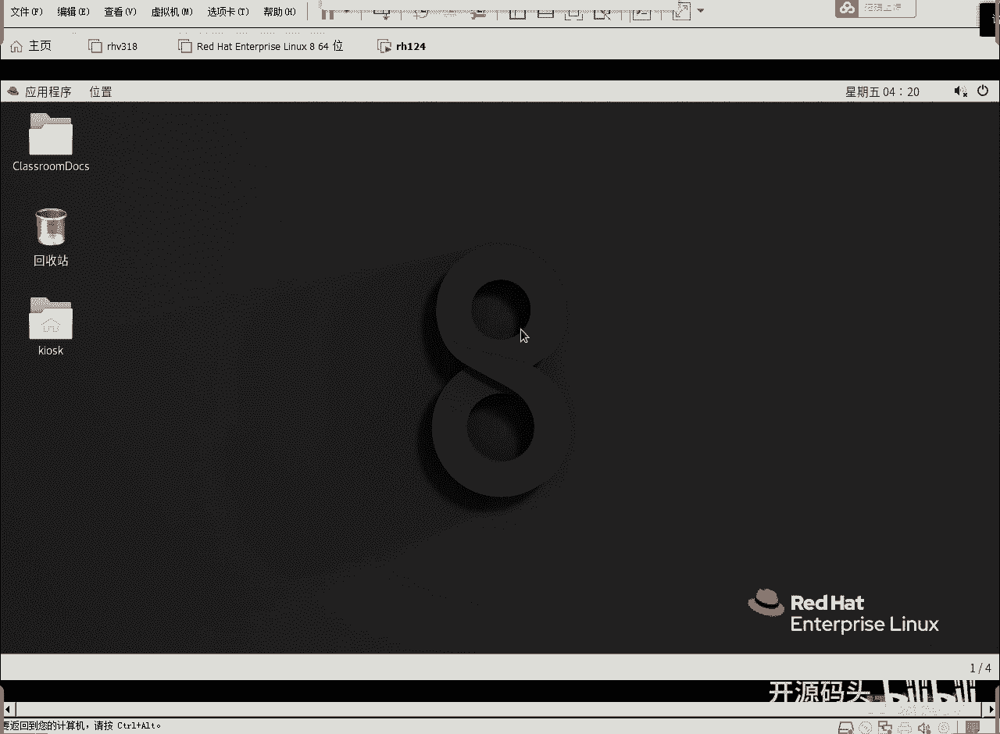

左上角应用程序，应用程序里面有个什么一个教育education啊，英文英文的那个单词是education，教育底下呢就是我们要玩的那几个续集，我们要打开的或者是要启动的那几个续集啊。

看一下classroom，开始room呢，这个机器一定在任何时候都得开，因为它是我们的练习的服务器，后台服务器呃，我们给大家提供这个系统呢其实已经开了啊，其实已经开了，我们可以点开看一下好吧。

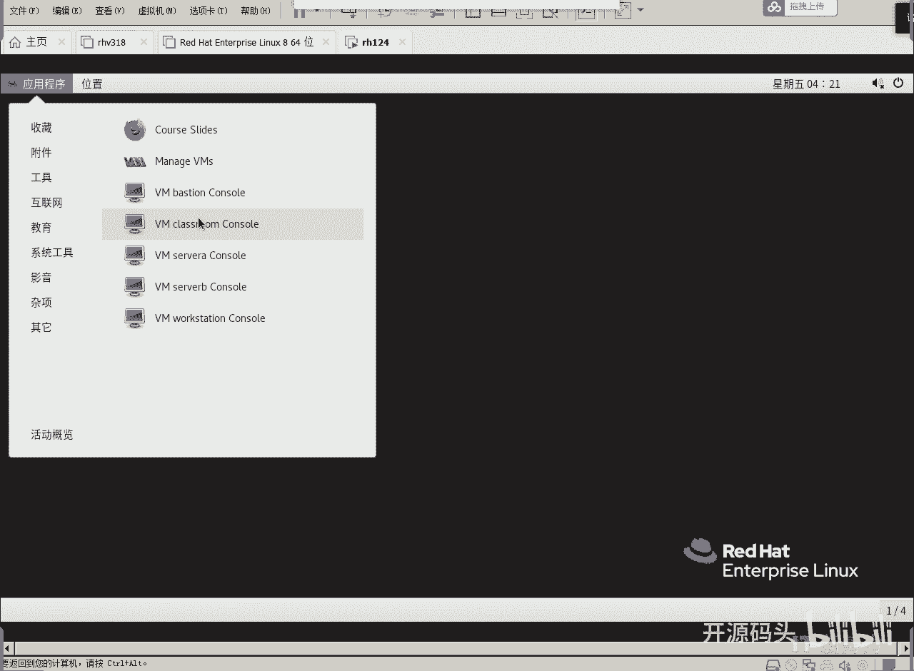

点开classroom，你看他已经开了是吧，显示出这个登录的用户名和密码的这些操作啊，ok啊那么呃这个控制台呢是有点小对吧，没关系啊，嗯在自己的迹象练的时候呢，可能会稍微倾斜。

我在这里呢显示的是估计不太好。

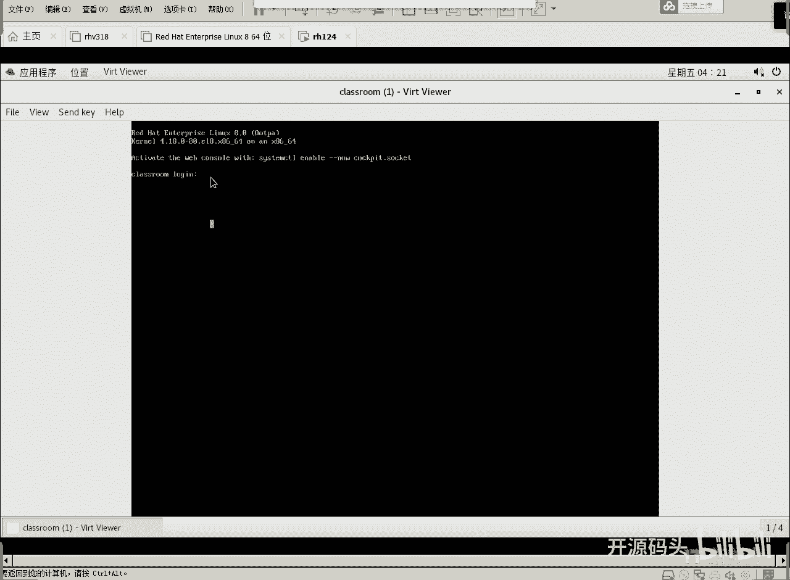

但是我们也不用它的控制台，为什么不用它的控台呢，因为我们资源在它上面，我们不一定要登录它，所以直接把空调关掉就完事了啊。

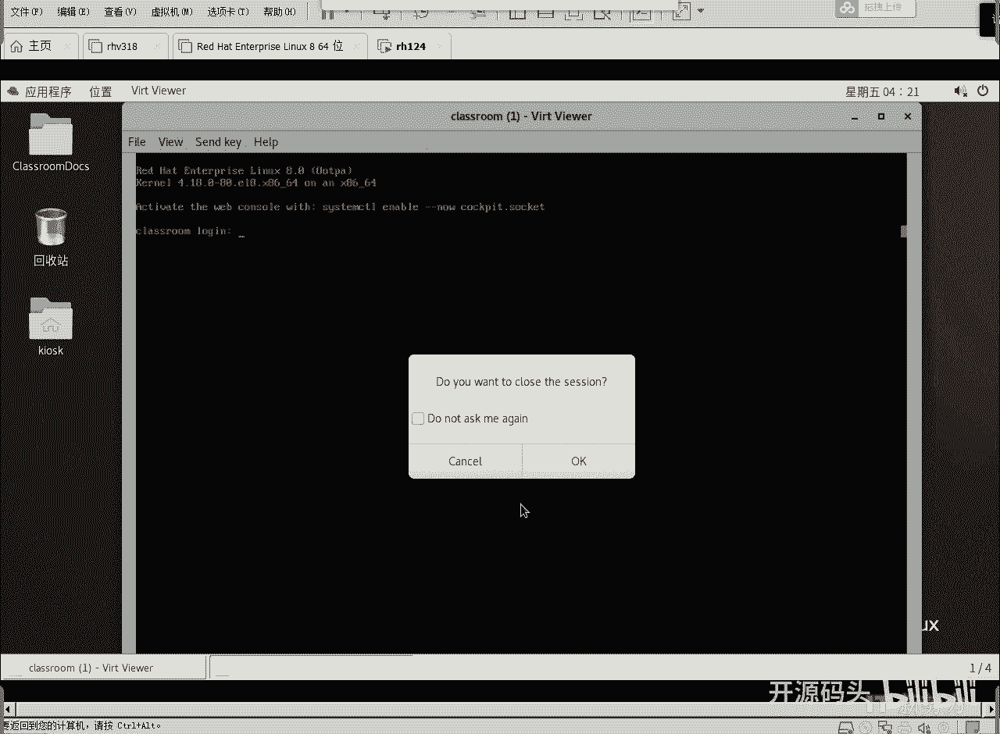

ok关掉这个绘画啊，关掉绘画并不代表关掉机器，我们的机器还在后台运行是吧，所以说你会你你们在练习的时候，好像你可以不去管卡拉斯room，因为卡拉room其实已经开了啊，已经开了，就是他每次正常情况下。

我们这个外壳的机器开掉的时候，开启的时候，我们的这个classroom 5就是开的，然后server workstation，server is soob，这三个机器构成一个网络。

他和classroom怎么通讯，通过什么，通过vision这个机器来通讯，是通过这个机器来通讯啊，所以说呢呃总共有几个舞台，所以你想想你的机器内存够够啊。

内存至少应该有个什么哎哟至少应该在8g物理内存至少得8g，然后呢虚惊6g应该已经不是太太小了啊，已经嗯6g这个东西已经差不多了是吧，好我们可以呢呃去打开这个续集管理器。

然后呢这里面看每一台续集的这个工作状态，啊这个不好看啊，这个这个里头这个管理续集还是还是用这种菜单式的，这个点选的方式去管理，太没意思了啊，我们来打开这个啊，有一个系统工具。

系统工具底下有个虚拟系统管理器，这是我们原生的东西啊，这个不是我们这个定制版的，就每个linux它里面都有这个东西啊。

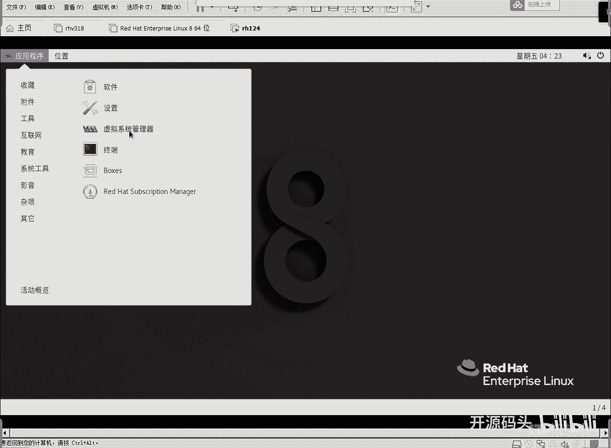

虚拟系统管理器点开啊，这里就列出了所有的血迹，而且现在这些数据都已经开机了啊，然后我们现在要打开workstation。

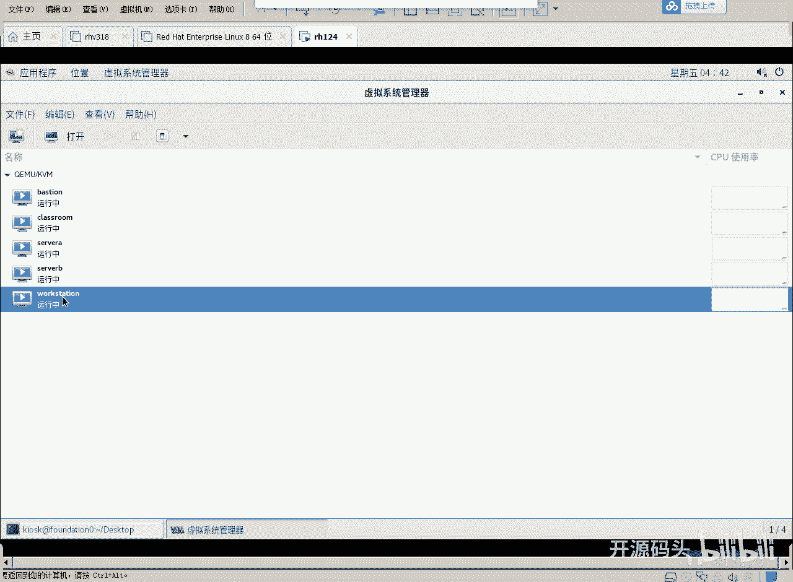

双击打开workstation的登录界面，默认用户是student回车输入密码，默认密码呢也是student，好我们现在这个环境基本上就这么用啊，就是你拿到一个虚机之后呢，你就这么用它就可以了。

我们以后做实验的时候呢，能不用work station，我们就不用了，因为我们ox station就是为了提供一个图形化的操作界面，而我们可以使用外头这个图形界面的话，oxation就可以省掉不用了。

沃克之城这个图形界面呢和外头的那个图形界面是一样的，比如我们还是想设置中文啊，电源按钮，然后左下角找见这个设置啊，就会出来我们上次可聊的那个控制面板里的各种设置项目对吧，其中就包括了语言好最小化。

然后呢我们可以在桌面空白处点右键打开一个终端。

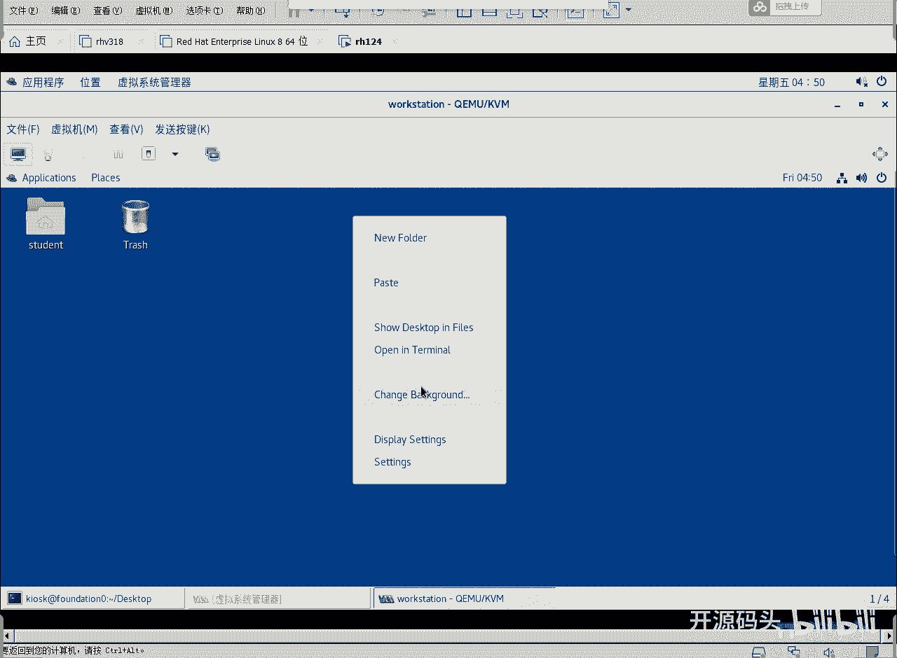

打命令df杠h啊，我们可以看一下这个磁盘的一个剩余情况啊，比如说呃整个系统这个根目录啊，它的一个使用了5。1g嗯，这个呢大小的话呢应该还算适中啊，有图形界面的一个空间大小，然后退出这个终端啊。

呃可以用ctrl d快捷键啊。

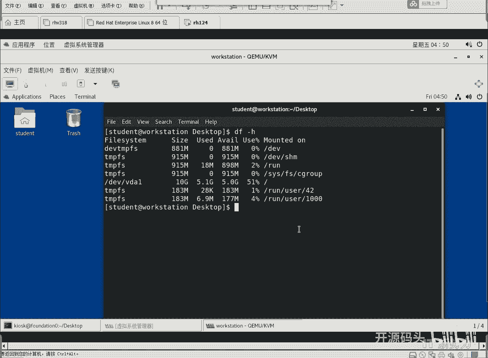

我们以后如果说不用，我不确定用work station的时候，我们就不用它了，因为它这无非也是一个图形界面的使用。

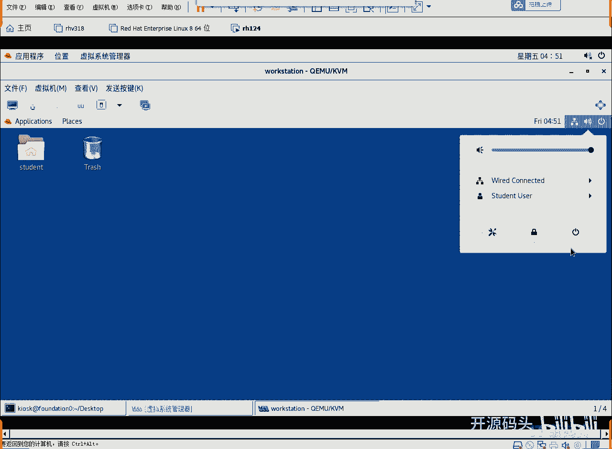

就是我们的桌面用户，那我们能不用它就不用它了，那我也可以把它关掉吧，关掉也可以，重启也可以，或者是直接关掉这个显示也可以。

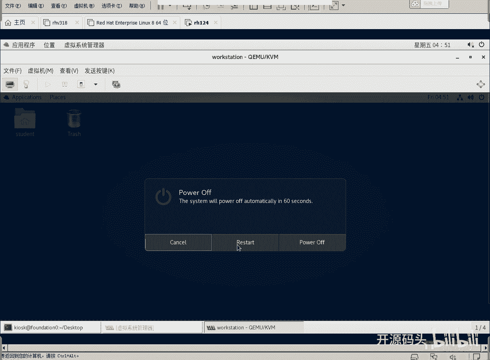