# RHCE RH124 课程：2.1：Linux虚拟机管理 - P1

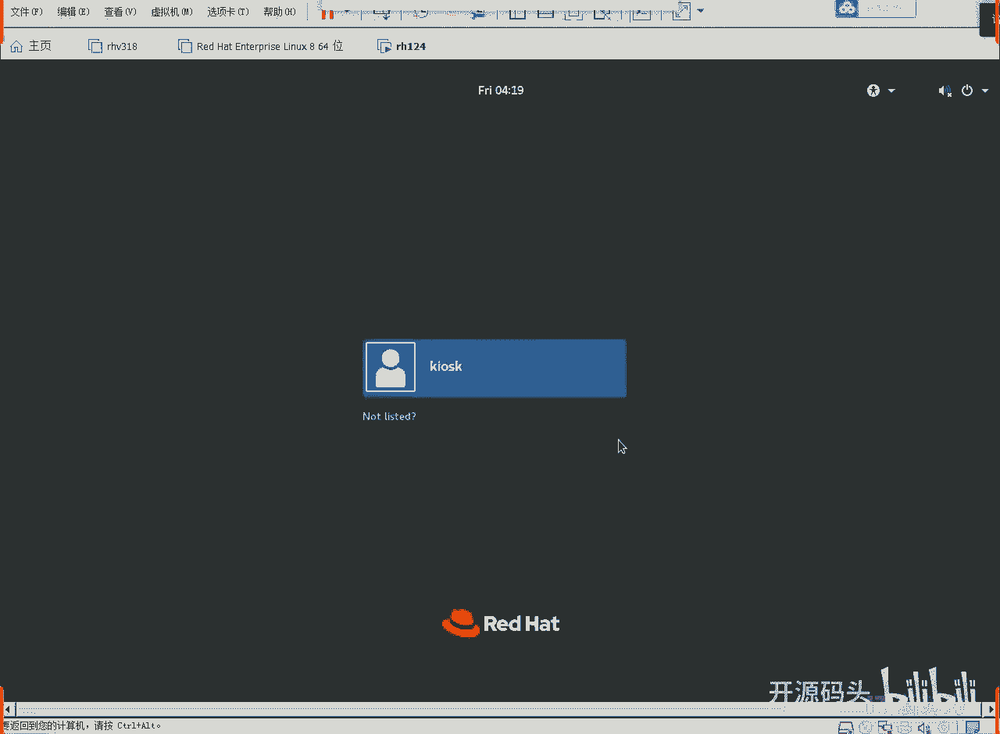

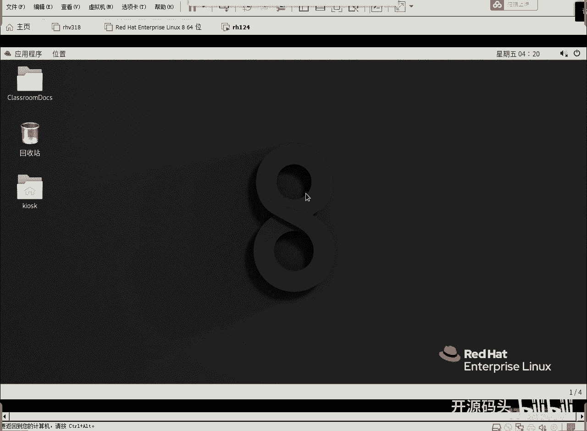

## 概述
在本节课中，我们将学习如何管理Linux虚拟机环境，包括启动、登录、查看系统状态以及使用图形化工具进行管理。这是RHCE认证课程的基础实践部分。

---

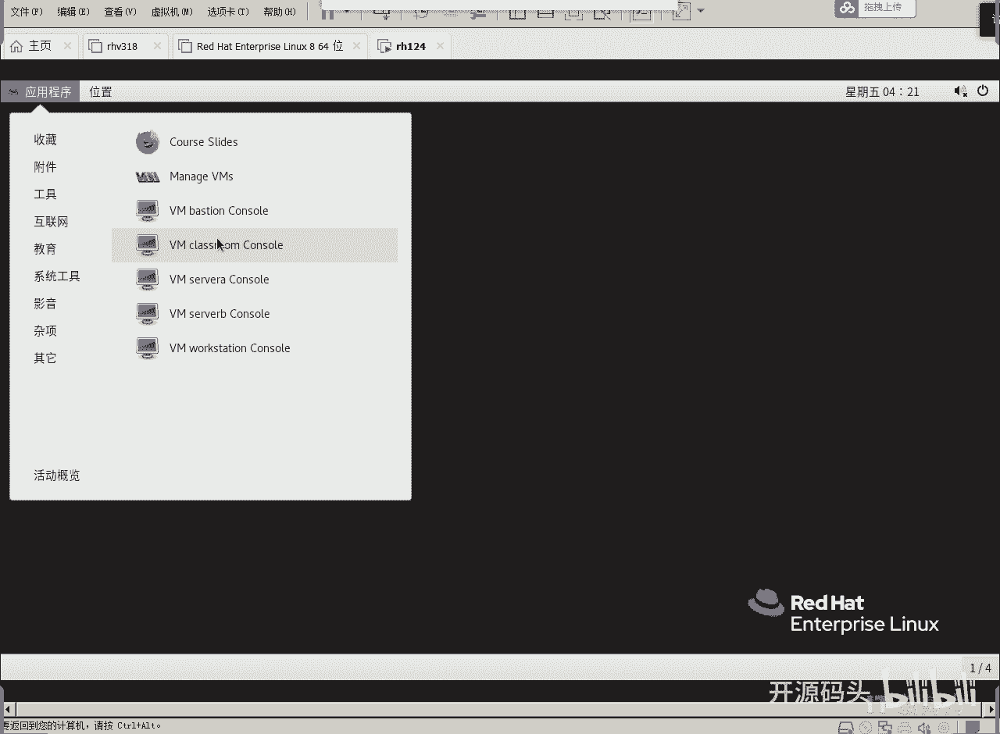

## 登录桌面环境
使用用户 `k4k` 登录系统，密码为 `redhat`。登录成功后，桌面环境将显示出来。


## 访问虚拟机列表
在桌面左上角，点击“应用程序”菜单。在应用程序菜单中，找到“教育”分类。该分类下包含了本课程需要使用的虚拟机。


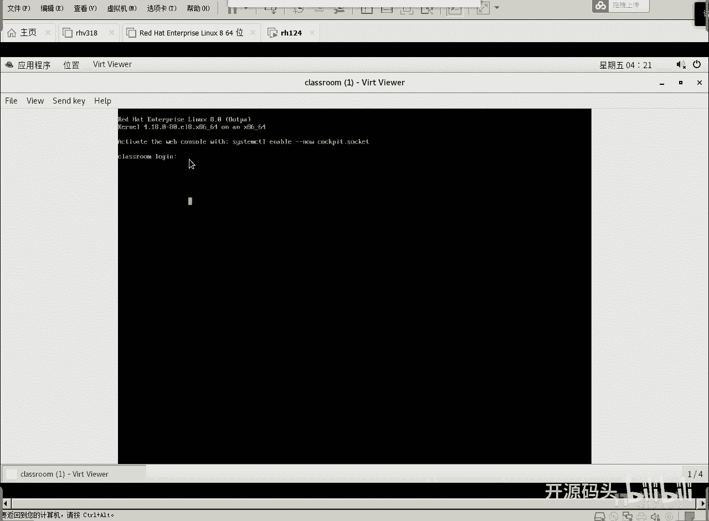

以下是虚拟机列表：
*   **classroom**：这是我们的练习服务器，需要始终保持运行状态。
*   **server**
*   **workstation**
*   **vision**


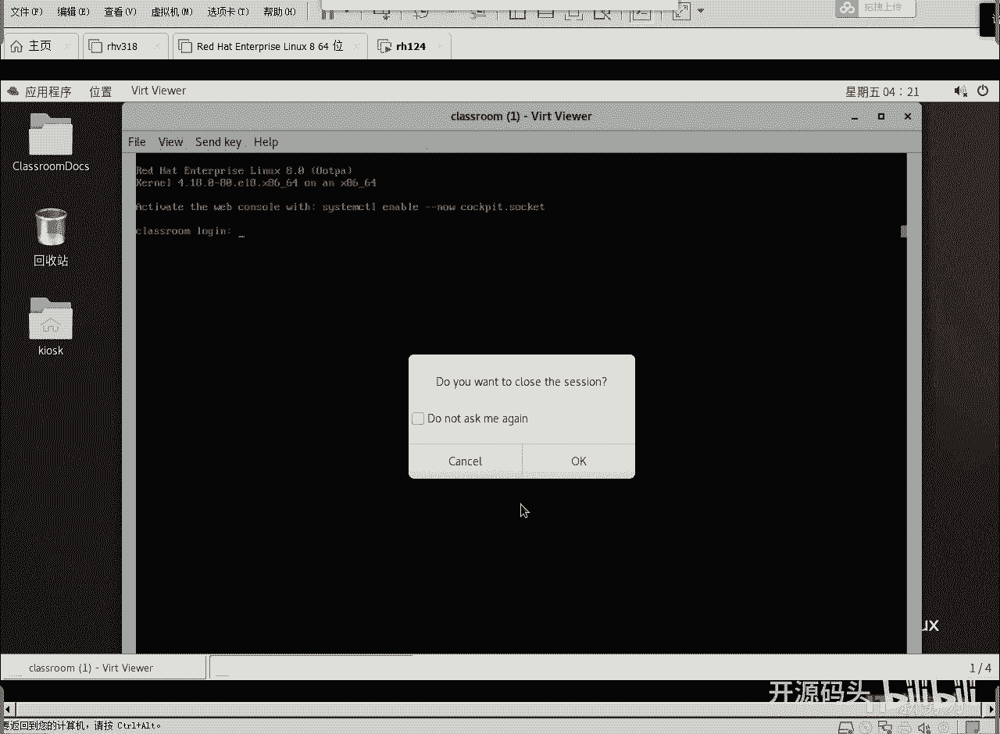

## 启动与管理classroom虚拟机
classroom虚拟机在系统启动时通常已自动运行。我们可以点击它来查看其控制台界面，确认其运行状态。


我们通常不需要登录到classroom虚拟机的控制台进行操作，因为我们的资源位于其上，但操作可以通过其他方式完成。因此，可以直接关闭其控制台窗口。


**注意**：关闭控制台窗口**不等于**关闭虚拟机。classroom虚拟机仍在后台运行。在我们的练习环境中，classroom、server、workstation和vision这几台虚拟机共同构成一个网络。workstation和server通过vision虚拟机与classroom进行通信。


**系统要求提示**：运行此实验环境，物理机内存建议至少为8GB，为虚拟机分配的内存不应少于6GB。


## 使用虚拟系统管理器
通过桌面菜单启动虚拟系统管理器是一种更直观的管理方式。在“系统工具”分类下，可以找到“虚拟系统管理器”。这是Linux系统自带的原生工具。


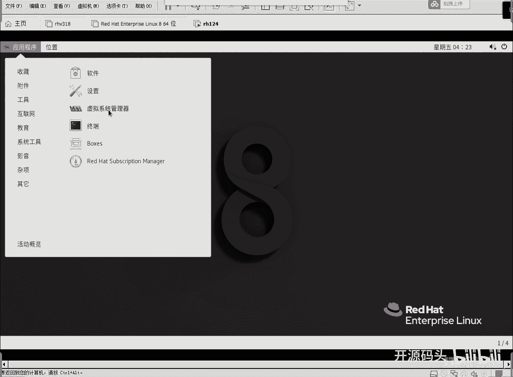

启动虚拟系统管理器后，界面中会列出所有的虚拟机及其当前运行状态。


## 登录workstation虚拟机
在虚拟系统管理器中，双击 `workstation` 虚拟机图标，可以打开其登录界面。该虚拟机的默认用户名和密码均为 `student`。


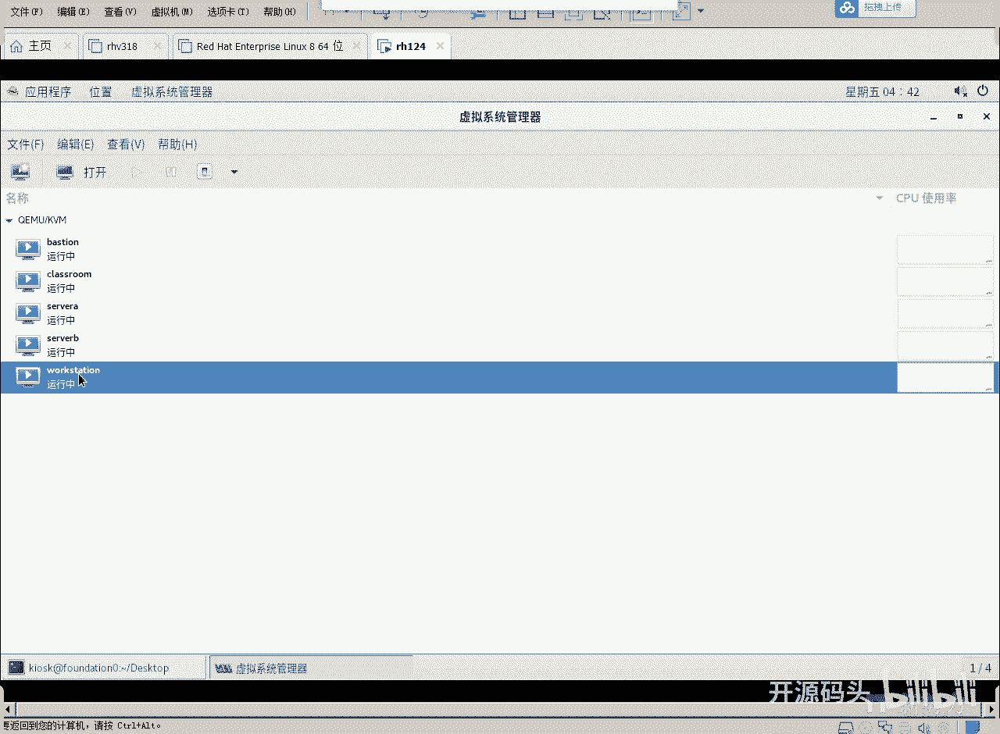

输入密码后，即可登录workstation的图形化桌面环境。后续实验中，我们将尽可能避免使用workstation的图形界面，因为我们的宿主机已经提供了图形界面。workstation的作用主要是提供一个备用的图形化操作环境。


workstation的图形界面与宿主机界面功能一致。例如，同样可以通过点击桌面左下角的电源按钮，进入“设置”来调整系统语言等选项。


## 查看系统状态
在workstation的桌面空白处点击右键，选择“打开终端”，可以启动命令行终端。


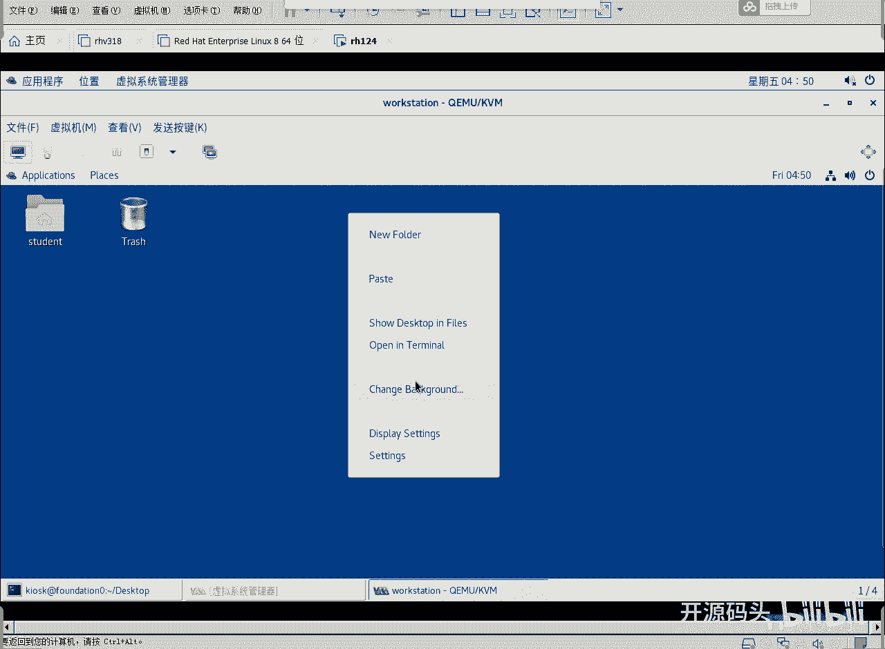

在终端中，我们可以使用 `df -h` 命令来查看磁盘使用情况。例如，查看根目录 `/` 的使用情况，命令为：
```bash
df -h /
```
执行后可以看到磁盘的总大小、已用空间和剩余空间等信息。


查看完毕后，可以使用快捷键 `Ctrl + D` 或输入 `exit` 命令来退出当前终端。


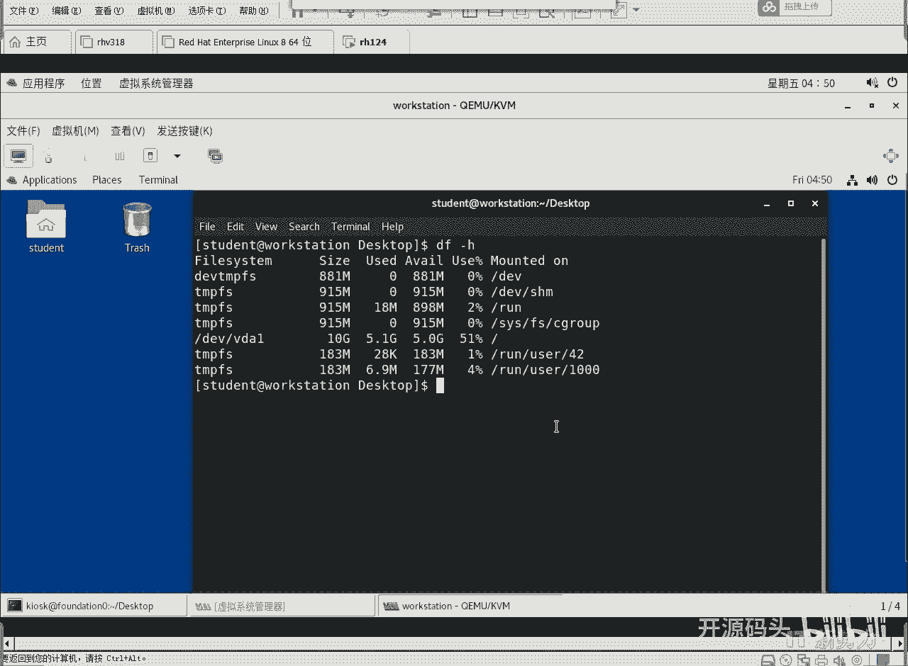

## 管理workstation虚拟机
由于我们可能不经常使用workstation的图形界面，因此可以选择将其关闭以节省资源。在虚拟系统管理器中，可以选中workstation虚拟机，然后选择“关机”、“重启”或仅“关闭显示”。


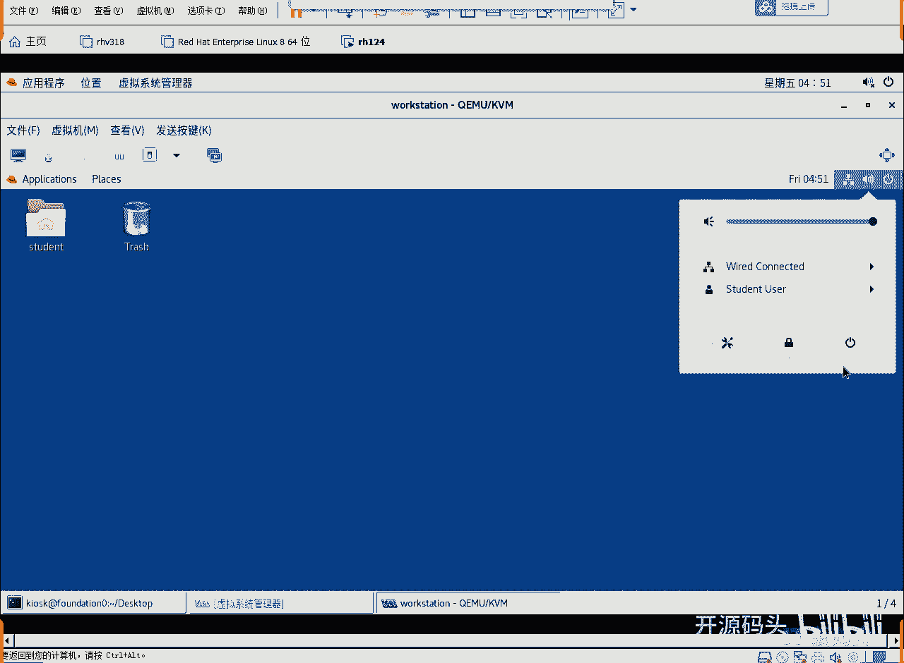

---

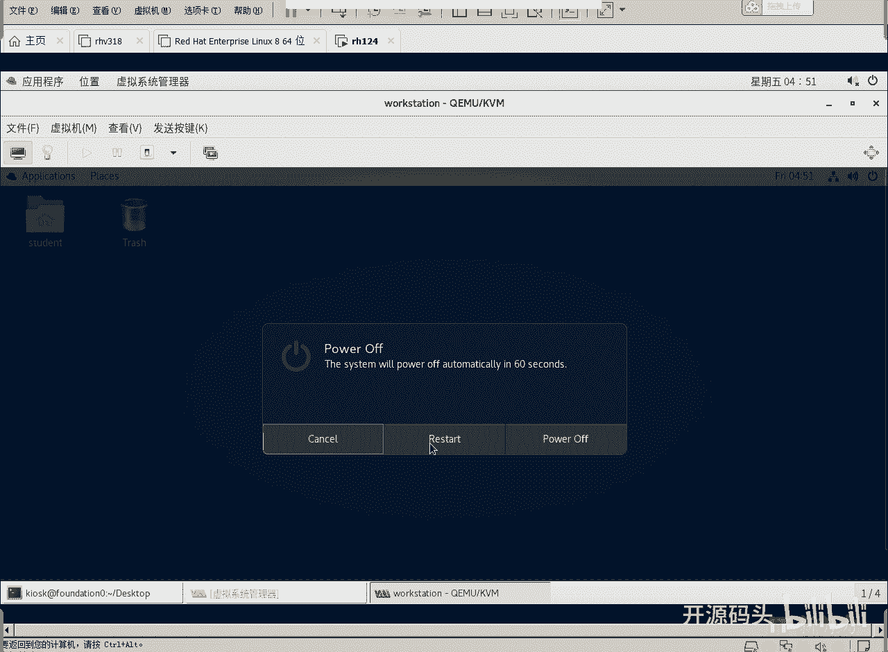

## 总结
本节课中，我们一起学习了Linux虚拟机环境的基本管理操作。我们了解了如何登录系统、通过应用程序菜单和虚拟系统管理器访问并管理虚拟机、登录特定虚拟机（如workstation）以及如何在图形界面中使用终端查看基本的系统信息（如磁盘使用情况）。这些是后续进行系统管理和网络配置实验的基础。