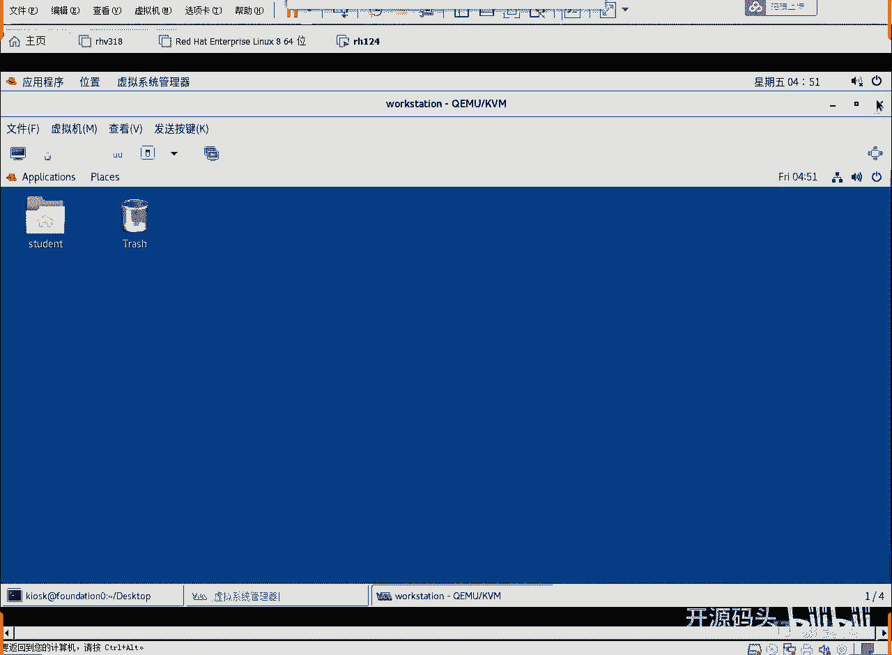

# RHCE RH124 之2.2 Linux基础命令_1 - P1 - 开源码头 - BV12a411V76t

下面我们来看一些常用命令啊。呃，比如说上次课我们聊的黑保健补全，对吧？

退保键可以补全命令。hsistory historyistory显示历史打hiistory之后呢，我们曾经用过的命令行全出来了。好，那么呃你history显示出来的所有命令。

如果我们想重复执行第六行或者第三行啊，你惊叹号6或者三就可以了，是吧？或者是打这个什么打这个命令行的头几个字母啊，如果你打着这个头几个字母已经能够区分出我们之前用过的那个命令行。

原来那个命令行就会再次执行啊。还有控制光标的快捷键。ctrorl Actrl Ectrl Uctrl K是吧？这个呢就是啊你比如说我们呃我们有这么一条命令是吧？然后cttrol A。

是不是直接光标就到了行首了啊，ctrl一直接就是行尾是吧？嗯，右。K。这玩意儿是不是。是不是我们呃我们的那个叫什么？嗯，打游戏的时候经常用到那几个那几个键，对吧？AEUK啊UKUU是从光标处删到行首。

K是从光标删到行尾啊，还是这个一个概念。如果光标定在。呃，定在。VMV是这个地方，我们从这个地方contrlU。是不是就删到杭首了？啊，然后我们在vis后面在这个地方contrl key上的行位，对吧？

啊，这个东西如果说在我们初始使用的时候啊，能够很养成一种使用习惯的话，我觉得你以后也是忘不掉的啊，这些东西也。就是不容易忘啊，但如果说你就根根本没记过啊，以后也不用它。

你用你就直接每个时候操作都是用那个光标键来移动也能行，是吧？就是说效率稍微低一些啊，这就看你喜欢喜欢用什么的啊。啊，这是我们一些常用的命令啊。第一个命令呢就是who am I我是谁呀是吧？我是谁啊。

我们来看一下我是谁啊。Who am I。M I。我是QSK对吧？当我切换到root以后。ho am I。对吧。当前用户是谁就能看到啊。还有这些显示日期是吧？显示当前日期。然后呢。

这个后面这个选后面这个参数呢是对日期的一个什么一个格式化的显示啊，把它按照格式化的方法显示出来。同学们都学过C语言那个编程。C语言编程里面那个print f命令啊。

print f命令是不是也后面也可以规划规定我们是显示成字符还是显示成数字，对不对？哎，那个就是类似于那个作用啊，就是我们把那个日期里面的东西呢，格式化成我们喜欢的那个样子啊。

比如说呃加分号R代表的是呃只显示时间。如果是加百分号X，就是小X啊就是只显示日期啊这个。首先是data可以显示这个系统的完整的时间是吧？啊，如果我们显示的是。呃，百分号的格式化的是大R。哎，小R了大R。

啊，哎，先设置啊，凌晨4点56。吓我一跳。穿越了啊。啊，然后呢小儿。不是小X是吧？诶。是显示器是吧，就是把我们的那个完整的这个时间。9月25号的凌晨4点。今天是9月25号。我这个外头的机器是9月20。

今天到底几号？啊，这个时间也不对。呃，暂时不用管时间了啊我们就是说呃这个data命令显示当前系统时间的和日期的这个呃命令用法，好吧，呃，时间完了再说。然后继续看命令啊，还有修改密码password。

这个命令是修改s student的这个用户的密码是吧？当然你要修改一个人的密码，你必须是root啊。如果你是普通用户的话，你是不可能修改别人的密码的，只有root才可以修改啊。

所以说你切换到root时候呢，可以修改用户密码然后我们都可以查看一个文件的类型，用fi命令，fi命令呢就是查看你后面所说的这个文件的类型是什么。你像这个fi查看密码文件。

我们来看一下看它有什么看它得到一个什么样的提示，好吧。打一个打一个命令叫做fill。fi什么呢？呃，ETC下面的PSWD啊，这是我们的密码文件啊。啊，这个密码文件，他说这就是一个阿斯克玛的一个文件啊。

就是一个文本文件，对吧？password里面其实我们所有的用户的用户名密，用户名以及用户的一个什么加目录啊，什么的配置信息全在这个。这个文件里面放的啊windows的这个库呢，它是加密的。

而我们的lininux的库呢，它是铭文的啊，我们用什么用ca。用ca me。啊，我们用一个图形化命令吧，G editit g editit是图形化的编辑器啊。

我们来alt小数点alt小数点把上一个命令的那个最后那个参数调过来。我们上一个命令最后的参数是这个，所以说我们alt小数点就出来了，是吧？这也会减少会增加我们的工作效率是吧？提高我们工作效率。好。

编辑这个文件啊，打开之后你会发现就是这明文的是吧？张三李四往5root用户啊，root的ID号组号啊root的那个呃组名加目录啊，以及它的shall等等，这些东西就是明文存储啊。

你能看懂但是说你要改它吗？不要直接去改，虽然你有这个能力去改，但是不要去改啊，呃改呃要改的话，通过命令去改。比如说你想改这个呃它的加目录啊，那你就通过you若 modify的命令去。

啊，modify啊通过这个命令去改这个一个用户的信息，而不要直接去改那个库。当然有人说候有人说我就想改他会有什么有恶果呢？如果你一定要改，你改对了的没问题，你改错了，它会造成一些什么？不可预料的结果。

因为他认为是那个东西应该是什么东西，结果呢完全不是那个样子，或者是完全出乎他的这个语法处理的呃意外，要么就是出现一些什么啊不可预料的这种结果啊，所以说我们也要么就是。可能是正常的对吧？啊。

最好还是通过标准的命令行去操作它，好吧啊，虽然你有能力去做啊，但是不要那么去做。好，继续看命令啊呃，刚才聊了who am I date。呃，file啊，password改密码啊啊，我们可以试一下，好吧。

那我们这么来做操作啊，远程去修改一个密码。我们在这个SI址的上候呢，加上用户名。root at work station对吧？root at station会车，那这就是要以root身份。

要我要用work station这个机器上的root用户的身份登录啊啊，然后呢我已经进来了啊。我已经进到work克这个机器，然后是root用户。有些人说哎没看见你打密码啊，呃，没关系啊。

这个是这个免密码的登录的，呃，比那个有密码的更安全啊。它其实是做了很安全的这种身份验证之后才让我进来的啊。关于这个道理，我们在后面的某一个章节啊，在讲SIC的这个具体工作原理的时候，我们会详细的去讲啊。

现在呢我们知道一下不打密码登录也是很正常的一件事情就可以了。啊，然后呢我们我们登录的这个work session这个迹象啊，然后我们可以来练习。啊，练习我们这里所列的所说的这些呃命令，对吧？

比如说改密码，注意啊，改密码一定要是谁来改？root来改啊，我觉得我记得应该有个用户叫student，对吧？啊，我们可以查一下啊ID。STUDENT啊，有没有这个用户呢？

我们能看见有啊这个student这个用户，他的UID这是这个student的用户在linux系统里的身份证号，就是唯一的标识号UID用户ID是吧？这是他的GID这是他的说属组啊。

sdent的用户既属于student组，还属于where组，有些人说唉sdent用户还有个student组嘛？yes没问题啊，这个东西而且是必然的，就是普通情正常情况下。

我们任何一个用户都有跟他同名的一个组。啊，这是linux的安全架构决定的啊。呃而且这个组呢叫主组啊，就是这个stdent这个用户的主组啊，一个用户只能属于一个主组，就是很一般都是跟他同名的组名。

就是有一个所有用户，那就99%的可能性。也有一个sent策的什么？啊，组这是很正常的啊，就是一个用户属于两个组也很正常，对吧？OK好，随den呢我们现在呢改死人的密码PASI是WD。STUDEMT。啊。

PSWD的意思就是改密码，改sdent的密码。当然你必须是谁root啊，好，回这。他就会问啊，新的密码啊新的密码是什么？我们给它改成red hat。啊，然后他说无效的密码密码少于8个字符。

重新输入一次密码。我还是瑞纳的。已经成功更新。就是student的密码已经被更新了。虽然说它提示了这是一个无效这个密码呃少于8个字符。再一个是啥呃那个密码的那个呃所谓的呃复杂度不够，对吧？没关系。

复杂度不够。呃，因为是谁在操作，因为是root在操作，所以说几乎就是强制性做下去的。啊，普通用户你要是设置一个redhead的密码。你比如说st改自己的密码。啊，用户改自己的密码怎么改呢？

PESWD回车就可以了。啊，后面如果不加用户名的话，改的是自己的密码。啊，所以说呃只有只有root这个用户呢，是可以后面在partto的后面加用户名的，别的用户加的话都呃。别的用户加的话都不不可以啊。

别的用户只能改自己的密码，不可以改别人的密码。但是root改密码的时候呢，它不会受到这个密码策略的限制。啊，就是几乎是强制设施，强制实施下去了，对吧？okK这是改密码啊。

那么sent的密码就算改过来了啊。如果说我们想测试一下sdent密码，可不可以啊，看呃直接登录本地就可以啊。SSH呃s丢。dentt art，然后。还是work station是吧？哎。

我们在work station上再再创建一个通道，由student这个身份创建一个通道啊，比如说student。呃，写work station当然也可以啊，那我们也可以写什么？我们很习惯的写这个127。

0。0。1。同学们知道这是个什么地址吗？是不是127。001是IP地址的本机是吧啊，登录本机用student的身份登录本机啊，哎呦这个登录过程也是啊没有没有提示要密码啊。

呃我们的系统已经按照我们最初始就是按照我们最简化的工作方式已经做了优化啊。呃正常情况下是需要密码的。那我们再来试一下。呃，SSH。嗯，还有s吗？还有还有一个谁？我们现在还不至于说这些东西啊。

又是按的李4。装车吧。悠然等张三。PSWD加3。Red hat， Red hat。O。我做了个什么操作？添加了一个用户张三，然后呢把张三的密码进行了设置。OK现在我们SH。张三艾特127。0。0。

1注车。这个root进任何用户好像都不需要密码啊啊我们用张三进谁进那个student。哎，这次就有了是吧？正常登录的时候呢啊首次登录，我们要进行进行这个呃服务器那端的这个密码密钥验证啊要。

要让我们人来选择这个密钥的确是他的哦。只要我们做了第一次决策以后，所有的安全验证都基于我们第一次定下来这个决策去走了啊。然后i说yes呃，就是继续吗？yes，这样的话我就信我就信任了这个服务器上的密钥。

这个道理我们后面再讲啊，我们详细会讲这个道理。现在我们只要知道一下啊，我们登录看似是直接登录过去了。但实际上它会有很多密钥的验证啊，这是首次密钥验证。

因为我们的机器是没有办法确定服务器到底是不是你要的那台服务器，所以说第一次验证，要让人来决定啊，但是我们也其实也没有也没有一个什么嗯百分之百的一个精确的方法去说这个机器这个密钥的确就是那台机器的密钥。

只不过是我们首次出问题的概率很小，我们就yes了。啊，那你要选no的话，那就相当于不登录了，不信任这个东西啊就不登录了。好，sule的密码，我们刚才设置的是多少readd cut。啊。啊，我又打错了。

我敲错密码，readd hat。好，进来了。哎，这就是一次完整的啊完整的登录过程。啊，这就是一完整完整的录过程啊，退出来。再登录一次回车。哎，这次是不是没有yes no了啊？

因为以前第一次的时候密码呢让人来确定一下服务器就是这个密钥。如果这个密钥它不对的话，我马上就能确定出服务器是假的了，对吧？当然第一次没法确定，第一次让人来确定你说这个服务器就是这个密钥。

你信不信你说你信，那么他就给你记住了。以后如果这个服务器发过来的密钥跟这个不一样。那他马上就会报警。他说哎那个服务器是冒充的啊，可不是你第一次给我说的那个服务器了。

他就用密钥就验证出那个服务器是假的了啊。好了，我们现在呃很正常，没有报错，那就说明我们还是上次的那个127啊，还是上次的那台服务器。好，read heart。很正常的一次登录，对吧？啊。

第一次登录需要回答完整的yes啊，因为什么？因为要人来确定这个密钥是不是那个服务器真实的密钥，其实人也没有办法去确定，对吧？人顶多就是你肉眼看一下。呃但是这个过程是机器是不负责的。

机器只能说你来负责这个事情。首次第一次我我把他的我跟他联系，他给我的一个密钥。你人来得确定一下，你人只要确定第一次后面的事情，只要他跟第一次不一样，我就给你报警。他肯定是假的假服务器啊。

就给你报出来了啊。O好了，这是新密码的登录啊，密码的用途一般就是如此的啊，用SSH的方式去远程的登录1个1270。11的这么一个目标服务器，这个地址可以是任何真实的地址啊，任何真实的地址啊。

只要有一个机器真实存在IP地址，不管是多少，写上，然后呢写上他这个机器上面的某一个用户，那么你用这个用户来登录这个用他那个机器上的用户登录。那你就必须回答那个用户的密码，一旦回答成功。

你就已经登录进来了。登录进来之后呢啊你就可以在上面执行任何命令。而这个命令的执行全部都在服务器那边运行的。是不是感觉跟远程控制一样，对吧？哎，这其实就是远程控制啊，就是远程管理和控制。O好。

EXIT退回。当时我们进16顿的是从张三进去的，是不是我们再从张三再退。哎，是不是退到root了啊，其实我们来来回回登陆来登录去，登录的都是谁，都是work自身本机啊，都是他本机啊。

但是可不可以登录别的机器，完全可以啊。我是为了演示方便，所说登录的是本机好吧，好，这是一个环节啊，这是一个环节啊，然后呢呃改了密码，改了密码的目的就是为了远程登录啊，远程登录的时候呢。

回答我们设置好密码，你就可以以这个用户的身份在目标机器上呢进行相应的是吧。权限范围内的这种操作，对吧？啊，我刚才打的是EXIT如果你不想打exXT快捷键，有没有有conttrol D啊。

刚才这个一层一层推EXIT。EIT凡是建到这个地方都可以用什么命令。都说要用什么快捷键。什么ctrol D啊ctrl D。好呃，fi啊fi这个东西呢就是查看一个文件的类型啊，查看一个文件的类型。

这个我记得我也聊过了是吧？好，有这里有几个命令，12345，这是5个查看文件内容的命令啊，5个查看文件内容的命令啊，这5个命令呢，我们呃怎么说啊，我们就是说呃。使用频率应该是非常高啊使用频率非常高。

因为我们用命令行去对一个呃文件，对一个文本文件进行操作的时候啊，我们必然要对文本的内容进行查看啊啊，或者是什么抽取啊啊，看我们要要看的那个内关键字呀，或者是什么呢？啊，去WC啊，这个不是测所啊。

这个东西是什么what count就是单词统计啊，统计一下这个这个文件里面有多少个单词多少个字母，多少个什么行啊，行数单词数以及字符数量哎，用这些东西，用这这四5个命令啊，这5个命令呢。

我一次性给大家演示一下啊啊，我们先得走弄一个弄一个文本文件，对不对啊，现在我的当前位置，是在根目录下的root这个目录里头。啊，根目录下面的root目录里。啊，然后呢我们LS看一下啊，有几个文件。

有两个文件啊，LS列出当前目录的内容，当然它列的是只有文件名，只有文件名，没有其他的。如果有人说这个还不如windows呢，windows列出来的还有什么文件大小啊，文件时间啊什么的。不着急，LS杠L。

LS杠L呢就显示出每一个文件就显示出它的详细信息了啊，或者叫做详细的属性信息是吧？就是文件的属性。比如说这个文件啊，这个文件叫做uncota杠KS点CFD。啊，然后他呢嗯这个文件的这个呃。

应该叫什么时间呢？应该叫呃。创建时间。啊。就是19年4月4。啊，然后它的大小。6K。啊，6。947K是吧？6000。947K呃，74个字节，那就是6K啊，6。9K好吧？然后这两个呢是它的所有者。啊。

这两个这是这个文件的所有者用户，这个是文件的所有者组，就是一个文件必须有它的所属用户以及所属组，缺一不可。这个地方不可以控。所以说。我刚才说，任何一个用户都有一个同名的组，知道它的原因了吧？

这当然是原因之一，这也是最主要的原因啊，就是任何一个文件，任何一个文件或者文件夹，它呢必须。有他的所属的用户名，也必须有他的所属的组名。就是他属于这个用户，也属于什么这个总。而且这就是一个框架。

这个东西你这个环节或者是这个环节都不可以缺。那所以说我们作为一个文件来讲啊，它如果属于root用户的话，那应该让它属于哪个组呢？啊，如果我们预算没有什么规划的话。

那就按照root用户再创建一个root组吧，那它就属于root组了。对不对啊，这就这个组就成为root的用户的主组。啊，就是到时候任何新建一个文件，新建文件当然是一个用户创建的。

但是这个文件呢又必须属于一个组组如果没有预先没有明确指定的情况下，默认情况下就用跟用户同名的组名，免得什么，免得出现一些意外，对吧？啊，所以说呢linux里面每个用户都有一个和他同名的。组啊。

作用就是为了实现这种权线框架。因为一个任何一个文件或者目录都应该属于一个用户，也属于一个什么组。好，前面呢这个一代表的是什么呢？代表的是现在我们看到的这个文件名，只有一个文件名，对的是这个文件的内容。

有人说还可以有两个三个吗？可以啊，你可以有三个文件名，对的是同一个文件的内容。你在windows里见过这种情况吗？没有windows没有这种情况啊。

windows里面没有这种就是说两个文件名或者三个文件名打开之后是同一个文件的内容。有些时windows里面是个快捷方式，不是吗？no，它就是一个图标。你点击这个图标的时候。

它是真正打开的还是原原始的那个文件。而我们现在所说的这个道理是什么呢？三个原始的文件或者4个原始的文件，这几个原始文件对应的是同一个文件内容。但是现在来讲，这个文件名对应的内容只有几个名字对应的。

只有一个名字对应的啊，这个问题我们在后面再详细聊好不好啊？然后前面这个东西是什么呢？前面这个东西是权限。权限啊读写权限啊，这个地方应该要有的话，也是一个执行权。然后第二部分第三部分，这是权限啊。

权限呢我们后面也是一个专专门的章节去聊。好吧，现在我们只要能大概看懂这个含义就可以了。那我们找见了一个多到的6。9K的一个文本文件。我们现在呢想看这个文件内容怎么看？Cut。unc table键。

当我打这个A的时候，我后面就可以不打了。因为什么？因为当前目录下A打头的文件只有一个un callll打，所以说我打完A table键，后面就全出来了，没必要再打是吧？好，回车。哗一下子是一闪而过。

看一下这个文件有多大。那么翻屏幕怎么翻shift page up。shift键配置up键。听听到呃，记住了吧。

按住shift and page置 up就是我们的小键盘左边的那个中间home and配置 up配置 down是吧？这几个是6个键。我们去看那个p up，一直往上翻，但是记得啊要摁住shift啊。

往上翻。我们暂且不管这个文件的内容具体是做什么用的，我们就看这么多文本是不是一闪而过，一下子就全输出了。这也得益于什么呢？得益于这种机器的速度很快。而且我们显示的是是文本文件。

这种文本的这种资源消耗是非常非常小的。所以说我们当我们用cast命令去看它的时候呢。啊，几乎是一闪就看完了啊，所我们要回顾，要要想慢慢看，还得用shift page置 up往上翻着看。

是不是感觉到很累啊？好，另外一个命令。cttrol L清屏control L清屏或者CLEA2清屏啊。CLEAR清屏对吧？好，那么清完屏幕之后，我们刚才是cut是吧，现在换换什么换less。ます。

A退保键。Un call的。啊，乐ice这个是呢就是我们可以翻着看。哎，上下翻着看。往下往下翻。啊，配置翻也可以啊，用那个上下箭头翻译也可以啊，哎来回翻着去看啊，Q退出。linux里面很多命令。

如果你不知道怎么退，两个呃最常用的就是Q，你敲一下Q，它就退出了。啊，敲一下Q键盘，Q这个键它就退出了。啊，好，lessice呢是什么翻动的查看一个文件的内容啊，翻动查看一个文件内容。啊。

然后第三个了啊，如果我只想看这个文件的前三行呢。H。感恩。后面写上行数。hand字的意思很明显，字面意思就是头是吧？哎，头几行。un code啊回车，哎。

这个只会显示出我们un code这个文件的前三行。啊，如果前十行呢。那你打个十呗。高恩打个1呗，回车哎。这个就是前十行。啊，就是汉的命令是做什么？是查看一个文文件的前几行。好玩吧啊。

那有人说我想看后几行呢。😡，后几行什么开。太有感人。后三行。按靠的回撤。这就是后三行，后三行倒数第二行还是空行是吧？倒数第二行是个空行。啊，这就是倒数三行的内容，这个文件具体里面是什么内容，不管它啊。

就这这就是字符写出来就行了。好吧。OK好，那五行呢那那就港恩5为。回家。对吧几航。一行、两行、三行、四行五行，但是这是从从哪往往哪看，从这个文件的最后一行往往上看吧，因为t是从底往上看啊。

从文件的末尾往前看，五行往前看三行。啊，还有一个命令。统计一下这个文这个文本文件中当当中的那个单词个数以及行数。好，WC。啊，嗯 called的。会唱。好，很清晰啊，6947个字母。

这也就为什么我们这个文件是这么大啊，这个文件就这么多字母，一个字母就是一个字节呗。对不对？好，它是这么多字母啊，多少个单词呢？751个单词。啊，751个单词，这就算一个单词。这算一个单词啊。

就是说呃这算一个单词，就是中间空格空开的就算单词啊。但是即使说是横杠，它也算是一个单词啊，好，多少个行。总共这个这个文件有245行行单词字符依次从单位最大到单位最小，对吧？245行751个单词。

6947个字母。啊，黑 story看一下喽。刚刚我们演示了一个什么ca。Nose。Hand。Tao。WC。对吧分别对一个文文文件进行一些什么。啊，各种各样的这种插看，各种各样的抽取。对不对啊。能理解吗？

这几个命令啊这几个命令我刚才已经演示过了啊。好，继续往下啊，继续呃还有一个比较有趣的东西啊，我们来看一下hand的。可以焊的这些命令呢是可以出负数的。-1是什么概念？回去。看出什么东西了吗？

我们写个-5吧。哎，这个文件内容还是有点我们要不这样啊嗯。😊，我们乐ice乐s先找一见它的那个呃特征，好吧，安ibleshift G到最末尾。shift G到最末尾啊。

然后我们来数啊一行从倒数一行、两行、三行、四行、五行、六行、七行。八行、九行、十行。Language park。laborates是吧，这些东西啊，那我们找到这个规律之后的，找到这个特征之后啊。嗯。

我们取个1234567。找个7好不好？第7啊Q。付q。啊-6吧，因为7也也也被也被挡住了啊。看到这个看到这个特征特征了吗？这是。我们汉着的意思是什么？汉的意思N几是不是就写前几行？

对吧那么如果是-6的话呢。-6是不是就？就说。前副六行。前负六行什么？就是从后往前空掉6行，就是剩下的就是前面的。啊，-6你可以想成补数吧，我们说行数的整个行数的一个一个补数。对不对啊，就是-6呢。

就是。😊，倒数的六行不看啊，看的就是查看前面多少行嘛，我-六的话就是减去倒数的六行，前面的全看。啊，这是负数。那么同样的道理，tro呢？啊，如果把它换成t呢，t也可以用复数对吧？看一下。啊，-6。

然后再写个6。什么感觉？tal是不是本身就是从后往前的？对吧凑谎前，那你的-6和6是一个概念。对吧负6和6是一个概念，都是到处六好。那意思说。从前往后的话是正的。看出来了吗？的确是是吧啊。

你杠N因为是从后往前默认，它就应该你写正6或者写一个6，或者是写个负6，它其实就是负6。如果是正六的话呢，除了前面六行不显示，后面所有的行都显示。从后面最后一行一直显示到上面的第六行。

就是从前往后数的第六卡了，就是反方向了，对不对啊，因tro面临的是。6那所以说正六和六和负六还不一样。不哎，没关系啊，我们其实平常很少用这种啊这种奇奇怪怪的这种用法。虽然说可以用啊，不用这种奇奇怪怪。

我们就用倒数六行嘛，我们就看倒数六行嘛。我们我为什么要看啊。反方向的倒数六行呃，这呃反方向的六位，反方向六就是前面从第一行到第六行是不显示的啊，从第七行到最后一行显示出来，就是我显示的总是最后的几行。

但是呢加6的话，加6就是从前往后。啊，就是跟我原来的方向是相反的。对吧啊这这个呃，你你。现在如果能懂，那就懂了，不懂的话，你就测一下就出来了，对吧？tll一下，马上就感觉出来了啊，就这个东西。

如果说和原始的符号不相同的情况下，就是原来和原来的正符号不相同的情况下，都是什么？都是反着走，我还是走我的那个前多少行，但是是从后往前数，不是从前往后数的。啊，因为我们的风属的方向变反了。啊，OK好。

那。😊，就这几个命令啊，history。啊，我们试了一下负数以及加数对吧？啊，负几行和什么正几行。那有人说这难道不是正吗？这实际上对于t来讲，它就是负6。-6和六是一个概念啊。

我们想实现那种啊从后从后往前显示显示的什么？空过前六行，那就是什么？空过前六行就是加六就空过前六行啊，前六行，从后往前一直显显到什么，显到离头还有六行就停止啊，离头还有六行的时候停止，因为它的方向什么？

方向反了是吧？方向反过来去去盯这个数字了啊，数字对数字代表的是反方向的几个数几行。O。好，这是我们最常用的对文本最常的方法。其实什么用的最最多呢？乐ice用的比较多呃。

WC用的比较t用的比较hand很少用hand好像没多大使用价值。t为什么能用呢？因为t我们可以用这个t命令去监控一个文件正在进行的写入。我们往一个文件里写东西，是不是这个文件一直在增加增加增加。

往后追加东西呢？那么我们用t命令呢是可以。看到你正在增增加的一个过程。啊，有人说科不演示一下，大家看一下啊，这个书上没有讲啊。啊，tll用用监控这个日志是很有用的啊。好，我们tile。杠F。

杠F啊持续性的坚实坚实。un code好吧，呃，这个我们当时是。root我们就进root吧，因为我们要在两个屏上操作一个东西啊。嗯。Red head。啊，不好意思。

foundation不是啊fo不是我们应该是SIHroot art work station。因为我们走的是一个机器，好吧，我们最后验证的work station，我现在是两个窗口都登录了啊。

那有些同学就会问这种这种情况也很正常吗？非常正常。10个人、8个人同时登录一台机器，同时在这个机器上进行操作都是有可能的。好，我们现在呢这么来啊我们这么来。tll杠F。我还是写到左边吧，好吧。

因为我们命令还是最后黑istoryory在这里就是很全面的一个命令啊。黑sistoryory。tll杠F昂 code。你看这是不是看到的是安cata的最后十行。如果我们不写几行，它默认就是十行啊。

最后十行。现在呢我到另外一个窗口，或者是另外一个管理员通过他别的机器过来往这个文件里面追加东西啊，注意这是一个小技巧，怎么样追加东西一口乐乐啊，我们就是想把这个字符。

这段乐乐乐这段字符串呢追加到un code里面。用什么？用双肩括号按扣。这句话的含义是我要显示一个字符串乐乐乐乐乐显示这个字符串呢，通过这个双箭头的作用，把它重定向到这个文件里面。

就是把这个字符呢本来是输出到屏幕上的，就直接回车之后，它直接显示到下一行了。现在我把它。转到什么呢？转到unco这个文件里面。也就是说我这个666最后会追加到这个文件后面啊。好，我们在这里回车。

这个文件本身这个命令本身是没有输出的对吧？那我们到左边来看一下哎。是不是监控了它的动动作了啊，再来一下再走再走再走啊，向上回车向上回车向上回车向上就是把上一个命令调出来啊，我一下子调了4次啊。

调了三次是吧？打了一次，调了3次啊，调用三次。那我们来看是不是调用了三次的，也输出也也放到这个文件里面了啊，用这个命令可以实时的监控一个文件的变化。好吧，用这个命令可以实时的监控一个文件末尾的变化。啊。

你如果在中间加。我觉得也看不到啊，中间加肯定看。好吧，好呃，那么呃这边呢没有卡住，这边是不是一直在监控？那么想退出监控怎么办啊，cttrol C。啊。

ctrol C就是中断这个持续监控啊中断这个持续监控ctrorl C中断持续监控好吧啊，有些人打Q行不行？Q应该是不行啊，就是ctrol C啊。

这因为它是一个具正常的一个命令操作的一个持续监控的一个过程。啊，好了，history。啊，我们比幻灯片上多讲了一个tt的应用比较多啊，因为我们以后要监控日志，就是我们要监控某些软件或者某些进程。

它运行的时候，对日志里面写了一些什么正确的还是错误的信息。我们可以用t杠F，然后后面写上日志文件，我们就可以实时的看到它所发生的一些事情。就是那个被监控的进程或者是程序。

它运行过程当中往这个日志里面所切入的那些事件。对吧。日志文件就是一个记录呃变化的一个变动信息的一个文件啊。啊，我们后面可以加认志文件，好吧啊，t含复啊，也是一个比较常用的东西。好。

那么这个环节我们基本上就讲完了啊，就是我们其实第二章我们一开始就聊的这个话题，现在我们又详细的做了一些什么做了一些这个详细的解析是吧？啊，hiistory啊静态号记静态解重复执行是吧？像这个光标移动。

我希望大家能够记住尤其是刚开始学习的时候，如果记住的话，以后的话就不会忘啊，如果以后记的话，因为你已经形成了一种什么替代效应。就说你你已经用键盘的上下左右键已经能替代这个光标的移动了。

所以你就再去记的话，就觉得。

啊，没必要去记，因为你可以用另外一个替代性的这种方式去解决这个问题，是吧？那如果说一开始就这样做的话，这个效率是很高的对吧？OK好，这是我们的那个什么呢？呃第二章的所有的命令。

这个并不是说我为了讲这个命令啊，主要是让大家感找到linux里面去敲命令的那种感觉。就你要做什么操作啊，首先是一个命令，然后后面是被操作的对象，对不对啊？如果说我们在操作这个对象时。

我们想显示一些想显示函数是三行或者十0行或者5行，哎，你可以加选项嘛，选项可以让你定嘛，对不对？命令选项以及参数，对吧？哎，我们把这个这个linux里面这种命令习惯给它抓出来的话。

慢慢的慢慢的就很容易就结束了啊啊，那么刚才我们也讲了什么cttrolLcttrol D是吧？这些快捷键啊这些快捷键呢顶一些命令，对不对？我们还说了一个快捷键。

ctl Ccttrol C是中断一个程序的运行，把一个程序直接强制退出啊。好，这个呢是呃第二章的时的要介绍的东西。

