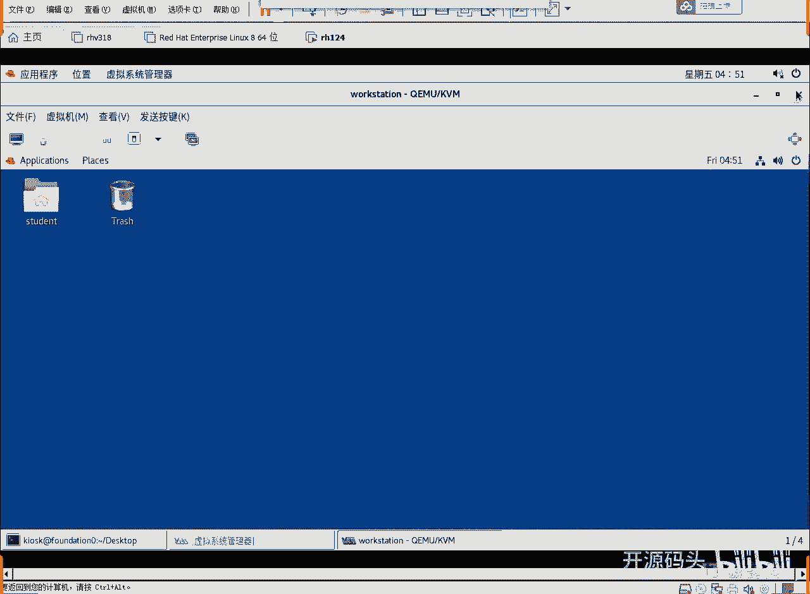
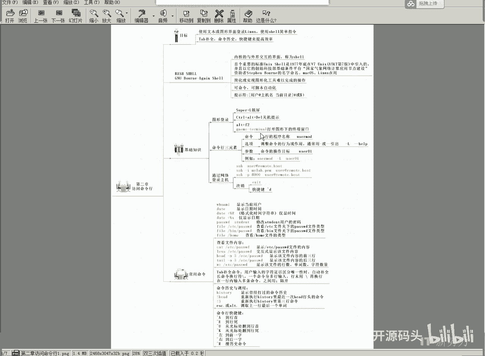
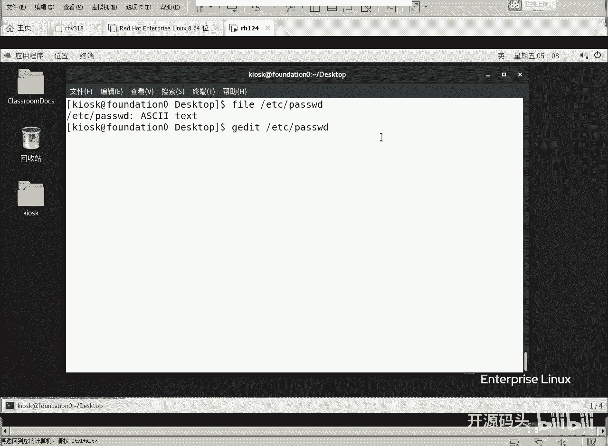
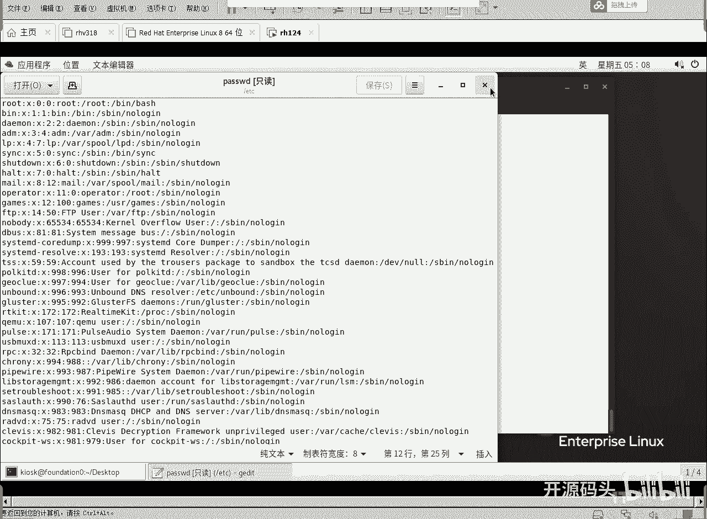
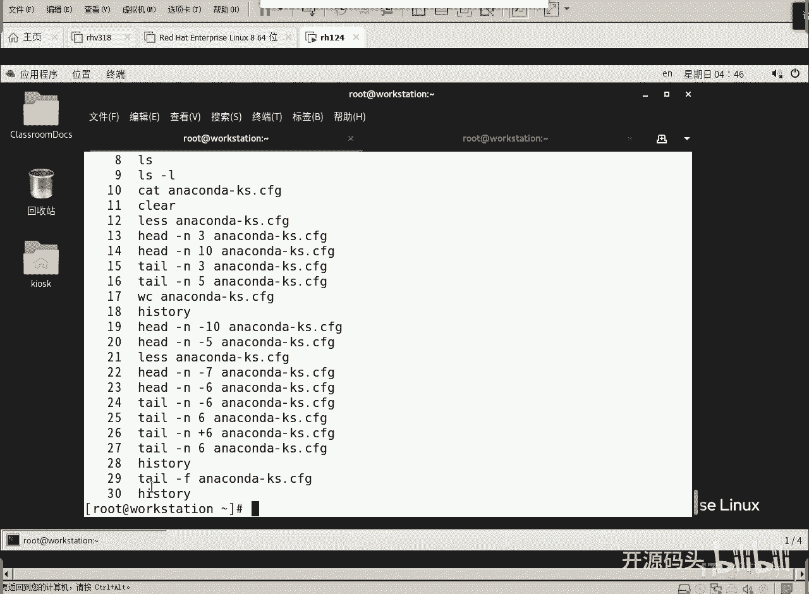

# RHCE RH124 课程：2.2：Linux基础命令（一）🚀





在本节课中，我们将要学习一些最基础的Linux命令，包括如何查看历史命令、移动光标、查看用户信息、修改密码以及查看文件内容。这些是日常使用Linux系统时最常用到的技能。

---

上一节我们介绍了Linux的基本概念，本节中我们来看看如何通过命令行与系统进行交互。首先，让我们从一些提高效率的快捷键和命令开始。

## 历史命令与光标控制





**Tab键**可以用于命令补全。输入命令的前几个字母后按Tab，系统会自动补全命令或文件名。

**`history`** 命令用于显示之前执行过的所有命令列表。

以下是使用历史命令的几种方法：
*   输入 `!6` 可以重新执行历史记录中编号为6的命令。
*   输入 `!字符串`（例如 `!ca`）可以重新执行最近一个以该字符串开头的命令。

控制光标的快捷键可以大幅提高命令编辑效率：
*   **`Ctrl + A`**：将光标移动到行首。
*   **`Ctrl + E`**：将光标移动到行尾。
*   **`Ctrl + U`**：删除从光标处到行首的所有内容。
*   **`Ctrl + K`**：删除从光标处到行尾的所有内容。

## 基础信息查询命令

现在，我们来学习几个用于查询系统基础信息的命令。

**`whoami`** 命令用于显示当前登录的用户名。
```bash
whoami
```

**`date`** 命令用于显示或设置系统日期和时间。可以使用格式化选项自定义显示格式。
```bash
date
date +%R  # 只显示时间 (24小时制)
date +%x  # 只显示日期
```
这里的 `%R` 和 `%x` 是格式控制符，类似于C语言中 `printf` 函数的格式化参数。

**`file`** 命令用于判断文件的类型。
```bash
file /etc/passwd
```
执行上述命令会显示 `/etc/passwd` 是一个ASCII文本文件。该文件以明文形式存储了用户账户信息，但**不建议直接编辑此文件**，应使用专门的命令（如 `usermod`）来修改用户属性。

## 用户与密码管理

接下来，我们看看如何管理用户密码。

**`passwd`** 命令用于修改用户密码。
*   普通用户只能修改自己的密码：`passwd`
*   **root用户**可以修改任何用户的密码：`passwd 用户名`

例如，以root身份修改student用户的密码：
```bash
passwd student
```
输入命令后，根据提示输入两次新密码即可。root用户设置密码时不受复杂度规则限制。

密码的主要用途之一是进行**远程登录**。例如，使用SSH协议登录到另一台机器：
```bash
ssh student@192.168.1.100
```
输入正确的密码后，即可在远程服务器上执行命令。首次连接某台服务器时，系统会询问是否信任其密钥，输入 `yes` 即可。

使用 **`Ctrl + D`** 或输入 **`exit`** 命令可以退出当前登录会话。

## 查看文件内容

在命令行中，我们经常需要查看文件内容。以下是五个最常用的相关命令。

**`cat`** 命令用于一次性显示整个文件的内容。
```bash
cat filename
```

**`less`** 命令用于分页浏览文件内容，可以上下翻页，按 **`Q`** 键退出。
```bash
less filename
```

**`head`** 命令用于显示文件的开头若干行（默认10行）。
```bash
head -n 5 filename  # 显示文件前5行
head -n -5 filename # 显示文件内容，但不显示最后5行
```

**`tail`** 命令用于显示文件的末尾若干行（默认10行）。
```bash
tail -n 5 filename  # 显示文件最后5行
tail -n +5 filename # 从第5行开始显示到文件末尾
```

**`wc`** 命令用于统计文件中的行数、单词数和字符数。
```bash
wc filename
```
输出格式为：`行数 单词数 字符数 文件名`

**`tail -f`** 是一个非常有用的命令，它可以**实时监控**文件末尾的新增内容，常用于跟踪日志文件。
```bash
tail -f /var/log/messages
```
监控过程中，可以按 **`Ctrl + C`** 来终止监控。



---

本节课中我们一起学习了Linux命令行的高效使用技巧，包括历史命令操作、光标快捷键、查询系统信息、管理用户密码以及多种查看文件内容的方法。掌握这些基础命令是熟练使用Linux系统的第一步。下一节，我们将继续探索更多的文件和目录操作命令。