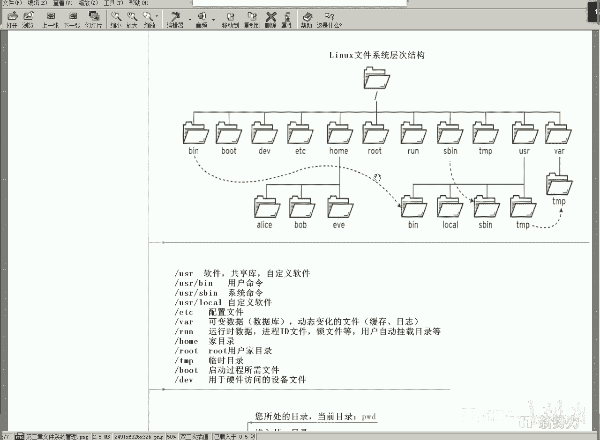
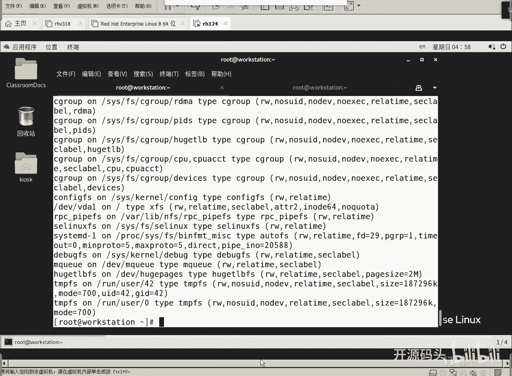
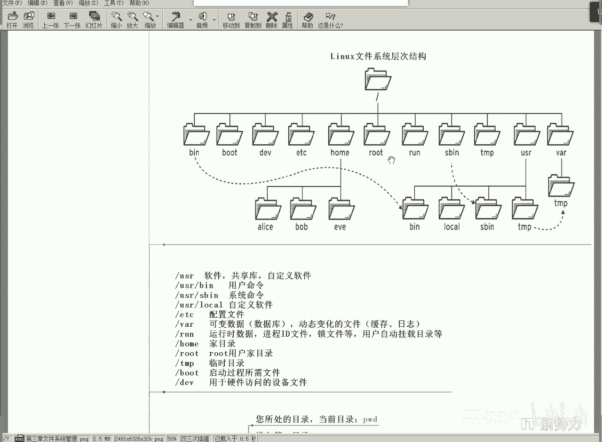
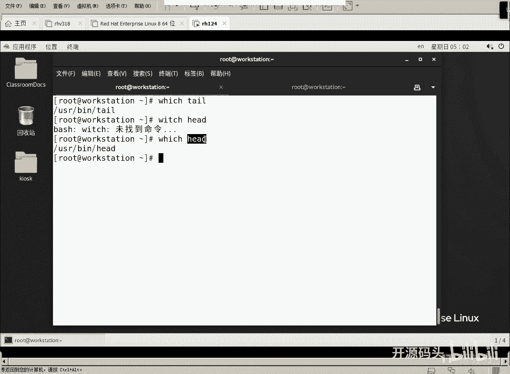
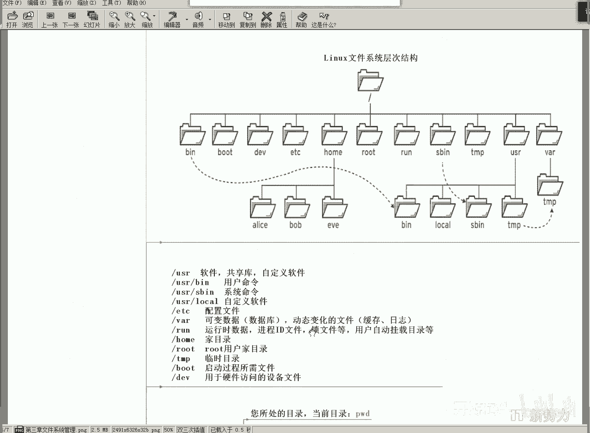

# RHCE RH124 之2.3 Linux文件目录结构 - P1 - 开源码头 - BV1YB4y1V7Rp

那我们来看一下第三章，为什么我们说第三章呢，哎呀我们第三章和第二章一样，在说命令之前呢，呃我们在这个地方郑重其事的给大家介绍一下啊，linux的目录结构啊，或者叫文件系统的层次结构，什么是文件系统啊。

就是能够存储用户文件的这么一套解决方案，就是一个文件系统，就是你你是一个技术人员，我给你一台计算机，你给我想个办法，把我的把用户的文件给我能够管理起来，用户能够增删改自己的文件内容。

那怎么去解决这个问题呢，你必然要想哎我们怎么把磁盘的空间做一下规划，然后我们怎么样去存储这个文件名啊，文件名或者目录名啊，应该在什么地方存，然后我们通过用户去选这个文件名，从而呢找到文件所存储的位置。

打开文件内容是不是唉这个一套这种思路结构呢，就称其为文件系统，那我们以前有一些呃教学资料上，他写的比较书面化啊，就是被管理的文件以及管理文件所需要的这套数据结构，统称为一个文件系统啊。

我给大家简单介绍说几个文件系统的名字大家应该就清楚了啊，我们u盘上啊，我们每个人都有，每个同学应该都有u盘是吧，大部分团都有u盘，那么你用u盘的时候，你是不是对u盘进行格式化。

第一次使用的时候是不是要格式化，那么你格式化这个文件，格式化这个u盘的时候，其实就是在创建它的空文件架构啊，它里面是可以从文件了啊，也可以存文件夹了，只不过就没有存进去一个文件或者一个文件夹。

但是他的那个什么数据结构啊，这哪存文件名字，在哪存文件内容啊，这些信息其实都已经规划好了，所以说这说明你格式化的作用就是在u盘上创建了一个文件系统，这个文件系统呢正常情况下就是fat fat的文件系统。

那我们现在这个文件系统什么呢，我们现在windows的文件系统，当然默认情况下它是ntfs，有人说ntfs这种文件系统和fat的这种文件系统有什么区别呢，啊首先说他他们都是为了存文件对吧。

只不过就规划不一样，那不一样到哪里了呢，ntfs是有权限的，而我们的u盘上那种f a t的文件系统，它是无法设置权限的，什么是权限，所谓的权限就是张三能读，李四能写，王五能执行，赵六能读和写是吧。

就是针对不同的人，他可以设置不同的访问权限，访问访问层面，操作层面，读写执行，或者是读和执行，或者是读和写各种组合是吧，哎像这种全这种读写操作的这种控制，我们就称其为权限。

ntfs文件系统是可以设置权限的，f a t文件系统没有这个规范，所以说我们的u盘不管你插到谁的机器上，都可以直接打开，都可以，任何人都可以直接打开，任何人都可以在它上面进行什么增删改。

对文件和目录进行增删改，因为它根本就没有这种权限控制，只要是个机器能打开的，只要有一个界面能打开它，我们就可以对它进行修改，有权限的呢，你是张三的话，你能写，我才让你写，你是李四，你只能读，那你想写。

我不让你写进去啊，这就是权限的概念啊，ntfs有权限，f a t没权限啊，由于f a t这种文件系统呢，它是ibm公司在一开始做pc机的一个标准，其实这个到这个标准其实并不是ibm自己定的啊。

是微软定的，微软定的标准，微软卖给ibm是吧，呃我我应该给很多同学聊过，他就是微软自己研究了一个系统，就是dos操作系统，dos的名字也很直接，磁盘操作系统，这个磁盘操作系统呢它就是为了管理磁盘。

其实就是它的文件系统就是当时的fat，那么他当时比尔盖茨呢当时就说跟i b m呢谈成一笔交易，这个交易就是我这个dos系统呢，就是磁盘管理的这头f a t的文件系统呢，我不卖给你啊。

我能让你去预装到你的机器里面，你卖一台机器，你给我一块钱就行了啊，给他一美元就是我这个软件装到你的系统，装到你的机器里面，你卖你卖出去一台机器，我只收你的成本收益块钱啊。

然后呢ibm一年的在七几年的时候啊，在197几年的时候，ibm一年的pc机的销售量是100多万台，所以说比尔盖茨合作的第1年，就ibm公司到年底一下子就给他打了100多万美元，过去一套只要一块钱。

1年就成为百万富翁了是吧，所以说那时候就是f a t文件系统，由于当时呢i b m呢相当于把微软就是属于那种捎带的，就把它就把微软就呃提携了。

所以说呢这个f a t呢称为什么称为整个pc行业的一个技术标准，就是事实上的技术标准，这也就是为什么我们现在u盘是它linux也可以是他，就是你拿一个fat的文件系统放在u盘。

放在windows里能打开，放在我们的那个linux也能打开，你插到你的手机上，如果你的手机能识别fa不是识别u盘的话，它照样能打开那个那个磁盘，为什么，因为f a t文件系统太普及了。

从七几年就就已经制定了标准，一直在普及，所以说这个f a t是最普及的一种文件系统，但是它有个最大的缺陷就是无权限设置，但是比尔盖茨就靠着这么一个很简单的，就是能把文件读写啊，增删改的这么一个操作啊。

就是这么一个小小的功能就成为百万富翁了啊，当然现在这种神话是不可复制的，对吧啊，现在这个计算机技术复杂到什么程度了，对不对，嗯所以说呢这个东西只能算是一种启示啊。

我们可以去我们在计算机行业也可以去做这方面的事情呃，有没有类似的产品或者是类似的这种呃这种机会存在，如果我们上过容器化的话，我觉得容器化这个环节有有类似于比尔盖茨呃。

真有只不过就看我们能不能慢慢的掌握到，好吧啊，具体有人有人感兴趣，咱们下面聊我，我在讲课不多聊了啊啊那这个文件系统是什么东西呢，就是管理和规划磁盘存储空间。

用它来对文件进行增删改操作的一系统化的一套一套这个规划啊，这套规划的具体实现了以后，就是相应的文件系统，文件系统有什么呢，有微软，最初微软和ibm合作最初的那个f a t的文件系统啊。

也有什么呢啊比较健全的ntfs文件系统，我们的linux是什么，linux是叫ext扩展型文件系统呃，还有一个叫xs，扩展性文件分配表和扩展文件系统啊。

我们现在的这个机器，我们怎么样去看这个文件系统，我们可以看这个看mt命令吧，这个对大家可能稍微有点生疏啊，mount命令是什么意思呢，就是呃就是把一个磁盘挂接到我们的一个文件系统的文件结构上。

文件夹的结构上就是目录的结构上去啊，目录是一个逻辑上的一个分支结构，我们把任何一个磁盘都可以挂到任何一个目录结构上，我们mt来检查一下，检查哪个的，检查那个根目录好吧，检查根目录啊，这个根目录太多了啊。

嗯我们直接回车看吧啊看一下啊，随便找一行dv下的vda，dv加v da是什么，是是一个虚拟的磁盘设备啊，what啊，water的磁盘设备啊，然后呢a是第一块磁盘，一是第一个分区。

第一个磁盘呢第一个分区啊，这么一个盘呢对应的是根目录，对应的是根目录，这就是挂载啊，然后它的文件系统是什么，看到了吧，x f s x f s啊，还有什么呢，还有别的类型吗，cd rom应该也有吧。

啊别的文件系统你看这种type就是临时文件系统啊，这种就不是一个常规型的文件系统了，它是就是我们的系统启动就有关机就没了，这种它是主要是用来规划资源的啊。

把资源就是说把那些嗯就是存储资源或者是呃我们的进程资源啊，就是cpu里面的那些运算量什么的要规划的啊，所以说它是一个逻辑性的一个文件系统，不是真正的磁盘上的啊，我们聊的是磁盘上的文件系统啊。

啊没有看到那个呃叫cd rom好吧，我不找了好吧，就说呃光盘的文件系统是什么呢。

光盘的文件系统是iso 9660，iso 9660的文件系统，我们的linux现在默认是xfs文件系统叫做扩展文件系统，在real 6的时候，它叫e s t文件系统，扩展的文件分配表系统。

那么这个东西呢其实就是一个名字，但是他们所有的文件系统的目的都是为了规划和管理磁盘空间，让它可以对文件和文件夹进行什么进行具体实现的一些方法，系统化的一些解决方案和方法啊，好了。

那我们来看一下linux的文件夹结构啊，不管你手头拿到的是哪一个厂家出厂的linux，我们都知道linux是一个百加一的系统是吧，就是任何人都可以对linux进行标准化的制定以及什么以及设置。

但是呢如果说大家都不遵不遵守规则的话，linux里面是不是就是乱的，所以说呢我们国际标准化组织啊，就是不是他是应该是linux里的一些协会啊。

一些标准化协会他们就对linux的结构呢进行了一些简易的规划，不管怎么样，大家都按这个标准去走，所以说我们拿到任何品牌或者任何厂家的linux版本里面的，这个目录结构都是统一的啊。

这个文件夹的结构都是统一的，根目录下面呢是一级目录，我们一级目录由bn boot d e v e t c home，root run s b n t m p c u s i对吧对吧。

进行各种各样的这些目录啊，这些目录呢叫做协会定义的呃，工业标准化，工业标准，任何linux都必须按这个目录去去去分牌，有些人说我自己再加几个行不行，你加答案是可以的，但是你改是不行的。

就这些目录的那个呃，每个目录叫什么名，字，里面应该放什么东西，这个那个工业标准都是做好的，所以说我们就遵循人家这个标准去用就可以了。

好我们来简单看一下第一个usr这个目录，这个目录啊，这个目录啊，usr这个目录它里面应该存的是软件共享的函数库，以及自定义的软件啊，然后下面的u3 下有个b n us下面有个b n这个目录吧。

usr下面有个b a目录，这个目录里面存什么呢，存用户使用的命令，像刚才我们打的l s就在这个目录下啊，ios命令就在这个目录下，wc can tell都在这个目录下，可不可以检查，可以我们看一下。

ctrl which ta，看到了吗，我去看，啊我写拼错了啊，对不对哎，这就是用户用的命令都在这个目录下放的，这个命令的作用就是查找任何一个命令它所在的磁盘位置。

这些东西大家看一下，我就不解释了，好不好，因为这个东西必须你必须理解啊，你必须理解啊，你比如说有个所有的软件的配置文件都在etc下，哎呦你使用windows的同学是不是有这么一个概念啊。

就是windows是不是也是呃windows目录下是存的是windows自己的，就是相当于windows内置的那些程序，program file下是不是就是呃第三方的应用程序，对吧啊。

其实任何一个系统都应该有这些就是规范和定义对吧，哎那我们这些规范就是这些目录就必须放这些东西啊，你放这些东西，那么有几个目录比较特别，比如说dv这个目录，因为这个目录呢它里面并不是磁盘。

它里面所有的子目录或者是文件，它对应的都不是磁盘空间，对应的是什么呢，对应的是我们板卡，就是我们的网卡呀，我们的磁盘呀，对应的是我们的硬件的一个设备啊。

所以说不要简单的认为根目录下所有的地方对应的都是磁盘空间，windows是这样的，但是linux不是linux，有些目录下，比如说这个dv这个目录下，它的任何文件对应的其实是一个什么，是一个具体的设备。

所以说它叫dv目录，device设备目录，设备目录里面好多文件对应的并不是磁盘的空间，而是我们的板卡设备，就是我们主机里面的，拆开机箱之后啊，插槽板卡硬盘这些具体的设备，当我们去查看一个文件内容的时候。

你看到的还是文件内容，但实际上你看到的是那个设备的内容，就是设备的信息啊，所以这个这个第一位目录比较特别啊，同样特别的还有个什么呢，还有个呃p r o c目录，这里面有没有写，好像我刚才没记得有啊。

还有个目录叫p r o c process process，这个目录呢它也看见看上去也是一个目录，但这个目录是什么呢，是所有的进程进程信息是在这个目录下，所以它也不对，磁盘它对应的是内存。

我们的程序启动之后，是不是放在内存里，占一定的内存空间，然后开始让cpu从这个内存空间里面读取指令，一个一个执行，是不是这就是一个进程嘛，就是运行起来的程序。

是不是就是cpu再按照这个指令一句一句话往后执行对吧，那么这个占用这段内存的啊，这个这么一个封装起来这么一整套东西啊，而且占用cpu的时间片对吧，这么一套东西称其为一个进程运行起来的代码，就是进程。

那么进程呢对应的肯定是内存空间，因为它它要占用内存空间，然后cpu从内存里就开始读那个指令，就开始执行了，就成为一个进程是吧，那么process下面的这些文件名对应的都是内存里的啊，资源空间并不对磁盘。

所以说啊我们这里所谓的linux的根目录并不简单的是磁盘的根目录，而是所有资源的根目录，你从这个根目录下可以找到磁盘上的内容，也可以找到板卡，还可以找到什么内存里的信息，所以说有几个目录是比较特别的啊。

大部分都在磁盘上o好知道一下啊，我们应该理解一下，好吧好，这里面又是一些命令啊，这些命令呢我们cd命令p w d我们演示过了，l c也演示过了是吧，c d c d还没看是吧，像这些命令呢。

我们还是要去练，我们这个幻灯片呢给大家已经放到云盘上了，你呢拿上之后啊，在我做示演示之前，你就可以去尝试着有按照空格呀，小数点啊，什么这些东西去试啊，就是看看这个效果是什么，后面有解释的啊。

后面都有解释的好吧，你自己就可以去试一试，然后呢我在解释的时候呢，你再接触会更快一些，好不好，后面应该还有这些啊，不但可以对一个具体的文件名进行操作，还可以对通配符的文件名进行操作啊。

比如说心啊代表任意字符啊，问号代表任意单个的字符啊，还有数字啊，是吧，飞啊什么这些东西啊，什么打头啊啊这些具体的这些叫做通配符，就是一种特殊字符格式，代表一个特定含义啊的一段字符，比如说我们想说啊。

我们想看什么文件名里带数字的，那就是星什么星呃，这个deject啊，新dj新，这什么意思，就是唉数字啊，就是心中间有0~9的任意数字，后面还是任意字符，中间只要有零和九就算是名字里带数字了。

是不是这个dj双中括号冒号括住一个数字，那么这个就代表任意的数字，这样的话就我们在对文件进行统进行整理统计的时候呢，哎就有了更理理想化的一种表述对吧，一种描述方法。

从而让我们可以对这个文件名的定位呢做的更精确啊，或者是文件呢更匹配更更人性化一些，ok好这不但可以匹配这个文件名，也可以匹配文件里的内容啊，因为它表示的是一种啊就是匹配的一种模式。

ok那这个东西呢我们后面再聊好吧，呃刚开始呢我尽量慢一点，让大家都能跟上，好吧好，今天的课就到这里吧，还有什么。

