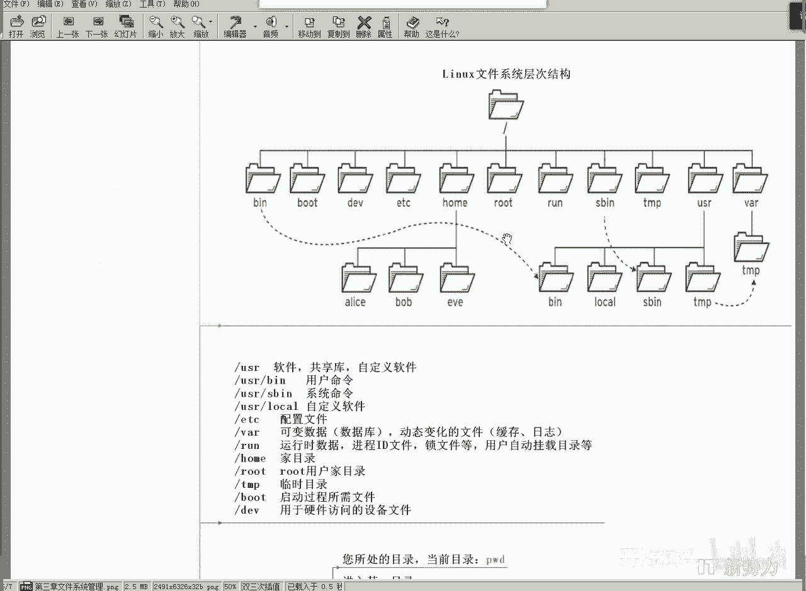
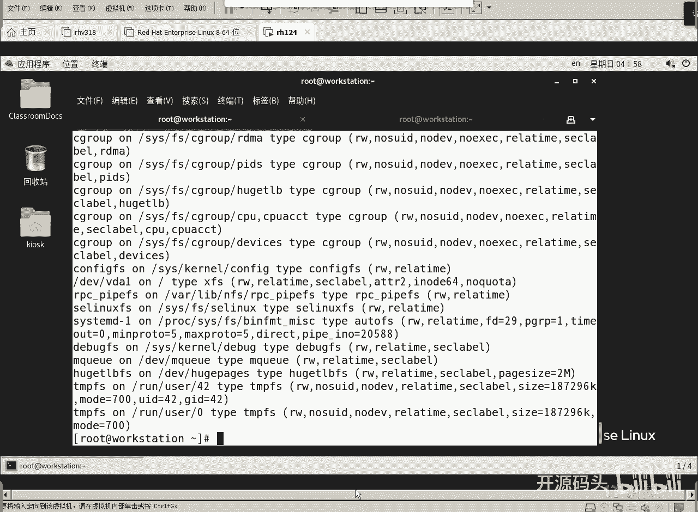
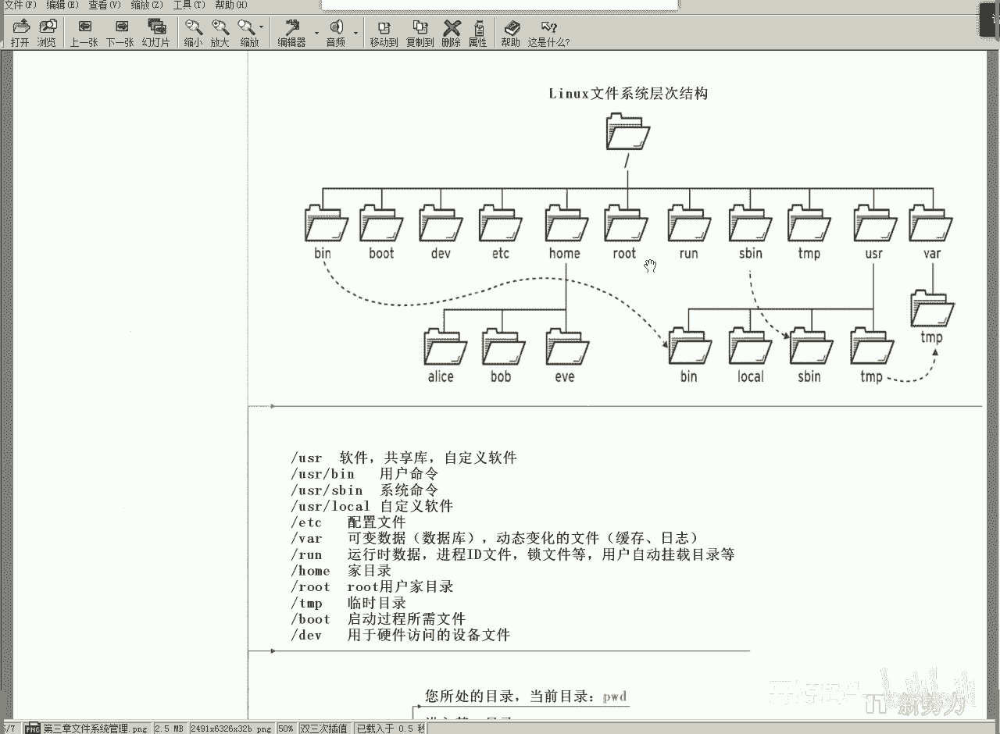
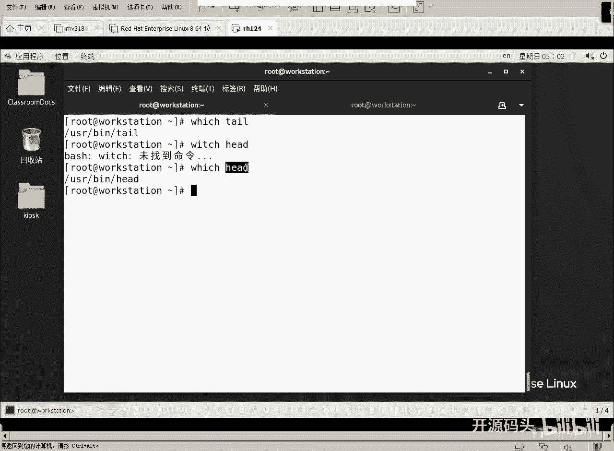
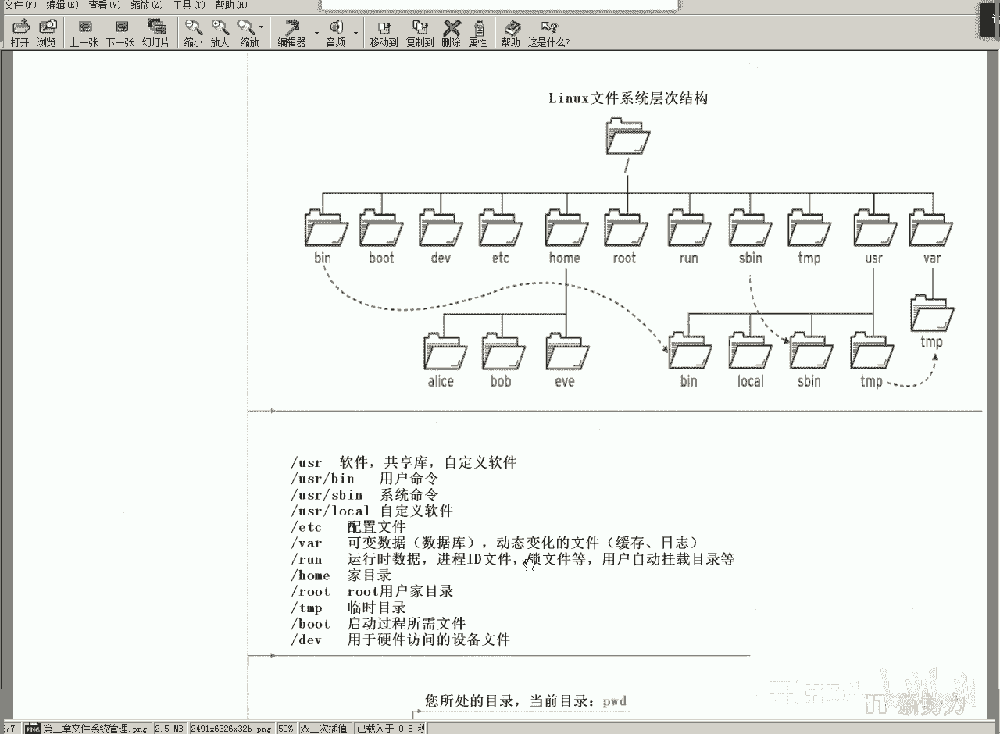

# Linux基础：2.3：Linux文件目录结构 - P1 📂

在本节课中，我们将要学习Linux文件系统的核心概念——目录结构。理解这个结构是掌握Linux操作的基础，它能帮助你清晰地知道文件存放在哪里，以及系统如何组织各种资源。

## 什么是文件系统？

上一节我们介绍了命令的基本操作，本节中我们来看看支撑这些操作的基础架构——文件系统。文件系统是一套用于存储和管理用户文件的解决方案。它规划了磁盘空间，定义了文件名、目录名及其内容的存储位置，使得用户可以通过名称找到并操作文件。

简单来说，文件系统就是 **被管理的文件** 以及 **管理这些文件所需的数据结构** 的统称。

## 常见的文件系统类型

不同的操作系统使用不同的文件系统来管理文件，它们的主要区别在于功能和规划方式。

*   **FAT文件系统**：常见于U盘。它历史久远，普及度高，但**没有权限控制**功能。这意味着任何能访问该设备的人都可以随意增删改文件。
*   **NTFS文件系统**：Windows系统默认使用。它**支持权限设置**，可以控制不同用户对文件的读、写、执行等操作。
*   **Linux文件系统**：如 **ext4** 或 **XFS**。这是Linux系统默认使用的文件系统，同样具备完善的权限管理功能。

我们可以使用 `mount` 命令查看当前系统中挂载的文件系统。例如，查看根目录 `/` 对应的文件系统类型：



```bash
mount | grep ‘ / ’
```
输出可能包含类似 `type xfs` 的信息，表明根目录使用的是XFS文件系统。

## Linux目录结构标准

Linux发行版众多，但它们的目录结构都遵循一个名为 **文件系统层次结构标准（FHS）** 的规范。这保证了无论使用哪个品牌的Linux，核心目录的结构和用途都是统一的。



根目录 `/` 下包含一系列标准的一级目录，每个目录都有其特定用途。

以下是部分核心目录及其作用的简要说明：

*   **/usr**：用于存放**用户应用程序和文件**。例如，`/usr/bin` 目录下存放着普通用户使用的命令，如 `ls`, `cat`。
    *   可以使用 `which` 命令查看命令的位置：`which ls`
*   **/etc**：存放系统**配置文件**。类似于Windows中存储程序设置的地方。
*   **/dev**：**设备文件目录**。该目录下的文件不代表磁盘上的普通文件，而是对应着系统的硬件设备，如硬盘、网卡等。
*   **/proc**：**虚拟文件系统**，存放**内核与进程信息**。该目录下的内容映射自内存，提供了访问系统运行状态的接口。



**重要提示**：Linux的根目录 `/` 是**所有资源的逻辑根**，而不仅仅是磁盘的根。从这里，你可以访问磁盘文件、硬件设备信息以及内存中的进程数据。



## 路径导航与通配符

在熟悉了目录结构后，我们需要掌握如何在其中移动和定位文件。

常用的导航命令包括：
*   `pwd`：显示当前工作目录。
*   `cd`：切换目录。
*   `ls`：列出目录内容。

除了操作具体文件，我们还可以使用**通配符**来匹配一组具有相似模式的文件名，这能极大提高操作效率。

以下是通配符的基本用法介绍：
*   `*`（星号）：匹配任意长度的任意字符。例如，`*.txt` 匹配所有以 `.txt` 结尾的文件。
*   `?`（问号）：匹配任意单个字符。例如，`file?.log` 匹配 `file1.log`, `fileA.log` 等。
*   `[ ]`（中括号）：匹配括号内列出的任意一个字符。例如，`file[0-9].log` 匹配 `file0.log` 到 `file9.log`。
*   `[^ ]` 或 `[! ]`：匹配不在括号内的任意一个字符。例如，`file[^0-9].log` 匹配不以数字结尾的 `file.log` 文件。



通配符不仅可用于文件名匹配，稍后我们学习文本处理时，也会看到它在内容匹配中的应用。

## 总结

本节课中我们一起学习了Linux文件系统的核心知识。我们首先了解了文件系统的定义和作用，然后对比了FAT、NTFS和Linux文件系统的特点。接着，我们详细探讨了Linux标准目录结构，明白了 `/usr`, `/etc`, `/dev`, `/proc` 等关键目录的用途。最后，我们介绍了使用 `cd`, `pwd`, `ls` 命令进行路径导航，以及使用 `*`, `?`, `[ ]` 等通配符进行模式匹配的基本方法。理解这些内容是高效管理和使用Linux系统的基石。