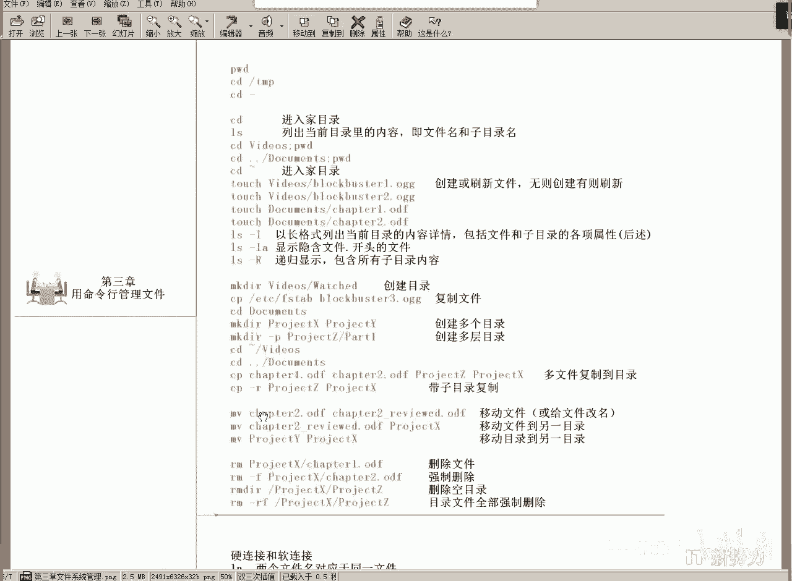
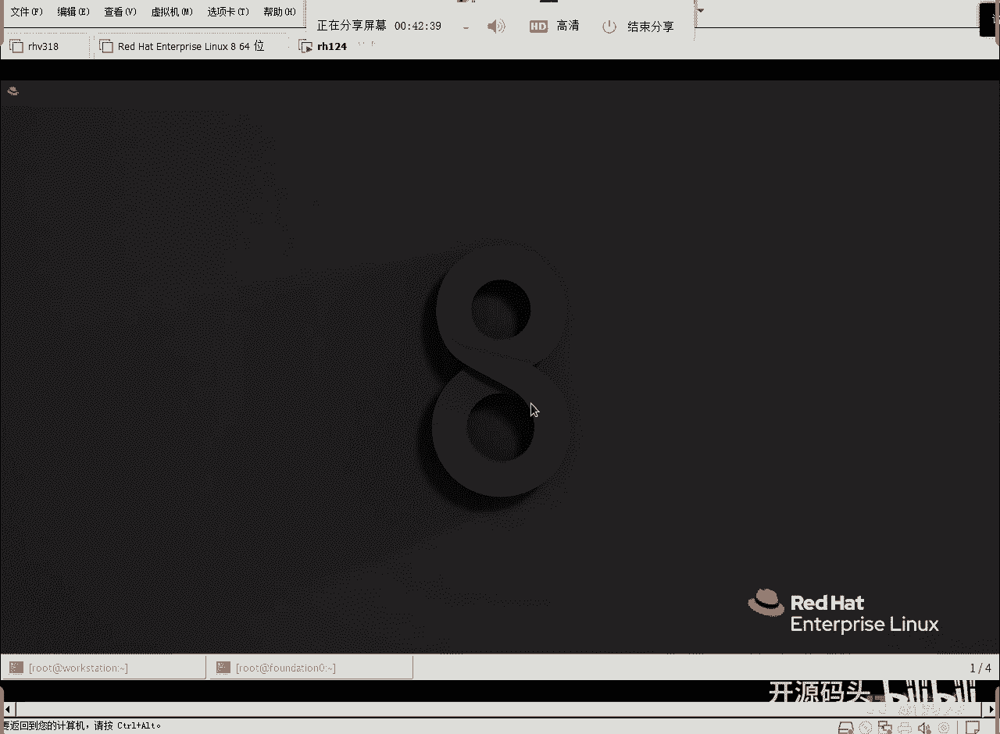
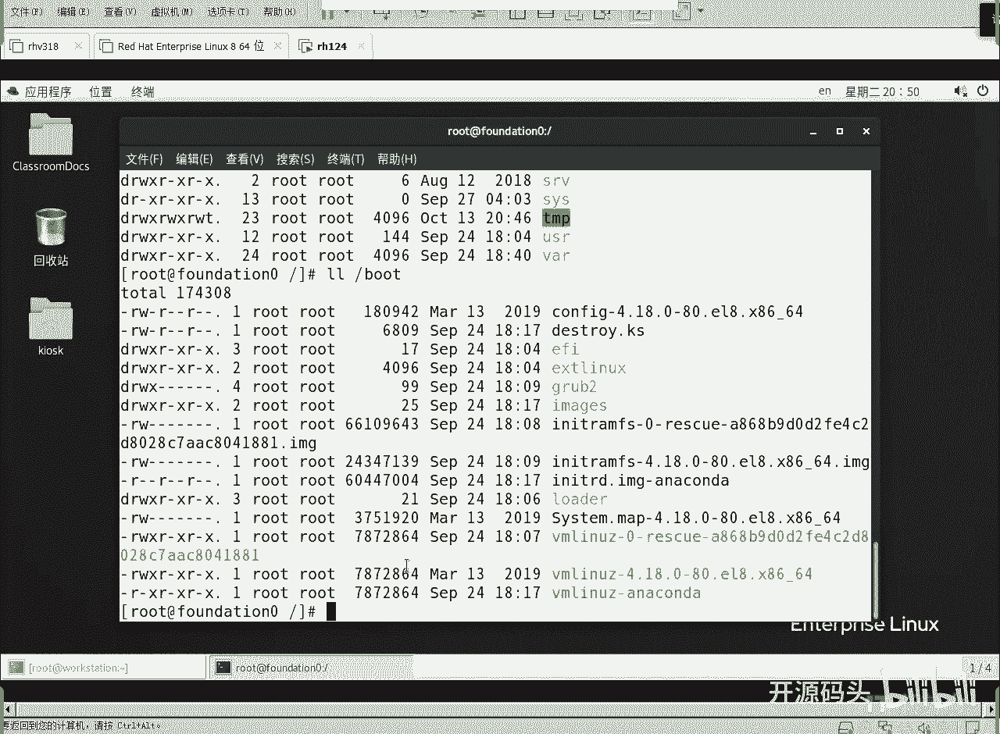
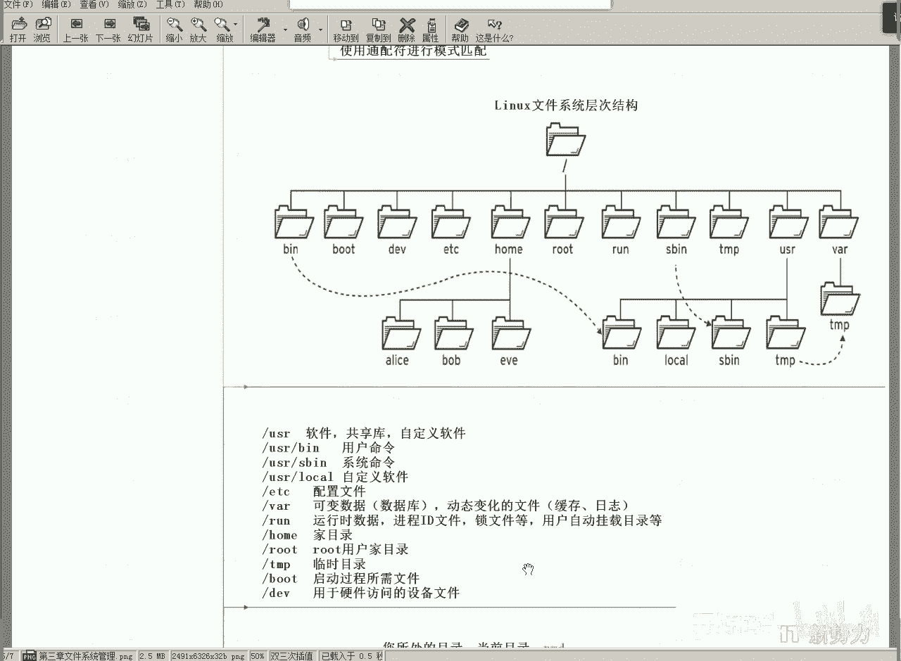

# RHCE RH124 之3.1 Linux文件结构 - P1 - 开源码头 - BV1Fa4115727

那今天呢我们接着聊linux的目录结构啊，呃上节课呢我们说DV目录，ro目录，process目录，这些都是比较特殊的。它对应的是呃设备内存处理器，对吧？而剩余的大部分目录都占用的是磁盘空间。

比如说最常用的ETC啊，ETC目录是配置文件。啊，就所有软件的配置。啊，这个软件有什么变量啊啊，这个软件的环境有什么参数啊哎。都放到ETC下。啊，任何软件的这个配置都放在一思下。

这和windows不一样，windows好像是不是所有的软件都在program下面的自己的目录里。对吧每一个软件都在program下面的，每自己创建的目录里面。但是呢。呃。

linux是所有软件的配置文件都应该放在ETT下。所有软件的数据都应该放在va这个目录下。有人说全放这里面是不是感觉到很臃肿？那你再创建一个子目录啊，对吧？

va底下创建自己的软件的子目录ETT下创建自己软件的子目录啊，因为什么它是横向分割的啊，一个一个软件配置放放在ETT下的自己的自定义的目录里。数据放在Y下的自定义目录里。啊，这样就比较好了，是不是啊。

两个目录啊ETT和万都聊了是吧？好，还有个run啊，run呢啊这叫运行时的数据，开机自动创建这么一个目录。然后呢呃运行当时进程ID文件啊，锁文件啊什么这些东西放在这个目录下。当你关机的时候。

这个东西就消失了。啊，这是一种特殊目录吧，这种目录是运行，只要有CPU系统，CPU只要运行指令，它必然会需要一些啊呃锁锁文件啦啊，或者是呃这个进程ID啦，这些运行任何程序运行时候啊，进程的一些标记啊。

这些东西是不是啊，那么这些就是ro目录这个目录里的东西呢？就是当时我们内存里运行起来的所有的进程的信息。如果进程之间有数据共享啊，那肯定会有锁啊，为什么要有锁呢？

你编程的同学都应该知道这个我们如果说两个人同时去。同时去请求对方呃，请同时去请求对方。呃，占有的数据的话，这会这就会形成一个什么互锁互锁会导致资源消耗。并且呢我我要读你的东西，你要读我的东西。

但是我们都不放我现有的东西。那就完蛋了，这就锁住了。锁住之后呢，就没有办法去协调这个数据了，是吧？啊，像这是一种锁。那还有就种锁什么，就是哎我为了什么我为了呃占有这个数据独占这个数据，我不让别人独占。

我把这个文件呢锁住啊，把这个资源给它锁住，不让人用啊，那如果说互锁的话，或者叫死锁的话，这就比较麻烦是吧？啊，这些锁文件啊，资源要想完整的去。保证数据的完整性。那没有这个呃垃圾数据。

那你就是当你对数据进行修改的时候，一定要先锁住它。锁住它之后呢，修改它以以保证什么这个数据的修改是确定是无疑，是我预先想的那种样子，而不是两个人三个人同时修改一个东西，那就乱套了。

是吧所以说应该有一些锁文件什么东西，这都是运行，就是程序运行前以后呢，需要用到的一些数据。那么这些资源放在ro下。所以我们把ro目录叫做运行时的数据。这个round目录呢关机就没有了。

它不会在磁盘上存的啊，因为它都是内存里的东西。啊，好，还有一个就是比较著名的加目录。这个加目录呢就是一个数每一个用户他自己的。主目录都应该放在home下面啊，这里home下。

我们比如说有三个用户叫爱icebob e对吧？那这三个用户呢啊。每个用户都有自己的什么专属的文件，然后专属的那个数据。那么你的专属数据我就放在你用户名命名的这个目录下就行了，和你的用户名同名。

而且呢权限只给你不给任何其他人。那，这个是不是就跟你的私人空间一样，所以说我们形象的把它叫加目录。在西方国家，是不是你要擅自进入一个别人一个家里的话，啊，房主都有可都有权利把你直接用直接枪毙了，是吧？

直接就是打死了，是不是？那就是说这个地方呢。就是个人的私有资私有资产部分，私有资源部分哎，类似于西方的家一样啊，那我们把它所有每所有用户的这个数据都放在home下就可以了。

对吧所有用户的数据都放在ho下。对不对？嗯，ho面下面以每一个用户以自己的名字命名的文件夹，就是自己的这个夹子里的东西，任何第二者都没法看。当然，root除外啊，root除外啊，就是那个跟用。

就是超级用户是除外的，因为linux里面超级用户是不受限的啊。调级用户是不受限的啊，那这些目录呢都只有自己可以。只有只有用户自己可以去访问。啊，那我们这个总目录就给它形象了起一个home。啊。

这个home的这个目录呢就是假目录是吧？形象是吧？很形象啊。好，你也可以把它叫做什么叫做用户个人的主目录，对不对？当然不是以home为准，是home下面啊，以每一个用户名命名。

一个每以每一个用户的名字命名的目录都是给。对应的用户专门使用的。由于这里面都是每个用户的专业目录合在一起，统称为ho目目录啊，home下子目录是吧，二级。OK好，那么还有一个目录叫这个root啊。

root这个目录呢啊就叫做用户的加root用户的加目录，超级用户的加目录啊。超级用有有人说，唉，超级用户的加目录不在home目录下吗？别的都在人证底限嘛，你就特殊。😡，它真的很特殊啊它真的很特殊。

root用户root可以在linux系统里面。为所欲为。做入的所所做一个管理员所做的任何想做的事情。不管你给他设置的什么权限，他都不受权限的限制。所以说有些人说我获得root权限就好了。对不对？

你有没有把你的手机获得过root权限？对不对？你的手机里面内置了很多呃预置的软件，对吧？你买的手机很便宜，小米手机。啊，小米手机也不便宜是吧？但是我举个例子而已啊。你买了一些内置了很多软件。

因为这些这他这个他这个手机呢，它呃造价很低，他肯定是让别人掏钱了，让商家掏钱了啊，商家要求这个APP你给我推广，他把这个软件呢就做成什么，你卸不了的是吧？叫内置软件。啊，这那个软件。

那你想卸就是获得你手机的root权限，对不对？当你获得了你手机入册权限之后，任何对用户的限制都会成为泡影。因为root呢不受任何权限的限制，所以说这个时候你就可以什么你拿到了你的手机的root权限。

你当然可以卸载掉你手机上的任何软件。啊，你的手机也是一个lininux系统啊。🤧嗯。所以说这个呃root比较特别，那root特别的，所以说root的加目录呢也很特别。啊，有没有第二个特别的人？没有了。

除了root一个人的加目录在这个地方，别人的加目录都在home下面啊。好了，还有一个临时文件的目录啊，这个东西应该好理解是吧？任何数据的倒腾啊，任何数据的这个呃什么转换修改排序，什么乱七八糟整个操作。

你是不是都需要一个临时存放的位置啊？对吧文件的任何do腾都需要一个临时的目录啊，临时放一下啊，临时目录填P还有一个boot啊，一个boot顾名思义啊启动。啊，启动目录这个启动目录里面放的什么呢？

放的我们的这个启动机器，当我们我们的系统呃。主板自检完成之后，默认从从硬盘上启动的那些程序啊，就是硬盘的第一个程序。都应该放在这个目bo目录下啊，就是我们的启动机器的那些程序啊，启动机器的那些程序。

有人说不就是linux嘛？no no no no no，这是什么东西啊？这是要启linux或者要起windows之前的那个。那个文件所在的目录。其实就是什么？其实这个目录是让我们看。

这个目录在没有加载文件系统的时候，就应该能够读取的。就是我们的主板就可以直接读取的这个目。啊。什么意思啊？这个bot目录里的东西就是启动机器所需要的文件。

在还没有确定你要请windows还是要请linux的时候。就要启动的文件，在任何操作系统之前启动的文件啊。指导一下，呃，只不过我们呢有一个不同目录，我们可以找到它，可以看到它。其实有没有这个目录。

你的机器都会启，因为启动它是先于我们的lininux启动的程序啊。因为你的系统里面可能又装了windows，又装了linux，还装了unux。那么。

用户还还没有选择启windows启linkux启unux之前，是不是得有一个人先把这些系统的索引目录给显示到屏幕上。谁来负责这个事情？boom目录下的文件来负责啊。这个目录下所存存的文件负责的啊。

其实这个目录存在不存在，并不会影响你的机器启动。我们之所以让它存在，就是为了让你能看到它，让我们能看到这个启动的文件。啊，其实这个文件啊不管你的系统啊，就是你的系统能不能看到这个不同目录。

你的机器肯定会在没有选择系统之前就启动它。啊，这个程序就启动了，我们把它的启动机器的软件啊，就是它啊来看一下，就是它。What。

打开一个终端啊，cttrol air清除屏幕，清除屏幕之后呢，CD。小。CDCD的意思是changedirect改变目录到哪里啊，我当前的目录是波浪号是在我自己的加目录里，是在我root的加目录里啊。

然后CD到一个目录CD到什么呢？CD到最高层的那个目录。然后我们来看一下LLL比较好用啊，LL的意思是呃LS杠L。啊，就是列list列一下文件，然后呢一个文件一行。港line对吧？好。

我们直接写LL回车。啊呃这个目录。看E熟悉吧？ETCDEV啊，boat看到吧？它啊这个。然后root。这是root的用户的加目录，对吧？root用户的加目录那么别的用户的加目录在哪里？Home。

这些目录都在啊这些目录都在。好，你看一下我们现在这个。第一个字母代表是一个D，代表就是目录啊，代表D就是目录L的代表什么呢？L代表一个快捷方式。啊，快捷方式啊，在这里有一个目录叫什么叫BIN。

但这BIN实质上是USR下的BIN好吧。跟他同一级下的US下边USR在哪？在这？资源目录啊资源目录刚才我们已经聊聊过了啊，资源目录下有资源目录下的bin是用户命令啊，SB是什么系统命令，对不对啊。

都有了啊。有些人说这里为什么没有没有那个根目录那个标记？我们当前就在根目录下，它就是当前目录下往下走的啊，就是这个指的是这个里面的东西，好吧。好，L代表的是链链接文件啊。

链接文件windows里面说法就是快捷方式。就是通过他这个指针指到真正的目录里了，你进他其实是进的他啊，就是他的是他真这个真实目录的一个什么一个代表啊，你类似于他是吧？

所以说你可以走走这里跟走这里是一样的，好吧。好，我们刚才看到是这里是吧，是boot啊，那我们的我们的bo呢LL撇boot。再看一下bot目录里的东西。啊，这里面有个比较。专业名字叫groupber对吧？

group也是四个字母的缩写啊，四个字母的字头啊，它一个group。所以说我们这个linux默认情况下装的这种启动程序叫什么呢？叫group啊，启动程序叫group啊。

group可不可以起windows。Yes。啊，groupbal这个启动软件启了之后呢，它会把我们可以启动的系统全部显示到屏幕上。然后用户在呃。屏幕上选择要启哪一个系统，你选windows。

它就可以把windows起来。你选linux，它就可以把linux起来。啊，那由于是linux默认带的东西，所以说我们在这能看。如果说你是用windows去看的话。我想问一下，windows启动之后。

能不能看到这个Pbo目录？看不到的看不到的。因为。呃，不需要看啊，包括linux也是不需要看，之所以能看到是因为。我们要用它啊，我们要不是也不是要用它。

我们要我们本来就是linkux默认的默认启动嗯用的那个启动程序，对吧？好，大家注意一下啊，boot下存在的程序啊，这个程序有boott没boot，它都会起作用。它的作用就是先与任何一个操作系统启动。

先把机器接管过来，然后让用户呢去选择要起哪一个操作系统。啊，在主板和操作系统中间的那个环节。就是启动程序，或者叫做引导程序。那，bot的字面含义是不是呃引导把机器引导起来。

是不是啊把机器引导到某一个操作系统里面。就叫启动程序，也可以把它叫引导程序，也可以是吧？OK好，gub啊，我们linux里面用的这个软件叫gub，这是关键字，以后可以去摆一下，好吧。

gro我们在后面会讲啊，如果gro坏了怎么办，怎么修复啊？如果group果坏了，就意味着你的机器人启动启不了了啊，就机器启动之后就是一行1一行白字啊，就是没有系统或者是系统出错。啊，它就有问题了。

你就没有办法启动到任何操作系统啊吧？然后呢把g修复一下是可以的啊。我们后面会有一章去讲这个修复g。

OK啊，聊一下这个概念啊，就是说哎我们这个目录呢有几个目录是比较有特特殊性的啊。啊，DV最后这个啊DV目录。刚才我们聊了ron目录是不是呃就是运行时才会产生的？对不。就是我们的程序运行进程运行起来之后。

它会呃在内存里所占用的那些东西啊，那么D一V目录呢啊也是一个比较特别的和va比较和那个ro比较类似啊。D一V是什么呢？是你这个机器上所有的硬件。你所。掌控的这台机器上所具备的硬件设备的一个列表。

那有人说那我拔了一个声卡或者插了一个硬盘之后啊，DV下会发生变化吗？当然会的。啊，当然回答啊，就说它DV顾名思义这个目录下每一个文件代表的是以你的主板是包括主板在内的任何板卡。任何板卡啊。

它的对应的代表文件。那有些同学就问，这不是硬盘上的东西吗？DV底的DAV里面的。这不是文件系统吗？这不是占的磁盘吗？第一位是不占磁盘的啊，第一位对应的是你的主板上的现有的任何版卡。

也就是我们可以通过对D一V下载。那些文件进行操作，从而影响那个板卡上面的数据。啊，所以说这里有一个概念就出来了，linux里面有一句话叫什么一切皆示文件。一切接省文件进程是ron下的文件。

而我们的那个板卡是DV目录下的文件，这两个目录基本上都不占磁盘空间，因为它对应的并不是磁盘的盘面，对应的是我们的机器里面的某些什么你像ron里的，对应的是大部分是内存空间，对应的是大部分是内存空间。

而DV下对应大部分的是什么呢？啊，是我们的机器上面的板卡设备。你多了一块硬盘，你少了个网卡。低V下都可以表现出来。啊，所以说这个这俩目录都不是对着磁盘上的文件系统的那个啊磁盘盘面的内容啊。

并不对磁盘盘面，它对的是什么呢？对的是我们的硬件设备或者是内存里的空间。那有些人说我对着这个文件操作是不是就操作了内存了？我对着这个DV下的文件操作，是不是就操作了那个设备了？Yes。啊，没错啊。

我们linux最后就把什么把所有。设备内存以及磁盘的操作，最后全部抽象成一种。对文件的操作。啊，不管你是操作内存空间，还是操作什么板卡上的数据呃，存储器寄存器等等等等啊，板卡上的数据IO是吧？啊。

还有比如说网卡的IO是吧？啊，不管你是对内存空间进行操作，还是对板卡里的IO进行操作，还是对什么磁盘上的盘面进行操作，所有的操作，都只要用一个对文件的命令就可以操作了。这就是linux的优势。

当然也是它的劣势。劣势是什么呢？就是比较抽象，不好理解。比如出现不好理解。但是对于呃实现来讲。啊，我们把把一切。不同类型的操作全部都抽象成什么？抽象成对文件的操作。所以linux里面有个叫一切皆示文件。

啊，因为对的板卡也是文件，对的内存空间也是文件。你如果对这个文件进行操作，那就是对这个内存空间操作，就是对那个板卡的IO进行操作。很厉害了是吧？操作起来简单多了。对于编程来讲，简直简单，非常简单啊。

比如说你想你想通过网卡传输一个数据给对方。你只要把把那个。呃，要传输的文件内容啊，通过对文件的操作，比如说一口显示这个文件内容到哪里呢？到。网卡的那个文件里面就可以了。这个内容就会通过。

你对文件的对一个网卡文件的写入。才是从而实现数据从网卡上传出去的这么一个效果。啊，所编程的时候体现的更明显啊，不编程的话呢，其实这个你就了解一下啊，我们有硬盘设备在这DV下就可以了啊，有硬盘板卡是吧？

声卡是吧？网卡也在里面啊，通过对。网卡对应文件的操作，从而通。控制这个通信。啊，所以编程的时候呢，直接就。用那个对文件的操作命令啊，就可以控制了通信。而我们的windows里的网卡就是网卡。

硬盘就是硬盘，内存就是内存，它是不同类型的东西。然后呢，你要针对不同类型的东西，调用不同类型的。函数库。说那个windows里的编程就比较。篇幅就比较大。但linux篇相对来讲，篇幅就比较少。

行数就比较少啊。

啊，说多了，好吧，不好意思。