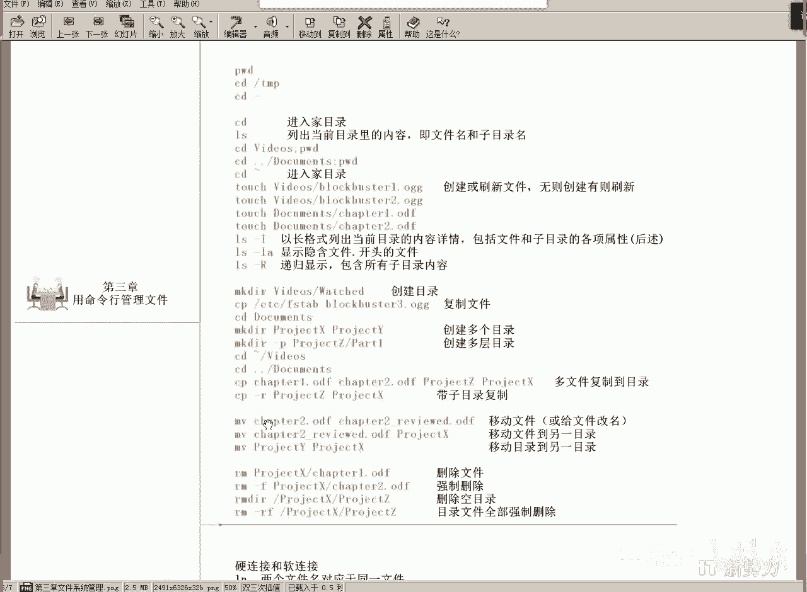
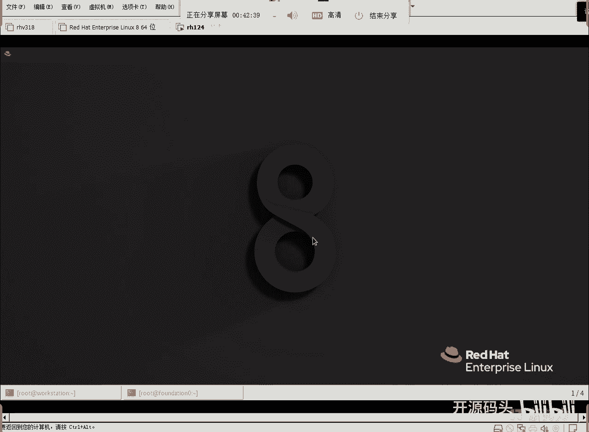
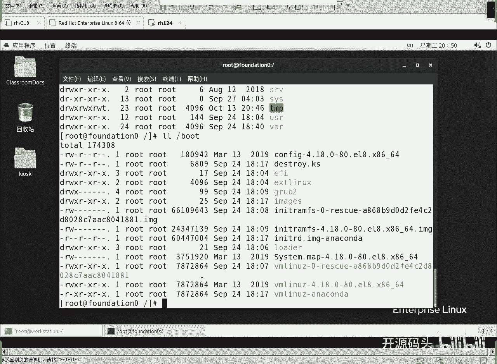
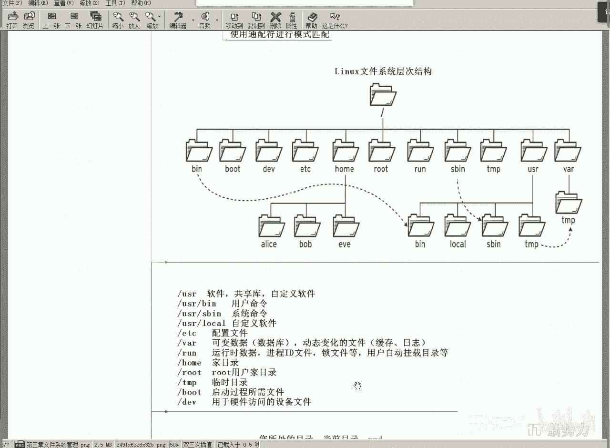

# Linux文件结构：3.1：核心目录详解（上）📁



在本节课中，我们将要学习Linux文件系统中几个核心且特殊的目录。我们将了解它们的作用、存放的内容以及它们与Windows系统的区别，并理解“一切皆文件”这一核心理念。

上一节我们介绍了`/dev`、`/proc`等特殊目录，它们对应着硬件设备和内存信息。本节中我们来看看那些占用磁盘空间、用于存放系统配置、用户数据和运行时文件的重要目录。

## 📂 `/etc` - 系统配置目录

`/etc`目录用于存放所有软件的配置文件。这与Windows系统不同，在Windows中，每个软件的配置通常存放在其自身的安装目录下（例如`Program Files`目录内）。而在Linux中，所有软件的配置都集中存放在`/etc`目录下。

以下是`/etc`目录的特点：
*   所有软件的配置变量、环境参数都应放在`/etc`下。
*   为了避免混乱，每个软件通常在`/etc`下创建自己的子目录来存放专属配置。

## 💾 `/var` - 可变数据目录

`/var`目录用于存放系统运行过程中经常变化的文件，例如日志、数据库文件、网站内容等。所有软件运行时产生的数据都应放在`/var`目录下。

以下是`/var`目录的特点：
*   所有软件的数据都应该放在`/var`目录下。
*   同样，每个软件在`/var`下创建自己的子目录来管理数据。
*   这种设计（配置在`/etc`，数据在`/var`）实现了功能的横向分割，使系统结构更清晰。

## 🏃 `/run` - 运行时数据目录

`/run`目录存放系统启动后产生的运行时数据，例如进程ID文件、锁文件等。这个目录在系统开机时自动创建，关机时其中的内容会消失，因为它主要关联内存中的进程信息。

以下是`/run`目录的核心概念：
*   **锁文件**：在多进程编程中，为了防止多个进程同时修改同一份数据造成混乱（死锁），需要使用锁文件来确保数据的完整性和修改的原子性。
*   该目录下的数据是临时的，与内存中的进程生命周期绑定，不占用磁盘空间。

## 🏠 `/home` - 用户主目录

`/home`目录是普通用户的“家目录”。每个用户都有一个以其用户名命名的专属目录，用于存放个人文件和私有数据。



以下是`/home`目录的特点：
*   每个用户的专属目录位于`/home/<用户名>`下。
*   该目录的权限通常只授予对应用户自己（超级用户root除外），保证了隐私性。
*   形象地理解，这个目录就像用户的私人住宅。

## 👑 `/root` - 超级用户主目录

`/root`目录是超级用户（root）的专属家目录。root用户在Linux系统中拥有最高权限，不受常规权限限制。

以下是关于`/root`目录的说明：
*   root用户的家目录**不在**`/home`下，而是直接在根目录`/`下，体现了其特殊性。
*   拥有root权限意味着可以对系统进行任何操作，例如卸载手机中预装的、无法删除的应用程序（许多手机系统基于Linux）。

## 🗑️ `/tmp` - 临时文件目录

`/tmp`目录用于存放临时文件。任何程序在运行过程中，如果需要进行数据的暂存、转换或排序等中间操作，都可以使用这个目录。

以下是`/tmp`目录的说明：
*   这是一个公用的临时文件存放区。
*   系统可能会定期清理该目录下的旧文件。



## 🚀 `/boot` - 系统启动目录

`/boot`目录存放着启动系统时所需的文件，例如引导加载程序（bootloader）和内核镜像。

以下是关于`/boot`目录的核心概念：
*   这些文件在主板自检完成后被读取，用于引导操作系统启动。
*   即使系统中安装了多个操作系统（如Windows和Linux），在用户选择进入哪一个之前，也需要一个引导程序来提供选择菜单，这个程序通常就存放在`/boot`下。
*   在Linux中，常用的引导程序是**GRUB**。我们可以通过命令查看其内容：
    ```bash
    ls -l /boot
    ```
*   即使你无法在文件系统中看到`/boot`目录，这些启动文件依然存在并起作用。Linux将其展示出来是为了便于管理。如果GRUB损坏，系统将无法启动，需要进行修复。

## 🔧 `/dev` - 设备文件目录与“一切皆文件”

`/dev`目录是一个特殊目录，它包含了系统中所有硬件设备的文件表示。例如，硬盘、声卡、网卡都在这里有一个对应的文件。

以下是关于`/dev`目录和“一切皆文件”理念的阐述：
*   `/dev`目录不占用磁盘空间，它是对物理硬件设备的抽象映射。
*   结合之前提到的`/proc`（进程信息）和`/run`（运行时数据），Linux系统将硬件设备、内存空间、进程信息等都抽象成了**文件**。
*   **核心概念**：**一切皆文件**。这意味着，无论是操作硬盘数据、向网卡发送信息，还是读取内存状态，都可以使用统一的文件操作命令（如读、写）来完成。
*   **优势**：这种抽象极大地简化了编程模型。例如，想通过网络发送数据，只需将数据“写入”代表网卡的那个文件即可。
*   **公式/代码描述**：这个理念可以抽象为：`操作(文件) = 操作(硬件/内存/进程)`。在代码层面，无论对象是什么，都可以使用像 `open()`， `read()`， `write()`， `close()` 这样的统一接口。



本节课中我们一起学习了Linux文件系统的核心目录，包括存放配置的`/etc`、存放数据的`/var`、用户家目录`/home`和`/root`、临时目录`/tmp`、启动目录`/boot`以及特殊的设备目录`/dev`。最重要的是，我们理解了Linux“一切皆文件”的设计哲学，它通过将各种资源抽象为文件，提供了强大而统一的访问和管理方式。