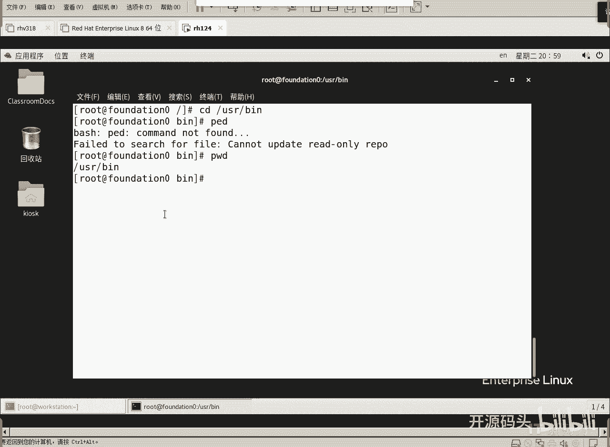

# RHCE RH124 之3.2 Linux文件路径 - P1 - 开源码头 - BV1GB4y1V7xV

好，那么我们如果说在这个树状结构里面啊，我们应该怎么样能够进入一个目录去看这个目录里的东西呢？哎，我们就涉及到一个路径的表达是吧？你是从爱丽丝这里跳到bo勃里，当然不能跳啊，你只有root能跳啊。

除了root，你们说爱丽丝能不能跳到抱抱目录里，不可以的，加目录是不能随便跳的，没权限的啊，权预制权限就不可以是吧？好，有人说我可不可以从B跳到脑口里。或者从local跳到TMP里，可不可以？啊。

怎么调？刚才其实那个命令已经说了，CD就是跳，对吧？那我跳的时候，我应该怎么去描述呢？我应该怎么我应该从并，我们就直接操作它，好吧，从。

并跳到天僻里好不好？我们先要进入并好不好？进入这个目录啊。好来看啊。

还在这个还在这个沐录下，好吧，康炒苑。首先我们得进入B是吧？注意啊，从哪个目录跳到哪个目录，从这个USR下的B跳到USR下面TMP是吧？

对不对？好，那我们先得进入这个并吧，那么进入怎么进入呢？我们现在在哪里？我们现在在这里或者我们现在在这里，然后我们要进入。是不是又是一种表述？还是一种要表述的概念是吧？所以说我们表述的应该两种概念啊。

一种叫什么？一种叫。绝对路径的表述就是你从最顶上这层描述下来。根目录下面的USS。Be害人。是不是一下就到了，不管我现在在哪里。😡，我从这个上面。从根目录这里开始依次往下走，是不是一次就能走到是吧？哎。

从根目录这个地方开始描述起的路径就称其为。绝对路径。啊，从根目录开始描述的路径就是什么绝对路径。因为我不管在这哪个分支里头，只要你说我从根目录下到到根目录下的某个目录下的某个目录下。

这是不是从根上一直就能搜索到确定的那个目录啊，是吧？这叫绝对的路径。走不错。啊，那么有一种我从病下什么到病的上层目录，我不知道根了啊，我从病的到上层目录到上层目录下的TMP。从到B里的上层下面的天P下。

这是不是相对我病来说的对吧？好，我们先来按绝对路径走到病里面，然后再用相对路径走到TP里啊。

CD。根目录下载USRR下面的是吧？In。回车。PWD可以看你当唉不好意思啊，PWD命令呢可以看你当前在哪个目录下。US项变对不对？啊，这个描述已经很明确了，告诉你US下的B啊。

然后看一下是不是根目录下的USR项的B在这里了吧。好，我现在想想又从这里呢跳到这里。

跟猴子一样，从这个数枝跳到这个数枝。啊，你怎么跳，你从这个根目这下到树底下，从树底下开始跳到这来，还是直接从这树枝这跳过来就可以了。是不是从数枝这比较方便一些？啊，那我们得描述啊。

我现在在这个病底下是吧，在病里头在病里头，我是不是得先出了病？Ha。😊，先出了BIN这个目录是吧？然后呢跳到什么TMP这个目录里，是不是？好，我现在不是从树根那开始跑了啊，从我这个树枝跑到另外一个树枝。

这个叫相对路径，相对于我我这个BIN这个目录走的啊。好，怎么走呢？我现在在。跟目录下载US下面的编一下编一下是吧？好，我现在走什么CD。Dianian。点点代表上层目录。好，上层目录。

BNN下面BNN的上层目录是不是就是USR这这里这底下了，是不是好，BIN下面上层目录从上层目录这里走到哪里啊，走到BTMP下再下来是吧？好。

下面的TMP。回车PWD看一下。是不是进了天僻目录了啊，像这种从当前目录往上走又往左走又往右走，不管你走几个上或者几个下，反正只要不是从根目录开始描述的。只要不是从树根开始爬过来的，都算什么相对路径。

那么相对路径的话呢，就是相对于当前所在位置，对不对？好。

这叫相对路径啊。我现在在这里，对不对？细心的同学说，哎，往下是不是也有个甜品？没错，如果我想从。啊，这个是不是有点感觉有点绕了是吧？感觉有点一模一样不好看。好，我现在想这么走啊。

想从TMP走到ETTG目目录下。可不可以？TMP走到。走到ETG目录下。啊，你怎么走比较方便，是从树根开始直接走下来。还是从我TMP往上走一级，再往上走一级，然后再走到一天下。我们用两种方法都走一下。

好吧。

好，CD。点点是不是从TMP下到了上一层到USR下了，然后再点点。这是不是上层目录的上层目录，是不是就到了USR上面这个目录了啊。我在天不下CD点点就到了这里了啊，到了这个位置到了中间。

就是先在TMP里头CTMP上面一层就是USR下了是吧？我再上一层是不是就到了这一层了，然后从到这层里头再走ETEC。PWD看一下。

是不是过来了啊，从TM从这个TMPR。往上走一层，再往上走一层，然后再走ETT这是不是一个相对路径？

相对于我当前TMP这个目录，相对路径过去。过去的位置啊。有些人说。那我直接CD撇ETT不就行了吗？没错，这样是不是感觉又好一点，是不是好，CD杠回撤。CD杠回车的意思呢就是。撬回原来的目录。

我现在不是在gameEC吗？我从哪到根meDC的？我从TMP呢我跳回去啊，CD杠又翻回上一个上一个目录啊，翻回上一个目录。CD杠翻回去之后呢，我重来一下，刚才我不是相对路径过去的吗？

我现在还是进入还是在这个目录下了啊，PWD验证了啊，还是在这个目录下，我现在呢直接用绝对路径走CD。撇ETC。披软金。是不是一样到了，对吧？一样到这个目录下啊，好，CD改变目录。

改变PWD查看当前你在哪个目录。然后我们改的时候呢，要么我使用绝对路径。绝对路径啊，就是。从根目录开始描述起的路径就叫绝对路径。啊，那么。从我们当前目录开始描述起来的路径叫什么？叫相对路径。

从我当前路径开始描述的。啊，也你也可以这么说，只要不是从根目录开始描述的路径，就是相对路径。因为从根目录开始描述起的话，不管我当前在哪里，我都可以到那个目标是吧？不需要关心我当前位置。

如果说我用相对路径的话呢啊，就是从我当前路径开始描述起，对不对？有些人说，那我喜应该用哪一种？你喜欢用哪种就用哪一种喽。喜欢哪种，反正是最重要达到那个到达那个目标位置就可以了，是吧？

从这个树枝从这个树状结构的。

目录结构里面任意的跳跃。至于说你是想从树根那直接树根那跳过来，还是什么呢？啊，还是自从自己的位置描。一层一层1一段一段描述过去都可以。啊，你喜欢用哪一个就用哪一个爱用哪一个就用哪一个。

最终的目的就是你到了就可以了。

啊，到那个目标位置就可以了是吧？好，CDCD改变目录是吧？从根目录开始描述的路径是完全限定的位置，称为绝对路径啊，从这里开始描述讲一个撇开始撇哪里哪哪哪哪。对吧啊。好，你看CD当前目录下的BA。

啊一个点是当前目录，两个点是上级目录。从当前目录开始描述路径，成为相同路径，一个点代表本级目录，点点代表上层目录。有人说三个点可不可以？不行啊，没有了，没有这个说法，就一个点和两个点啊，没有什么三个点。

4个点啊，没有了。你要说有人说我上级目录的上级目录，那你就是点点撇点点啊，目录和目录中间。他的隔离服。用的是撇啊。目录和目录中间隔离服用的是P啊，根目录也是P啊。

好了，这是路径的描述。