# Linux基础：3.2：Linux文件路径 📂

在本节课中，我们将要学习Linux系统中一个非常核心的概念：**文件路径**。路径是我们在文件系统的树状结构中定位和访问文件或目录的方式。理解绝对路径和相对路径的区别，并掌握如何使用它们，是高效使用Linux命令行进行导航的基础。

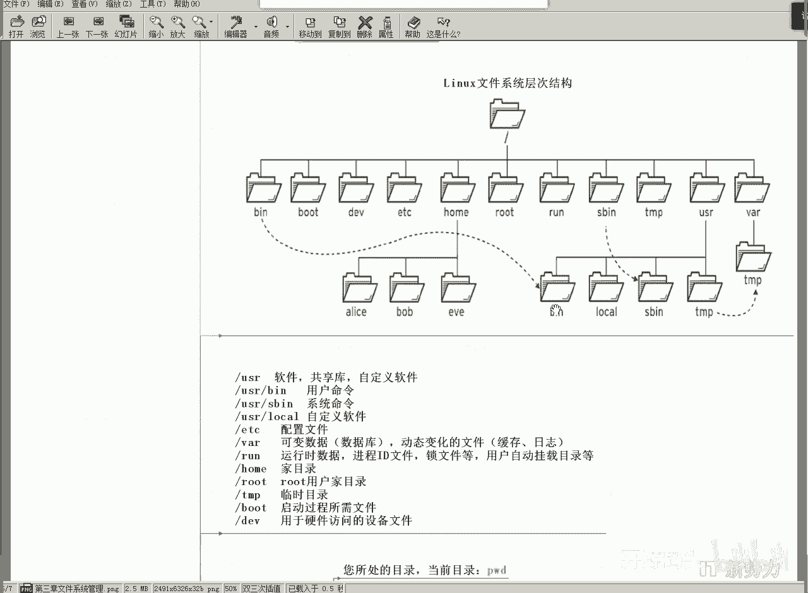

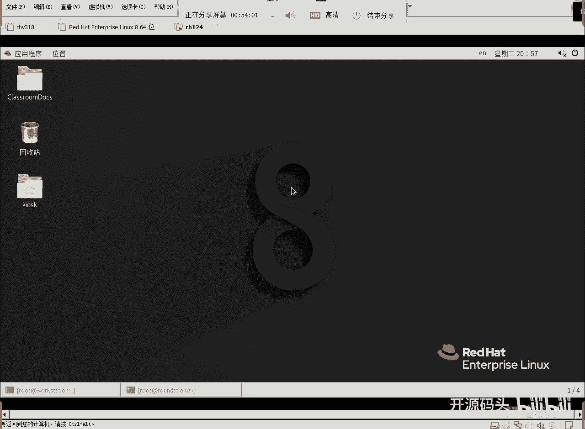

上一节我们介绍了Linux文件系统的树状结构，本节中我们来看看如何在其中进行“跳跃”——也就是切换目录。

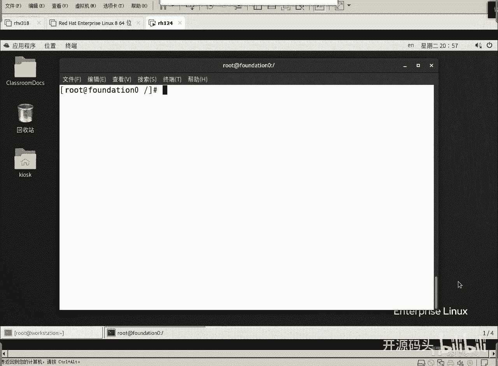

## 绝对路径与相对路径

在树状结构中，从一个目录切换到另一个目录，需要使用`cd`命令。关键在于，我们需要一种方式来“描述”目标位置。这种描述方式主要分为两种：**绝对路径**和**相对路径**。

### 绝对路径 🌳

**绝对路径**是从文件系统的**根目录（`/`）** 开始描述的完整路径。无论你当前身处哪个目录，使用绝对路径都能唯一且准确地指向目标位置。

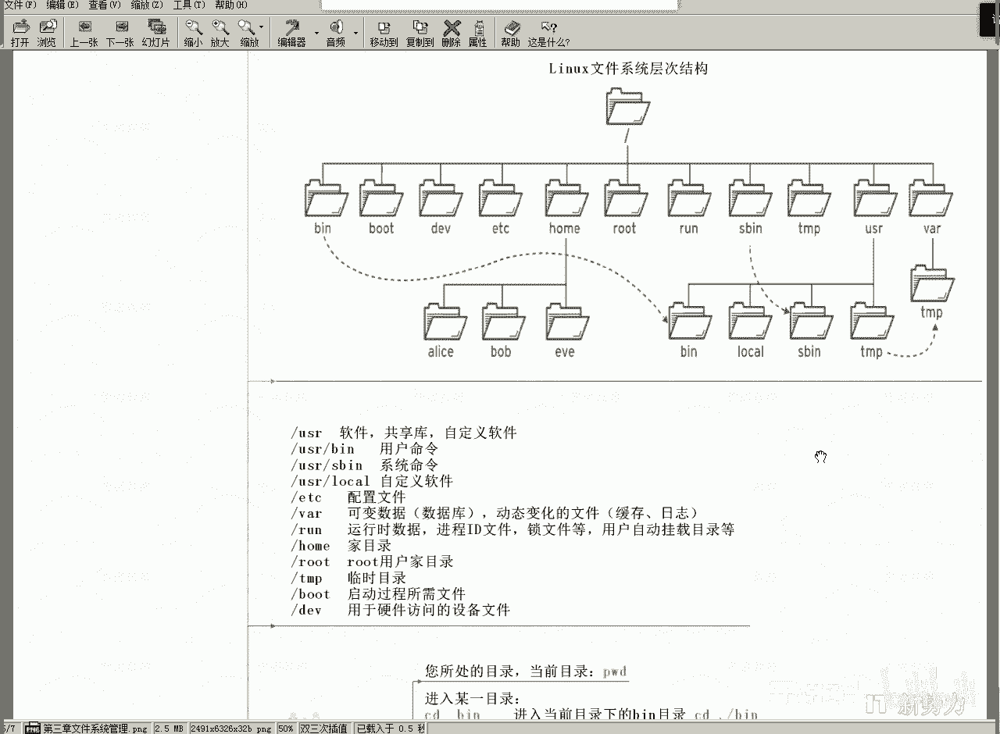

**公式**：`/目录1/目录2/.../目标目录`

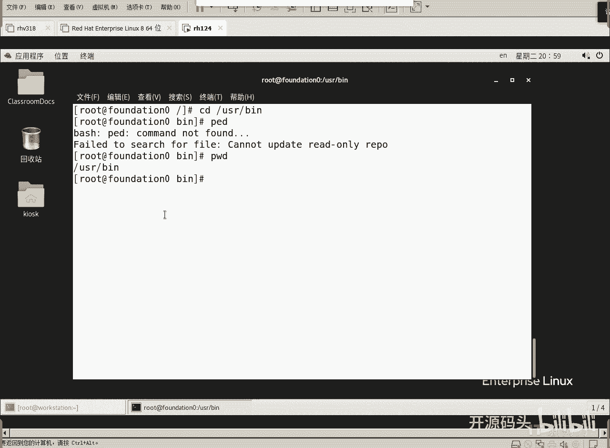

例如，要进入`/usr/bin`目录，无论当前在哪里，都可以直接使用命令：
```bash
cd /usr/bin
```
这个路径`/usr/bin`就是一个绝对路径。它从根目录`/`开始，依次经过`usr`目录，最终到达`bin`目录。这种方式“走不错”，因为它不依赖于当前位置。

### 相对路径 🐒

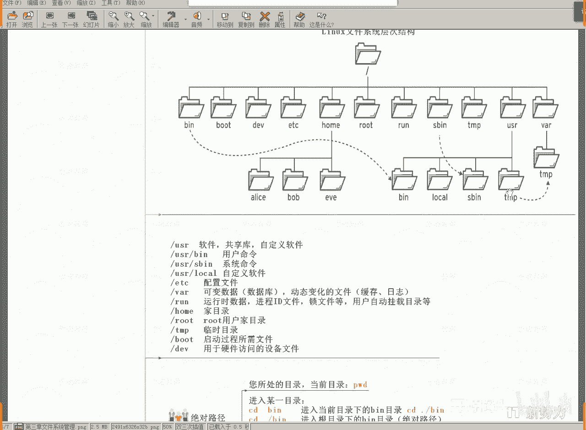

**相对路径**则是从**当前工作目录**开始描述的路径。它描述的是相对于“我现在在哪里”的位置关系。

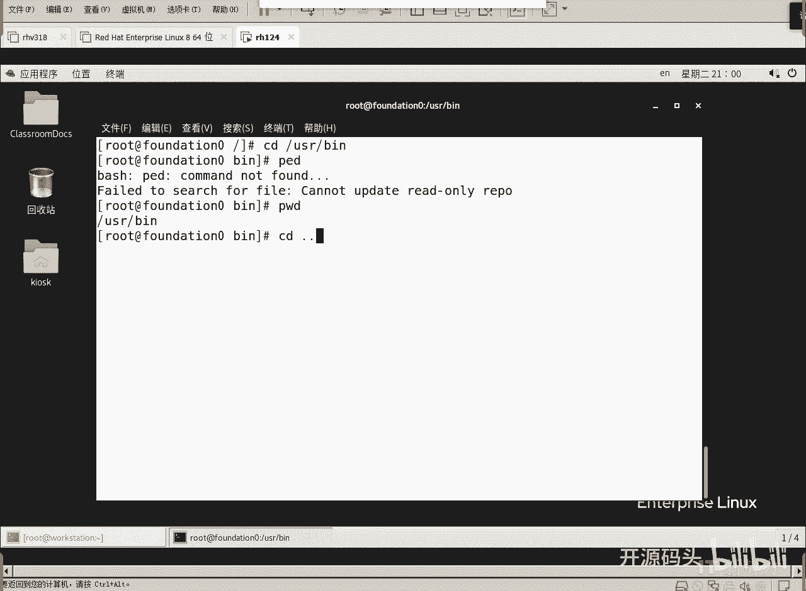

**核心概念**：
*   **`.`** （一个点）：代表**当前目录**。
*   **`..`** （两个点）：代表**上级目录**（父目录）。

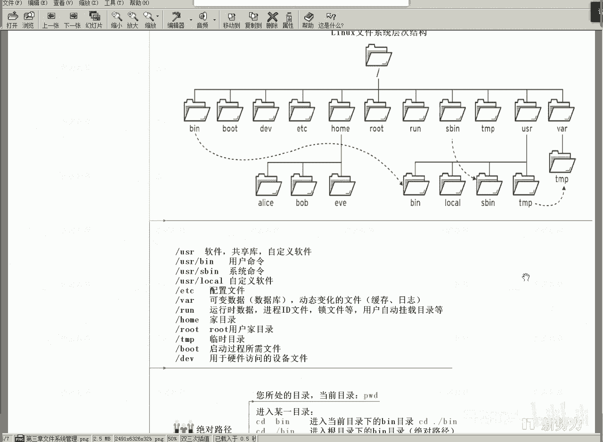

例如，假设我们当前在`/usr/bin`目录中，想要切换到同级的`/usr/tmp`目录。使用相对路径的方法是：
1.  先用`cd ..`退回到上级目录`/usr`。
2.  再从`/usr`进入`tmp`目录。

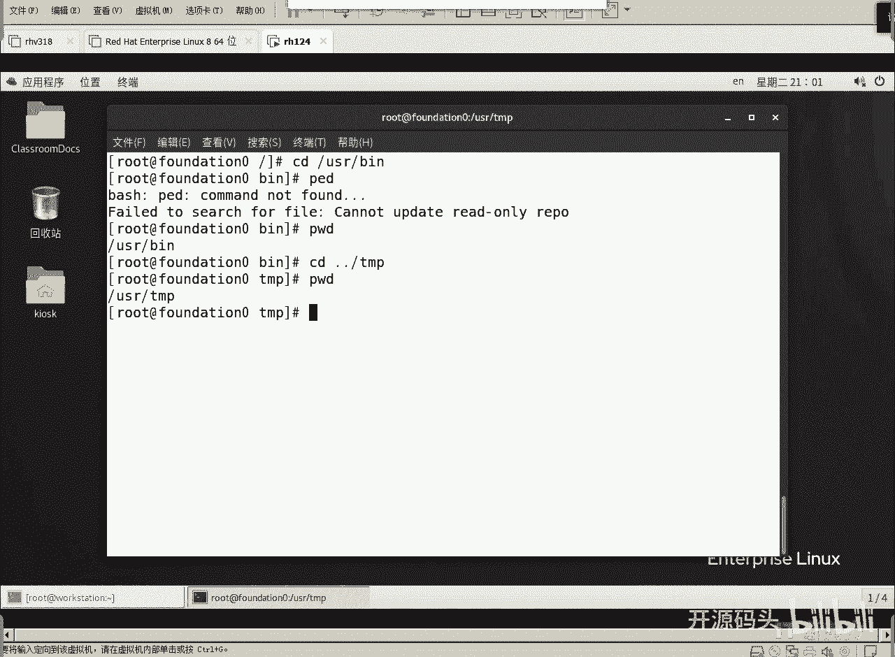

可以合并为一条命令：
```bash
cd ../tmp
```
这个`../tmp`就是一个相对路径。它表示：先向上走一级（到`/usr`），然后进入`tmp`目录。

## 路径操作实践

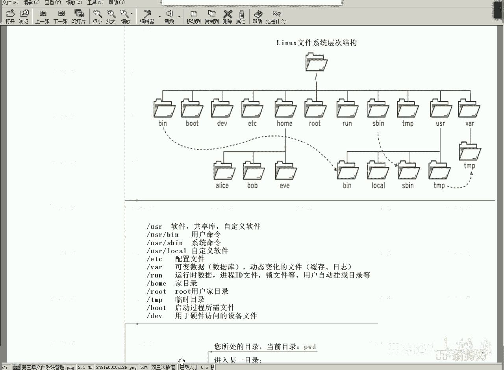

让我们通过一个具体的例子来巩固理解。假设我们要从`/tmp`目录切换到`/etc`目录。

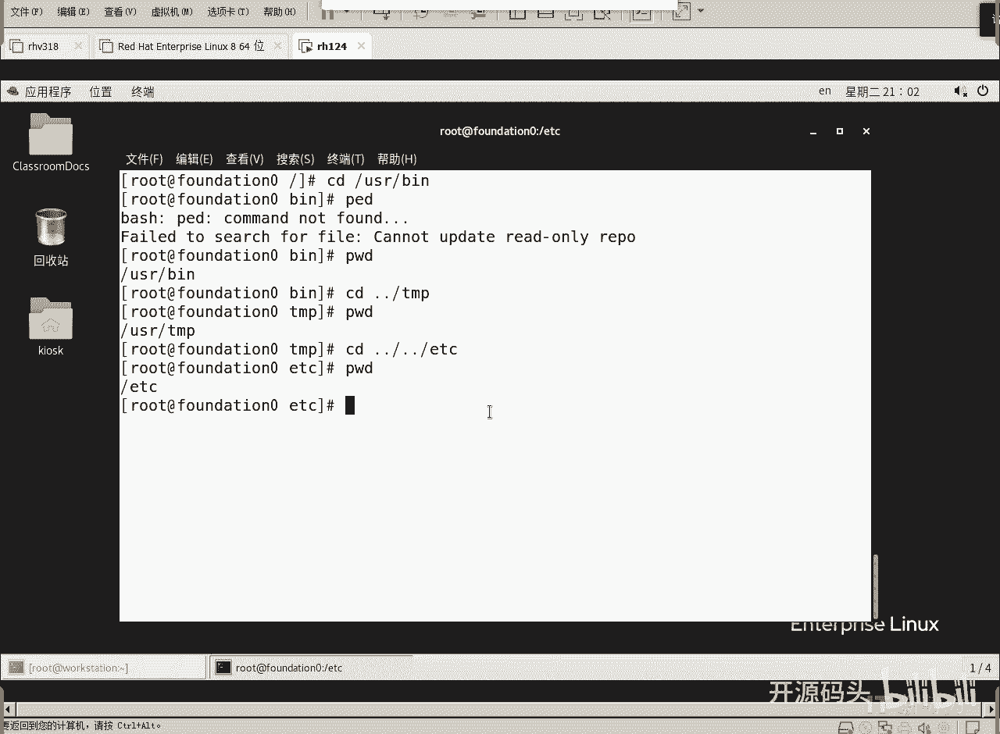

以下是两种实现方法：


**方法一：使用相对路径**
从`/tmp`出发，需要先向上两级到根目录`/`，再进入`etc`。
```bash
# 假设当前在 /tmp
cd ../../
cd etc
# 或合并为：cd ../../etc
```

**方法二：使用绝对路径**
直接从根目录开始描述，一步到位。
```bash
cd /etc
```

显然，在这个例子中，使用绝对路径`/etc`更加简洁直接。

## 路径描述要点总结

以下是关于路径描述的几个关键点：

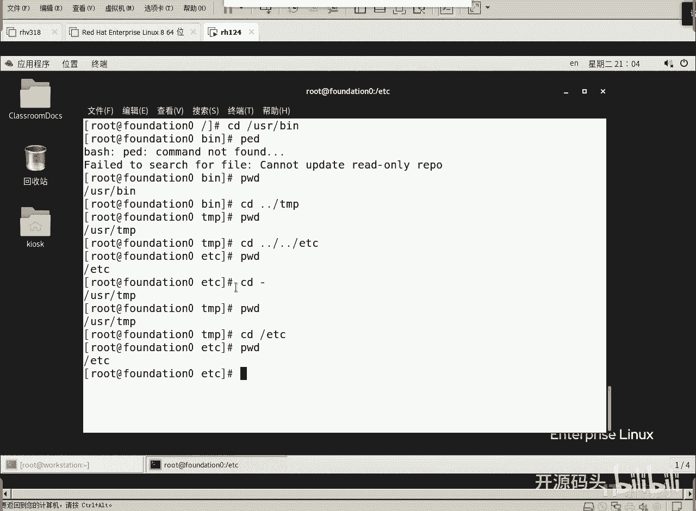

*   **路径分隔符**：在Linux中，路径中的目录层级使用**正斜杠（`/`）** 分隔。
*   **根目录**：绝对路径以`/`开头。
*   **目录快捷表示**：
    *   `.` 代表当前目录。
    *   `..` 代表上级目录。
*   **命令回顾**：
    *   `cd [路径]`：切换目录。
    *   `pwd`：打印当前工作目录，明确自己所在位置。
    *   `cd -`：快速切换回上一个所在的目录。

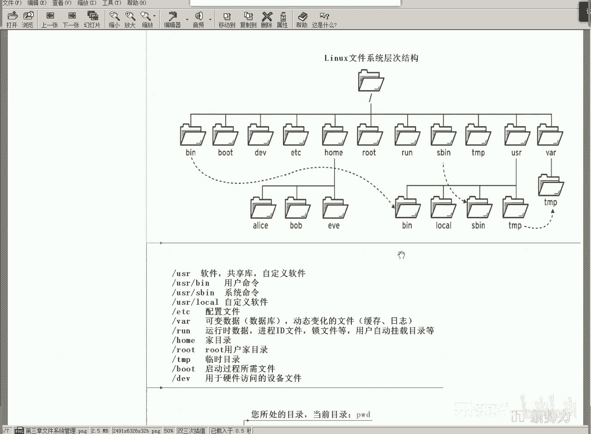

至于应该使用绝对路径还是相对路径，取决于具体场景和个人习惯。当目标目录距离根目录较近，或你不确定当前位置时，使用绝对路径更可靠。当目标目录就在当前目录附近时，使用相对路径可能更快捷。最终目的都是准确、高效地到达目标位置。

---


本节课中我们一起学习了Linux文件路径的核心知识。我们明确了**绝对路径**是从根目录`/`开始的完整定位，而**相对路径**则是基于当前位置的灵活导航。通过掌握`.`和`..`这两个特殊符号，以及`cd`和`pwd`命令，你已经能够在Linux文件系统的“大树”中自由地从一个“树枝”跳转到另一个“树枝”了。这是所有后续文件操作的基础，请务必熟练掌握。