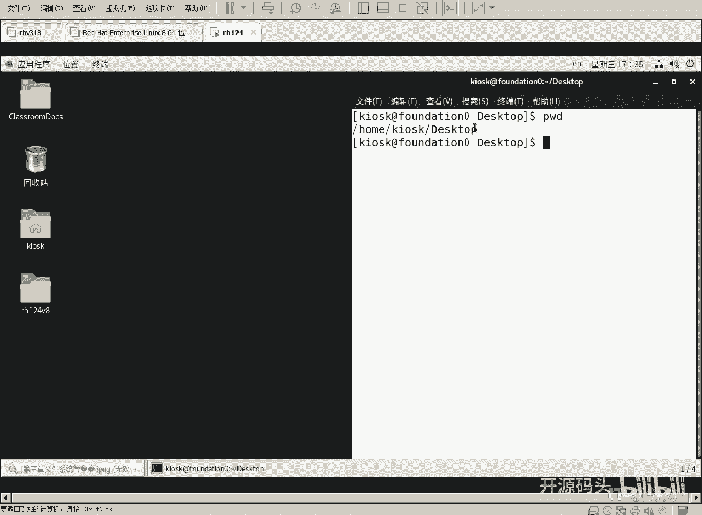

# RHCE RH124 之3.3 Linux目录常用命令 - P1：3.3目录常用命令 - 开源码头 - BV1Mg411r7bf

啊，呃后面呢我们我们会呃做一些试验啊，比如说啊查看当前路径。然后进入到根目录下的TMP。我问一下，下TMP是我们刚刚做试验的那个TMP吗？这个图上根目录下是不是没有写TMP啊，但是的确存在啊。

这个TMP是USI下的PMP并不是根目录下的TMP好不好啊，那这个TMP呢？是Y线的TMP啊。啊，这这里有这里有这里。这里有是吧。该目录下载TMP和US下的TMP是一个目录吗？当然不是啊，各是各的啊。

只不过是名字巧合而已。因为估计是都是为了存储临时文件，好吧。

好。CD到根下载TMP然后CD杠是什么意思？切换到原来的位置，好吧，就是进入TMP之前从哪过到TMP的，你就回到哪去？好，CD直接回车呢是进入加目录LS列出当前目录的内容啊，但是LS列出的不太好看。

你知道吧？啊，我们呃CD杠。翻回到那个目录下好了，ctrorl L清屏LL看一下嗯这个一个文件一行，一个文件还还还好看一些，内容也也蛮多是吧？内容也蛮多啊，但实际上如果说你只用LS的话呢。

ctrll清屏了LS你只能看到文件名。除了文件名，其他任何信息都没有。所以说LS好像呃呃不用起来资源内容太少，我们加个杠L。

就有了是吧？LS杠L因为写的频率比较高，所以说呢我们做了一个什么呢？做了一个别名，就是我们让LL代表是LS杠L好吧？啊，这个事情，我们的系统都已经做好了啊所以说你只要要打1个LL就可以了啊。

和和打这个列表一个文件一行一个文件一行当然显的内容就比较多了，对吧？哎，是一样的效果，因为什么？因为我们LS杠L打的频率比较高，我们干脆把它简化一下，把它简化成LL啊，这个简化过程是叫别名操作啊。

就是把这个命令再给它做一个别名叫LL，所以说我以后打LL其实跟打LS杠L是一样的，对吧？啊。好，这是别名LS杠L命令的别名。哎，有人说命令还可以做个别名。那命令太繁琐的话，你可以给他做一个简单的名字。

就是别名，好吧。好，LS意思啊，好，CDvis数，然后分号PWD什么意思啊，从当前目录进入当前目录下的vis数是目录啊，进入这个目录之后呢，分号代表下一个命令又开始了。

下一个命令叫PWD这个意思就是一行里面写两个命令啊，分号之前的是一个命令，分号之后是第二个命令啊，你一个命一次性打完了，一次性执行两个命令啊，就分号是格可以隔在一行上写好几个命令。啊。

可以在一行写好有没有CD点点下载doments什么意思？啊，进入。当前目录的上级目录下载。dmo也就是说，visus和大mo是不是在同一级？同级又有一个vis数，又有个dments，我先进入vis。

然后呢从vis数里又退回到上一级下的dtments这两个目录在同级吧。vis数和d minus是不是在同级啊？PWD仅是用来做验证，好不好？好啊，我们后面又会讲touch啊，生成一个空文件。

用touch。啊，创建或者刷新一个文件。如果这个文件已经存在，我们去刷新它啊，刷一下。代表我们碰过它啊好，这个touch呢只创建新文件。我把这这里面所有命令给大家演示一下啊好呃，在空白处点右键。

open in terminal打开一个终端。我们把它拖标题栏呢拖到最右边，那么我们有一个虚框呢表示它可以自动的占半面屏幕啊。

OK啊，然后呢呃PWD看一下。我当前的目录呢是home总目录里面的KISK这个当前用户名命名的目录下啊，桌面这个目录下，其实呢就是当前。这里的内容啊，当前桌面上的东西呢就是在dtop下。啊。

好，然后我们把这个笔记打开啊，然后再选再选中这个。命令行窗口啊，呃我们呢先去TMP下CD且TMP。啊，这就会这是一个绝对路径是吧？从根目录下找见TP目录。啊，PWD我们可以看一下。

已经进到这个跟录下TMP对吧？好，那CD回车。那这个呢。空的CD命令呢直接回到了加目录啊，回到了谁的加目录呢？当然是当前用户的加目录，对吧？OK好，然后LS看一下。啊，我当前用户加目录里面的东西啊。

那其实呢不同的颜色呢显示的呃不同的类型是吧？像这些呢黑色的都是普通的文件，而蓝色的这个呢应该是什么目录啊，或者叫文件夹啊，然后红色的呢，这是一个压缩文档。

对边OK那我们现在呢就在从加木路这个位置开始呢啊。熟练的呃去熟熟练的去使用这个CD命令，以及什么啊touch命令啊，以及基熟练的使用这些基础命令，对吧？好呃，CD。啊。

大写的V啊呃linux大小也是敏感的啊。啊，我们要进这个目录，对吧？啊，如果你想打的话，可以打下去。不想打的话呢，打个table键。因为呢。VI这两个字母啊，其实就一个V就可以了啊，大写的V就可以了。

就可以唯一的确定出这个目录了，对不对？就可以唯一打一个字母，其实就可以唯一确定出这个目录。因为在当前路径底下啊，或者叫当前目录下，只有一个大V大头的这么一个目录。那这个时候你敲table键呢。

聪明的系统会给你补全啊。好啊，后面有这个撇没这个撇无所谓啊，有个这个撇只能代表是什么呃，它是一个目录，对吧？啊，如果说我们。不想看到它，那可以把它删掉，然后分号啊。

这是要还要打一个命令PWD啊就是要看我进了微呃微vio的目录之后呢，PWD再看一下。是不是啊home下的KSK这个用户的啊目录里面的什么videos这个目录对吧？三层目录对不对？好。

那么现在呢我又想出了这个video目录啊，重新进和它相同级的目录的thatments。O。好，CD。啊，因为当前目录是vis是吧？当然有些人说我我可不可以这样去写撇home下的KSK下面的大什么。

可不可以？可以，这叫绝对路径。我现在呢想试一下相对路径。🤧从V6值这个目录下面啊往上走一层，然后再进和V6是同级的大什ance，对吧？CD点点下面的啊大写的D啊，T间能打出来吗？打不出来，为什么？

因为大写的D打头的好几个文件和目录对吧？好，我们再写O还不行是吧？C这才可以是吧？t键。啊，这时候呢我们可以进入到这个呃这个目录，然后PWD再看一下啊，是不是已经进入这个目录了，对不对啊。

先运行这个命令，先进入这个目录，然后查看当前目录是哪里。当前目录果然是这里是吧？你当然你写一个CD撇后面下的S可也可以，对不对？O好，现在呢我们重新进入加目录啊，进入加目录的第二种方法。明确的写一下啊。

我要进入加目录波浪号代表加目录啊，就车啊，其实进的还是那个啊空CD打的那个加目录，对吧？啊，它是一个地方啊，也就是说呃这个CD波浪号和CD呢啊，其实去的是一个地方，都是加目录啊。好了。

然后我们在加目录下面呢开始用touch命令去生成新的文件啊。Touch。啊，然后呢大写的V。啊。我们现在用touch命生成一个新的空文件啊，当然这个文件如果已经存在的话呢，它会刷新这个文件啊。

如果说我们没有这个文件，它就创建这个文件啊啊block。Bus。一点OGG啊OGG这种扩展名呢其实是什么？是那个呃。视频啊视频或者语音。啊，然后呢我们呃现在呢还需要去再创建一个呃blockbu2是吧？

Touch。大写的vis啊，然后。BLO table键啊，它是不是自动的把呃。block bus一引出来了啊，我们要改改什么，改成2。OGG啊，删掉后面的东西啊，改成2。OGG好。

我们相当于在呃维rous目录下啊放了两个大片是吧？大片一和大片2对吧？好，我们又在呃d months。这个目录下放一个什么啊，单元一和单元2啊，ODF是一种呃类似于PDF的啊这么一种文本文件对吧？

我们现在这个文件里是空的啊。好，如果说想偷懒的话呢，我们可以用向上的箭头打一下啊，这个命令就出来了是吧？这个换呃，不要呃理会它这个换行，因为我们这个屏幕。太窄啊，所以它自动换行了啊，不用理会它啊。

我们该该怎么写还怎么写。好吧。好，我们现在呢把。它上面你重新调出来啊，然后呢DOC。table键啊，然后下面的些cht。一点ODF。好，回车。再来往上箭头跳呃，把上一个命令再调出来啊，光标。呃。

切换的光标移动到一这个位置啊，再写一个2。这样的话呢，我们就相当于刚刚四行命令创建了，分别在两个目录下创建了两个文件，一共4个文件，对吧？好，我们可以看一下啊，LS杠L。IS杠L啊，然后看哪里呢？

我们可以看一下vi。是不是有两个文件对吧？那么杠L呢，它不光显示文件名。还把文件的属性信息也显示出来了啊。关于这些内容的具体解释呢，我们在后面再聊，好吧。好，呃，还有呢是呃显示这种隐含文件啊。

什么是隐含文件呢？那比如说我们再来做一个额外的东西啊，touch。vis啊videos底下呃写一个小数点ABC。点TST。回车。那么当我们用LS。杠L看这个目录下的内容的时候呢。

你会发现并没有这个点ABC点TXT这个文件啊。因为什么？因为这种小数点打头的只有扩展名，是不是没有文件名，只有扩展名的这种呃。文件啊这种文件名啊，其实有人说这是扩展名啊，呃你你也可以把它写它想成啊。

就是其实这么聊吧，就是小数点打头的文件名啊，是默认是不显示的。如果想让它显示的，加一个什么加一个A。A选项代表啊连带着隐含的目录一块显示啊，其中你看点ABC出来了啊，点ABC出来了啊，还有什么呢？

还有代表本级目录的一个点，代表上级目录的两个点，它都会显示出来，对吧？啊，刚才没有A的时候呢，它是不显示的OK。好，呃，还有递归显示啊，这个递归显示应该很有用啊。比如说我现在想看一下啊。

我们先来看一下当前目录下。刚才其实我们已经看到了是吧，当前目录下呢又有文件名，又有目录名。那么如果说我还想看到目录里面的文件呢啊，那你可以一次性再加一个杠大R啊，杠大R的意思是叫递归啊。

在linux里面我们呃专用名词把它翻译成递归。其实就是什么呢？啊，就是把当前目录下所有的子目录以及子子目录全部罗列一遍。啊，就是把所有的内容全部显示。啊，直到没有文件为止。

就是要把当前目下以及当前目下的子文件资质文件。所有的目录都要看遍。啊，我们会看到的downdownload的目录下是空的music目录下是空的picture目录下是空的啊，呃，那么vis目录下啊。

那我们刚刚创建好的两个文件，大成猫的目录下，我们刚刚创建好的两个文件，对不对啊，当然这时候这时候有没有显示出那个。呃，叫什么？隐汉文件没有，再加个A。啊，是不是显示出来了，对吧？OK好，呃。

然后呢我们可以呢在呃创建我们喜欢的目录，对吧？啊，比如说make。DRR啊makeDR就是创建一个目录啊，我们把这个目录创建到vidows目录下啊，vids目录下WATCHED啊。啊，然后这是看过的。

是不是？好，我们把这个呃。ETC。根目录下ETG目录下有1个FSTB这个文件，我们把它拷到哪里呢？啊，拷到。考到当前目录下呢，还是考到那个videos目录下。

我们还是考到video videos目录下吧，大写的V。啊，然后拷拷贝的时候呢，把原文件FSTB文件内容拷过来，顺便呢把目标文件名改名，改成什么呢？Radbu。十。啊吧呃我们的幻灯片上呢没有写目标路径。

对吧？啊，那么如果不写目标路径的话呢，其实这个文件就拷到当前的加目录里面了啊，当前目录下啊，我我直接把它拷到了vidus目录下啊，那拷贝的时候呢，原文件名。啊，被改成了新的文件名，但是文件内容动不动啊。

文件内容是不动的对吧？OK这种自动换行还是刚才说的啊，不用理会它，你照写就可以了啊，不要写回车，不要打回车啊，他自己换的行，因为我们的屏幕太窄啊。OK好，那么这是呃。拷贝命令对吧？好。

然后再进入大开的目录啊。ctrolL清一下屏幕吧。啊，CDP呃CDDOC。dm啊dm进入这个目录以后呢。我们 make theirR our project。X再写一个空格啊。Pro。Jack 1。啊。

回车。那我们这个makedR后面写了两个参数啊，一个是project X，一个是project Y。那么这样写完之后呢啊其实就是一次性创建两个目录啊。

maked projectject X以及makedRpro Y啊，相当于一次性创建了两个目录啊，你后面可以再需要，你写多少个目录名都不怕啊，它都会给你创建出来。当然都是创建了创建到了什么呢？

当前目录像啊当前目录像。okK好，然后我们做一个呃。多层目录的创建啊。这个命令啊makeDR杠P啊。Make牙。啊，杠屁。呃，除了PROGECTproject Z这个目录之外。

我们还要在它底下再创建一节目录，叫做part。What。那part一好吧啊，刚屁的意思就是什么呢？一次性创建多层目录，不要不但要创建project Z，还要创建什么？它前面的part one啊，好。

回车。然后我们再来LS看一下。啊，是不是呃XY之外，还有个Z，对吧？Z里头是不是会有一个。part a啊part一对吧？OK好，然后。我们再来一次1一次拷贝啊，拷贝呢呃。回呃。

切换到加目录里的windows目录，然后又从windows里切换到dtments。那我们为什么要跳来跳去的？我们直接跳到达mo底下，好吧，因为我们现在已经在这个底下了啊，然后拷贝chap一ch2啊。

然后呢以及project Z。project X啊。那么。一个2个3个、4个啊，像这种拷贝是什么概念呢？啊，我们拷贝命令是这样的啊，前面可以写若干原文件啊，最后呢必须写一个目标。

然后他会把前面的所有的啊。这些文件呢拷到后面的那个最后的那个目标里面去。这个时候呢，最后那个目标一定要是一个目录，因为前面的文件有好几个啊，它不可能你不可能把好几个文件拷贝成一个文件，对吧？啊。

所以说呢呃在前面如果有好多个文件的时候。后面最后面一定应该是一个目录，然后他会把前面所有的文件名以及目录名啊拷到什么，拷到对应的。最后的那个目录下啊，就是说拷贝命命令的参数是这样的啊。

前面所有的参数都是圆，最后一个参数是目标。好，我们来试一下。靠贝。啊，chap一table键chapt2。是吧差不多。2、推保键啊，然后呢大写的project。Z。啊，然后再写个project。X。

也就是说，要把前面这三个语言文件拷到最后这个目标目录里，对吧？project X目录里啊。有人说哎，这个目录会拷到目录里吗？不是这个Z是不是一个目录啊，哎，我们看一下它报什么东西。回撤啊。

他说你没有指定这个杠R啊啊，那么它会略过这个project Z这个目录。也就是说它会把chap一和ch2拷过去啊，并没有考project Z。因为如果想把一个目录考到另外一个目录里的话。

属于这种目录以及目录里的子子对象一块考，对不对？是不是递归的概念，所以应该加一个杠R的概念啊，而CP命令呢并没有。我们刚刚操作的时候并没有加R是吧？加杠R选项啊，注意这是参数，而杠R是选项。

没有加没有加它，所以说这个目录将不被拷贝。啊，有些同学说刚才那个呃LS命令的那个呃递归是显示不是杠大R吗？对，没错啊。呃，有有的命令呢呃他把杠呃就是他取的是那个联联想式的这么一种选选项是吧？

那么L的小R呢已经用作了这个排序的逆序，就是从从小到大或者是反过来从大到小的这种逆序排序。啊，呃所以说呢它的小R作为呃排序的一个逆序的话，表功能的话，那么小R就不能再再用作递归了。

所以它就用的一个杠打大R式递归，而我们的拷贝命令呢啊就直接用的是小R，对吧？那有些人说不统一嘛啊这两个就是一个互不相关的两个命令，对吧？这个命令呢是列入软件目录。而，这个命令是拷贝啊。

有些同学说哎这个东西不好记。哎，这个东西就只能记了，对吧？那呃只能去记了啊呃打多了啊，我们就会习惯啊呃也不用刻意的去记它，你只要打的多了自然就习惯，好吧啊。OK好，那么我们如果想带子目录一块拷贝。

那就加个杠什么杠大啊，杠R是吧？拷贝命令不是杠大R是杠小R啊，我们直接写拷贝杠R。Project Z do， Project X。X是大限对吧？回撤哎，这次不报任何错误，那就是正确的是吧？LS。

Project x。你会发现它里面除了刚才考过的呃chap一和二之外呢，又会又多了一个project Z。那project Z里头我们记记得刚才还创建了一个part一，这个子目录被拷过来了吗？

我们看一下。撇project table键回撤，你是不是发现了project X下面有一个project zproject Z下面是不是还有个part一？对不对？OK就说明他。

子目录包括子文件都会被拷过去，对吧？这就叫递归啊，然后呃做了拷贝之后呢，我们还可能是什么还可能是呃移动啊，移动一个文件到哪里啊啊或者是呢呃在本目录下，如果移动的话呃两个文件名不一样。

那就属于什么改文件名儿。比如说chap2啊，我们要把它移到本目录下相同目录下，因为我们没有前面没有这个目录路径，对吧？那就是默认就是当前路径，把chap2呢啊改名为revis啊revis呃。

ODF好不好？好，来一下啊。他会诶。Chapter一 the O effort chapter。呃，应该是我们按照幻灯片上的是二是吧，差不多2。然后改成t。2。下滑杠。Rei。You do。点OTF。

那么LS的时候呢，我们会发现呢。traer已经被改成trier下划杠re是吧？这个文件名了是吧？这就相当于一除了一如果同步如下啊，原文件名和目标文件名不一样，那就是把原来这个文件删掉，又新建这个文件。

其实就是改名了。对不？好，然后呢又把刚才这个文件移动到project X里面。木后。啊，这个时候我们用alt小数点。按住二t小数点不对，再摁一次。啊。

alt小数点呢会把我们的呃上一个命令的最后一个参数调出来。当我们第一次摁的时候，它把上一个命令它调出来，我们一看不对，然后再摁一次alt小数点，它就会把。

上一条命令啊它的上一条这个命令的最后一个参数调过来。最后的参数是不是正好是我们要的对吧？好，空格，然后把它拷到哪里呢？考到大写的project X。那，不是拷贝啊，不好意思，是移动。那移动过去之后。

我们当前目录墙肯定就没有了。因为真的是移动，就是把它呃移到新的地方，对吧？老的东西得删掉，是不是IOS。project X你会发现。他在这个目录下。对吧OK好，然后呢把目录也可以移动吗？

当然也可以把Y移动到X里面啊。我们现在当前目录下啊有有X有Y，有Z啊，我们现在呢呃把这个Y。啊，给它移动到X里面。路。Project why。然后project的目标是X。回车LS再看一下啊。

project。刚才那个目录里有个projectY对吧？现在还有吗？没有了，因为它已经到了这个目录下了啊啊L。Project X。是不是在这里？对吧OK好，然后呢删除删除一个文件啊。

删除一个文件是RM啊，然后杠F是强制删。我们可以试一下，好吧，RM删除一个什么呢？project。X下面的chet一。退保健把它删掉，回车啊，删掉了是吧？呃，如果说。我们呃作为root用户来讲的话。

他可能删一个东西的话，因为呃root用户有特权嘛，他随时都可以删。所以说删的时候有可能会提示，如果强制要删的话呢，加个杠F。相当于forse的意思，我强制删，你也别问了，我就要删对吧？

project X下面的chap2。点。ODF对吧，把它删掉，强制删除啊。啊，呃其实普通用户删的时候，他也不提示是吧？好，然后呢呃如果有提示的话嗯。讨厌提示的时候，加个杠F就是不管你问不问我。

就是你不用问我了，我就强制要删它啊，像普通有时候删的时候，他还会问你真的要删吗？对吧？像普通用户是不用，是得不到提示的啊啊root用户很多时候会有提示。好，如果删除一个目录，该怎么删？

IM啊project X下面的project Z。啊，要什么呢？要RMDR啊，删除一个目录，就是removeDR啊，删除一个project Z能删掉吗？回去。错，因为什么？

因为Z下面我们记得还有一个什么part一了啊，这个目录不是空的，里面还有个子目录。所以说如果想。一块山，那就是杠。2。那么杠R的时候呢。相当于如果说Z底下有子有子子目录或者子纹点一块删。啊，一块上。

当然这个时候用不该，还有可能是文件，对不对？所以这个时候用杠啊就remove命列就可以了啊。因为RMDR就只能删空目录啊，我们这个RM呢不但可以删文件，还可以删目录啊。

如果说我们用杠R对的一个目录删的话，这个目录以及目录里所有的子对象都会被删掉啊，那我们杠R删一下啊，删的时候呢，它会。会车啊。啊，然后这个就删掉了。如果他提示说啊你呃每个都要删吗？啊。

每个文件都要都要问你一下，是是是真的要删吗？你要觉得烦的话，加个F啊。那么普通用户因为全嗯他它的资源呢并不是特别重要，是吧？不如root的资源重要，所以说呢普通用户在删的时候呢，不会得到提示啊。

那如果说真有提示的话，我们是可以把它。用这个什么F强制删啊，不用去一个一个去。回应了是吧？OK好，那我们这些命令呢就这样啊，我们演示的先先到这里啊，然后呢我们后面再聊。

链接好吧。