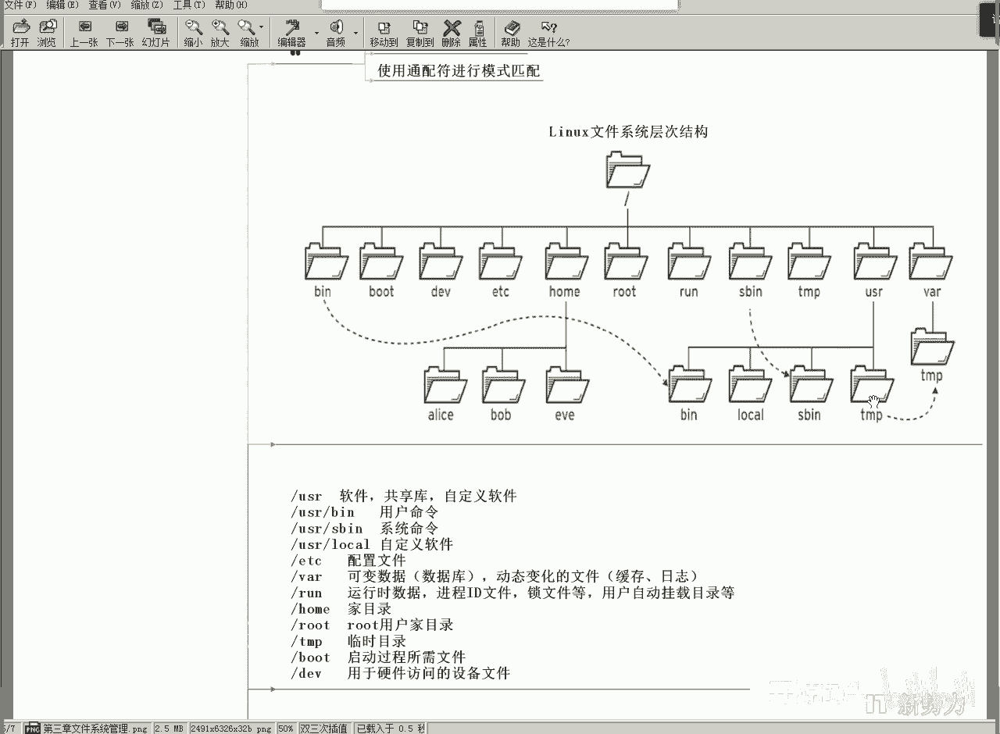
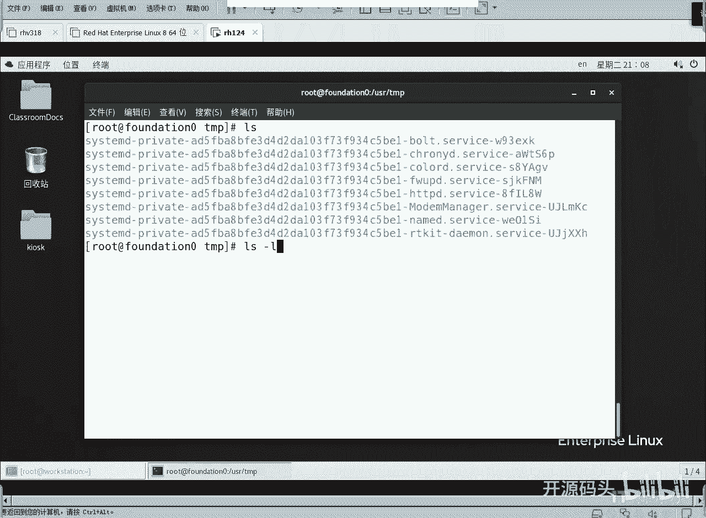
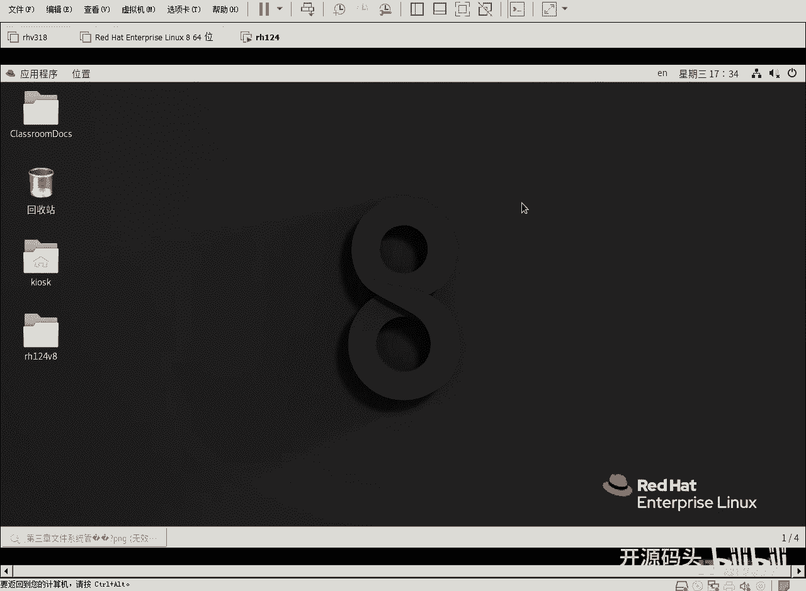
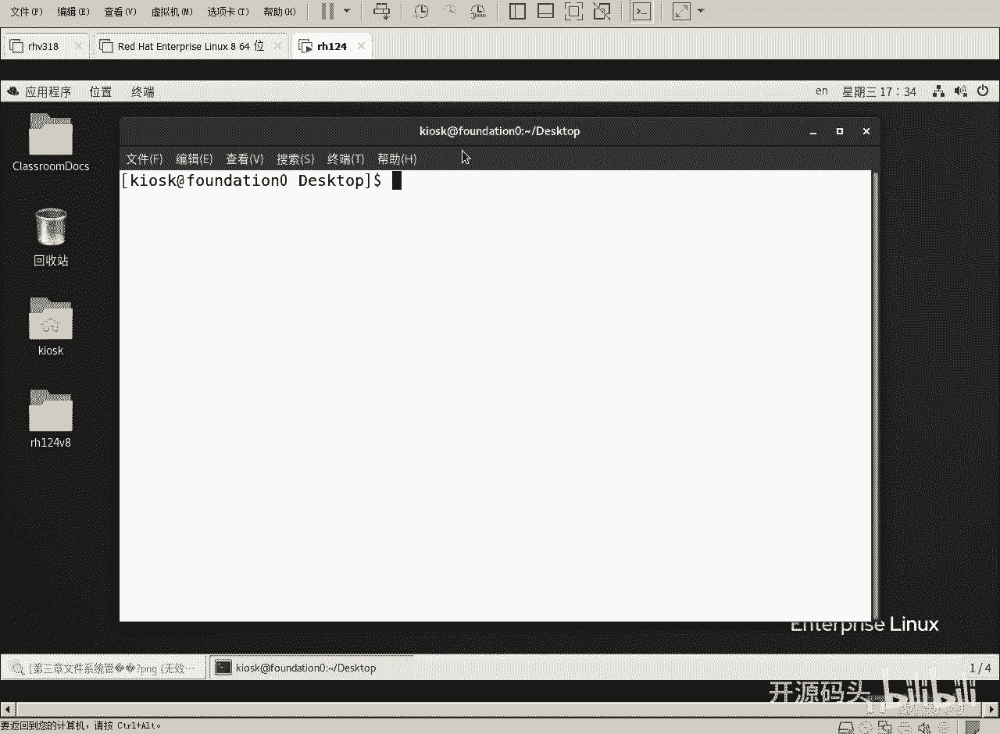
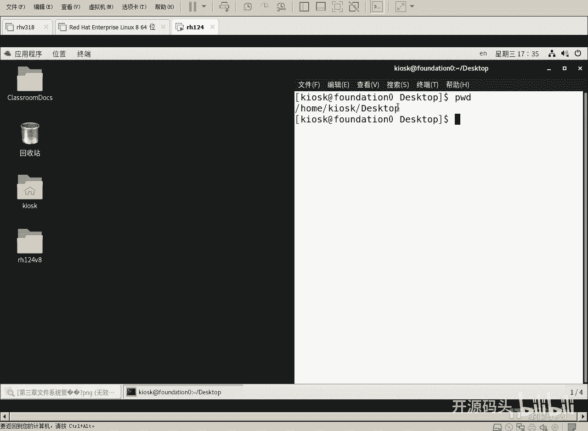
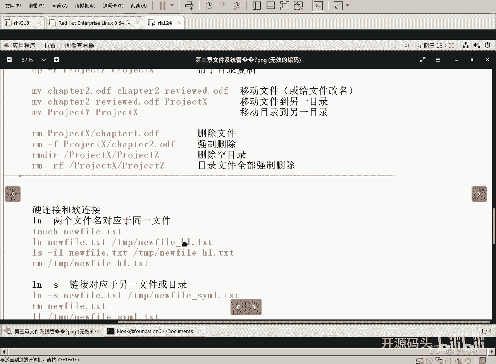

# Linux基础：3.3：目录与文件常用命令



在本节课中，我们将学习Linux系统中用于操作目录和文件的核心命令。我们将从查看当前路径开始，逐步掌握切换目录、列出内容、创建文件与目录、复制、移动、重命名以及删除等基本操作。这些命令是日常使用Linux系统的基础。

## 查看与切换目录



上一节我们了解了Linux的目录结构，本节中我们来看看如何在目录间导航。

**pwd** 命令用于显示当前所在的工作目录的绝对路径。

```bash
pwd
```

**cd** 命令用于切换当前工作目录。以下是几种常用用法：



以下是 `cd` 命令的几种常见用法：
*   `cd /tmp`：使用绝对路径切换到根目录下的 `/tmp` 目录。
*   `cd ~` 或 `cd`：切换到当前用户的家目录。
*   `cd -`：切换到上一次所在的目录。
*   `cd ..`：切换到当前目录的上一级目录。
*   `cd ../Documents`：先返回上级目录，再进入该目录下的 `Documents` 子目录。



> 注意：Linux 系统中，`/tmp` 和 `/usr/tmp` 通常是两个不同的目录，虽然它们都用于存放临时文件。



## 列出目录内容

掌握了如何切换目录后，我们需要查看目录里有什么内容。

**ls** 命令用于列出目录中的文件和子目录。单独使用 `ls` 命令只会显示文件名，信息较少。

```bash
ls
```

**ls -l** 命令可以以长格式列出详细信息，包括文件权限、所有者、大小和修改时间等。由于此命令使用频繁，系统通常为其设置了别名 **ll**。

```bash
ls -l
# 或使用别名
ll
```

**ls -a** 命令可以显示所有文件，包括以点 `.` 开头的隐藏文件。

```bash
ls -a
```

**ls -R** 命令会递归地列出当前目录及其所有子目录下的内容。

```bash
ls -R
```

你可以组合这些选项，例如 `ls -laR` 可以递归地、详细地列出所有文件（包括隐藏文件）。

## 创建文件与目录

现在我们知道如何查看目录内容了，接下来学习如何创建新的文件和目录。

**touch** 命令有两个主要功能：如果文件不存在，则创建一个新的空文件；如果文件已存在，则更新该文件的访问和修改时间戳（即“刷新”它）。

```bash
touch video1.ogg
touch video2.ogg
```

**mkdir** 命令用于创建新的目录。

```bash
mkdir watched
```

你可以一次性创建多个目录。

```bash
mkdir project_x project_y
```

**mkdir -p** 命令可以一次性创建多层嵌套的目录结构。

```bash
mkdir -p project_z/part1
```

## 复制、移动与重命名文件

创建好文件和目录后，我们经常需要管理它们的位置和名称。

**cp** 命令用于复制文件或目录。
*   复制文件：`cp 源文件 目标文件`
*   复制到目录：`cp 源文件 目标目录/`
*   复制目录（需要 `-r` 选项）：`cp -r 源目录 目标目录/`

```bash
# 将 /etc/fstab 文件复制到当前目录并重命名为 readme.txt
cp /etc/fstab ./readme.txt
# 将多个文件复制到 project_x 目录
cp chapter1.odf chapter2.odf project_x/
# 递归复制整个目录 project_z 到 project_x 目录
cp -r project_z project_x/
```

**mv** 命令用于移动或重命名文件/目录。
*   重命名：`mv 旧文件名 新文件名`
*   移动文件：`mv 文件名 目标目录/`
*   移动并重命名：`mv 文件名 目标目录/新文件名`

```bash
# 重命名文件
mv chapter2.odf chapter2_review.odf
# 移动文件到目录
mv chapter2_review.odf project_x/
# 移动目录
mv project_y project_x/
```

## 删除文件与目录

最后，我们来学习如何安全地删除不再需要的文件和目录。

**rm** 命令用于删除文件。
*   `rm 文件名`：删除文件。
*   `rm -f 文件名`：强制删除，不进行任何确认提示。
*   `rm -r 目录名`：递归删除目录及其内部所有内容。

```bash
# 删除文件
rm project_x/chapter1.odf
# 强制删除文件
rm -f project_x/chapter2.odf
# 递归删除整个目录（危险操作！）
rm -rf project_x/project_z
```

**rmdir** 命令用于删除**空**目录。如果目录非空，此命令会失败。

```bash
rmdir empty_directory
```

> **警告**：`rm -rf` 命令非常强大且危险，一旦执行，文件通常无法恢复。使用前请务必确认路径无误。

## 命令组合与技巧

在实际操作中，我们经常需要组合使用命令或利用一些快捷技巧来提高效率。

*   **分号 `;`**：可以在一行内顺序执行多个命令。
    ```bash
    cd Videos; pwd
    ```
*   **Tab键补全**：输入命令或路径的前几个字母后按 `Tab` 键，系统会自动补全。如果存在多个可能选项，按两次 `Tab` 会列出所有选项。
*   **历史命令**：按 `上箭头` 键可以调出之前执行过的命令。`Alt + .`（点号）可以快速输入上一条命令的最后一个参数。

---



本节课中我们一起学习了Linux下管理目录和文件的核心命令。我们掌握了如何使用 `pwd` 和 `cd` 进行目录导航，使用 `ls` 查看内容，使用 `touch` 和 `mkdir` 创建资源，使用 `cp` 和 `mv` 进行复制与移动，以及使用 `rm` 进行删除。这些命令是Linux系统操作的基石，熟练掌握它们将为后续的学习打下坚实的基础。