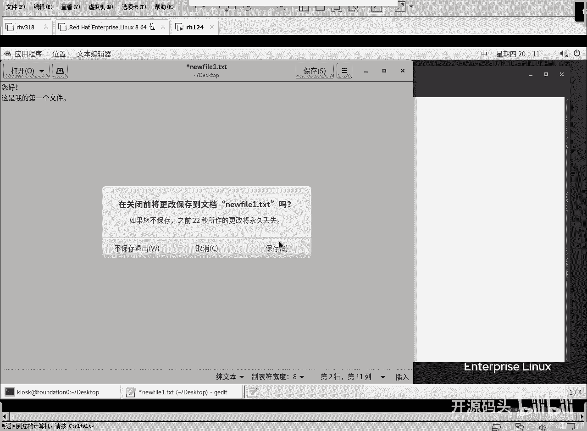

# RHCE RH124 之4.1 Linux软硬链接 - P1 - 开源码头 - BV1QB4y1B7gv

好，我们打开一个终端窗口。

那么呃这个时候呢我们可以先做一个呃自己新建一个文件，好吧。LS看一下当前目录下呢呃在桌面上呢有两个目录，一个是classroom doc，一个什么呢？HUSV8的这个目录是吧？就是桌面上啊。

回收站是系统图标，对不对？啊，就是它的加目录不在这显示啊，这个这个啊，我们现在看的是桌面上的啊文件夹，或者叫桌面上的目录啊，然后我现在呢想新建一个文件。

啊，新建文件的方法是什么呢？touch对吧？TUUCH。New。算呀。一点TXT。你会发现桌面上也出来一个东西，其实我们就是在桌面上创建了一个新文件，对吧？好，然后呢呃我们呃双击打开这个文件。

在这个文件里面呢写一些内容进去啊，比如说呃。我想用中文写啊，您好。好呃。这是我的第一个文件。好，这个文件里面呢写了一些内容，对吧？好，关闭啊，并且呢保存。

okK啊，我们也可以用另外一个命令啊，摁一下那个windows键和空格键，把中文输入法给它去掉啊，然后呢用cat。这个命令这个命令就是查看一个文件内容，new file e推车是吧？

这是不是我们文件的内容就显示到呃，命令行的窗口里面了，对吧？O好，现在呢我们想做这么一个操作，就是想把呃。想在还在桌面上吧，我还在桌面上创建，想做一个什么呢？就是它的软链接就是它的快捷方式啊。

你用fi一的快捷方式啊，怎么做呢？LN。🎼LN顾名思义就是lin啊就是链接文件的那个缩写LN令，然后杠S啊这叫软链接，待会我们再讲硬链接啊，软链接，然后原文件是new file一。啊，然后我呢想把它呃。

新的文件名叫做new file符号文件。啊，点其他题。啊，就是就像幻灯片上所说的这个样子一样啊，就是呃是个呃它是一个符号符号标记啊，给他加一个符号标记SYML好吧，给他加一个这个符号标记。好。不车。

你会发现桌面上又出来一个文件名，是吧？这个文件名呢啊它。实际上指的就是他，对不对？因为我们在这里已经用命令确定好了啊。新文件是原始的文件，然后我们创建一个符号文件，叫啊new file符号是吧？

这么一个文件名。那这个图标也不一样是吧？这个图标是一个text的图标，这个图标呢是什么？哎，它是一个。快捷方式的有一个箭头指向了另外一个文件，对不对？那我们双击它是什么效果？双击。是不是还是那个文件。

还是我们刚才那个new file那个文件，对不对？你好，这是我的第一个文件，还是它吧。哎，这就是所谓的所谓的快捷方式，对吧？那我们呢把它在linux里面把它叫什么叫软链接。啊呃。

我们如果想看它的大小的话呢，我们可以用LL看。啊，就是所谓的LS杠L对吧？啊，缩写成。あるある。啊，这是我们做了一个别名是吧？回车。一个文件一行。New范一。这是我们的原始文件。

然后new files是吧，这个。这个呢就是所有的符号文件啊，符号文件指向了什么呢？指向了new file e。啊，我们能看到它的大小。我们能看到它的大小。new file一里面有内容的对，它是41个。

应该叫字节。啊，41个字节，而我们的newfer一符号的这个文件呢，它是12个字节。其实12个字节很好理解，我们数一下它的指它包含的那个指向啊一。23456789101112。啊，很简单是吧？

就是它只是它这个文件的内容只有一个什么另外一个文件名的描述。啊，当我们去打开这个符号链接文件的时候，实际上打开的是它指向的这个新文件。那么这个文件名有多大啊，它的大小就是多大。啊。

就是它这里面并不存真正的内容，真正的内容是在这个里面存的是吧？它里面存什么东西，它里面只存一个文件名啊，这个文件名是12个字母，它就是12个字节长，这个文件大小就是12个字节。是吧这是符号链接啊。

符号链接啊等同于完全等同于微软里面的那个快捷方式啊。呃，比如说new file一不在桌面上，那，我们的可以把它呃。可以就是在桌面上给它创建一个快捷方式，对吧？我们双击打开它，打开的还是它，对不对？啊。

当我们双击打开这个newfi的时候，其实打开的还是原始文件。有人说，那我可不可以往这个文件里面去写东西呢？当然可以，对吧？双击打开啊，这是我的第一个文件啊。

这。呃，windows加空格键啊。切换成中文。这是。嗯。打开。符号文件。嗯。加的好。啊，好，这是我们打开符号文件夹的行保存啊，然后呢关闭。

啊，我们再来LL看一下。好。windows空格。啊，键盘上的windows键啊LL。啊，又切换成英文了是吧？hel然后呢，你看new file一的内容发生变化了，对不对？由原来的41变成了78。

因为我们在后面加了字加了那个汉字了。啊，然后呢啊newer一这个符号链接文件有没有变化？没有对吧？啊，这就叫快捷方式啊，能不能跨目录去做呢？当然可以是吧？当然可以。比如说我们可以。Touch。呃。

一个touch1个TMP目录下的。312。点TS器。好。然后呢，我我就不从图形界面去打了啊。

哎，打一下吧。好，随便打开一个打开一个这个呃目录，然后呢从下面啊其他位置。然后上面有个计算机，计算机打开以后就是我们计算机里面根目录里所有的东西啊，根目录里面所有的东西从图标上也能看出来。

这是不是都是链接。啊，这个是权限不能访问的。这是不是都链接？是吧bean level level64SB这个东西呢都是符号啊。有人说哎，你刚才做的是文件，目录也可以做符号吗？yes啊。

目录也可以做这种呃符号连接啊。好，我们找件什么，找件TMP打开。

里头是不是有个fi2，对不对？fi2啊，我们在这是我的第二个文件啊。windows空格。这是我的第二个文件。

好了，保存关闭。OK这个文件的内容就有了啊，这是我的第一个文件。然后呢啊我们现在呢在桌面上给它创建一个图标啊，LN杠S我切换回中英文啊LN杠S然后原始文件是TMP下的fi2啊，目标文件呢是当前目录啊。

我们当前目录就在桌面上是吧？就在桌面上啊，如果想确保在桌面上，我们也可以这么去做啊，我加目录的desktop这个目录啊，我的我的那个桌面的目录并没有改成中文啊，因为我们在。

安装中文的时候呢安装中文环境的时候啊呃会有一个提示啊，问是否把这个我们的那个就是英文的那种。呃，文件夹全换成中文的，我没有换啊。如果你换了的话，这个地方就应该写什么汉字的桌面了啊，就应该写汉字的桌面。

我没有写啊。好，桌面上呢呃写一个fill。呃，fi2的符号。啊，点儿。TXT。OK回去看桌面啊。哎，桌面上呢就会出来一个。

啊，被遮住在这里是吧，新的快捷方式叫做fi2的符号。那我们双击打开它。

是不是还是那个范2呀，对不对？好，OK好，那大小呢看出来看一下啊大小。

哎，这个天片的F2呢，它的大小是14个字节，为什么是14个字节？你数一下，1234567891011121314。它就14个字母啊，这个符号连接指的就是14个字母，14个字母呢就是TMB下的范2，对吧？

所以说这就符号链接好吧，OK好，那么符号链接呢，这个完全等同于微软里面的那微软系统里面的那个所谓的呃。快捷方式对吧？但是微软里面呢没有这个东西，就是windows里面它没有这种东西，就是什么呢？

可不可以两个文件名指的是同一个文件的内容？对不对？好，我们来一个。我们来一个新现在先新建一个文件，好吧。Touch。Yeah。Double。点TST。回车。啊，它这个图标自动放到放到右边了啊。

我们把它摆到下面来，好吧。我们是不是创建了douer？

啊，然后呢双击打开。嗯，这个文件。理有。这个文件我们计划啊这个文件内容啊。这个文件内容啊，我们计划啊对应到两个文件名。啊，三个吧，好吧，三个文件名几个都可以啊。啊，我写的写的是douer是吧啊呃两个吧。

呃，反正两个和三个是一样的，你只要一只要呃。去。呃，多做一个就行了是吧？这个文件内容呢，我们计划对应。对应的啊。

对应到两个文件名啊，好了，保存关闭。好，这个时候我们来挨来着看一下啊。好，看dou啊这个。这个文件呢。现在又看这个值。就是我们呃LL命令所显示出来的第二个列啊，这是第一个列是吧？

第一个列其实是什么是类型和权限。第二个列这个数值这个一代表的就是这个文件名，就是这个文件的内容对应于什么？一个文件名。对应一个文件没有啊，我们再来试一下啊。LN不要加杠S了啊不要加杠S啊。

我们来个什么呢？来个呃。啊，IEP点TNT。啊，我先先先写原文件啊，然后呢再给一个再链接一个文件名叫做什么？叫REP。啊，点题叉T。回这。这个时候桌面上还会出来一个文件文件。

从表面上看，这个。repeat和这个double呢。是什么两个独立的文件名吧，而且呢是不是快捷方式啊？不是啊不是我们LL看一下。

看这个dou呢，它的大小是55个字节。repeat呢也是50个字己。我们可想而知，它两个内容肯定是一样的。对吧而且呢有细心的同学已经发现了。这在没有做链接之前，它的链接数量是一个。

这个文件的链接数量这个做了之后呢，这个链接数量变成几个了两个啊，为什么是两个？因为这个文件名啊和这个文件名表面上看上去是两个独立的文件名，但是呢。他对应的是。同一个内容啊同一个内容。

我们repeat的双击打开看一下，是不是这是不是我刚才写的这个文件内容，我们计划对应到两个文件名上，这是不是两个文件名指的是同一个文件。两个名字对应于同一个文件内容。啊。我们改一个。把这披子改一下。啊。

我们进行了修改。啊，我们从。REP进行了修改，好吧。好，保存。关闭，然后我们看一下大板。我们从IP进行修改。

是不是两个文件名对应于同一个文件内容，但是我们。看的时候是不是就是完全独立的两个文件？这种东西叫硬链接啊，硬链接数在这里啊，硬链接数在这里。那有些同学就说了，如果我删除一个文件呢。

比如说我把大oubo删掉。Remove。回车。桌面上不见了啊，已经被删掉了啊，已经被删掉了啊，删掉之后LL看一下。double不存在了，但是IEP还在，只不过IEP后面的2。变成了几。

变成一说明这个文件还有一个文件名对应于它。啊，不同的目录可不可以？可以啊啊，比如说我们可以。台伦。repeat这是圆哈，然后把它再对应到TMP下的呃。REP2点TST。回去。然后我们现在再来看的时候呢。

你会发现IEP定应的文件的链接数又变成2两个了啊，因为什么？因为TMP下的IP2。也对应于这一个文件内容。Cut。啊，alt小数点。啊，就把上一个命令的最后一个选项给他什么？粘过来，添不下的AP单。

我们看一下内容。是不是还是刚才我们文件的同一个文件的内容，对吧？啊，这种东西叫硬链接啊，我们微软里面呢微软的文件系统呢不能这么做啊，微软文件系统它没有这个功能啊。

那如果说我们把这个文件呃结文件系统的结构，把它文件系统的组织结构，把它比喻为一个树状结构的话，树叶是不可以再长在一起的。那么这个是长在一起了。就是说两个那个脉络啊，或者是说两个两个那个呃呃。叶杆啊。

最后连到的是同一片叶子啊，两个页杆连了同一片叶子啊，在windows里是完全不允许的啊，但是我们的linux是可以做的。啊，这种叫硬链接啊，这个硬链接呢，我们的LL命令显示出来的第二个列子。

这个数字就是它的链接数量。等到链接数量被删成零的时候，这个文件就彻底从磁盘上被删掉了。如果这个任何一个文件啊，至少还有一个的话，那这个文件都不会被删掉。啊，OK好，知道一下这个链接啊，我们。呃。

上节课聊的一个话题是吧？啊，一个是软链接等同于微软的快捷方式，一个是硬链接啊，硬链接就成了什么了？啊，就成了linux特有的一个功能啊，就是两个文件名对应于同一个文件的内容。啊。

当然也仅此而已啊也仅此而已啊，比如说呃我们把权限进行修改。如果我们把权限进行修改，它会不会发生会会不会变化呢？啊，我们这里REPTX权限是什么读写？读写杠读写杠。读是吧，我们可以把它权限改一下，试一。

看看它内容是一个权限是一个吗？change model啊，change model什么呢？呃权限给它改成。R杠杠杠杠杠杠杠杠啊，就只读啊只只读的权限啊，IPTST回车哦呃无效模式。我们这样。啊。

应该是呃要写的话，是这样写的啊，就是呃。U等于R。走啊，然后拍来了。我看我多打了一个哪完了哎。大大来看一下啊，哦，他光把U改了是吧？呃，这几个东西没人改啊，没动啊那我们干脆改的彻底一下，U等于R。

然后呢。G等于空O等于空。看这个权限是不是看上去非常明显是吧？那我们再看一下它的另外一个天陛下的那个repeter，它的权限是不是也跟上改了呢？是不是？所以说仅仅就是文件名儿对应于同一个内容。

不但对应于同一个内容，而且对应于同一个什么。权限对吧？对于同学不可以单独设置权限的啊，硬链接不可以单独设置权限啊，但是硬链接有个区有一个功能上的区呃，因为硬链接很容易造成这种呃混乱，对吧？

就是树状结构不是树状了，树状结构从树叶上又给合起来了。那我们呃有一个限制，就是说这种硬链接不允许。嗯。链接目录。啊，不能把一个不能把两个目录名对应于同一个目录，它只允许对文件进行操作。

不允许对目录进行操作。而软链接是可以对目录的啊。软链接是可以对目录的。我们刚刚打开这个跟目录的时候，刚才我们已经看到了那种目录的软链接，对吧？其他位置计算机，然后这Blele64是吧，这些都是什么？

都是都是目录的软链接。

所软链接的限制没有啊，但是硬链接的限制呢必须是。

只能对文件，不能对目录啊。OK我们的链接这个概念说完了啊，呃，因为课程上我们聊了这个话题，所以说呢我们还是呃按照课程按照我们课本上的那个过程去走一下，好吧啊。

