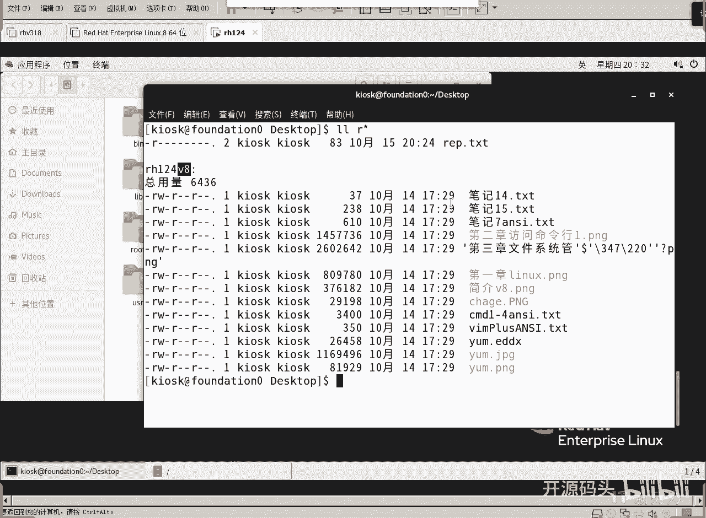
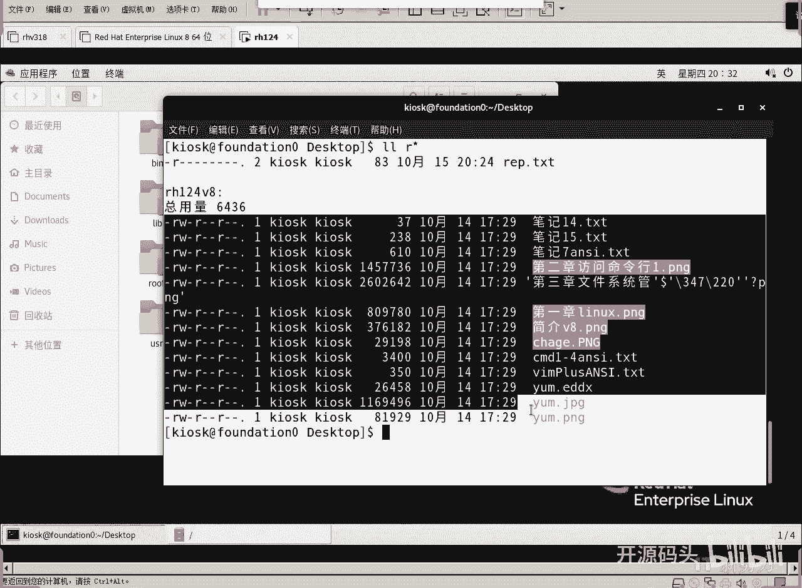
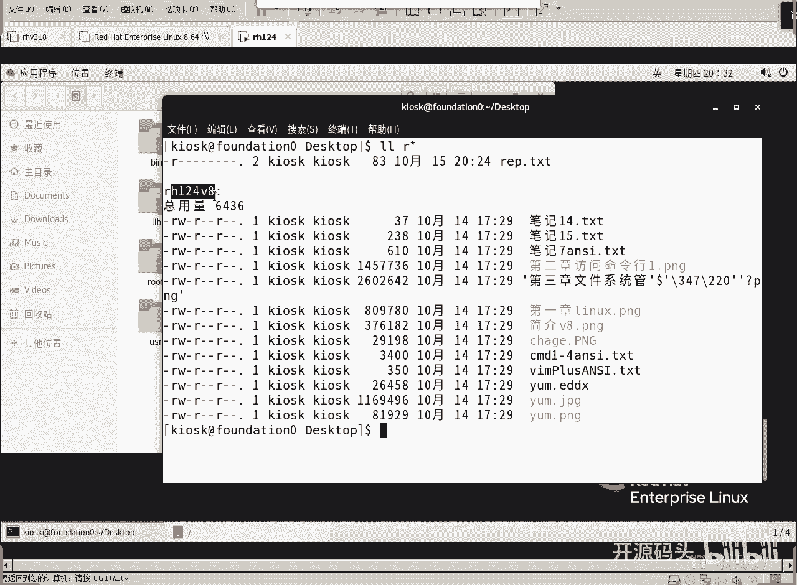
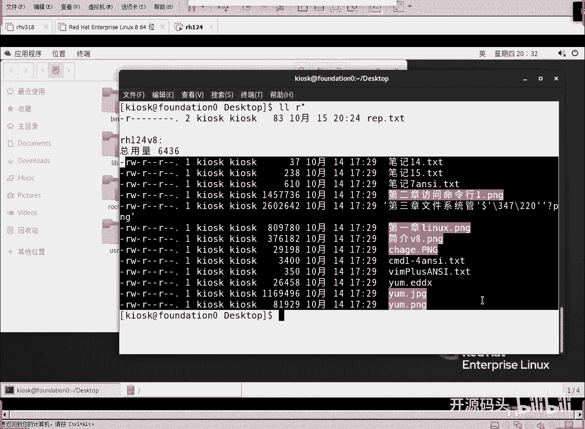
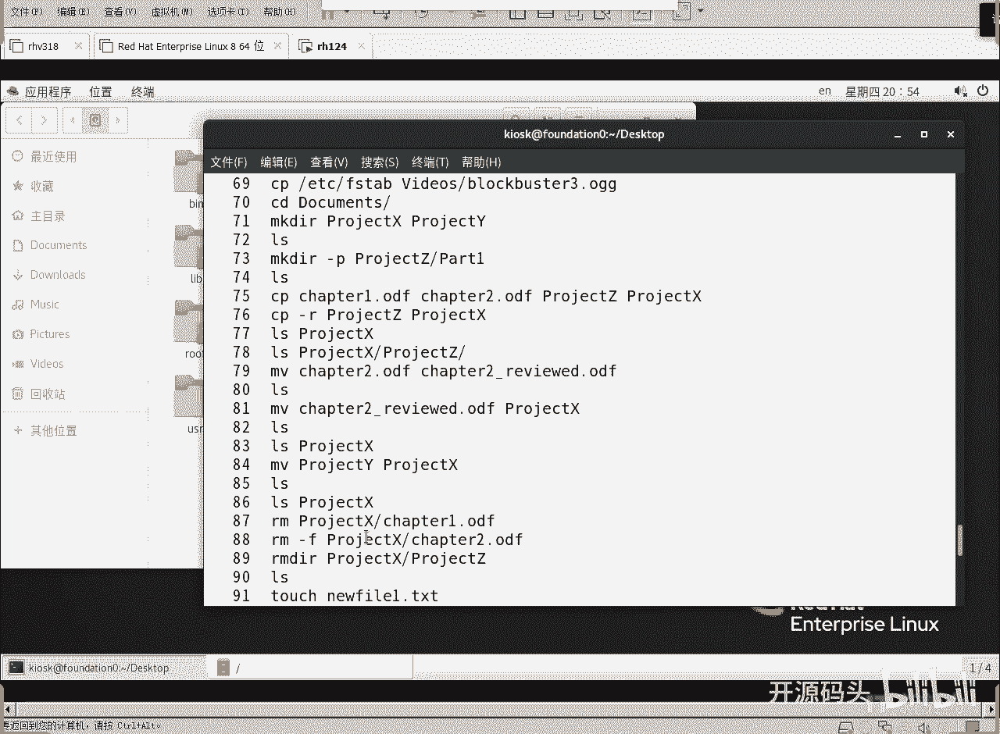
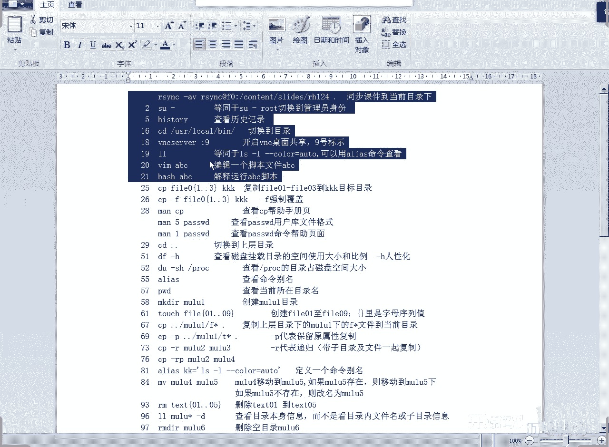
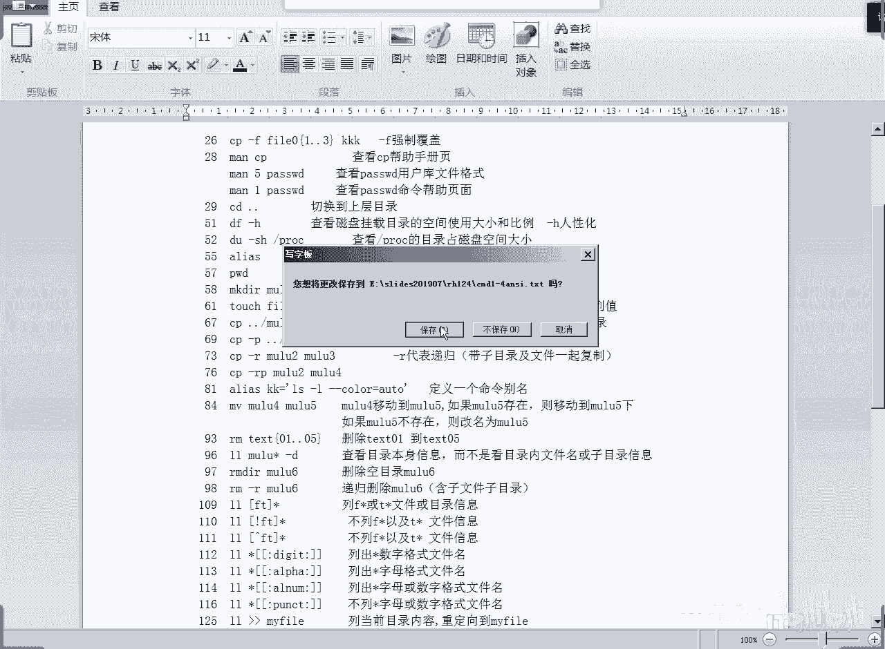

# RHCE RH124 之4.2 Linux通配符.mp4 - P1 - 开源码头 - BV1zV4y1p796

然后最后一个知识点啊，叫什么呢？叫通配符啊，通配符啊，什么是通配符呢？第一次听的同学可能感觉啊这个东西不太好理解是吧？感觉啊什么是通配符啊，通配符的意思就是什么呢？匹配啊。

就是我们用一个特殊的字母来代表一种特殊的匹配模式。啊，比如说星啊就代表的是任意的字符啊，就是零或者是多个字符的任意字符字符串啊，什么意思？很简单啊，就是说呃任意字符星就代表任意字符。啊。

那我们可以的用LL命令。啊，用LL命令呢或者用e口命令呢去。啊，还是用Ll命令呃，比较简单一些啊，比较简单一些，比较好好看一些。好吧。好，我们现在呢用Ll命令呢来试一下这个通配符的概念。

Conttrol L。啊，来来了。啊，我想看什么呢？想看这个R打头的所有的文件。后面的字符我们不管，后面是星。What。😮，哦。当我们看R星这种文件的时候呢，除了REP这个文件之外呢，还有什么？

还有R打头的目录啊，这个目录里的内容也显示出来了啊还有啊目录里的内容就这么多。

对吧啊，不但能把R打头的文件显示出来，也可以把R打头的目录也显示出来。那当然你要看目录的话呢，目显示的就是目录里的文件名。

对不对？OK好，这是那个。😊。

R星是吧啊我们可以在RL。还有什么？还有F是吧，还有F打错的对吧？counttlL216F新。对不对？哎，有些时候呢我们说哎我们这个字母呢最好是能够呃。确定出它的个数。啊，那就是用问号来来做就可以了啊。

L啊。F问号。啊，F第二个字母不知道啊，但第三个字母我知道file啊LLE。啊，点TST。没有。啊，本身就没有是吧？那我们试一下这个啊LL。R。问号啊，P点TSG。是不是就显出来了是吧？

比如说呃用问问号呢代表什么代表一个字母。比如说尔尔问问。哎，这也出来了，对吧？OK好，这就所谓的嗯。通配符，一个是新，一个是问号啊，星代表的是所有的啊任意的字符，而问号代表的是一个单个的字符。

如果我们想确定这个具体的字母的个数的话，你写多个问号就可以了啊，写多个问号就可以了啊，那么还有一些什么呢？中括号括住的啊，中括号括住的一种操作啊。我们先说下面这个中括双中括号冒号啊，这种什么呢？

这种就是描述啊，这种描述啊，就是任意字符。啊，这种是小写字符，这个是大写字符啊，这个是什么呢？数字啊，这个数字啊，这个是什么呢？可打印字符啊，除了空格啊，除了空格和那个呃控制字符之外，所有的可打印字符。

这个是什么呢？数字啊，这个数字啊，这个是字母和数字啊，这个字母和数字，这个数字，啊后这个是什么呢？这个是空格。啊，那我们可以呃文件名里面带数字的。啊，文件里面带数字的应该怎么去的？dig个吧，好吧。

现实我们可以看一下啊，现在我们里文件里面有没有带数字的，有吧，啊？好，我们先看着它。操作就可以了。L嗯L谁呢嗯。新。然后中括。怎么出来的是这种字符的？中号中号。磨合磨合中国中啊。

就任意字符中间有数字有数字，然后后面也是任意的，好吧。啊，他把那个R124又给显出来了，当D吧。啊，杠D的意思什么意思呢？就是呃我们只显示目录名，如果是目录就只显示目录名，不显示那个嗯。目录里的内容啊。

杠D只显示目录名，如果是目录只显示目录名啊，然后这个时候你可看一下这里面是不是有个数字，这里面是不是也有个数字啊，这个里面是不是有不止一个数字？对吧啊，就是任意字符中间加一个什么加一个数字的概念，对吧？

哎，这就是所谓的呃通配服务的一种特殊格式。这个好像在windows里不能用啊，但是windows里有一个通配符就是新啊windows里有一个通配服是新其他通配服好像windows里都没有啊。

而是因为什么linux大部分情况下是用命令行，所以说它有更多的控制啊，这也就说了一个概念就给人带来一个带来一个结果啊，就是如果说我们想精确控制一些文件名或者是一些呃字符内容的时候呢啊。

我们用通配符匹配的办法，用这个呃lin呢匹配的精确度要比那个微软的一个精确度要高得多啊，都有这个概念，但是呢实现的精确度差很多啊，微软里面我们好像就新可以用其他的都不可以用。啊，这个中括号括住。

然后括住一些字母啊，这个什么意思呢？啊，这模是这里面随便挑一个。这个中括括住的所有的字母里面随便挑一个匹配就可以。啊，那我们来看一下。嗯呃ctrl LL先把内容显出来。比如说我们想想显示什么呢？

先显示呃有两呃有这个呃有S的。对吧包含S的文件名。啊，class classroomroom dos是不是有里面有S啊，我们。有有S以及有E。有T吧。啊，有气的太多了是吧？那么有。呃，一个是S。

一个是E吧。E好像也很多是吧？意也很多。P吧，好吧，P啊有S有P的M。星星啊中间呢我们用中号括起来啊，要么是S，要么是什么P。回车。啊，刚低一下。啊，这个里面是不是有S？对吧。啊。As。S。啊，屁。

对不对啊，就是任意字符中间或者US或者有P中合和括任意字母。那么它呢啊从中合里面随便取一个啊随便取一个。还有一个比较有趣的用法，金太好打一下。啊，今天上打了之后呢，你会发现。都出来啊，这个什么意思呢？

非的意思啊。飞的意思。啊。只要不是这里面的字母，那这个我们可能说的有点说呃写的有点的没有S的啊，这里面是不是有没有S的字母啊，这个里面是不是也有没有S的字母啊，这就没法分辨是吧？不太好分辨啊。

非S啊或者非P啊，那那。只有纯S或者纯P的这种文件名才才会被过滤了，是吧？OK好，这个是非啊，前面如果有个静叹号代表非啊非的意思。啊，这是这个这个啊嗯还有一个呢呃是用向上的监括号代表静态号啊。

是一样的功能啊一样的功能。🎼好了，这叫通配符啊，我们这里有一个小小的练习，我们来看一下CD到tdent的目录，然后呢呃显示显示一个一段字母啊，注意啊，这里面并没有大括号啊，我们讲的这里面并没有大括号啊。

这个呢呃我们把它叫做产生序列的概念啊，大括号括住，然后呢里面呢从一个字母到一个字母，它自动会产生一个序列。啊，这个是匹配用的，而这个呢是什么呢？是产生序列啊，呃或者是呢啊这里面枚举啊枚举啊。

我们可以简单看一下，好吧。更多的用法啊，更多的技巧。ECHO是显示一个内容到屏幕啊，等同于C语言里面的print F。比如说ECHOPPPP。PPP。那么这就显示到屏幕上啊。

等同于printt C语言里面的printtECH抽什么呢？大括号括起来的啊，从A到。F。啊ABCDEF啊，这是一个序列值，对吧？从。呃，呃从。H到 F。啊。

就是说它会自动的测你的那个是倒序还是什么顺序，对吧？啊，不管怎么样，你给它两个字母，它就会自动的给你啊产生这两个字母之间的一个序列。当然数字可不可以也可以啊，我们可以试一下0到什么到三啊到5吧。啊。

0到5啊0到50行不行？可以吧啊，就是这样呢也可以产生数字的是么？数字的序列啊，嗯数数字和字母可不可以混起来？啊，0到Z。不行了是吧？😊，Ling。一个数字，一个字母，他认不得，是不是？0到9。

Gang。A到A到Z。这中间还有特殊字符的。他他做了一个什么呢？做了一个呃阵列，是不是？做了一个那个呃我们两个大括号之间的一种什么一种呃并级是吧？系냐。0到Z之后又1到Z，然后又2到Z3到Z。

反正就是每个数字都对于后面的。这种方法。这个他不认得是吧？像这种组合方式，他都不认得。好，就是产生一个什么呢字母序列或者是什么数字序列。我们用大括号把它什么括起来啊，然后也可以什么呢？也可以去枚举啊。

枚举的时候呢，就是大括号把我们所有的呃。项目给他用逗号隔开啊。EC， H O。嗯。大括号啊，然后呢呃A逗号3逗号F逗号6回撤。啊，就是我们把所有应该出来的东西，直接让它什么就在这里显示出来就可以了。啊。

OK啊，这是产生枚举啊，大括号还是大括号啊。如果是点点就是产生序号。如果是逗号，就是把每一个元素给它什么显示出来啊，啊，还有什么呢？变量替换啊，变量调用啊，我们机器里面有很多变量的啊。

有很多环境变量等等。我们有一个变量就是看当前语言ECHO啊，环境变量一定要是什么？要看变量，一定要用刀了打头，然后写上变量的名字叫language。啊，我们现在当前机器的语言就看出来了是吧？

当前机器的语言就看出来了。那如果说我们打一个命令，这个命令不在当前目录下，它会到哪里去找呢？那我们来看一下这个变量PAATH。他就会到这些目录下去挨个去找啊，到这些目录挨个去找。冒号可开的啊。

就是所我当我们打了一个字母，比如说随便打一个命令之后，这个命令它如果不在当前目录下的话啊，它就会到pass下去找。啊，不对，不好意思，呃，有点呃说成windows的规律了啊。呃，就是说我们打任何命令啊。

这个命令都会到这些pass底下去找啊，并不会找当前目录啊，微软呢是可以找当前目录。但是linux里面呢。他必须从所指定的位置去找。就说我现在打1个KGKL这个命令。

那这个命令呢必须存在于冒号隔开的这些目录里这些目录里面。报K这目，如果这些目录里没有这个命令就不会运行，甚至于这个命令，如果在当前目录下，它也不会运行。啊。

它必须在这些pass里面啊必须在这些passpass所指定的目录里面啊。所以我们打任何命的时候，都是从这几从这个pass所指的这些目录里面去找的啊。OK好，这是呃变量啊。

那我们可不可以呢去把这些呃目录的信息都显示一下呢？或者什么把别的命令呢呃。作为我的这个命令的一个替换呢。啊，我们来看一下这个概念啊，就是说呃我们想看一看呃，有一个命令叫PAIWD是吧？我想看看这个命令。

它的大小是多少。就这个二进制文件它的大小是多少？如果要看的话呢，呃首先你得找到这个命令，对吧？哎，我们用这个命令去找啊啊，which啊，那我们找到什么找PSWD这个文件在到底在哪里。

我们先来单独打一下啊，ctl L啊，WHSH然后PASSWD或者是刚才我们那个呃改权限的这个命令chanmod对吧？改权限命令回车哎，是不是看到。文件在这个位置。啊。

用这个命令呢就可以查找啊pass里面的所有可执行文件。啊，用这个命令可以找pass路径里的所有的可执行文件啊，那我们是不是已经找到这个文件了？我们是不是已经找到这个文件，是这在这里了。

那我们想看看这个文件大小是不是用这个看LL啊，然后呢。USRUSR下面的bin下面的changemod。这个时候我们是不是才能看到它的权限以及它的大小啊，有时说大小到底多少？7兆多吗？啊，杠H7K多吧。

啊，76K。是吧76K杠H呢是代表这个选项代表的是人性化。啊，以人性化的方式显示这个方式太枯燥了啊，我们给它加上单位啊，感觉他就。很人很人性化，对吧？啊，我们想看这个文件大小，看到了吧。

那我们能不能一次性搞定，我们直接找到它，然后把它输出的结果当成我要引用的变量，直接去看它可不可以的，当然可以这么来啊。好，我们先把这个。命令调出来。然后LL，然后doller，然后呢用括号把它括住。

这个刀了括号括住的东西就是变量值啊，对不对？啊，而这个变量呢其实是一个命令执行的结果。啊，回车。啊，再加上杠H吧。是不是一样的效果啊啊，原来先找见它的位置，然后直接把这个位置复制过来。

我们用LL去看它的大小，对不对？啊，现在呢我们直接用1个LL，然后后面呢我们直接把它什么作为变量取它的值啊，which。听止mod的啊，找见你这个文件找到了吗？啊，肯定是这个值吧。

然后我们LL后面直接就引用它了。因为他已经得到这个结果了是吧？哎，我们直接把这个T换到这个位置。到了括号括住就是什么叫做命令替换。啊，这个方式叫做命令输出替换。啊，OK。啊，那么有些时候呢。

我们就想在屏幕上显示出doller language这个这么一个字母，而不是想看它的变量。那这个。赋予变量意义的这个刀er能不能单独输出呢？啊，我们有一种方法叫做转移符，就是不要把它当这个变量的起示符。

就把它当一个普通的刀了字符啊啊，这个呢是这样的啊，ctlLECHO啊，我们原来是这样的啊PAATH。但是我不想。看这个真正的pass这个变量，我就想在屏幕上输出一个doll了pa的这么一个字符啊。

就输出这个东西怎么输出。啊。前在这个专门的啊或者叫做特殊字符的前，特殊意义字符的前面加一个什么加一个钠。往左斜是斜杠啊，那是不是反斜杠，对吧？哎呃，专呃。这个我呢喜欢直接叫个捺啊，左就是撇。

往左斜就是撇，往右斜就是捺是吧？好，这个时候你会看到它并没有把这个。把这个变量内容显示出来，而是直接显示出一个什么do勒pas的字符串。因为这个时候呢，这个刀勒已经转了含义了，它已经不是代表变量了。

它它是什么？就是一个纯字符。啊，所以说有时候呢我们需要用那来做一个转移的操作啊，我就叫转移符，看一下吗？转移符三个字啊，转移符。OK好，这是我们的。😊，就是第三章第三章主要让我们来接触一下。

就是有找到linux里面的那种什么操作感觉啊，要大量的习惯与命令，并且习惯在目录之间进行跳跃。跳跃目录之间呢，然后呢目录里面呢有很多文件名，文件名可以有链接文件，对不对？啊，也可以拷贝移动删除啊。

然后呢啊在。过滤我们需要的字符串或者需要的那个文件名这个啊当然我们LL是对应于文件名，对吧？大部分情况下我们就是为了过滤文件名。

这个时候我们可以用通配符呢去精确的寻找匹配我们需要的条件的那些呃文件名是吧？呃，或者是什么字符都可以啊，那我们还可以呢去什么实现一个序列的产生以及枚举的操作啊，以及变量替换等等等等，变量调用和替换。

对吧？哎，这些东西呢，我们。慢慢的就会呃有些人说，哎这个东西感觉用起来很生疏啊，没关系啊，我们后面呢很多机会都会用啊，也这很多东西其实是这样的啊，就是你一开始理解的时候呢，感觉这个啊莫名其妙啊。

为什么就会这样？那你用刀了，你不会用呃鱼吗？啊，不会用那个呃井号吗？为什么非得用刀的啊，没有意义啊，没有呃不需要去考虑这些啊，为什么你不用井号而用刀的啊吧？不需要考虑这些东西为什么？这就是习惯成自然啊。

我们慢慢的操作多了啊，等等到时候你见怪不怪的时候，这说明你入了门了啊，如果你还觉得它这个东西好怪异啊啊，好难受啊啊，这个东西说明我们还什么出次接助是吧？那以后的话呢啊慢慢的接触多了以后呢。

你会感觉嗯它天经地义就应该是这个样子的。无非给我们1个UI对吧？呃，有人喜欢用window呃windows系统，有人喜欢用什么micintoshmic系统啊，有些人喜欢用什么呢触屏，这个都是个人习惯啊。

呃，开发系统的人他喜欢用什么，他就给我们。定下来了，然后我们就去适应就可以了啊。OK好，这些东西其实呢从深层行业来讲，我们是可以去去变那个惯例的。但是呢已经形成一个惯例，我们就没必要去动它了，好吧啊。

所以说我们呃要习惯于用这种啊用这种模式来理解啊，或者是接助这个UI。啊，我们的linkuxUI就是这样的啊，你看我我打了多少命令啊，history看一下啊。你看我打了多少命令。100多条是吧。

150条啊，连黑透试件内一共150条啊嗯打了这么多啊，就是为了做一些什么演示啊，那我们也可以自己去做啊，我这里呢还有啊，你看。

这个试验的更多啊呃我会把这个文件待会儿呢发到群里面啊，我现在就发吧啊，呃这是常用命令啊，常用命令。然后呢，有些呢我们我可能没讲，比如说VNC这个命令没有讲啊，这个因为什么以前在教室里的时候呢。

大家要分享我的屏幕的啊，所这个呢我们可以不去管它啊，还有这个编辑啊，编辑的时候呢，我们刚才用的是什么双击。直接在屏幕上双击打开的，是不是？如果说我们直接想用一个编辑器编辑这个文件，用什么呢？啊。

用VIM或者是什么呢？啊，或者是GEDIT啊，那我们把这些没有给大家讲过的这些东西呢。嗯。这么说吧，呃，我们21行之前的这个标号呢，你可以先暂时不理他好不好？啊，因为这是我们教室环境里特有的一些命令。

我们也要去熟悉它。所以说我们当时就讲了啊，从25号开始呢哎。

又有内容又有解释啊，这个完全超越了我们呃书上讲的那些命令啊，呃但是呢它涵盖了什么？涵盖了我们常用的绝大部分的命令的操作，好不好？啊，那我们呃这个。我把这个文件给大家发到群里面，待会儿呢你们可以去练练。

好不好？练的时候，其实后面都有解释的。啊，如果有有问题的，可以随时问我，好吧，在群里面随时发出来。我一我在群里面一发现有人问问题，我就会回回答好不好啊，O好了呃。这是。

第一章到第四章所有我们可能碰到到命令啊，前面这些命令呢，我还得加个标记吧啊，加个标记。啊，前面这命令呢是教室环境里面常用的命令，我们把它去了，好吧，啊，你可以从25开始往下列啊。

呃有些命令呢你暂时可以不知道啊，暂时可以没关系，可以不用管它。因为我们后面还是专门要讲的啊，VIM啊，还有脚本运行啊，我们专门还是要讲的啊，所以说现在如果暂时没有的话，我们就可先从后面练起好吧好。

