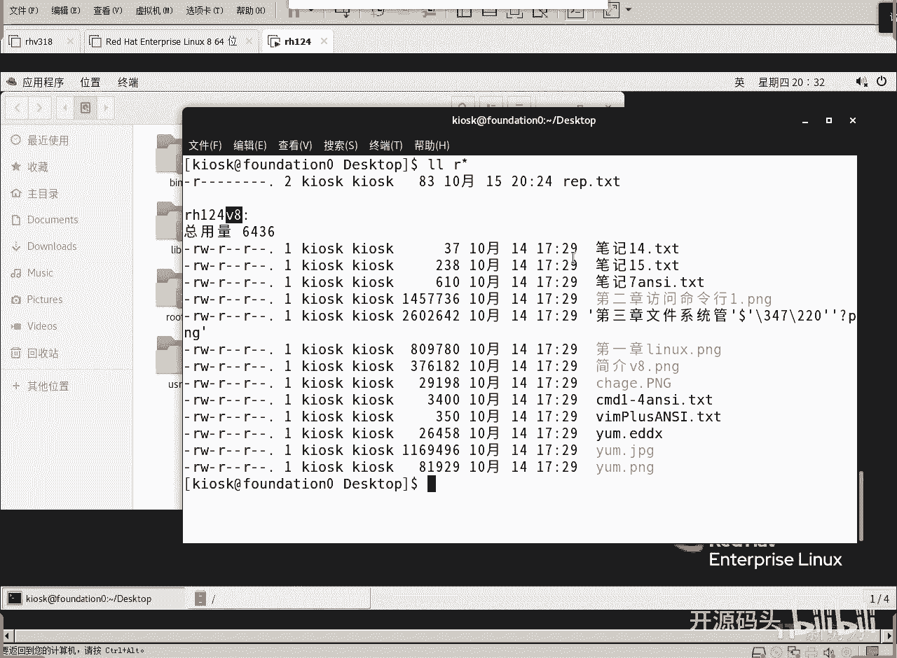
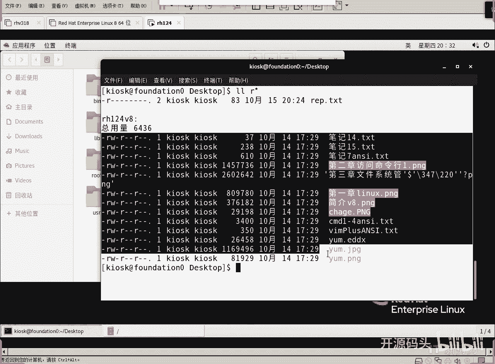
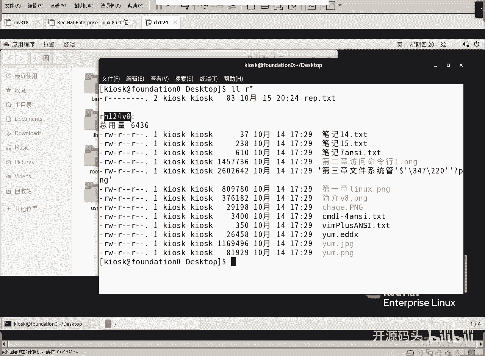
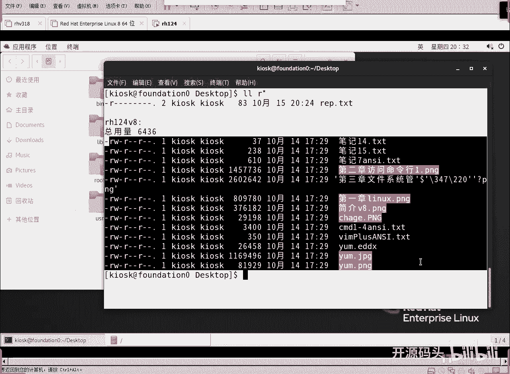
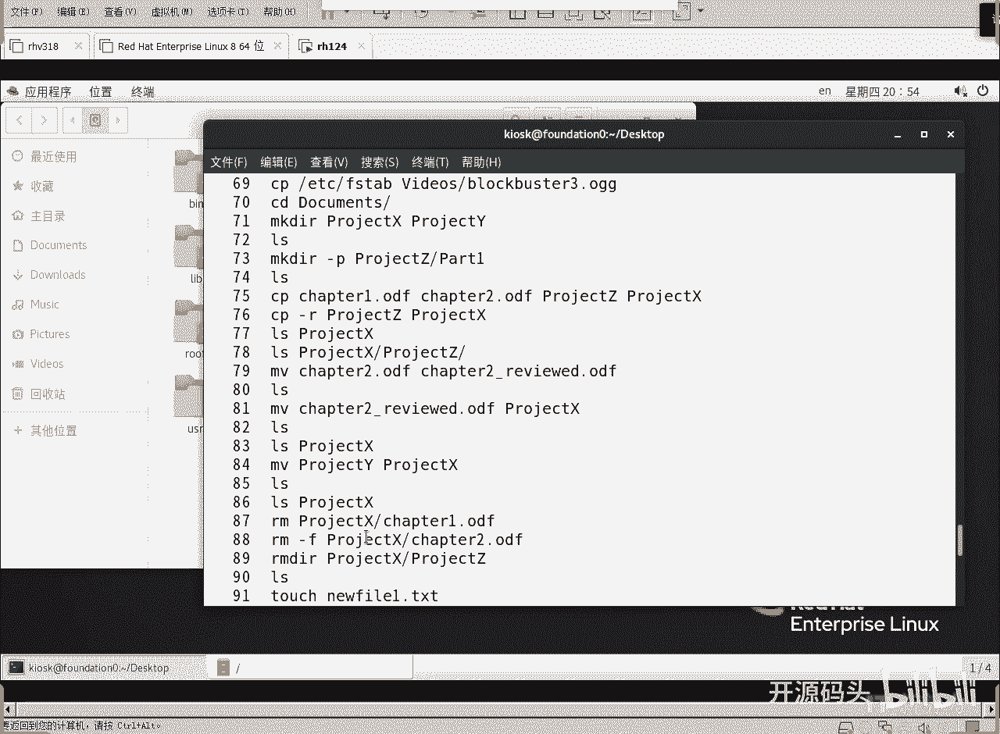
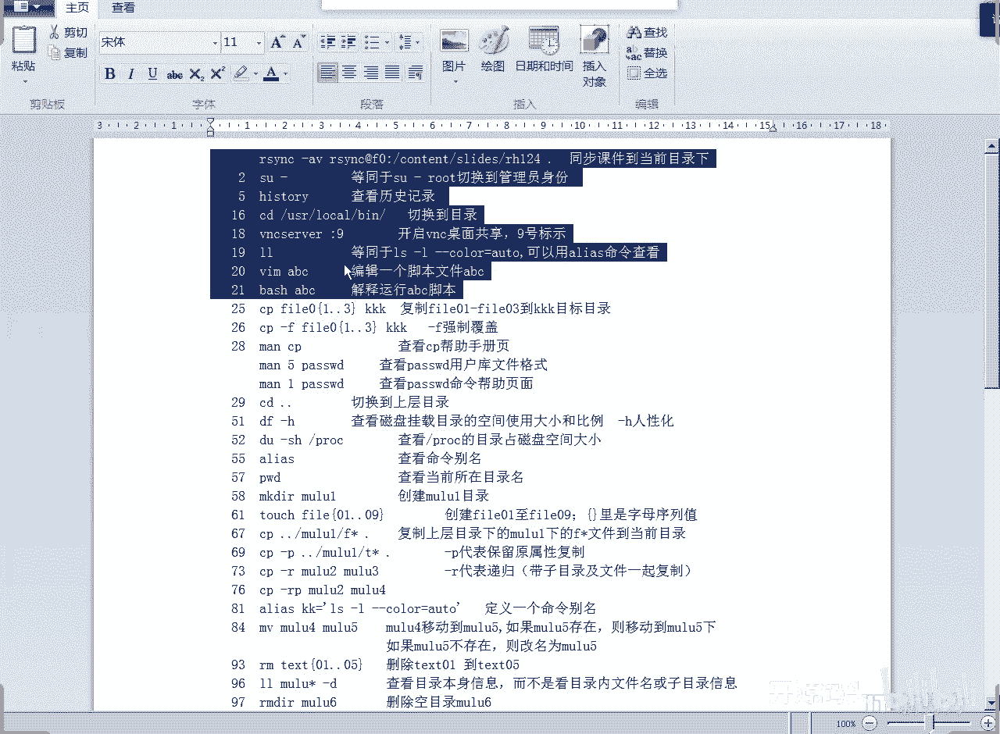
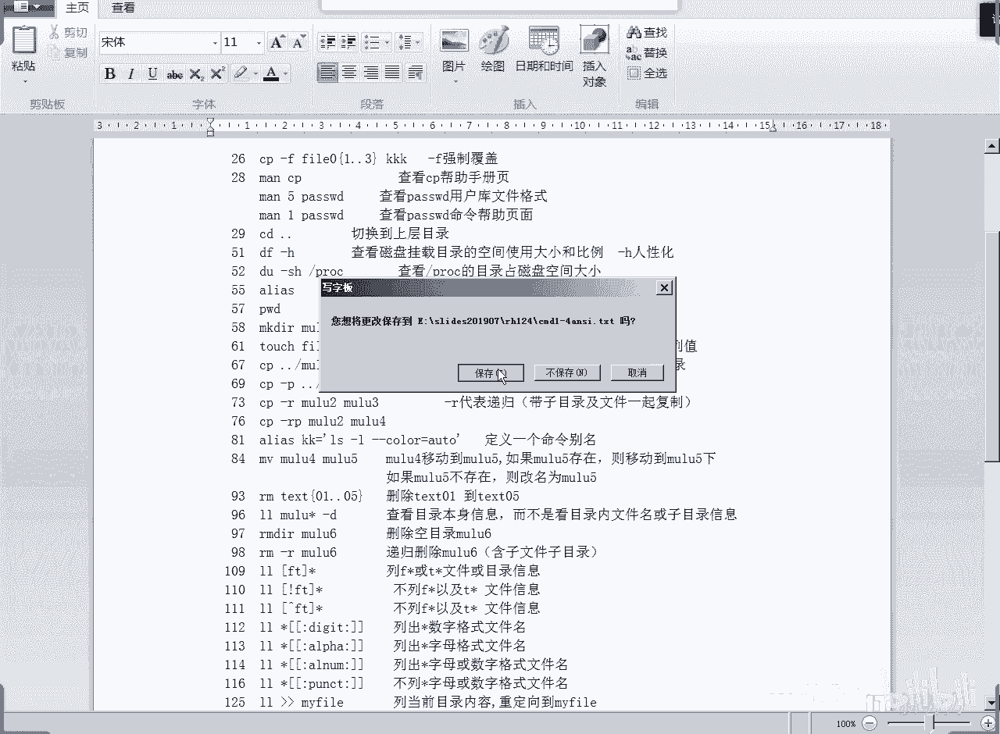

# Linux基础操作：4.2：通配符与命令替换 🎯

在本节课中，我们将要学习Linux系统中的两个重要概念：通配符和命令替换。通配符可以帮助我们快速匹配和筛选文件名，而命令替换则允许我们将一个命令的输出作为另一个命令的参数。掌握这些技巧能极大地提升在命令行环境下的工作效率。





## 什么是通配符？ 🤔





通配符是一种特殊的字符，用于匹配符合特定模式的文件名或字符串。它允许我们用一个简单的模式来代表多个文件，而无需逐一列出。

### 星号 (*) 通配符

星号 `*` 代表零个或多个任意字符。例如，`R*` 可以匹配所有以字母“R”开头的文件或目录。

使用 `ls` 命令可以查看匹配结果：
```bash
ls R*
```
此命令会列出所有以“R”开头的文件和目录。如果匹配到目录，默认会显示该目录下的内容。若只想显示目录名本身，可以加上 `-d` 选项：
```bash
ls -d R*
```

### 问号 (?) 通配符

问号 `?` 代表一个任意的单个字符。例如，`F?` 可以匹配像“F1”、“Fa”这样由两个字符组成且第一个字符是“F”的文件名。
```bash
ls F?
```
如果想匹配固定长度的字符，可以使用多个问号，例如 `R??` 会匹配所有以“R”开头且总长度为三个字符的文件名。

上一节我们介绍了基本的星号和问号通配符，本节中我们来看看更精确的字符集匹配。

## 使用中括号进行字符集匹配 🔍

中括号 `[]` 用于匹配括号内指定的任意一个字符。这是一种更精确的匹配方式。

### 匹配指定字符

例如，`[sp]` 表示匹配字母“s”或“p”。我们可以用它来查找文件名中包含“s”或“p”的文件。
```bash
ls *[sp]*
```
此命令会列出所有文件名中包含“s”或“p”的文件。

### 匹配字符范围

中括号内还可以使用短横线 `-` 来指定一个字符范围。
*   `[a-z]`：匹配任意一个小写字母。
*   `[A-Z]`：匹配任意一个大写字母。
*   `[0-9]`：匹配任意一个数字。
*   `[[:digit:]]`：同样是匹配数字（POSIX字符类）。
*   `[[:alpha:]]`：匹配任意字母。
*   `[[:alnum:]]`：匹配任意字母或数字。
*   `[[:space:]]`：匹配空格。

例如，查找包含数字的文件名：
```bash
ls *[0-9]*
```

### 取反匹配

在中括号内，如果第一个字符是感叹号 `!` 或脱字符 `^`，则表示匹配“不在”该字符集内的任意一个字符。
例如，`[!sp]*` 会匹配所有不以“s”或“p”开头的文件名。
```bash
ls [!sp]*
```

了解了如何匹配现有文件后，我们来看看如何“创造”序列。

## 使用大括号生成序列 {}

大括号 `{}` 的主要功能是生成序列或枚举列表，它本身不是用于匹配，而是用于扩展。

### 生成序列

使用 `{起始..结束}` 的格式可以生成一个从起始值到结束值的序列。
```bash
echo {a..f}
```
输出结果为：`a b c d e f`。
它同样适用于数字：
```bash
echo {1..5}
```
输出结果为：`1 2 3 4 5`。

### 枚举列表

在大括号内用逗号分隔各个项目，可以生成一个枚举列表。
```bash
echo {apple,banana,cherry}
```
输出结果为：`apple banana cherry`。

掌握了操作文件名和字符串的技巧后，我们进一步学习如何更灵活地组合命令。

## 命令替换与变量

命令替换允许我们将一个命令的输出结果，作为另一个命令的参数或变量值。

### 变量调用

在Linux中，变量用于存储信息。要使用一个变量，需要在变量名前加上美元符号 `$`。
例如，查看当前系统的语言设置：
```bash
echo $LANG
```
查看系统命令的搜索路径：
```bash
echo $PATH
```
`PATH` 变量中的目录由冒号 `:` 分隔。当输入一个命令时，系统会依次在这些目录中查找可执行文件。

### 命令替换

命令替换的语法是 `$(command)` 或反引号 `` `command` ``。它的作用是将 `command` 命令的输出结果替换到当前位置。
例如，我们想查找 `chmod` 命令的具体位置并查看其文件详情：
```bash
ls -lh $(which chmod)
```
这里，`which chmod` 命令先执行，其输出（即`chmod`命令的完整路径）会替换 `$(which chmod)` 的位置，然后 `ls -lh` 命令再对该路径进行操作。



### 转义字符

有时我们需要输出一些具有特殊含义的字符本身（如`$`），而不是使用它的特殊功能。这时需要使用反斜杠 `\` 进行转义。
例如，直接输出字符串 `$PATH`：
```bash
echo \$PATH
```
这样，`$` 就被当作普通字符输出，而不会调用 `PATH` 变量。



## 总结与练习 📝

本节课中我们一起学习了Linux命令行中的高效工具：
1.  **通配符**：`*` 匹配任意多个字符，`?` 匹配单个字符，`[]` 匹配指定字符集，用于灵活筛选文件名。
2.  **大括号扩展**：`{}` 用于生成数字或字母序列，或者枚举项目列表。
3.  **命令替换**：通过 `$(命令)` 将一个命令的输出作为另一个命令的输入，实现命令的灵活组合。
4.  **变量与转义**：使用 `$变量名` 调用变量，使用 `\` 对特殊字符进行转义。



这些概念是熟练使用Linux Shell的基础。初学者可能会觉得有些符号和规则陌生，但通过持续练习，你会逐渐习惯并欣赏其强大与高效。建议多在实践中尝试这些命令，例如使用不同的通配符模式列出文件，或组合使用命令替换来完成复杂任务。