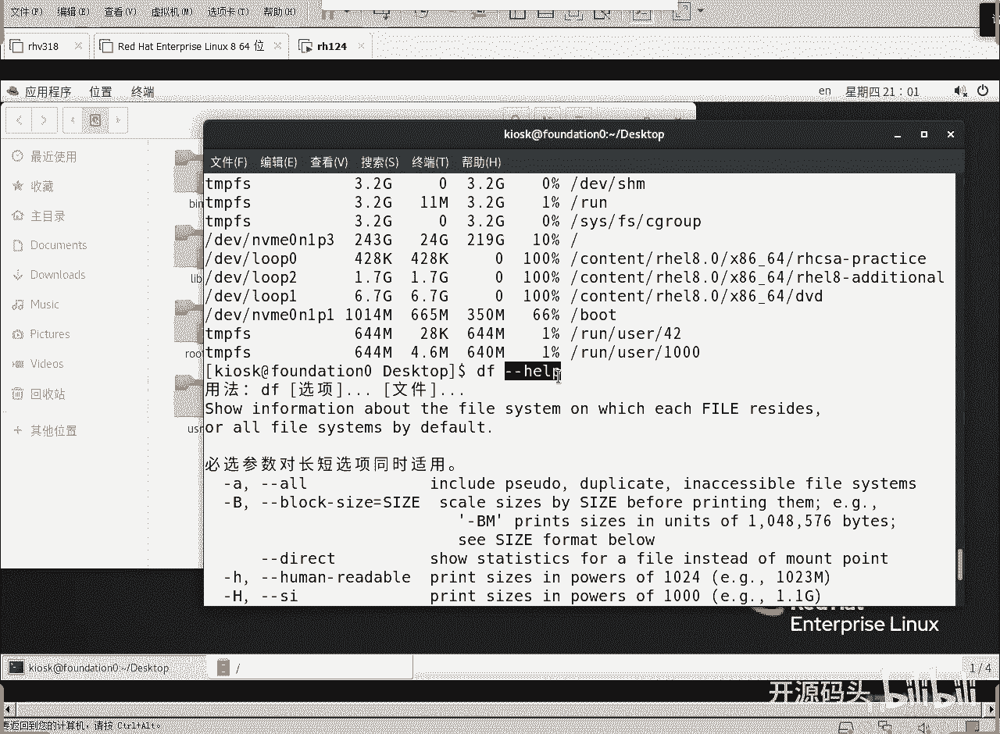

# RHCE RH124 之4.3 Linux自我帮助.mp4 - P1 - 开源码头 - BV1YP411j7wq

第四章什么意思呢，第四章就是我们可不可以自我学习，就是刚老师刚才讲那么多，每个命令都那么多选项是吧，刚才我们l l l的时候，我们加了一个选项叫做杠him呃，杠杠human或者叫杠h啊。

那这个意思就是以人性化的方式来显示文件的大小对吧，诶那这个东西你是怎么知道的，我可不可以自我探索。

完全可以啊，完全可以啊，我们来把linux里面的啊，就是常用的这种帮助自我帮助的这种工具呢给大家说一下，这样的话呢你不但可以啊，就当你看看我给你发的这个笔记啊，嗯1~4的笔记的时候呢，我。

记得用写字板打开啊，不要用记事本的双击，默认是记事本，对吧啊，你应该用写字板打开，写字板呢，它有换行符啊，那即使被打的时候呢，它不解释换行符，我刚才画的照呢没存吗，难道刚才我我打的不是那个文件吗。

第嗯一杠四一杠43d啊，哎哟，兄弟们，what字符集不一样啊，字符集不一样啊，我们用的是n n s i的啊，这个，啊一定要用，记得用写字板打开它啊，不要用记事本的啊。

记事本打的是呃那个没有换行符都不换行，每一个命令是这个命令很难看啊，好了呃，其实这里面也聊了啊。

这里面也聊了，就怎么样获得一个自我帮助呢，在linux里面可不可以自我学习呢，啊完全可以啊，比如说呃我有时候忘了给你告诉你们了啊，比如说我d s d f g h回车诶。

我给大家为了让大家看到我们这个硬盘的占有情况啊，占用情况啊，我呢用这个命令写了，但是我忘了告诉你是什么意思，你可以这么去做啊，呃df杠杠help，你会发现他的帮助竟然是中文的啊，他会告诉你查看信息。

关于这个文件系统啊，每一个呃就是链接上面的文件的，每一个已经链接起来的文件系统的使用情况，默认情况下是会显示所有的文件系统啊，你可以指定一个啊，你可以指定一个，也可以什么显示所有的啊。

我们如果不加明确指定的话，就是所有的所有已经挂在上面的文件系统了是吧，信息啊，然后杠h是什么意思，我们刚刚一个杠杠是什么意思，下面找一找a杠h等同于杠杠homa radio就是人性化打印。

size就是输出，这个是吧，大小啊用什么用，这个以1024为单位哈哈四为单位啊，你就说什么概念呢，人性化方式来显示，而且呢它除的是1024啊，它除的是1024啊，这个大h呢那是什么呢。

是除的是1000啊，除了1000，这叫大，这个是什么大k啊，下面这个是小k，也就是说呢一个文件或者是一个磁盘的大小是1k，是按1024算还是按1000算。

当然是它的大小除的是按除1000走的k一旦碰到k就是除的是1000，而这边除k的碰见k的时候除的是1024好吧，那还有别的好多啊，那每个项目作用是什么，是不是就可以得到一个帮助啊，啊得到一个帮助。

而且下面还有什么，下面还有一些版权声明对吧，这些东西呢我们就感觉嗯比较，就是呃呃当我们看到一个东西的时候，如果老师没讲或者是忘了讲，那你可以呢通过这种方式命令后面加刚刚help的方式来获得自我帮。

助，刚刚help。

那么有没有更详细的啊，甚至于开发文档类的东西让我们看到，那就是手册了，查手册查手册的命令就是手册啊，可不是男人啊，然后我们来看一下mdf，df其实就是desk free，就是磁盘的设计结余情况。

磁盘的剩余情况是吧，好menu没有，那么打打开头之后，你看啊，报告文件系统磁盘空间使用量诶，这是不是比这个cp解释的更加准确一些，这个命令属于什么，属于用户命令啊，然后这个命令的用法是什么呢。

df然后中括号代表可以选择啊，这个地方可有可无选项，然后呢可以有若干选项的重复，就是可以加好多选项啊，只要不不矛盾啊，然后呢对应的文件系统啊，对应的文件系统，然后你也可以后面罗列好多个文件系统。

对一个一个它都会给你显出来这个文件系统它的文字款使用情况，ok this is free啊，然后呢又更详细的啊，description对吧，有更详细的这个呃描述啊，只不过是英文的是吧啊。

那就是同学们英文有没有用啊，对吧啊，还是有很大用的啊，好选项介绍，看这个选项介绍和hp基本上是一样的对吧好难道就这些了吗，那我们再往下看版，除了版权声明之外啊，还有什么啊，cs是吧。

这个命令并没有给我们出那个呃example啊，有些命令呢还非常体贴的给我们后面加一个什么，加一个专门的项目叫example，所谓的example是什么呢，就是我这个命令的事例啊。

这个命令的例子怎么去用，慢用怎么退出啊，退出用什么呢。

用q linux里面绝大部分的这种有自己环境的这种红这种命令要退出，只要敲一个q就可以了，q代表什么，代表q u i t的缩写对吧，打个q就可以了。

打q就推出来了，怎么样移动，怎么样去找，怎么样翻页啊，找一个字符串是啊，打个n是朝向下再找这个再找一次字符串，打大写的，n是向上找。

再找一次，这个字符串怎么去做呢，继续演示几个命令啊，比如说mai is，你看首先ios代表什么，代表列出目录内容，然后就是opentation选项，那么这个operation这是中括号括住的。

代表你可有可无啊，也就是说这后面我们可以什么都不打的，l l s第一个中括号是可有可无的啊，第二个中括号也是可有可无的，那后面就可以不需要任何东西了是吧，也就是l os直接打了就可以看到效果。

那后面这个省略号代表什么东西呢，代表允许什么重复啊，允许重复的意思就是说你可以一次性写好几个选项，也可以一次性写好几个文件名或者目录名啊，你写三个文件名，它就会把这三个文件的信息给你显示出来。

你写若干个文件或者若干个目录，你就罗列出来就可以了，因为它允许你什么，允许你允许你把这个元素进行什么进行重复，这个省略号代表可以重复o好，那一大部分命令你就可以看懂了是吧，这个命令的用法无非就是ios。

然后加一些若干选项，后面可以加若干文件名或者目录名，这样的话呢就可以列出这个信息了，是不是ok好，这个解释也是很很，这就是人性化是吧，怎么样去快速的跳跃呢，好我现在就开始呃，说一下这个快捷键啊。

就在mu进来之后，首先你进来得退是吧，退的话就是q mu ios进来看l s命令的一个帮助手册，能你想退出就是q啊，这是第一个快捷键啊，好那如果说我们想往下翻怎么办啊，呃先往下翻很简单啊。

你可以一行一行翻，打回车，打回车就一枪按完啊，那还有什么呢，就是配置的呃打空格啊，空格是一页一页翻，那往前翻呢往前翻是呃back回敲一下b也就是说空格往下必往上对吧啊，这就一页页翻啊。

当然还有什么d是半夜半夜的啊，u是半夜半夜的，我相信很多同学他的目标并不是为了就是挨个去看，一页一页翻啊，他很有可能就要找一些关键字，那么找关键字的方法怎么找呢，诶我们可以打个撇儿，你就直接敲了斜杠。

然后比如说我想查一下呃排序的一些东西，shot，对不对啊，我要找salt这个关键字回车诶，它就自动跳跃到这个位置了啊，就有salt，那么找到shot之后呢，一看嗯，这个还不是我要的东西。

那你再打一下next，下一个下一个啊，就是打n就可以了，他就会把把我们的关键字挨个一个一个一个往下去找，直到你找到自己喜欢的那个东西为止啊，比如说我我忘了那个呃递归是杠小r还是杠杠大r。

那你再来一下撇杠r，我要找杠杆，不是这个杠r next a这个是吧啊，如果说再精确一些，我们前几天其实也学了啊，我明知道它是一个选项，对不对，那我就开始搜什么，搜这个开头是干啥的，怎么说。

撇开头杠r收不到，收不到原因是什么呢，开头还有空格呀，是不是开头是不是还有空格对吧，所以说我们准确的说法是这样，开头空格零个或者是若干个空格，然后加上一个什么呢，杠二，刚n下一个杠n下一个啊。

有些人说那那往回走怎么办啊，我后来往后看，往后看了，看不对，我又往回走怎么办，shift shift n就是大写的n是吧，你小写的n在现在是小写的情况下，按住shift n就往回走了，ok好呃。

这是那个搜索搜索的时候，用撇来搜你的关键字，搜到关键字之后，小写的n或者大写的n来上下找关键字啊，对还有两个快捷键，还有两个快捷键就是一下子到叶头，一下子到这个页面的最顶端。

或者一下子这个页面的最底端啊，怎么走呢，呃歌啊，这个歌按一下小g就到了页，就是页面的最顶头了是吧，那按住shift g啊，就到了页面的最底头啊，因为页面的最底下啊，你看它它除了那个呃帮呃。

像helper一样帮助的那些东西之外，还有什么呢，还有这些呃什么作者对作者信息，版权信息啊，以及相关的别的命令的信息对吧，跟阿拉斯相关的别的命令的信息啊都可以找到，所以说mu呢会比l杠杠。

help会稍微详细一些，其实我们作为一个技术人员最稳定的获取帮助的方法就是mu对吧，就什么按钮好，回忆一下，刚才我打了几个东西，刚才打了几个东西啊，小g大g是吧，还有p什么string加上小n和大n。

还有什么空格啊，space，空格加什么加呃b啊，上下翻啊，上下翻，其实还有个还有个那个半夜半夜翻的啊，半夜半夜翻的，我应该是d和u啊，d和u啊，小g是做什么用呢，到达帮助页面的最顶端，大g是做什么用的。

到达帮助页面的最底端啊，倒不是让你把这个大小写切换开啊，是你按住shift直接按小g，它就是大g了，按住shift键按小g就是大g啊，然后撇string就是找一个string。

然后n呢代表往下一个一个的翻这个string，我大写的n就是按住shift n就是往上一个一个的翻这个stream啊，嗯最后退出是什么q啊。

当然这两个啊space和b呢可以被替换成page down和page up，比如说我现在你想我想改一个，我想得到一个什么，得到一个帮助叫change honor，修改所有者，你看它的用法啊，它的用法呃。

change onor选项，然后所有者，然后可选的可以加一个冒号组，就是你既可以呃单独写一个owner，也可以写个什么呢啊冒号组可以两个都写，中间用冒号隔开，或者是呢冒号后面没有只写一个用户。

或者是冒号后面写个group这样去写，然后对这个文件，但是我问一下这个文件，这个参数可以少了吗，可以省略吗，不可以的啊，因为它没有中括号，看到没有，它没有中括号括住啊，这个参数是少不了的。

而且呢一次性可以改什么好几个文件或者目录的所有者啊，你要说这三个文件所有者都得改成张三，那么就是change order张三，然后呢文件一空格文件二空格文件三，当然我们也学了快捷方式了。

直接可以写什么文件，花括号一点点三，对不对，一次性把三个文件呢就就就把它改掉了是吧，后面就改掉了，然后再往下shift j我到最末尾了，是不是有啊，诶好奇怪，我说我要我想说的是什么呢，就这个东西啊。

exe啊，example一般在这个menu页面的最下面，shift这到最下面之后，example啊，刚才那个l s好像没有一个example啊，因为l s内容太多了啊，好example是什么意思呢。

例子呀，对不对，跟一个例子我们就照着用，对着猫画虎很快就会了，是不是好扣退出这around的啊，shift g到最末尾马上就可以找到example，甚至于什么，你要是对这个敲键盘不是很反感的话。

直接搜啊，e x a m example就搜到了啊，直接就搜到了啊，小g小g到达最顶端搜一个什么呢，example example回车，是不是example就出来了。

就可以搜到k几乎所有的menu这个命令哈，基本上都有个一个赞跑，这是一个非常好的一个呃帮助啊。

这个是我们的那个menu mu呢其实根据呃帮助内容呢。

它呃它的分类呢分了这应该是九种类型啊，应该是九种类型，也可以把它称其为九个章节呃，比如说第一个章节呢是用户命令啊，就是平常我们用的那些命令说明书啊，第二个章节呢是系统调用第三个章节库函数啊。

第四个章节啊，特殊文件的说明啊，第五个章节呢也用的也比较多文件格式，比如说很多配置文件的说明啊，第六个章节是游戏啊，游戏章节啊，这个已经淘汰掉了啊，第七个章节呢惯例标准和其他啊，第八个章节啊。

系统管理和特权命令啊，第八个章节呢是一些root的专用命令呃，第九章节啊，内核的a p i调用啊，那i函数的说明，所以说呢根据帮助内容的类型不同，把它们分到不同的章节，那么现在有个情况啊。

比如说有一个命令啊，他的既是命令啊，他还可能跟文件名呢通灵。

这个情况怎么处理，比如说我们有这么一个命令啊，叫什么呢，叫password，啊不但有这么一个命令，还有一个这个文件呢啊这个文件属于配置文件啊，比如说啊我们来看一下w h i c h啊。

p a s s w d我们能看到是不是在这个目录下有一个命令啊，啊然后我们再来看一下啊，配置文件，配置文件是在哪里呢，l l l e t c目录下p a s s w d一个是配置文件，一个是什么呢。

可执行命令它都叫p a s w d，这个时候我们去看的时候，他menu让我们让我们给我们看什么呢，回车你会看到它看到什么是用户程序，是用户命令啊，或者叫普通用户命令啊。

这这个这个是什么更新用户的授权令牌，说白了就改密码呗是吧，当然也可以改其他的啊，比如说密码的有效期啊等等等等，那么这个呢是呃属于什么第一章用户命令，他就给我们什么就给就给我们空过了啊。

而我想看的并不是他，并不是他，我想看的是他是这个配置文件，那我们看章节章节里面的配置文件是哪一张呢，啊是啊，配置文件是，第五章啊，第五章是文件的格式是吧，我想看的是配置文件的格式怎么写呢。

man第五章pa s w d回车看到了吧，这是e t下的p s w这个d这个文件啊，然后他会介绍这个文件的是吧，每个字段的每每一行里面每个字段的什么作用，我们就不详细说这个内容了啊。

我们只是要看一下什么，就说啊。

其实我们mu命令的完整用法是要加一个什么呢，加一个这个呃章节。

加一个章节，当然如果说你找记不得这个章节怎么办呢，没关系啊，我们直接不用写章节，但是不用写章节的时候呢，它只会只会给我们显示一个最小的那个章节，如果一章和五章都有，他肯定给我们写一章，如果五章和七章有。

那他给我们选第五章的，不会给我们选第七章啊，只会显示第一次的那个p sw d，还有啊还可以用什么呢啊。

还可以从呃，有些命令呢我们甚至于都什么都不知道这个命令叫什么。

我们知道这个命令可能有些什么功能，那我们可以这样去玩是吧，杠k杠k从标题和描述里面去查找一个关键字更大k的全文检索，全文检索是不是搜索的速度不能更慢了对吧，我们可以尝试一下啊，好ctrl杠k哎。

我们就找哪一个标题或者是描述里面带着这个p s w d的这个关键字，好吧，回车看到了吗，这些，这些命令都显示出来了，还有第八章的啊，第八章是什么东西呢，第八章呢是叫做特系统管理和特权命令。

这个属于特权命令啊，就是只有root可以用，别人普通用户是不能用的啊，一张的话是普通用户都可以用对吧，有这么多命令啊，以及他的描述里，他的概述里面都包含p s w d这个命令啊，这个关键字。

通过关键字是不是可以大致地找出跟这个关键字相关的命令以及描述，对吧，哎很呃非常的贴心对吧，我们不记得命令的话呢，我们就用杠k用关键字去找，他会把标题和什么和简介里面啊。

简介里面带p s w d的全部给我们显示出来，如果换成杠大k呢，shift k，全文检索啊，全文检索，嗯下一个啊查看回车，查看下个q退出回车再看q退出回车再看q退出啊，这个属于全文查看是吧。

如果直接想退出ctrl c看提示就好了啊，他会把我们就是整个介绍文件啊，比如说man j p a s s w d，包括底下这个描述全文检索啊，不仅仅是标题和简介，是标题和简介。

他会把所有包括后面所有介绍里面带有p s w d的全文检索啊，所有内容包含p全部给我们写出来啊，这样的话肯定量非常大啊，所以说我就直接中途退出了啊，看不出c中途退出了，这样看的话没完没了啊。

光看这个光看嗯，光看标题和描述里面有的就已经很多了啊，然后还要做一个全文检索，后面的一个example，乱七八糟全有的，所以说这个更多是吧，ok好啊，这是menu啊，其实平常呢包括考试的时候。

你you menu就够用了，但是实际上呢还有什么呢，还有一个更详细的叫p inf拼音符呢是以网页形式来显示的啊，只不过呢是命令行式下的显示啊，什么呃，空格下翻页啊，b是上翻页。

然后and是什么页面顶部底部，然后d呢回主题u去上一级回车进入一个主题，为什么要进入主题呢，因为它是网页形式的，就是超链形式的，所以说这个东西呢呃平常虽然它比mu可能会更细一些，大部分都比玩游戏啊。

但是呢呃因为用起来呢比较繁琐，所以说呢呃menu的u使用率会远远高于p音符啊，我们可以尝试一下好吧，比如说ctrl p inf啊，d f还看它好吧，回车诶。

你会看到这个解释呢会比我们mu里面看的更加的什么详细啊，那我们呢可以，上下翻页啊，上下翻页，然后呢等你的光标定到某一个，你看看到红绿变化了吗，光标定到某一个特某一个项目上的时候呢，我们就可以回车进去啊。

回车就去练，跟超链一样啊，就进得下面内容，如果想回去打一个什么u回上一层啊，或者打一个d直接回到最顶层，直接回到电影最顶层啊，p音符是一个什么呢，更加详细的一套帮助，这个帮助呢会写的更多。

但是我们感觉到他更繁琐，所以说呢用的并不是很多啊，退出还是q拼音符啊。

拼音for的用法呢，那我们也有啊，嗯这个地方你可以去查试去使用一下，大部分和上面是一样的，但是呢因为他有什么他有超链接啊，它相当于把整本这个帮助手册全部一次性可可以给我们显示完啊，如果打d的时候呢。

其实显示的就是我们linux里面所有的拼音符，然后呢我们可以一个一个往下走，走到我们喜欢的位置，我们打个回车就进去了，那打回去之后要好翻回去，那就是什么u啊，打个u就翻回去了啊，嗯凹凸是吧。

进入或者是凹凸啊，嗯你多多去跟踪。

多去操作一下，感觉就找到了，虽然是网页，但是它是什么，是文本型的网页啊，所以说实际上嗯如果能做成那种html的网页的话，那个就比较理想是吧，但是没有啊，那平行否又有比较繁琐，所以说呢其实使用率并不高。

使用频率最高的就是mu啊，我们考试的时候，如果你记不住东西，当场可以做menu，为，为什么呢，因为我们安装任何软件的时候，它都自带什么自带这个命令手册，几乎所有的命令啊都带命令手册。

我们只需要用mu去看就可以了，可以看到我们非常非常多的东西啊，好还有一个最后一个什么呢，最后一个就是开发文档资源目录下有个共享目录，有个doc，doc底下呢就多下任何一个开发者。

只要他愿意让你知道的更多，他都会附带一些什么开发文档，甚至于源代码，那我们都可以从这个d o c下找到软件名，软件名以及版本号，然后进去里面就会有它的开发描述。

就是开发者对这个软件的所有的开发描述都会写到这里，所以说这个东西更详细是啊最详细了啊，所以说我们可以啊由简到繁，慢慢的去深入的去了解一个命令的相关的内容，对吧啊，linux因为是全世界的开发者都在里面。

全世界的社区都在里面做开发，而不是某一个公司，所以说所有的东西都必须遵循一个标准，包括帮助都是有标准的，所以我们就可以用这个统一的帮助规则去查看，几乎所有的命令的帮助信息，最多用的就是命令。

刚刚hp和menu这两个使用频率非常高啊，然后呢这平方的频率不高啊，这个频率高不高呢，这个频率也高，为什么高呢啊，因为我记得当时我学那个dns的那个阶段的时候。

从市场上根本找不到dns的更很深入的这种描述的数啊，但是后来意外的发现了这个目录下有个有的一个呃，dns的一个呃软件名的目录，然后里面呢进来各种各样的example啊，太棒了是吧。

我们直接把它的这个example还带的解释，我们把它复制粘复制过来，然后呢根据解释去做一些小小的微调啊，我们把dns学得很彻底，书上不讲的啊，市场上并没有的这些文档。

我们都可以从u s i s t d o c下去，于是去找到啊，所以这个东西是非常有用的啊，最下面这种方式这个嘛因为这个几乎都是作者自己闹的啊，就是这个东西非常完美啊。

所以说这里头最不多用的其实是就拼音for一个东西，因为mu可以完全是吧和它类似啊，虽然说没太详细，但是基本上可以达到啊，可以提示我们的目标对吧，诶帮助系统啊，获取帮助，linux里面怎么样去自我帮助。

怎么样自我学习，我们第四章就告诉大家了是吧，当然一开始呢你学习的这个阻力是很大的，因为你就跟单词的词汇量一样是吧，一开始那个命令量啊，命令的词汇量还很少，所以你得操作起来感到这个举步维艰是吧。

慢慢的慢慢的我们第一本书差不多的时候，大家找到感觉了，而且呢习惯于使用刚刚help menu，这个时候你会发现a如鱼得水啊，就是完全不需要什么啊，什么时候卡在那动不了啊。

我们完全可以用mu的方式自我帮助啊，很快就会找到相应的东西啊，呃这个东西说到这儿，微软就差很多了是吧，微软微软天生不想让你知道，他就是不想让你知道它里面有些什么东西，老是在那躲躲藏藏是吧。

很多东西都给你说的模棱两可，而linux呢啊开发者的它是一种开源的这种这种精神是吧，他他总是希望你掌握的更多智慧呢，互相共享分享分享智慧，所以说我们在另一个用的时候。

你会发现你的不管是linux本身也好，还是考虑思思考问题的方式方法都会发生变化，而你在windows里的时候就是依赖依赖依赖啊，如果没有人可以依赖，就撂那没法动了。

但linux里面你可以完全不断的去探索下去，ok因为时间关系，我们只能讲这么多了，好吧啊啊下一次课呢我们继续讲后面的东西啊，帮助会使用menu加命令就可以了，然后呢在里面找自己喜欢的东西，怎么找呢。

加个撇，加个字符串就可以找啊，然后找到之后呢，呃如果关子很多，你可以下一个下一个next next n n n n对吧啊，呃按照这个橙色的字体去操作啊，橙色的自己去操作，你会发现慢慢的慢慢的你就会习惯。

ok好，今天我们就到这里吧。