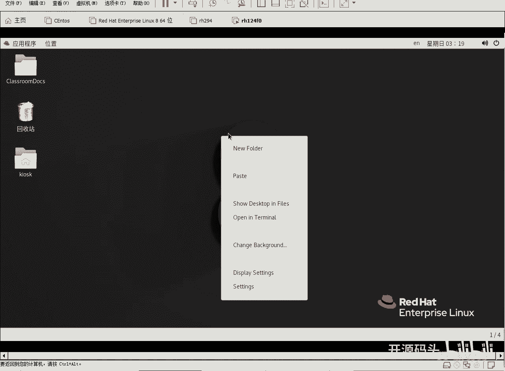
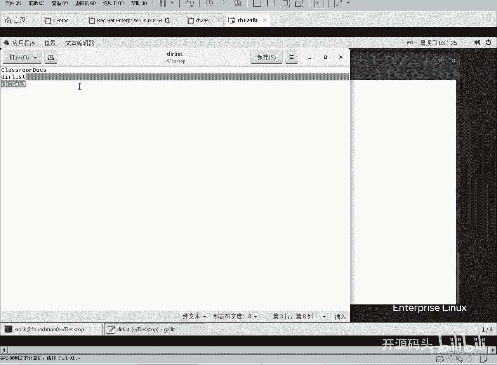
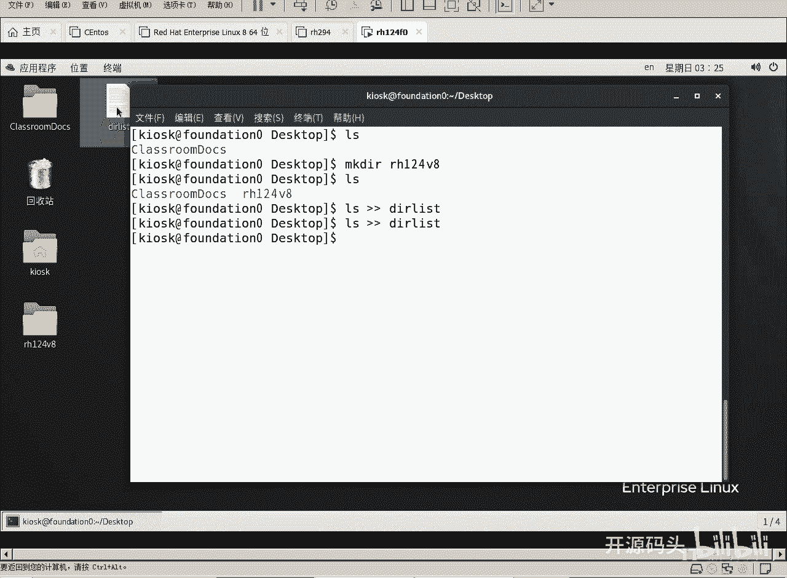
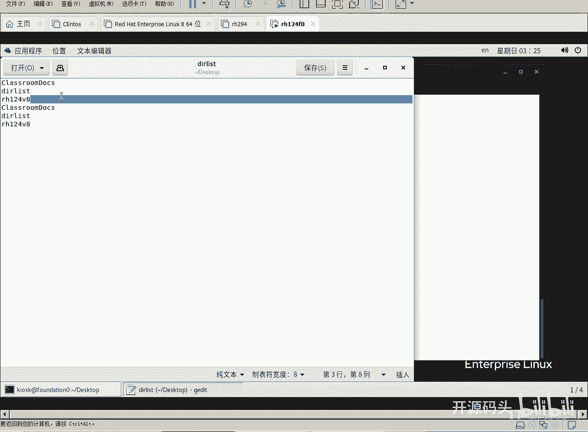
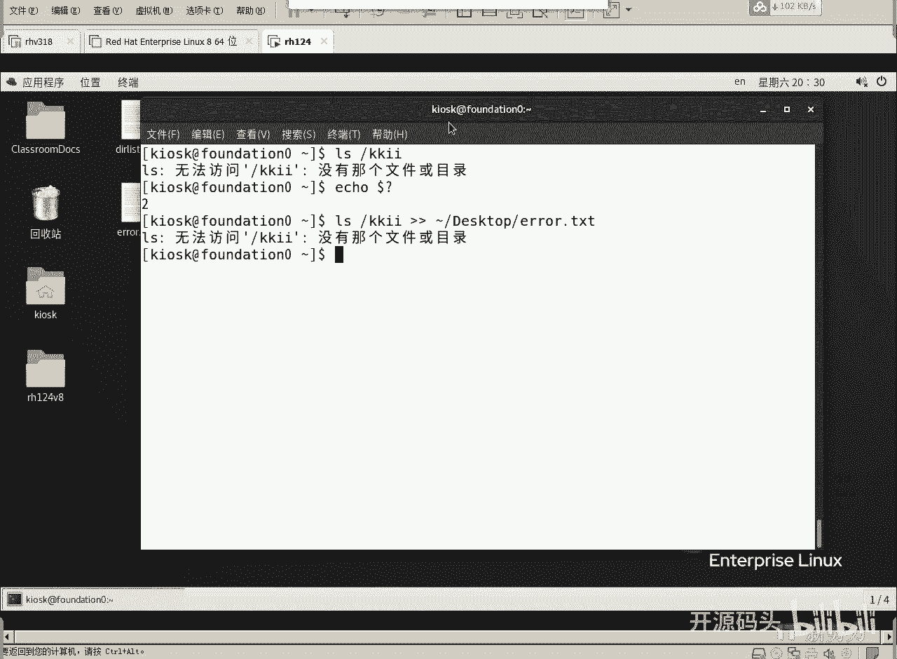
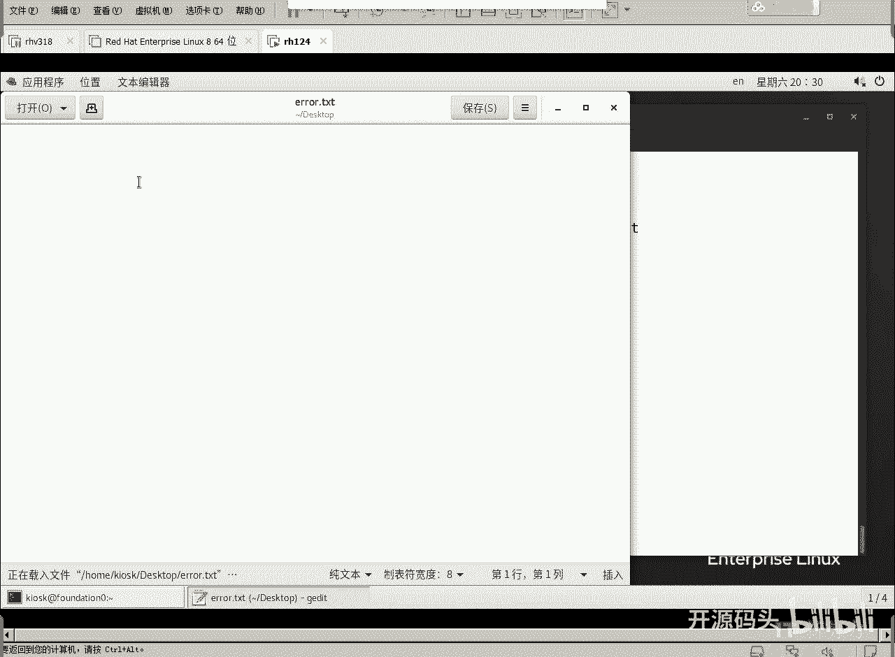
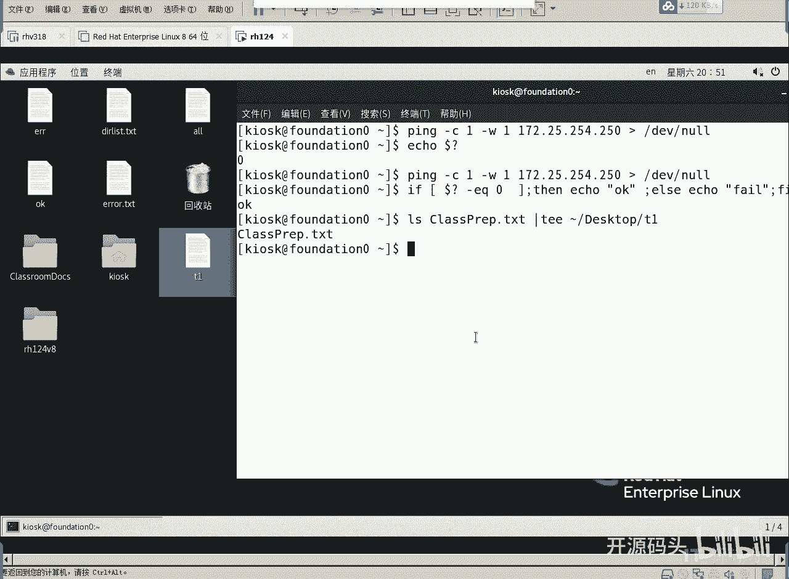
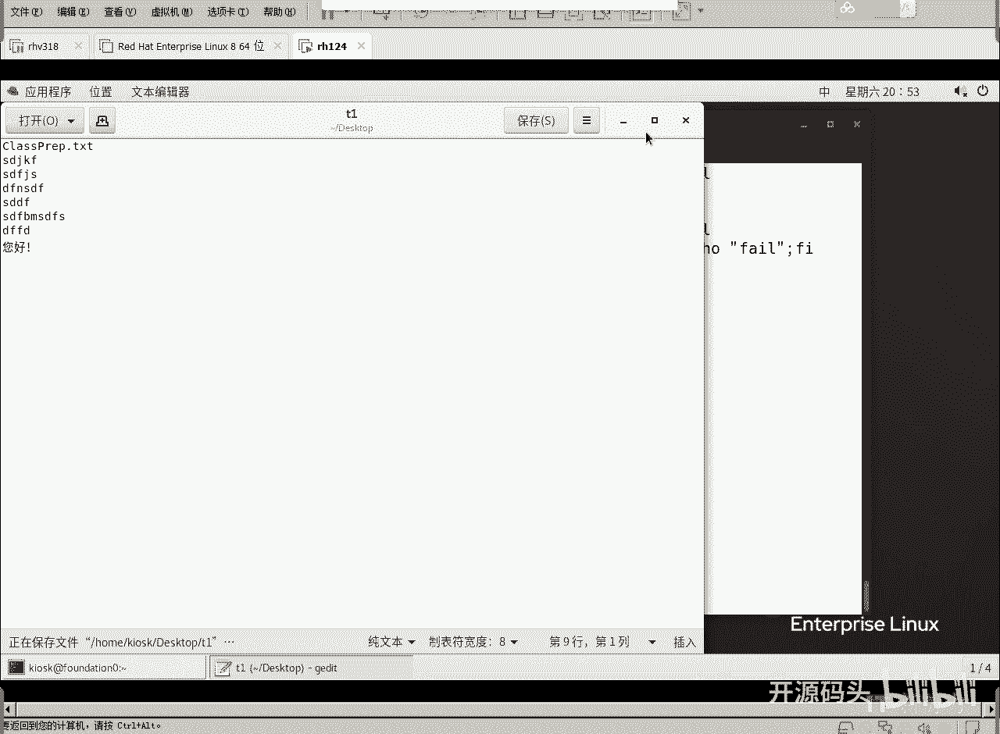
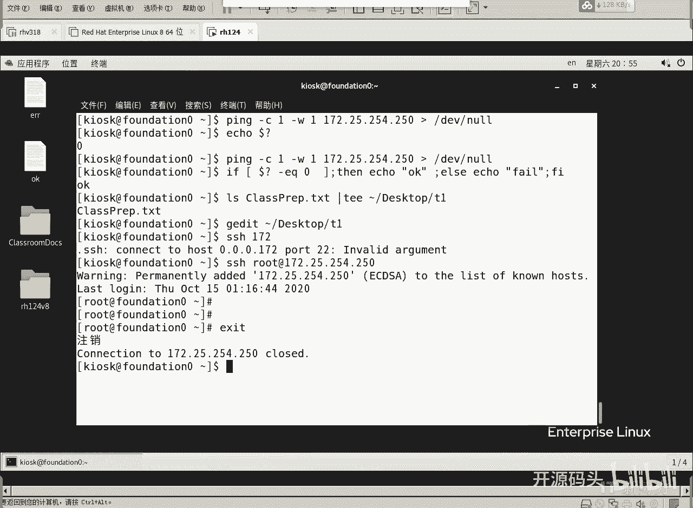

# RHCE RH124 之5.1 Linux重定向.mp4 - P1：5.1重定向.mp4 - 开源码头 - BV1Q14y147FM

好，我们来看第五章啊，对文本文件进行操作啊，创建显示编辑对吧？对文件进行操作啊，我们呢计划讲三个不同的方法啊，就是说呃第一种呢是重定向啊，呃，本来呢我们在运行linux命令的时候啊。

命令的输出是输出到屏幕上的。现在呢我们可以把这些命令的输出给它用重定向的办法。啊，让这个输出呢存成一个文件，这样的话呢我们就可以呢持久性的保存这个命令的输出，对吧？当然我们也可以去编辑它。

OK这是重定向的方法，把本该输出到屏幕上的内容啊，重定向到文件里面。那么第二个方法是什么呢？图形界面的编辑器G editit啊，这个前提是我们的图形界面必须打开，它只能运行在图形界面里面。啊。

呃类似于我们windows里面那个写字板或者是记事本。啊。第三个啊就是类unux系统里面啊，包括呃unixlinux，还有这个甚至于这个呃。苹果的那个IOS系统啊，里面呢都有这么1个VIM编辑器。啊。

这个变器呢呃。就是普及率很高啊，但是它呢是基于文本的编辑器。不需要图形界面。呃，所以说呢它里面的编辑呢需要用很多快捷键。啊，我们要记很多快捷键。但如果说我们一旦记住这些快捷键之后呢。

我们的操作效率会大大的高于纯图形界面的这种编辑。啊，所以说VM啊，在我们这节这个章节里面一定要把它。掌握手链。啊，后面所有几乎每一个章节里面只要涉及到文本操作的地方。我们几乎都用VIM来做了。啊。

OK好，就这么三个。我们先来看第一个重对项啊。我们用户跟计算机进行交互的时候啊，就要涉及到输入和输出啊，正常情况下啊，输入无非就是键盘鼠标，对吧？啊，输出呢？正常的话就是终端，就是我们的显示器。

我们根据这个输入输出的内容的类型不同。把他们分成不同的通道。我们把它分为三个啊，第一个是标准的输入啊，第二个是标准的输出，第三个是标准的错误。也就是说我们的错误呢呃会单独的使用一个通道。这样的话呢。

我们就可以把那个正确的信息和错误的信息呢给它区分开。啊，OK我们来看一下啊。好，空白处点右键打开一个终端。

啊。比如说我们现在呢呃。我现在是桌面的目录是吧？KLSK用户在桌面目录上好，我们LS看一下啊，当前目录下呢只有一个class room啊，其实就是桌面上这个啊这是系统图标啊。

这个也是就是表示当前用户的加目录啊，这两个是系统图标啊，然后呢这个呢就是我们看到的这个自己的目录啊，我们也可以再创建一个目录。比如说makeDR2啊H124。啊V8。啊，创建个目录啊，这个目录呢。

自动就会出现在桌面上，对吧？啊，我们可以看一下LS。啊，如果说我们想把桌面上的这些目录名都记录到一个文件里面，而不是显示到屏幕上重对下了L。一个监括号代表覆盖式啊，就是目标文件里如果有内容。

他就会把原来的内容覆盖掉啊，两个监括后呢是追加式。如果原来文件里呃有内容，他就会把新的内容呢追加到原来的内容后面。啊，我们现在呢这个文件还没有，对吧？我们可以先创建一个文件，比如说嗯呃DIRlist。

啊，然后后面呢就会显示出来，对吧？后面就点list双击打开。你看。啊，他把DR list本身。这个文件这个文件名啊也放进来了是吧？他把原来我们已经存在的两个目录名。

以及它这个文件本身的名字都已经放在了这个文件里面。

这就是什么？叫做重定向，对吧啊。看正常应该输出到屏幕上的东西。它没有了啊，但是呢被输出到了一个文件里面。这个时候呢既创建了新文件，而且呢文件里还有内容，对吧？啊，如果我们再来一次。哎，双击打开。

你看。内容有两两遍吧，因为我们用的是双间括号，是追加式的。原来的内容不动，后面呢再追加啊吧？如果再用一个间括号呢。

这个就成了一个什么了？覆盖式的，也就是说它只留第三次的，前面两次的都没有了，因为它是被覆盖掉，一个监括号就代表啊，原来文件里有内容不管啊，用新的内容直接覆盖掉。所以说呢这里面就成一份了，对吧？

内容就成一份了。这就是所谓的充电线。啊，通过重对象来生成一个新的文件。好，我们回到这个呃加目录是吧？下面我们再来说一个问题啊，刚才呢我们呃我们做的内容呢都是正确的信息是吧？如果说错误信息它会怎么样？

错误信息会不会和正确的信息在一个通道呢？对吧我们可以看一下这个doer问号这个变量。啊，那么我们在linux里面啊，所有的变量的前面都用啊这个钱的这个符号do了来引出啊。

那么do了问号这个变量是什么意思啊？就是前面这个命令它的执行结果是正确还是错误？零代表正确啊，非零呢。就是错误的类型。啊，那我们看到了这个错误类型是二是吧，这个二代表什么？

代表没有我们要找的这个文件目录啊，像这种错误的提示。怎么样能够把它也重定向到一个文件里呢？好，我们再来试一下，好吧嗯。LL根录下一个不存在的目录啊，随便就让它产生一个错误，对吧？好。

我们要把它要把它呢啊重定向到啊，比如说加目录下面的desktop桌面底下的一个什么一个L。我我知道这是个错误，对吧？ar点T3T，我要把这个错误输出过去。但是你会发现一个问题，TXT看一下啊，回这。

这个错误文件的确是产生了，对吧？双击打开。

里面有记录的错误信息吗？没有，但是我们翻回头看屏幕的时候，你会发现这个错误的信息它还会在屏幕上出现。这就说明我们用常规的重定向，并不能把错误信息重定向到一个文件里面。这是为什么呢？因为错误的信息呢。

其实它的通道是不一样啊，错误的信息它的通道是不一样的。我们来看一下这个这个概念啊。标准的输入通道啊，标示的是键盘鼠标，这个是什么？标准的输入standin input吧啊，然后标准的输出。

我们之前用LS查看桌面上所有的文件和目录，这是一种没有错误的正常的输出，这个叫标准输出啊，这个会显示到终端上。啊，但是还有一种什么呢？是错误。我们把标准的错误也输出，但是它啊它很显然和标准的输出一样。

它是在也是显示到终端上。但是当我们重定向的时候，默认情况下，只有标准的。输出会被重定下，而错误呢不是不在一个通道里面。把标准的输入称为零号通道，把标准输出称为一号通道，把错误呢称为二号通道。

所以说从一号通道出来的东西是可以重定向的。2号通道出来的东西，如果你不明确写出其通道号的话，是不能被重定向的。一号通道的信息输出重定向到一我们的目标文件里。这个一可以省略啊。然后如果说你想输出错误。

那就应该是什么？对，2号重电下就可以了是吧？二号重电下来看一下啊。好，那我们现在重定下的时候加个什么？加个2号通道。明确一下啊，如果你不写，它默认是一号，就是标准输出嘛，对吧？好，现在回车哎。

屏幕上有没有提示错误，没有。然后我们来看一下是不是写到了文本里面。是不是写到了文本里面了，对不对？好，这充分说明啊，虽然呃错误信息和标准的输出啊呃默认都会显示到终端上，但是实际上它的通道是有标记的。啊。

我们这样做是属于一号通道的信息重立向。那这样呢是二号通道，一呢可以被省略，二不可以省略。所以说你要想把错误也重立向的话，就得用它。啊，就是2号信息重定下。那有些人说，不管你是一号2号，我都想把它输出。

啊，你比如说我们这样去做LS。啊，呃LS当前目录，我们从当前目录里找个东西吧，比如说呃。呃，我们就显示这个吧，class pre prep是吧？好，ctrl。LS。Classs。Pp。好。

这个面然后再显示根目录下来KKII。这显示两个内容的时候，第一个内容是不是显示的很正常？对吧class paper这个命令是显示的很正常的啊，这也就是说，虽然同时出现在屏幕上的内容有两批内容啊。

但是这两批是有通道来是吧？通道来区分的啊，屏幕上区分不出来，但是它的通道是可以区分出来的啊，我们可以这样去做啊就是。呃。我们把这个正确的信息啊重定向到哪里呢？OK文件啊。

我们还是重对向到拨到加目录底下吧。dessktop底下啊OK文件。啊，然后2号信息。把它重新找找。加目录下面的desktop。啊，一个什么一个fim。或者ar吧。ar这个信息是吧？哎。

就是说呃这个一我们可以省略，也可以不省略啊，我们是不是不省略会感觉更好一些啊。一。就是把标准输出输出给OK文件，而把错误输出的输出给er文件。回车。啊。

你会发现呢我们的呃不管是错误的信息还是什么正确的信息，它都没有在屏幕上显示，而是呢进行了重对象。那我们看一下啊，先看一下错误信息，是不是里面只有错误信息，再看一下什么OK这个文件。

这个文件里是不是只有正确的信息。是一输出给。正确的信息2、输出给什么错误的文件呃，输出给正确的文件啊，正确的信息输出给OK这个文件，而错误的信息。输出给什么ar这个。这样的话呢我们作为一个基本的命令啊。

它有可能会输出错误，也有可能会输出正确的值。那正确值是一号通道的信息，而错误的值是2号通道的信息。我们分别可以通过一和二的这个区分啊它充进向到不同的文件里面去啊，把它的结果生成不同内容的文件。好吧。

那如果说我们想把两个同时呃收到一个里面了，也很简单。啊，我们这。就写一个什么写一个拢共。Yu。啊，这个鱼的操作其实就是哎合起来合起来到到一个什么文件，到一个，比如说到一个or文件。然后我们ca一下哦。

啊，看了一下那个什么啊啊，就是。桌面里面的稿是吧？你会发现啊这个文件里面既有错误信息，还有正确信息。啊，因为我们用了一个什么鱼鱼就代表什么一余二就是一和二合起来放到一个。重电现在一个文件里面啊。

就是这里面所说的啊这个。呃，鱼。啊，那这里面还有个东西就是说。把二重定向给一。如果你把错误信息再重对向给一号信息的话，是不是就变成正确信息了呢？对，没错啊啊，就是这个可不是当瑜假，这个当位置甲啊。

这个当位置一就是2号通道重定下到一号通道。啊，如果你写个直接写一的话，它是认为是一文件名是一，就是把错误的重定向到一文件里了。如果你写个余一，那就意味着什么？把2号信息合并到一里面。那么这个意思呢。

因为一我们是不是可以省略的一合并到哪里？2号信息里面，也就是说把这个是把错误的重定向成正确的信息。然后这个是把。正确的重叠下给什么错误的信息。啊，合并的意思把二并个一里面。

我们应该用什么例子来体验一下这个感觉啊，体验一下，就是说哎我们把这个本来的错误信息把它转换为正确的信息。你这样的结果呢。呃，列出这个正确的和错误的信息，然后呢把二合并到一里面。合并一里面以后。

这里面输出的两行信息就全成了标准的输出了。嗯，都是标准输出，虽然它是错误信息，已但是已经把错误把错误的信息合并到什么，合并到。正确的信息里面了。啊，我们能不能再重立向重立向到呃1个A1。啊。

这体现不出来是吧？这样这样他是先做这个，然后再做这个的啊，我们这种这种多多个这种重对向操作是从右往左开始做的啊。你看先做的这个是吧，先把这个做了啊，然后再做到前面这个。啊，不管错误的信。

你看这个是是不是一类信息到A一。但是在此之前应该把二已经与重兑向到一里面了，是吧？因为他这个做这个命令的时候啊，这个重对下命令是从后是从后往前开始做的啊，所以说这样做是不行的是吧？这样做就可以了啊。

把先把错误的信息重兑下给标准信息，然后再把标准信息重兑下给A一。当我们看A一的时候，A一错误标错误和正确的都有，为什么都有呢？其实在做这一步之前，他们已经把错误的都变成正确的。

所以说最后A一里面显示的都是正确的信息。啊。就他是这么个逻辑，对吧？他这么个逻辑。OK呃，换动片没有说啊，但是呢我们如果你要做实验啊，应该知道一下这个概念。好吧，哎，先做后面的才做前面的。

从后往前去做的啊。但这个结果是没有问题的，是吧？结果没有问题，那就是说把错误输出给正确的值，然后直接把正确值输出给A一，那你会发现错误的也在里面，因为在此之前的错误值已经变成正确值了啊。

就是把二合并于合并到一里面。啊，把二把二的这个错误输出，把二号通道的错误输出合并到一通道里面。啊，他就这么个理解法啊，我们可以把这个东西下，就是呃重内向合并到合并于一。啊，这是重定向的用法。

当然这种用法多不多？没有，几乎没有啊，我们只需要知道一下，有这么一种复杂用法就可以了啊。但是实际用途就是我们一般就是像这个样子就比较好了。啊，像这个样子就比较好，就是什么意思啊？

就是呃标准的输出导成一个文件，重定下一个文件啊标准的错误呢哎重定向为另外一个文件就可以了。对吧啊。这是我们所谓的一个充电线啊。那我们来看一下我们的呃重定向的一个理论基础啊，就是标准的输入是零号通道。

标准的输出是啊呃一号通道，然后错误的标准的错误输出是2号通道啊，那我们可以用这个方式来区分它好吧，那还有一个啊就是呃第一位线是no啊，第一V向no呢是一个什么设备呢？是一个无底洞。

有很多东西呢我们不想看它的输出，我们直接把它扔掉就完了啊。比如说你看一下我们这个这个例子啊，就是说呃比如说我们要拼。比如P172哎呦拼一个值啊，比如说拼1个F0这个机器。咦，F0啊，它竟然解释不出来。

不应该的啊。P17172。25。254。250这个机器。啊，这个pin的结果是不是很明显，这就是代表的是。拼通了是吧，SMP的序列每次都是通的啊，而且呢返回时间都有是吧？cttrol C。

中断啊看到C己中断，我们正常的拼是这个样子的啊，我现在呢想用编程的方法去拼。比如说。我去拼还去拼这个机器啊，还拼机器。但是我拼的时候呢，我带上这个选项。比如说我拼的时候呢啊拼只拼一次。啊。

就是杠C代表countt拼的次数是一次。然后呢，杠W等一秒。如果在一秒之内你给我回应了，我就认为你是通的啊。如果不是啊，就不通。那这个时候我们回车看一下，是不是它只拼一次。只有一行就退出了啊就退出了。

然后最后得到一个结果，对吧？这个东西我用编程的时候，我用我的编程去解释这个东西吧，觉得很烦啊觉得很烦啊，呃，怎么办呢？我刚才我们刚才聊过，如果一个命令正常执行了，它的翻回值到了问号。是不是就是零？

对不对？那比如说我们拼一个不存在了，比如说25呃拼一个。21。你看疫秒拼不通，它也退出了，它就等一秒啊。然后我们再来看一下这个翻回值，返回值是不是就不是零了，变成一了，是吧？

所以说我们可以用判断这个翻回值的办法就可以知道它通还是不通啊，我们就免得去解释这些东西了啊，解释这些输出，那怎么办呢？我们这样。啊，还是p那个刚才那个250。

然后呢把pin的结果给它直接重定向到no里头。你会发现很干净，什么都没有。然后我们去看这个翻回值就对了。哎，反有这是零芝不就意味着。我们这个。呃，上面这个命令的执行结果是正确的。对吧。呃，我们用。

判断的方法可以直接输出啊。如果中括号里面是判断的条件，前后加空格。如果到了问号。杠1Q0，如果是等于零的话啊，那我们Z。输出啊输出O。输出1个okK啊，否则呢。ECHO1个什么？fi。好，然后呢s。

这个语法呢是我们的脚本的语法。而这个语法呢，我们呃逻辑上跟我们的C语言是一模一样的。如果翻回值是零的话，就输出1个OK啊，否则就输出一个什么fin。

然后fo就觉得就把这个呃if判断语句的执行结果就扩住了是吧？好，回车看一下啊。是不是它显示1个okK呀？这就达到了我们就是说不用解释输出内容，直接只用这个命令的一个翻回值来判断结果正确与否的一个办法。

如果我们测到它在线，那我们后续的这个什么黑客攻击啊，乱七八糟就就跟上了，是吧？哎，这就是所谓的呃。我们是呃这个重定向的一个什么用法之一啊，就是把它把把那些乱七八糟的输出全部都给它转到什么。

转到无底洞里面啊，不让它在屏幕上显示。但是它有什么返回值，我们判断一下返回值是零的话，就代表这是成功的。对对。OK好呃，这个就是所谓的。诶。重定向的一些呃用法的一个事例啊，那我们在这个幻灯片上呢。

基本上可以看出来啊，标准的输出呃，标准的错误，然后合并的错合并的就是呃输出和错误合并起来的重定向，对吧？把二重定向到一就是把错误值也重定向成正确值，然后再把这个呢。正确值定向为错误值。啊。

哎这都是都是一些常规的用法。如果说我们在编程的时候想输出一段错误错误的结果，那你输出错误结果的时候，最好是把它重定向到于这个二里面。这个时候呢。从外头看到的这个内容，其实就是错误信息了啊。

错误信息它就是从这个通道出来的。从standed的 error这个通道出来的那这个时候别人去验证这个错误信息的时候，也能验证出来啊，这是错误信息。啊，就是把标准的信息重兑现成错误的信息。啊，这个相反啊。

把错误信息重新下为正确的信息啊啊或者是把这个呃输出内容呢直接重新下到什么？路里面啊重叠下这个里面就就就不显示到屏幕上什么都没有了啊，最后还有一个命令叫T啊，T这个命令的意思呢是什么呢？就是三通。

它不但可以重定向到一个呃目标人文件，那，还可以重定向到屏幕上啊，就三通了啊，一般是我要不通到文件里，我就通步到终端上。我现在呢可以把它重通到这个呃通到这个终端里面去啊，呃就是既可以呃重定向到文件里。

还可以重定向到终端里。就说终端上也能看到那个内容啊，文件里呢也被内也也内容也覆盖进去了啊。呃比如说这个命令我们可以这么去做啊。呃。LS。嗯。L class。我们传给这个T。啊，传给T以后呢。

T这是一个三通码啊，我们给它通到呃先通到加目录底下的desktop下面的T一这个文件里，好吧啊，然后呢啊我们传给他之后呢，他收到这个东西之后，他不但要呃传给这个呃就发送给这个文件，还发送到屏幕上。

对吧哎，那我们再来看一下桌面上的T一在不在。在这里吧，T1打开。是不是里面也有个列出的文件表？对吧啊，屏幕上也有。这个文件里也有，这就叫什么三通头。我们把这个输出的结果啊重定向到这个文件里的时候啊。

本来是用监括号重定向的对吧？现在我们是三通，不但要重定向文件里，还要把它重定向到屏幕上。啊，T呢就实现了这个目标啊，我们马上叫三通头啊三通头啊，三通头就是把。把正常的是把这个我们上一个命令的结果啊。

既把它传送给文件，又把它发到屏幕。啊，这样他就实现了三通是吧？OK好，这个T命令呢呃平常的用途好像也不是很多啊。

好，这是我们这一章的第一部分啊，第一部分就是重定向的概念。我们通过重定向呢可以得到呃。可以把一个呃命令的这个输出结果。直接给他。重定向到一个文件里面。从而呢。这个文件就有了内容了，是不是？好。

下面我们来看这个第二部分啊，第二部分是什么呢？就是对一个文本文件进行编辑。啊，一个最简单的文本文件的编辑办法呢是什么？是G editit。啊，JD等候于我们windows里面所谓的那个。

图形那个叫什么写字板啊，写或者记事本啊，G意entit。加目录底下的desaskt下面的TE这个文件是吧？回车。这就打开了是吧？打开之后呢，我们是可以直接对它进行编辑的。如果想写汉字呢，写汉字啊。呃。

windows键super键加上什么空格切换到中文输入法。这个地方啊我我切换，你再看一下那个地方。对不对？这是切换输入法。切换成中文输入法，然后呢，你好。你好。啊。啊呃。想写什么写什么呗，对不对？好。

保存关闭。

OK这是一种最基本的一个呃编辑器啊，但是它必须基于拖形模式。而我们在实际的管理过程当中呢，实际在管理机器的时候呢啊也很有可能就是远程的登陆到一个呃比较说是你看我们的腾讯的服务器。呃。

有很多文章你们都介绍过是吧？腾讯的服务器在哪里是不是在贵州的那个很多深山里面，还有那个呃阿里的服务器在哪里阿里服务器什么在什么湖底下啊，海底下啊，谷歌的服务器在哪，谷歌的服务器什么在什么沙漠里面对吧？

啊，这些地方的地皮就不值钱啊，几百台几万台的东西往上摆就行了啊，然后呢有的就在山洞里面啊，听说这个腾讯有很多机器是在贵州的那边呃那个山洞里面放的啊，就原来废弃的那些军用的山洞。

他们就很便宜的价格他们拿回来之后呢，就可以把它服务器放在里面，山里面我们都知道啊，冬南夏凉空调都不需要啊，可以省很多电啊，所以说他他们用了那么这些服务器里面的内容怎么样去远程维护啊，对吧？一般都是什么。

SSH。啊，因为远程服务器里面很很有可能是根本不会有图形界面的，它有图形界面，又没人在那里直接搭上显示器去看那个服务器的界面。他为什么要拖形界面是吧？所以说我们远程的去登录，对吧？

比如说SHH远程登录1个172。172。25。254。250对吧？远程登录一个。这个IP地址的机器。啊，这种登录过去以后呢啊我们是。呃，最起码是么它是图形界面是很少支持的。当然我们可以支持啊。

比如说我们加一个杠杠X，我们就可以支持图形界面了啊。但是我们平常的图形界面几乎用的很少。所以说我们登录过去，哎，你看。已经登录过去了啊，EXID退回来啊退回来了啊，这这种登录的话呢，只有这个文本界面。

在文本界面的情况下，我们如何去实现编辑呢？

那就是VI。