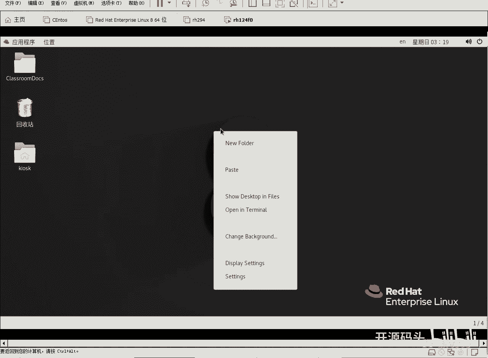
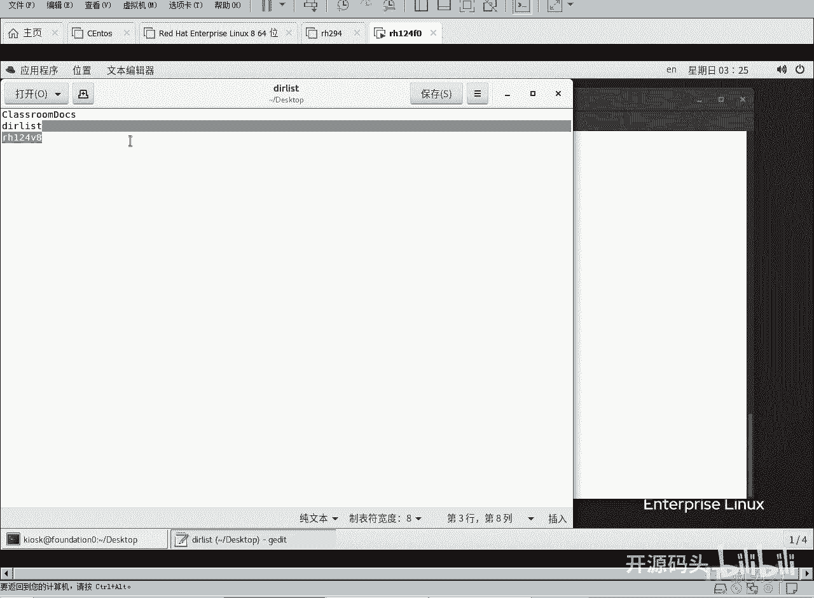
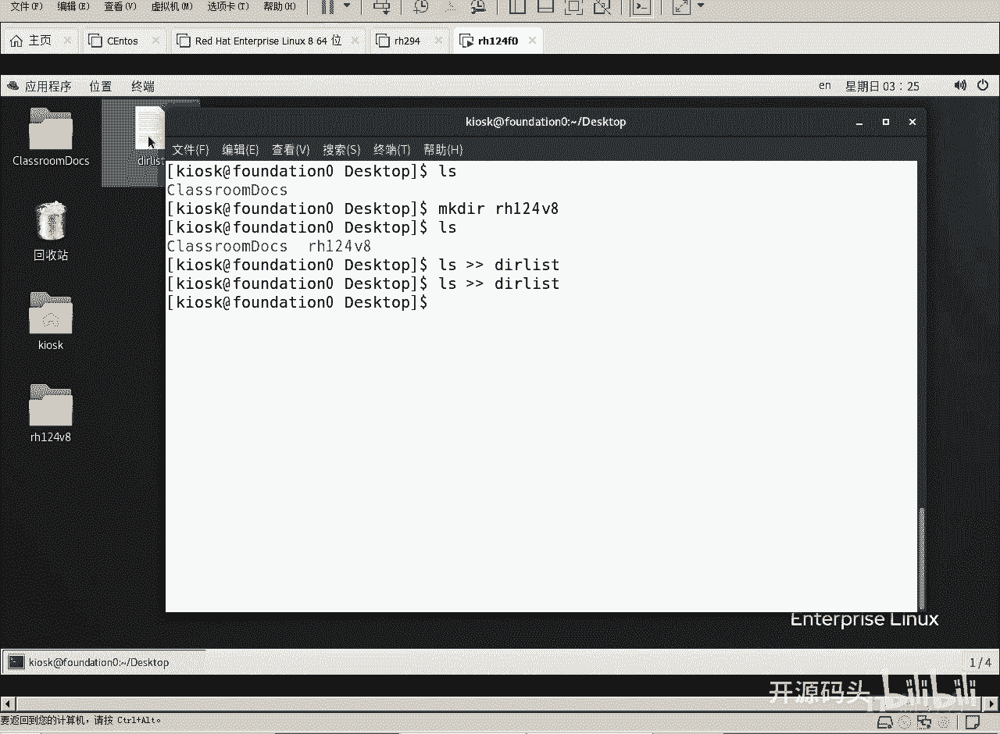
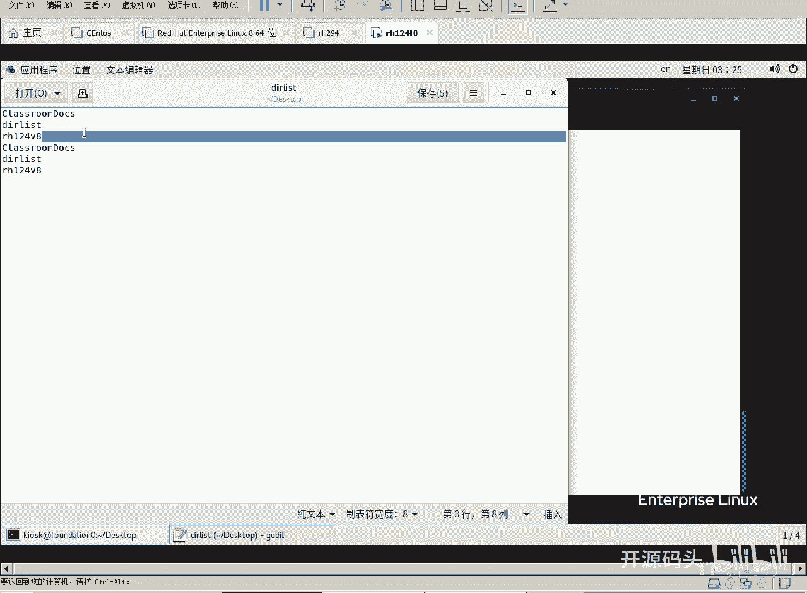
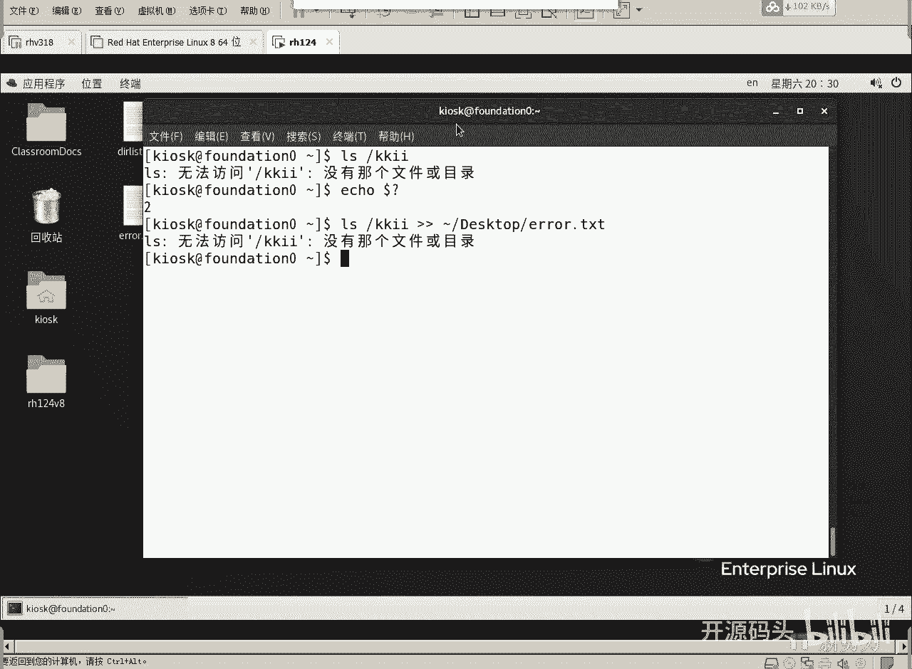
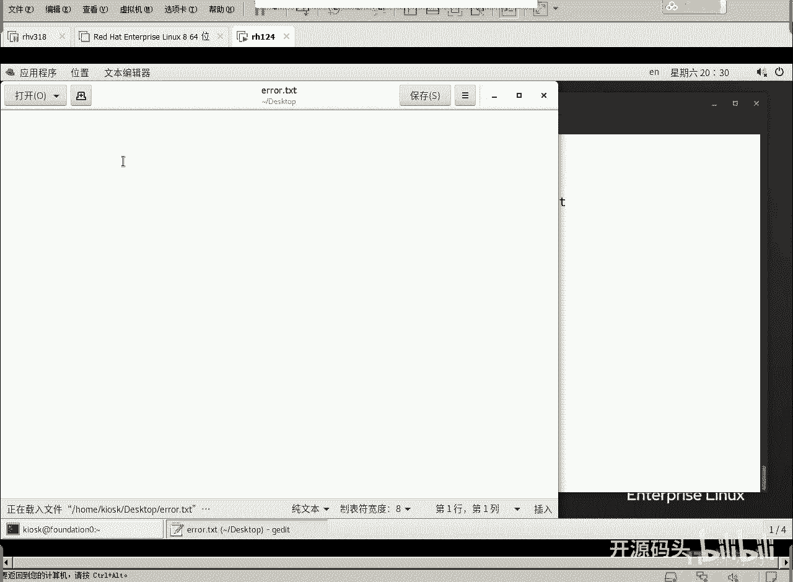
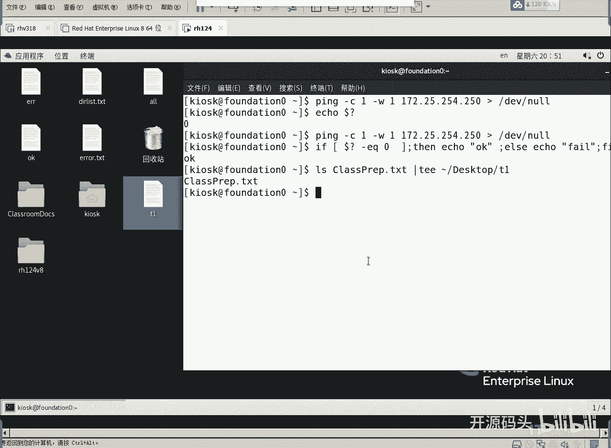
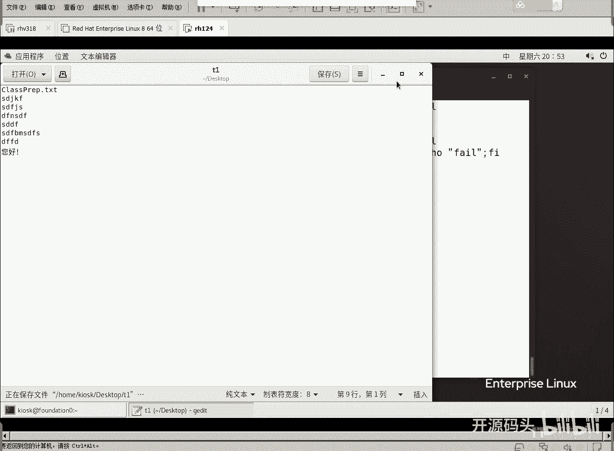
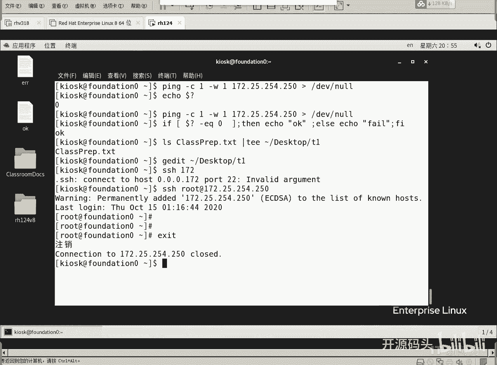

# Linux文本操作：5.1：重定向 📤

在本节课中，我们将要学习Linux中一个非常基础且强大的概念——重定向。通过重定向，我们可以改变命令输入和输出的默认方向，例如将本该显示在屏幕上的命令结果保存到文件中，或者将文件内容作为命令的输入。这是后续进行文本处理和系统管理的重要基础。



## 输入与输出通道

上一节我们介绍了文本操作的三种方法，本节中我们来看看第一种：重定向。要理解重定向，首先需要了解Linux系统如何处理输入和输出。



用户与计算机交互时，会涉及输入和输出。根据内容类型，系统将其分为三个标准通道：
*   **标准输入 (stdin)**：通道号为 `0`，通常指键盘输入。
*   **标准输出 (stdout)**：通道号为 `1`，通常指命令的正常输出，显示在终端屏幕上。
*   **标准错误 (stderr)**：通道号为 `2`，通常指命令的错误信息，也显示在终端屏幕上。





默认情况下，标准输出和标准错误都会显示在屏幕上，但它们是独立的通道。重定向就是改变这些数据流的流向。

## 输出重定向实践





现在，我们通过实际操作来理解如何将命令输出重定向到文件。

在终端中执行 `ls` 命令，结果会显示在屏幕上。如果我们想将这些结果保存到文件中，可以使用重定向操作符 `>` 或 `>>`。

以下是重定向操作符的用法：
*   `命令 > 文件`：将命令的**标准输出**覆盖写入指定文件。如果文件不存在则创建，存在则清空原有内容。
*   `命令 >> 文件`：将命令的**标准输出**追加写入指定文件。如果文件不存在则创建，存在则在原有内容后添加。

例如，将当前目录列表保存到 `dirlist.txt` 文件：
```bash
ls > dirlist.txt
```
执行后，屏幕不再显示列表，但 `dirlist.txt` 文件中已保存了 `ls` 命令的输出内容。

## 区分标准输出与错误输出

上一节我们实践了标准输出的重定向，本节中我们来看看如何处理错误信息。默认的重定向只针对标准输出（通道1），错误输出（通道2）仍会显示在屏幕上。

例如，尝试列出一个不存在的目录：
```bash
ls /不存在的目录 > output.txt
```
你会发现错误信息“ls: 无法访问...”仍然出现在屏幕上，而 `output.txt` 文件是空的或只包含其他正确输出。

为了重定向错误输出，需要明确指定通道号 `2`：
```bash
ls /不存在的目录 2> error.txt
```
此时，错误信息被写入 `error.txt`，屏幕不再显示。

我们可以同时重定向标准输出和标准错误到不同文件：
```bash
ls 存在的文件 /不存在的目录 1> ok.txt 2> err.txt
```
*   `1>` 可简写为 `>`，将标准输出写入 `ok.txt`。
*   `2>` 将标准错误写入 `err.txt`。

如果希望将标准输出和标准错误合并重定向到同一个文件，可以使用 `&>` 或 `2>&1`：
```bash
ls 存在的文件 /不存在的目录 &> all_output.txt
# 或等价的写法
ls 存在的文件 /不存在的目录 > all_output.txt 2>&1
```
`2>&1` 的含义是将标准错误（2）重定向到标准输出（1）的当前位置（即 `all_output.txt` 文件）。

## 特殊重定向：/dev/null 与 tee 命令

除了重定向到文件，还有一些特殊的用法。

**1. 重定向到 `/dev/null`**
`/dev/null` 是一个特殊的设备文件，可以看作“黑洞”。任何写入它的数据都会被丢弃。这常用于隐藏命令的输出，只关心其执行状态（通过 `$?` 变量判断，0表示成功，非0表示失败）。
```bash
ping -c 1 -w 1 some_host > /dev/null 2>&1
if [ $? -eq 0 ]; then
    echo "主机在线"
else
    echo "主机离线"
fi
```

**2. 使用 `tee` 命令分流**
`tee` 命令像一个“三通管”，它从标准输入读取数据，同时将数据写入文件**并**输出到标准输出。这对于既想保存输出日志又想实时查看屏幕的情况非常有用。
```bash
ls -l | tee file_list.txt
```
执行后，`ls -l` 的结果既显示在屏幕上，也保存到了 `file_list.txt` 文件中。使用 `-a` 选项可以追加写入而非覆盖。

## 图形编辑器 Gedit 简介

在掌握了重定向生成文件后，我们自然需要编辑它们。在图形界面下，最简单的编辑工具是 `gedit`。

`gedit` 类似于 Windows 系统中的记事本或写字板，是一个图形化的文本编辑器。使用方法非常简单：
```bash
gedit 文件名
```
然而，`gedit` 严重依赖图形界面。在实际的服务器管理、远程登录（如通过 SSH）或没有图形环境的情况下，我们无法使用它。这就需要我们掌握更强大、更通用的命令行文本编辑器。



## 总结

本节课中我们一起学习了Linux重定向的核心知识。



我们首先了解了标准输入（0）、标准输出（1）和标准错误（2）这三个数据流通道。然后，我们深入实践了如何使用 `>` 和 `>>` 重定向标准输出，以及如何使用 `2>` 来重定向标准错误。我们还学习了如何用 `&>` 或 `2>&1` 将两者合并重定向。

此外，我们介绍了两个特殊技巧：将输出丢弃到 `/dev/null`，以及使用 `tee` 命令同时输出到屏幕和文件。最后，我们简单了解了图形编辑器 `gedit` 及其局限性，为接下来学习全能的命令行编辑器 Vim 做好了铺垫。



重定向是Linux中组合命令、处理数据、记录日志的基础技能，请务必熟练掌握。