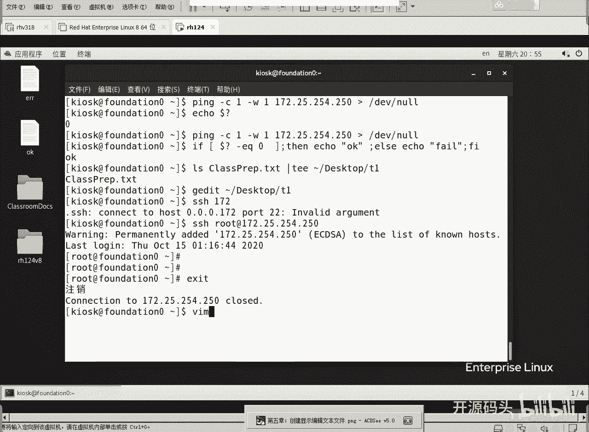
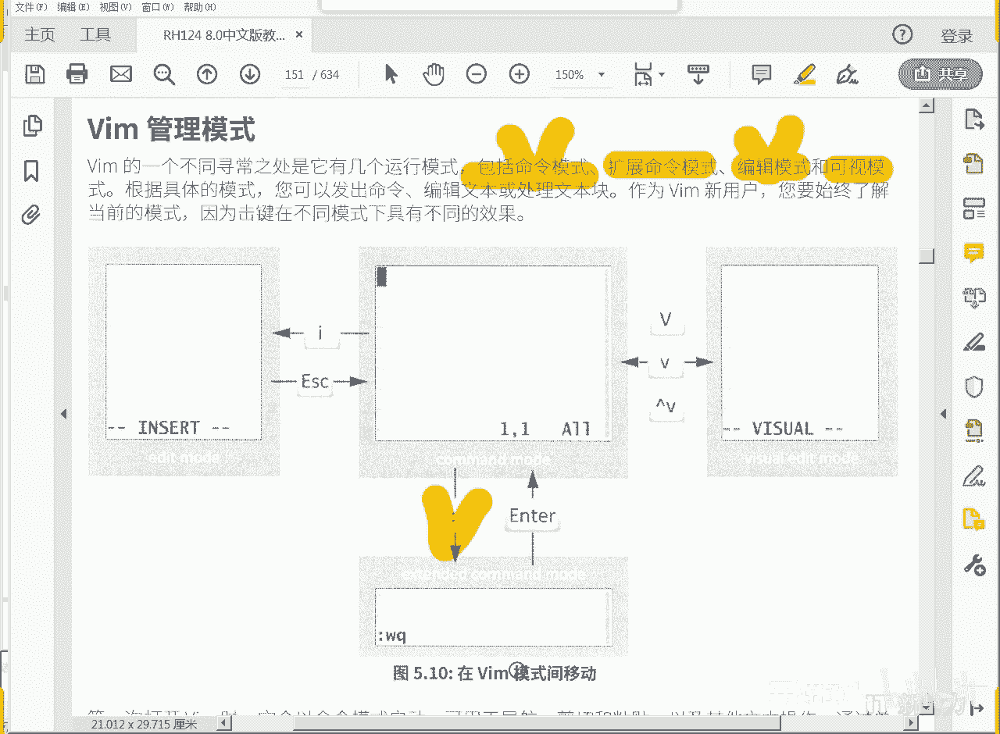
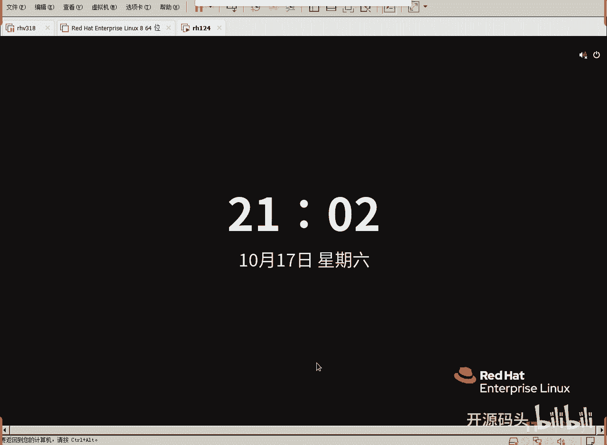
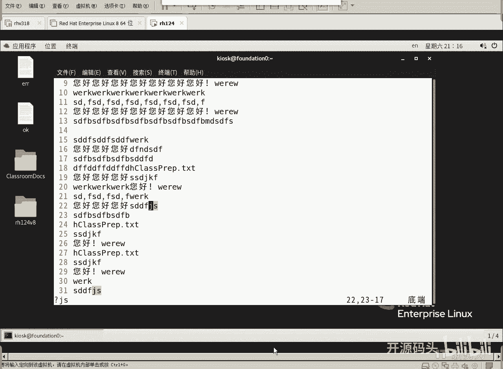
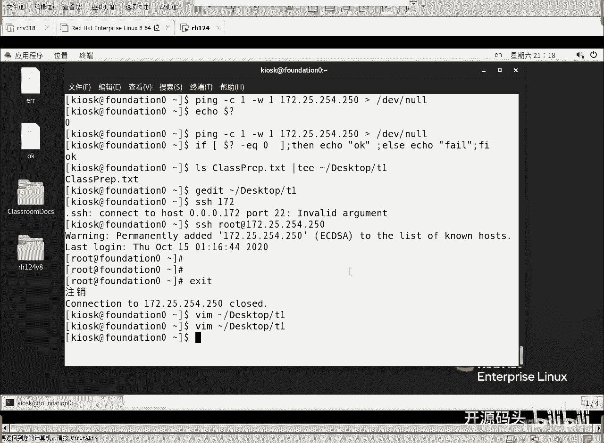

# RHCE RH124 之5.2 Linux vim.mp4 - P1 - 开源码头 - BV1At4y1n74q

啊，VIM这个编辑啊，它只它这个编辑呢是一个基于呃快捷。快捷键那我们把它就就称为快捷键吧啊称为快捷键的一个呃所谓的编辑工具啊，它里面呢要记，我们要用它，必须记很多快捷键才可以啊。

才可以用的非常的得心应手啊，所以说一般人没有人引导的情况下啊，用VIM还是比较难的啊，还是比较难的。那么我们现在呢呃这样啊，我们VIM呢简单的看一下它的规律啊。

呃，其中有一个什么呢？有一个VM的一个向导啊，VM向导呢就是呃VIto啊这个命令。这个命令打完之后呢，我们通过这个呃HGHGKLHGKL我们打游戏的人应该是很熟悉的是吧？

这个是我们打游戏的几个移动键方向移动键啊啊，向导帮助啊，这里面呢就会呃告诉你呃VM应该怎么用，你可以尝试着敲一下什么键，会看是什么反应啊，他会有一个呃就是边边解释边让你去敲的一个过程。

那我们呢进当然也是希望大家去。尽快的去掌握这些快捷键啊，这里呢我把这个快捷键啊已经什么呢？已经是呃罗列在这里了啊，呃你只要记住了这几个快捷键，那么啊注意大消息啊。

那么你就可以基本上就可以去呃应付这些问题了啊，应付这些呃编辑的一些初级的一些。问题是吧？我那这是我们给大家提供的那个呃电子版的教材啊，电子版教材这个教材呢我们翻到呃第。第呃，我们今天讲的是第五章是吧。

放到第五章。如果没有拿到纸质教材的同学，或者是没有纸质教材同学，你就可以用这个版本去看啊。要看这个图就可以了啊。就说VIM进来以后呢，一开始叫做命令行模式come on mod啊，命令行模式。

这个命令行模式为什么叫命令行呢？就是因为它进来的时候并不是让你直接开始编辑的。你像我们写字板打开一个文件，是不是直接就进入编辑了啊。那但是呢我们的VIM进来之后呢，它是一个文本格式的。

它不能直接进入编辑。因为我们要用很多编辑控制啊编辑控制都要记住这是快捷键啊，记住的都要是都是一些快捷键啊，那这个快捷键的话，你比如说呃用快捷键的方式来切换这个模式比如说我们用一个I。

I是insert的那个拼音字头啊，单词字头insert代表插入，这个时候才会进入到插入模式，这个时候才是编辑idit模式。啊，但如果说我们用打一个V，不管是大V小V还是什么control V啊。

都会进入到一种叫视图选择模式。视图选择模式就类似于我们在呃写字板里面用鼠标。啊，就是用选中的吧，选中的一段字符。那么你选中字符之后要进行什么操作啊，就还是控制字符和命令了，是不是啊。

那我们这里呢就是一进来是命令行模式，然后打个I就进入编辑模式，打个ESC又回到命令行模式。在命令行模式下，你只能打命令，只能打控制命令，不能进行编辑。你敲的键盘上的任何字母都认为是一个命令。

而不是一个字母的编辑。所以说我们要切换啊，用I切进去，用ESC退回来。还有一种叫什么？叫这个模式叫什么模式？叫扩展命令模式。X参D的好妈的啊，这个字字呃我们的汉字是可以看出来的。嗯。

这里这里写了这里写了编辑模式，这个呃命令行模式。我们这里有。高量划线嘛是吧，高量划线。命令模式。呃，扩展命令模式。啊，这个就是扩展命令模式啊，然后还有一个编辑模式，可视模式。啊，一进来是命令模式。

打1个I进入编辑模式，打1个ESC退回到命令模式，打个冒号，进入扩展命令模式。这个扩展命令呢是在呃我们的呃整个这个界面的最下面一行。所以说呢有些时候我们就叫默行模式，就是最后一行的那个模式。啊。

然后还有可视模式，可视模式就是用高量的方式来选中某些行列啊，某些行列的字符啊，选中的当然就是为了进一步的什么复制粘贴之类的操作了，对吧？O好，这是我们的一个大体概念，一进来是什么模式？

一进来是命令模式啊，命令模式，打一个I进入什么模式才能进入编辑模式，才可以真正的编辑一个文件的内容啊，然后呢，如果说编辑完了，我们想要让它一个稳定下来，稳定下来，不要人不要人的再能改动它。

那我们就是ESC打了ESC这个键以后呢，就会回到这个命令模式啊，从命令模式下又打一个冒号。就会进入到叫我们把它叫扩展命令模式啊，其实这个东西呃有很多资料上把它叫做呃墨行模式。

墨行模式的意思就是最后一行的模式，就是我们整个操作界面里面，它在最下面一行显示。

好，我们记住这几个东西之后呢，我们来演简单演示一下。

好，VIM啊VIM一个文件叫。呃，波浪号呃，加目录下面的desktop里面的T1。哎，这就是VIM的界面，感觉到什么了吗？没感觉到什么啊，但是我们现在如果想写想打个H。你是敲不进去的。

因为现在这个模式叫什么？指令模式吧，只能接受指令的那我们打一个I。哎，下面就变成插入，其实这是插入，这个时候才才可以编辑。比如说我现在可以打H。啊，这个可以打个随便打了。对不对？啊。

然后我们想想这个比如说我们想复制粘贴拟好的这行啊，ESC先退到命令模式下，从编辑模式退回去。退回去之后呢，我们把光标定在拟好的这一行，你好下面这两行一块复制，好吧，然后光标定在这行之后呢，写一个什么。

写个2YY。2YY的意思就是复制两行。然后我们把它定到这个。第一行这个位第二行这个位置打一个什么？P。啊，然后再再定到SDD这行，下面再定一个再打一个P。看出规律了吗？我们刚才在这里打了1个2YY。

是不是复制了两行，然后在这个命令行，在第二行这里呢打一个P，是不是就把这两行复制到这儿了，然后在第三原来的第三行下面再打了一个第三行上面，这个光标在这里定的时候，再打了一个P，是不是在它下面又粘了两行。

这叫复制粘贴啊，这比你光这比你用那个呃鼠标选中啊，然后呢啊点右键复制，然后再找到目标位置，目标位置，然后呢呃再去什么点右键粘贴要快？啊，你看一下啊，我给你再操作一遍啊。好，我们定在第一行上。3YY。

shift g到这个文件的最末尾，然后P。前三行直接就粘到这个位置了。你说如果你熟练的记下来这个指令以后，你会发现你的编辑效率远远高于图形界面的那个鼠标控制，鼠标加键盘啊，混合控制的那种效效率。

就是效率要高得多，对吧？啊，三行是吧？我们把第一行第二行，第三行三行直接复制到文件的末尾。啊，如果我们想把五行复制文件部门呢，看我的操作啊。

5YY光标定的第一行5YYshiftG光标直接进入文件的最末尾P粘出来5行。是吧GYY就是复制光标所在位置的几行。那几行复制好之后呢，到到目标位置以后，注意啊在目标位置那行下面开始粘的啊。

粘到这个目标位置的下面啊，然后P粘过来。啊，如果你要一直P，可不可以PPPPPPPPPPPP啊。P的多少行？是不是啊哎有人说哎呀，我弄错了，我我在瞎练写，弄错了怎么办？还原可以吗？还原是U。

U呦呦呦呦有有呦啊 do嘛。有有有有有有有有有有。最后还原到我们最开始的这个状态。啊，打个U那还原过了啊，觉得还原的太多了，我们想从中间那个部分就停止还原。那么再还原再还原，那就是再重复前面的步骤是吧？

cttrol R。cttro R controltro R controltro R controltro R。啊，像这种快捷键，如果你记住的话。你的操作效率是非常非常高的啊，编辑效率是非常高的。

比那个纯图形界面的那种鼠鼠标键盘混合操作效率要高得多啊。那我们刚才所说的那几个快捷键，大家看一下。我刚才说了几个I。是不是插入模式啊，大写的A呢是在当前光标下，那小写的A是在在光当前光标前。啊。呃。

然后刚才我们说了一个什么呃，YY挤YY是吧？数字你要复制几行就敲几。有人说十五行可不可以？当然可以，你写个15YY。或者写个105YY啊，它就会复制你所说的多少行。复制完了之后，把光标定在目标位置。

直接P它就粘过去了啊，P在那里。对吧P。就粘过去了啊，挤YYP啊，只不过它那个显示呢好像不是那么太灵敏，对吧？显示的时候GYY竟然没有反应，那我敲错了咋办啊？你敲错，其实挤YY的时候。

其实最下面会有一个状态显示啊，不它显示。OK这是所谓的呃。复制粘贴是吧啊，YYP复制粘贴。那如果有没有剪切粘贴呢？就是原来的位置不一要啊，那就是CC或者DD都可以啊，来看一下。好，我们呃为了。解释方便。

我们在扩展命令里面打一个扩展命令啊，冒号。啊，把光标定过来打一个冒号，你看它光标就放在不在这个边辑里了，而呃而在什么，而在最下面一行。所以说有时候把它叫做末行，最末一行的模式是吧？好，s。

numb灰成咦，它还很好的给我们每一个行的加了一个行号啊，注意啊，这个行号不是在文本内容里啊，行号就是这个编辑器自动给我们加上的行号，并不属于文本的内容啊。好，然后我们呃比如说我们把它定在呃第七行。

我把第七7893行，我要把它剪切粘到第15行那个位置。粘到SD的下面好吧？好，我们现在呢7893行吧。好，我们写一个。3。Ci。啊，ESCU还原啊。三。D弟。You。3。D弟。You。看出来没。

是不是7293行都被删掉了啊，3DD。然后到达原来的原来15行，现在33行成为1412行了吧，然后在这个位置呢就P。是不是又P过来了，把原来的P到这个位置了。对吧？OK好，这是所谓的什么呃剪切复制啊。

那么DD和CC有什么区别？细心的同学应该发现了啊，我们不要用几几CC几DD啊，我们直接用CCDD啊，你不写数字就是一啊，只写一行第六行啊，注意啊，CC。是不是把当前行删掉以后，直接进入编辑模式。

我你们就可以打字母了。啊，ESCU还原一下啊啊，我们用DD呢DD。直接就把它删掉了，是不是？而且呢也没有进入编辑模式啊，所以说CC呢是复呃剪切完了之后，直接在当前位置可以进入编辑模式。

而DD呢就是直接删掉了。直接删掉啊，而且不进入编辑模式。所以说我们我还是喜欢用滴D啊，在这个位置P一下。啊银行就P到这个位置了是吧？啊，OK好，这是所谓的什么呃，CCDD就是剪切粘贴啊，P还是粘贴是吧？

好，我们现在现在呢呃如果觉得你觉得这个挤YY不是很明显啊，比ESC比如说3YY其实3YY的时候呢，你打了之后，底下其实显示出来。三行被复制的。对吧三行为复制啊，如果说你觉得哎这种呃其实不是很明显。

我想用那种就是图形界面那种高量选中的这种方式来做，也可以。比如说你敲一个V。敲了V之后，它就进入可视模式。可视模式你就可以移动光标来选中需要的字体啊，需要的字符。比如说我选到这里是吧？然后呢。

还是那个CCDDYY。啊，比如说我们呃打一个D。删掉了吧。好，我们把它定到18行，然后打个P。啊，就把刚才的输入的东西输入的东西呢，从十八行的光标位置开始粘啊，粘到什么粘到新。

也就是我们的所谓的新的目标位置。啊。V啊V是什么？选中一个行啊，也不是选选中字符啊。你看啊我们从半截开始啊，V。从半截也可以开始。从一行的半截开。如果说你想选择整行，那就是大写的V。

shift vshift一选就是只能选行，你只能把整行选上。啊，它不是以字符为单位，是以行为单位的啊啊，那么Y复制。他怎么给没了呢？又还原一下。UUU啊，我我们注意一下六7两行蟆，我们有两个两个操作。

shift v。两行选中来了Y。啊，这才是正常。Y是不是？呃，复制了，然后们粘到11行线。Pi。是不是还是那个只不过只不过我们之前用几YY变成了什么，变成了shift v大写的V啊。

以可视的方式来选中我们需要复制的东西。那么这个里头还有一个比较有趣的功能，就是什么竖着选。Controrolly。cttrol位之后呢，你看它是竖着选的。他只把选中的部分做一个什么。做一个复制，好吧。

我们在这个选择一个Y复制啊，然后在这里摁shift P。shift p shift p shift p shift p shift p shift p。为什么要按shift p呢？

我们要粘到当前光标的前面，大写的P那小写的P是粘到当前光标下面，所以我要粘到它的前面shiftP你看。这就把它一直往前站是吧？又呦呦呦呦呦呦呦呦。啊，这是竖着站的。啊，直接把每一行的前面。

把那部分粘到每一行的前面。不是。啊，有些人可能记不住是吧？记不住的哎。看这个V大V小Vcontrol V大V选行，小V选字符control V选的是列。啊吧，然后呢还是Y复制C。

删除以后进入编辑D直接删啊，你选中的部分用V用任何V选中的部分都可以还用这个YCD来进行相应的这个复制粘贴啊，当然复制到了目标之后呢，打一个P啊，呃小写的P和大写的P粘贴的位置呢。

是在光标之下还是光标之前。啊，就这会有区别。好吧啊，我们刚才为了体现出那个效果，我用的是shiftP大写的P啊。所以说这个A呀大写的这个A呀大写的O呀，大写A呀。

一般呢啊都是和原来的I小写呢都有相应的关联性。对吧那么O和A是什么作用呢？啊，O是行下啊？A是光标后，因色的是插入A4end追加，是从光标后面开始输入的。但一般我们只要记个I，其实什么都有了是吧？

但是你记得更多更好啊，然后冒号行号是什么意思呢？冒号行号是我们定位到某一行。定位到某一行。比如说我现在想定位到第四行冒号四回车。光标直接到达第四行啊啊，冒号25行，冒号25回车啊。

光标直接定位到25行啊，还有我们之前讲过的小小哥。到行时到整个文件的呃第一行shift的歌就是大写的歌到。整个文件的最后一行啊，这是快速移动光标到某些位置，对吧？啊，这个呢是我们manu里面就用过的啊。

这说明manu其实用的规律还是VIM的规律。是吧好，还有什么搜索一个字符，这个我的maney刚刚演示过啊，搜索一个，比如说搜索1个GS。鞋。GS。推车啊，有2个GSnext3个哈是？第五行有一个。

第二2行有一个。第31行有一个。N呢就会一直向下下涨，向下找向下找向下涨shiftN呢向上找向上找向上涨。他是循环找的对吧？N是下一个下一个下一个shiftN是上一个上一个上一个。啊。

是是N就是大写的N了啊。

啊。所以说你只要记住这几个键，并且熟练的使用它OK。你就可以成功啊，你就可以呃就是熟练的掌握我们的那个编辑的一个什么，基本上是什么？就是在编辑里面呢可以呃自由的自由的处理一些事情啊。

要不然的话是寸步难行啊，这几个键呢都需要去切换啊，但是切换之前一定要理解这个模式啊，一进来并不能直接编辑，而是什么敲个I才能编辑，敲个O才能编辑，敲个A才能编辑。

只不过IOA这三个字母呢分别是在光标的不同位置开始编辑。那我们记住一个位置就行了，大不了多移动一次就可以了。是不是所以记住个I键就代表了O和那个A那么大写的I大写的O大写的U呢啊，大写的A呢。

它只不过这个位置呢更加的就是在相关联的这个位置上。啊，比如说呃在光标之后那光标之之后的那个行啊呃之下的行啊，它稍微有一些偏偏差，就是上下左右的这个偏差。所以说我们记住要记就是6个了是吧？

那我们不记就是记一个就记个小A就完事了啊？然后呢啊我们就可以呃从这个模式下啊，ESC再退回来，退回来之后呢，打个冒号就进入到啊扩展命令模式啊啊，然后呢打V啊，各种V就进入到选中的视图选中模式啊。

还是ESC退回来。那然后呢我们最后编辑完了，你要保存怎么办。

最后编辑完要保存ESC。冒号。W表示存盘Q表示退出。存盘退出。okK完成任务啊，VIM再来一下。你会发现原来的内容保存的很好。是吧保存很好，哎，只不过呢行号是不是没了，行号没了，没关系。

s number。行号又显示出来了是吧？对于编程来讲，这个行号是很重要的啊，好冒号。Q金叹号，就代表强制退出，不要保存。其实我也没改，是不是好。强制退出了啊，就是你改了也不不保存啊，Q静态好就是。

即使我改了，我也要退出，但是呢不保存我修改的东西扣静态啊啊啊，这就是我们的VIM的使用啊，希望大家呢结合这个视频，在自己的这个机器上要强化训练啊，一定要训练到把这些字母的用法呢全部都记好，全部都记住啊。

全部记住GYY减CC几DD啊，然后呢P的位置P到一个目标P到一个目标对吧？O复制粘贴剪切粘贴啊，快速定位行号啊，还有什么呢啊光标选中啊，高量选中高量选中之后还是那个Y复制呃C剪切啊。

D呢删除还是那个操作。

O这章就讲这么多。O。