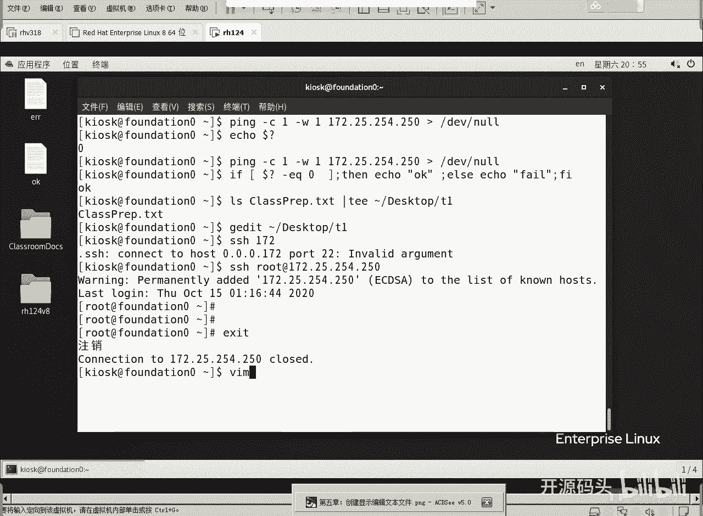
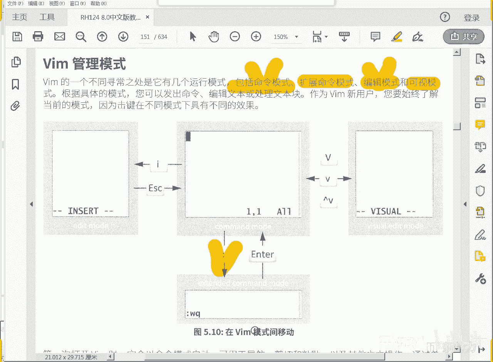
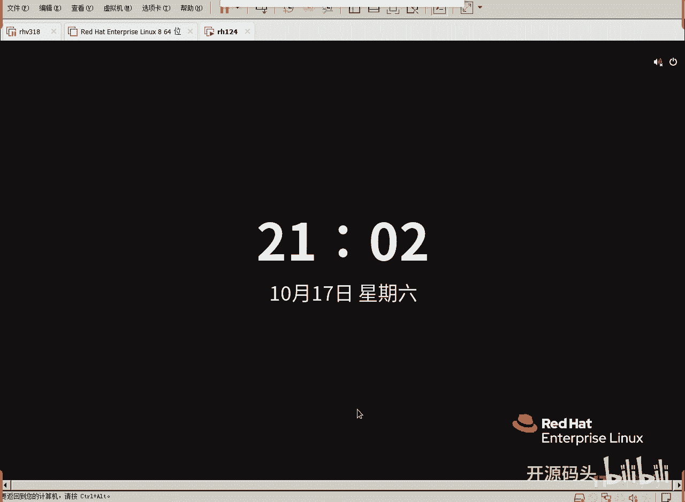
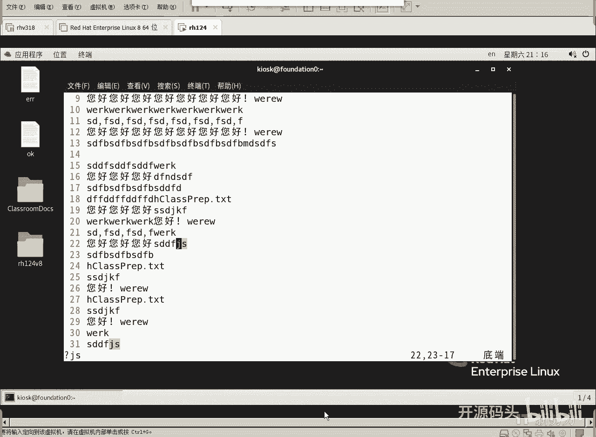
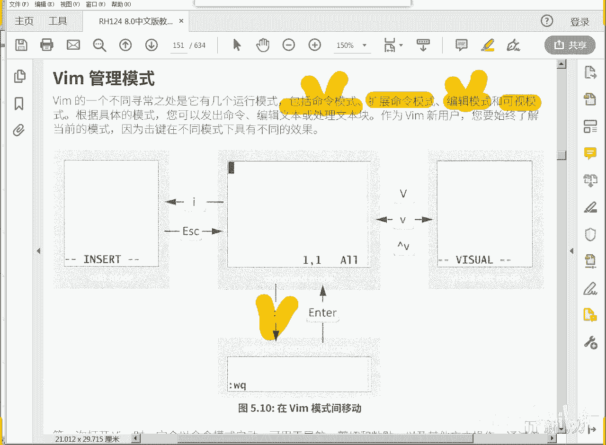
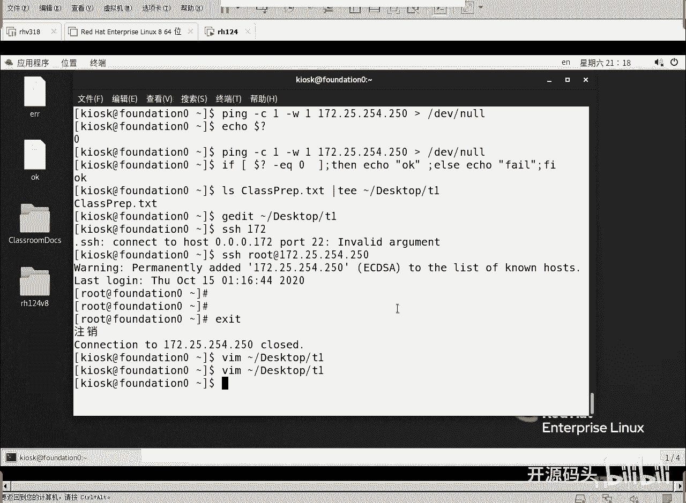

# Linux基础：5.2：VIM编辑器入门指南 🖋️

在本节课中，我们将要学习Linux系统中一个强大且高效的文本编辑工具——VIM。VIM是一个基于快捷键操作的编辑器，掌握其核心快捷键是熟练使用的关键。对于初学者而言，理解其不同的工作模式是第一步。本节课将引导你了解VIM的基本概念、模式切换以及核心编辑操作。

## VIM的工作模式 🔄

VIM编辑器拥有多种工作模式，每种模式下的键盘输入具有不同的含义。理解这些模式是有效使用VIM的基础。

一进入VIM时，我们处于**命令模式**。在此模式下，键盘输入被视为命令，而非文本内容。要开始编辑文本，需要切换到**插入模式**。编辑完成后，可以返回命令模式，并进入**扩展命令模式**（也称末行模式）来执行保存、退出等操作。此外，还有**可视模式**用于选择文本。

以下是VIM主要模式及其切换方式：
*   **命令模式**：VIM的默认启动模式。在此模式下，所有键盘输入都是命令。
*   **插入模式**：在命令模式下按 `i` 键进入。此时可以像普通编辑器一样输入和编辑文本。
*   **扩展命令模式**：在命令模式下按 `:` 键进入。光标会移动到屏幕底部，可以输入保存、退出等高级命令。
*   **可视模式**：在命令模式下按 `v`、`V` 或 `Ctrl+v` 进入。用于选择文本块。

模式切换的核心流程是：**命令模式** -> (`i`) -> **插入模式** -> (`Esc`) -> **命令模式** -> (`:`) -> **扩展命令模式**。

## 基础编辑操作 ✏️

上一节我们介绍了VIM的几种模式，本节中我们来看看如何在命令模式下进行基础的文本编辑操作，例如复制、粘贴、删除和撤销。

这些操作通常在命令模式下完成，需要记忆特定的快捷键。熟练后，其编辑效率将远超图形界面。

以下是核心编辑命令列表：
*   **复制**：`yy` 复制当前行。`3yy` 复制从当前行开始的三行。
*   **粘贴**：`p` 将复制或剪切的内容粘贴到光标**之后**。`P` (Shift+p) 粘贴到光标**之前**。
*   **剪切/删除**：`dd` 剪切（删除）当前行。`3dd` 剪切从当前行开始的三行。`cc` 剪切当前行并**立即进入插入模式**。
*   **撤销与重做**：`u` 撤销上一次操作。`Ctrl + r` 重做被撤销的操作。

## 可视模式与文本选择 👁️

掌握了基础编辑命令后，我们可能会想：能否像在图形界面中那样，用鼠标拖拽来选择文本呢？在VIM中，我们可以使用**可视模式**来实现类似的功能。

可视模式允许你高亮选择文本区域，然后再对选中的文本执行复制、剪切等操作。这为精确控制编辑范围提供了便利。

以下是进入不同可视模式的方法：
*   **字符可视模式**：按 `v` 进入，可以自由选择任意字符。
*   **行可视模式**：按 `V` (Shift+v) 进入，每次选择整行。
*   **块可视模式**：按 `Ctrl + v` 进入，可以进行纵向的列选择。

进入可视模式并选中文本后，可以使用 `y` 复制、`d` 剪切或 `c` 剪切并编辑选中的内容。

## 光标移动与搜索 🧭

高效编辑离不开光标的快速定位。除了使用方向键，VIM提供了更快捷的光标移动和文本搜索方式。

在命令模式下，我们可以快速跳转到文件首尾、特定行，或者搜索特定字符串，这在大文件编辑时尤其有用。

以下是快速定位光标的命令：
*   **跳转行首行尾**：`gg` 跳到文件第一行。`G` (Shift+g) 跳到文件最后一行。
*   **跳转到指定行**：在扩展命令模式下输入 `:行号` 并回车，例如 `:25` 跳转到第25行。
*   **文本搜索**：在命令模式下输入 `/关键词` 并回车，例如 `/hello`。按 `n` 跳转到下一个匹配项，按 `N` (Shift+n) 跳转到上一个匹配项。

## 文件的保存与退出 💾

所有编辑工作完成后，最后一步就是保存更改并退出VIM编辑器。这些操作需要在**扩展命令模式**下完成。

在命令模式下输入冒号 `:` 进入扩展命令模式，然后输入相应的命令。

以下是文件保存与退出的命令：
*   **保存**：`:w` 保存文件。
*   **退出**：`:q` 退出VIM。如果文件有未保存的修改，此命令会失败。
*   **保存并退出**：`:wq` 或 `:x` 保存文件并退出。
*   **强制退出（不保存）**：`:q!` 放弃所有修改并强制退出。

---

本节课中我们一起学习了VIM编辑器的核心概念与操作。我们了解了VIM的四种主要工作模式及其切换方式，掌握了复制(`yy`)、粘贴(`p`)、删除(`dd`)、撤销(`u`)等基础编辑命令。同时，也学习了如何使用可视模式(`v`, `V`, `Ctrl+v`)选择文本，以及如何快速移动光标(`gg`, `G`, `:行号`)和搜索文本(`/`)。最后，我们学会了如何保存(`:w`)和退出(`:q`, `:wq`, `:q!`)文件。反复练习这些快捷键是掌握VIM的关键，它将极大提升你在命令行环境下的文本编辑效率。