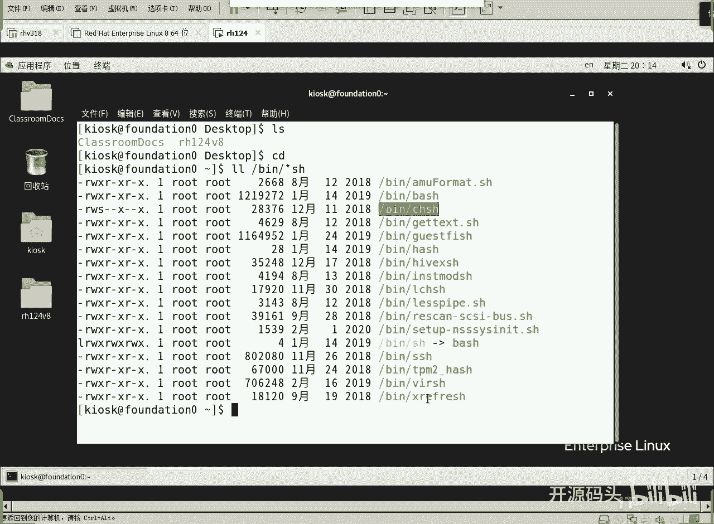
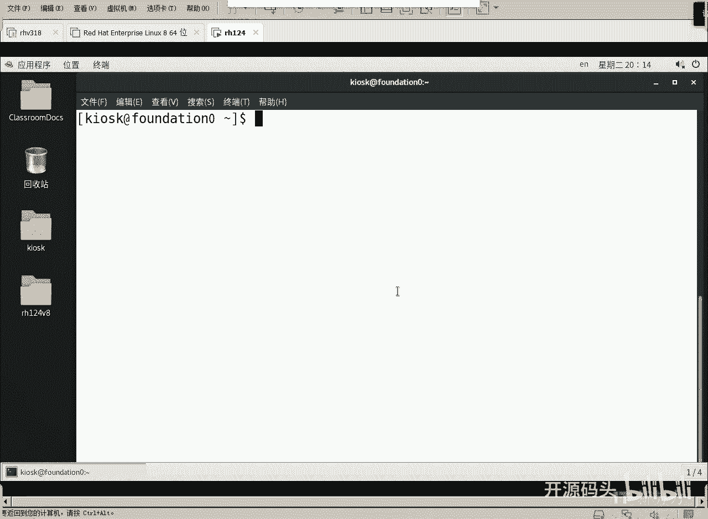
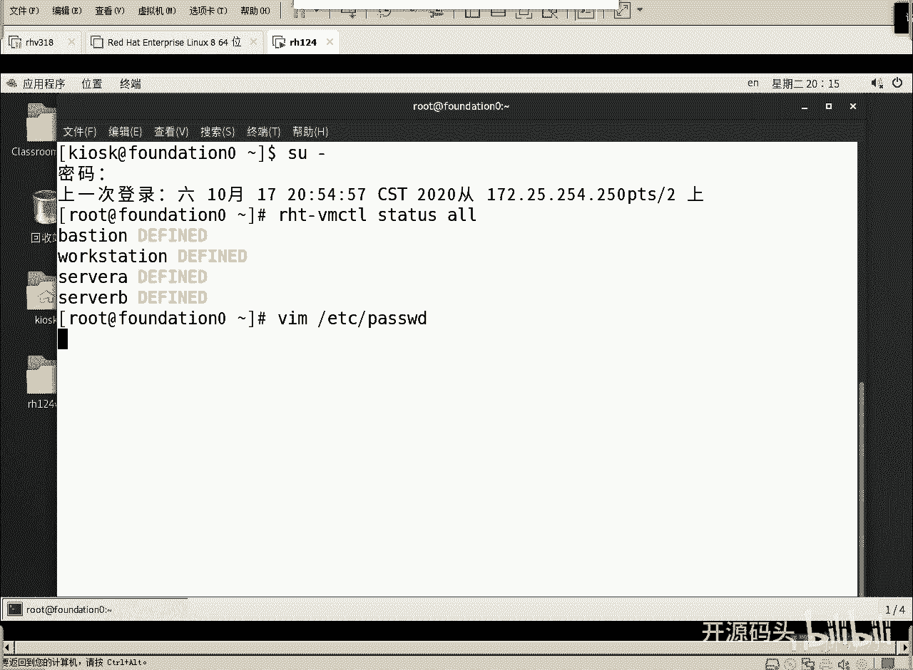
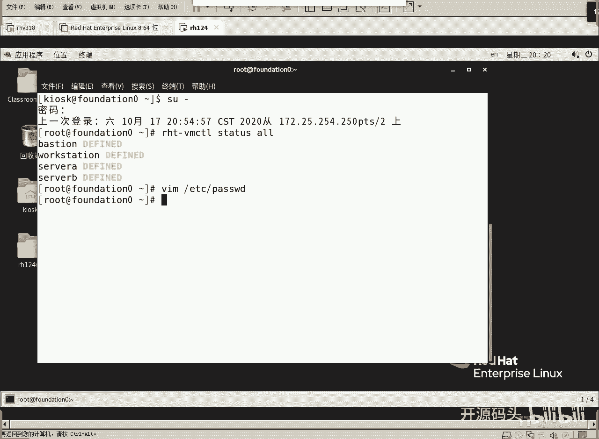

# RHCE RH124 之6 Linux用户管理(1).mp4 - P1 - 开源码头 - BV1TS4y1W7cR

那么呃用户管理呢呃其实就是一个什么账号管理啊，呃，平常呢我们喜欢把它叫做用户管理。但实际上一说用户的话呢，呃人们第一个印象总是感觉哦这是一个呃人是吧？啊，我们限制这个人他在系统里面的行为。

那么其实呢呃这个呃准确的来讲，应该叫账户管理啊，为什么叫账户管理呢？因为啊我们在一个计算机系统当中能够主动的行使权利和权限啊，主动的去呃进行一些操作的。除了人之外呢啊还有一种东西叫进程啊，或者是服务啊。

这些东西呢它也会主观的啊去行使去进行一些操作，行使所谓的权利和权限。啊，所以说呢呃这个账户呢其实我们映射的是一个安全主体。所谓的安全主体就是能够在系统当中主动的去行使权利和权限，主动的进行一些操作啊。

这种主体。那这种主体除了人之外呢，其实还有什么还有进程或者服务等等等等，对吧？啊，那么呃我们这个所谓的用户管理呢，实质上来讲就是对账户的管理。也就是说，任何一个安全主体。啊，都应该被管理。

都应该有一个独立的账号。我们通过对账号的这种限制，对账号进行复权，来规范他们在系统当中的一些行为。啊，所以说我们今天。说的是用户管理，但实质上呢是账户管理，对吧？啊，呃。

但是呢我们我们对这个呃系统服务的系统或者服务或者进程的这种呃描述的并不是太多啊，大部分还是针对人的啊，还是针对这个用户的。OK然后我们来看一下这个linux里面呢呃就是被管理的这些人。

他们到底是在哪保存啊，这里有ETC目录下啊，ETC目录下啊，password这个文件，还有什么呢？group这个文件，还有shale这个文件。这个文件里面呢就存着我们的那个账户。账户信息就在这里面。

这三个啊，当然不止这三个，应该还有一些。啊呃。最基础的信息是在这三个文件里面存的啊，用户库组库，还有什么密码库。啊，那么库里面呢很明呃很很直接的。啊，就存着这些字段啊，用户肯定得用户ID啊。

组呢有主ID是吧？还有用户登录的那个shall。Logo in shape。登录的sll指的指的是什么意思呢？就是用户登录到机器里头以后呢，他所呃。收到的那个交互环境。啊。

或者是它对内核进行操作时候的一个。呃，一个界面是什么？啊呃我们通常是这么去理解它啊，就是操作系统呢它有它的内核，内核呢一般不能够让用户直接去操作。所以说呢我们内核呢呃加一个shall，加一个外壳。啊。

用户通过shall的触碰，通过shall的这种呃。命令行呢来对内核呢进行相应的这个呃信息传递，是吧？所以说呢我们一般把啊用户工作的这个环境，用户敲命令的这个环境称其为一个shall。

而我们的那个sha呢就是linux这个shall呢就是bush啊，BASHbush这么一种shall啊，默认情况下啊，当然也有别的shall啊。如果说我们可以呃控制，或者是可以干预的话。

我们可以给不同的用户呢啊设置不同的这个shall环境。但是我们大部分情况下都是80存用户库里面所存储的用户信息大概就是这些东西啊，还有一个是什么呢？加目录啊。

加目录的意思就是每一个用户他自己的一个宿主目录，只能自己进入的一个目录，类似于家庭家一样的地方啊。啊，还有什么呢？还有主组啊，用户的主组，还有用户的一些辅组等等等等啊，这些信息啊，我们可以看一下吧。

啊，一入的身份啊只能一入的身份来看啊再稍微大一点，好吧，我把字体再稍微放大一点。

好，然后呢我们竖杠回车啊，回答root密码ASIMOV。这样的话我们就进入到root身份。注意啊，我现在的演示是在最外层的这个虚机上演示的啊呃呃里头的虚机也可以去用啊。

我们的那个那几台虚机RT杠5VM controltl STATUS。哦，看一下我们的几台虚机，这几个续机现在都没有启动是吧？所以说我们的执行效率还是蛮高的是吧？好，呃，在这个机器上，我们VIM。

上一节课刚刚讲了VM是吧，我们现在就要用它VMET下载什么PSWD啊，这个文件绘这。

啊，那么这个文件呢，第一行就是root用户的那个属性行，root用户一行，然后BIN用户一行啊，demand用户一行。我的命运会也好。那么这些这些人呢，我们看上去都不是什么都不像人名是吧？

比方root呢。就是我们的那个超级用户啊，那这几个BINdemand，还有什么admi这些用户其实都是针对的都是什么呢？都是我们系统里面的一些进程账户。啊，或者叫服务账户。啊，那么这些账户的ID号。

这是UID啊。像这个第一个数字就是UID。啊，这是用户名，这个地方应该存密码。但是密码呢我们用X把它呃充斥，就是充当密码。因为真正的密码并不在这个位置存，真正的密码在那个shale那个文件里面存的。

密码库里面存的啊，并不在pasword的存。所以这个地方呢密码的位置呢是有一个叫什么叫做呃。填充符或者叫充位符啊。充当这个密码的位置，然后这就是UID那UID呢你看都很小是吧？那我们看一下普通用户。

我们知道我们登录的时候用的用户名叫什么KIOSK吧。我们搜一哎，其实已经显示出来了是吧？我们也可以搜一下先杠KIOSK。啊，我们就能看到啊，他在这个位置，对吧？那么KLSK这个用用户呢。

他的用户ID是多少？1000。啊，实际上呢我们的lininux就这么规范的啊，就是1000以下的从0到999都属于系统账户。所谓的系统账户呢就是呃系统预先。

根据这个进程或者服务分配给进程和服务的一些一些这个账户啊，都是999以下的啊，0到999啊，当然root呢是一个超级账户啊，零号账户超级账户啊，我们往上翻是呃小呃小G。啊。打一下小G。就到了最上面是吧？

啊，我们能看到root用户的这个ID是0号，对吧？这是一个超级账户，然后大写的这。那就就到了这个文件的末尾啊，最末尾的就是这几个人。啊，其实就KSK是一个普通的啊针对人的或者映射到人上的一个账户。

那别的账户呢都是系统已经已经有的啊，预示着一个进程或者一个服务这种管理。那这是用户ID那用户ID后面又有个数字。啊，第二个数字什么是阻碍D。啊，这个用户属于哪一个组啊，应该也不叫组，叫主组ID啊。

主组ID呃，linux的一个权限框架，它呢呃要求一个用户呢必须，而且只能属于一个主组啊呃主组的作用是什么呢？当一个用户创建一个文件，或者创建一个目录的时候呢，这个文件或者目录一定要既属于用户。

又要属于一个组。那么它应该属于哪个组呢？就应该属于用户的主组啊。所以说呃用户ID以及用户的主组的ID啊呃一个用户必须且只能属于一个主组啊，这是这是他的主组的ID。一般情况下。

每个用户的主组呢都是跟用户同名的组啊。呃，在windows系统里面是没有这个概念的啊，在windows里面没有这个概念。在linux里必须要求一个用户必须切。属于只能属于一个。主祖。

然后这个主组呢是伴随着资源创建的时候，呃，作为资源的所有组啊。一个资源既应该有所有者，还应该有什么属于一个组所有者组。然后后面呢，应该这个地方冒号空格的这部分是应该是一个注释说明性的东西啊。

这是一个注释说明性的东西。然后呢，紧接着很明显，这是一个什么？加目录的字段是吧？加目录后面的字段是什么呢？是它的shall字段80。你像我们前面看到这些系统账户，大部分系统账户都不是呃让他来打命令的啊。

就是这些系统账户其实是呃映射的是什么？对应的是那个呃一个进程或者是一个服务。所以说他们这个服务呢呃，他们一般不会像人一样打什么打命令啊，所以说呢他们的那个shall呢都是。

no logogo in的这么一个程序。这个程序就是把它踢出去，不要让他什么呢？呃有这个呃命令函环境。而我们的普通用户的话是一定要有一个命令函环境的对吧？啊。

你看好多系统账户都是no logogo in啊，不让他不让交互式登录啊，因为进程不像人一样，他能打命令是吧？进程的他一般都是后台调用命令就可以了。所以说他没有不给他提供这种交互式环境。

而我们的人是要求一个有交互式环境的s。对吧O。好，我们刚刚看的是什么呢？看的是一个呃所谓的呃。用户库的内容对吧？啊，一个用户一行啊，而且呢还很简单是吧？用户的项目就这么几项。好，冒号Q退出。啊。

我们打一个冒号Q退出。

