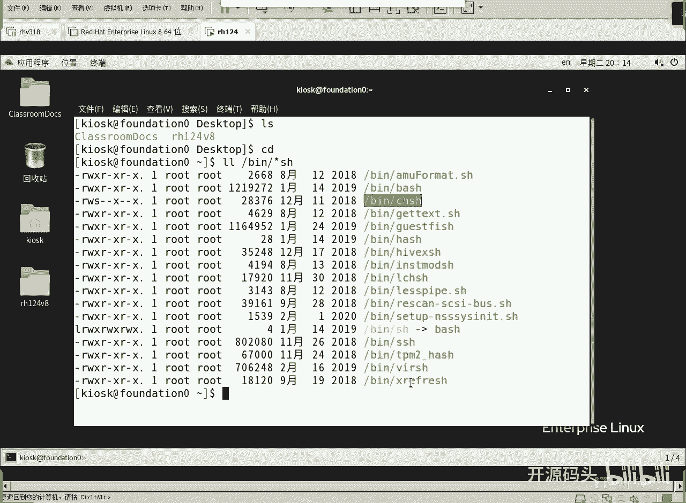
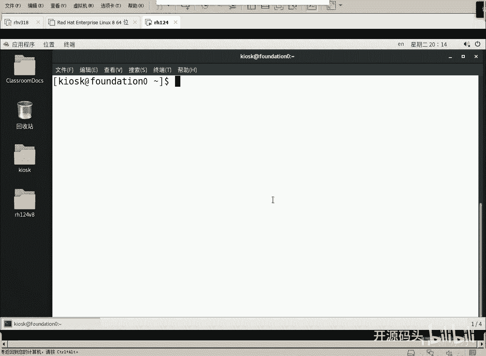
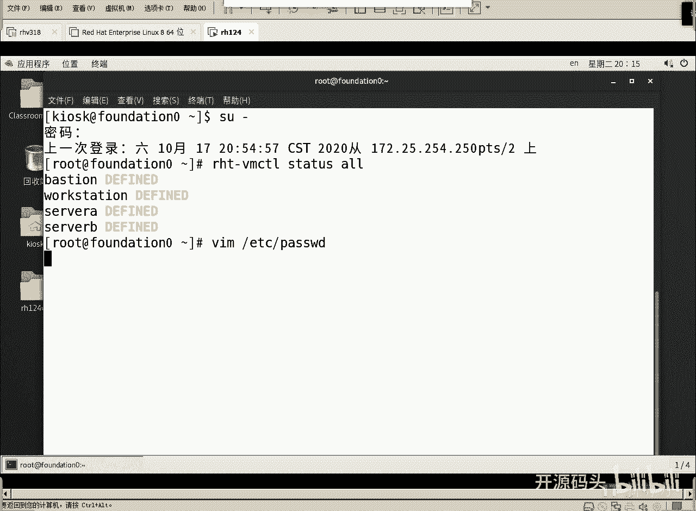
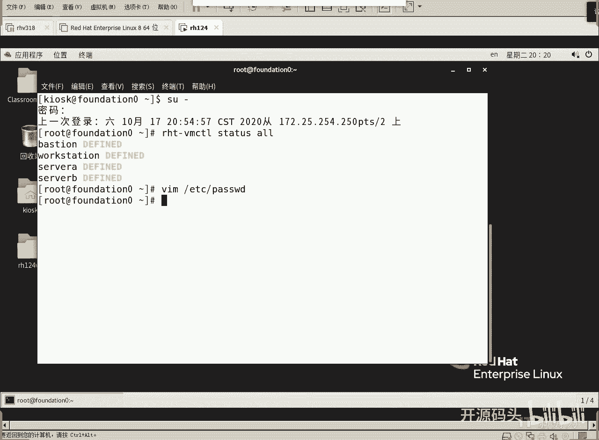

# Linux用户管理：1：账户管理基础概念

在本节课中，我们将要学习Linux系统中账户管理的基础概念，理解用户与账户的区别，并初步了解系统如何存储账户信息。

## 概述

用户管理，更准确地说是账户管理，是Linux系统安全与权限控制的核心。它管理的不仅是真实用户，还包括系统进程和服务等所有能在系统中主动执行操作的安全主体。

## 账户与安全主体

上一节我们介绍了账户管理的概念，本节中我们来看看其核心——安全主体。

所谓安全主体，指的是任何能够在系统内主动行使权利、权限并进行操作的对象。这包括：
*   **真实用户**：使用系统的人。
*   **进程或服务**：运行在系统中的程序。



系统通过为每个安全主体创建独立的账户，并对其赋予或限制权限，来规范所有行为。因此，我们常说的“用户管理”，实质是更广泛的“账户管理”。



## 账户信息的存储



了解了账户的本质后，我们来看看系统在哪里保存这些账户信息。

Linux系统将基础的账户信息存储在 `/etc` 目录下的几个关键文件中：
*   **`/etc/passwd`**：用户账户数据库。
*   **`/etc/group`**：组账户数据库。
*   **`/etc/shadow`**：用户密码数据库（加密存储）。

这些文件以文本形式存储，每行代表一个账户或组，字段之间用冒号 `:` 分隔。

## 剖析 `/etc/passwd` 文件

现在，让我们深入查看最重要的用户信息文件 `/etc/passwd`。

以root身份查看该文件：
```bash
sudo vim /etc/passwd
```

文件内容示例如下：
```
root:x:0:0:root:/root:/bin/bash
bin:x:1:1:bin:/bin:/sbin/nologin
daemon:x:2:2:daemon:/sbin:/sbin/nologin
...
kiosk:x:1000:1000:kiosk:/home/kiosk:/bin/bash
```

以下是每一行的字段含义解析：

1.  **用户名**：用户登录时使用的名称。
2.  **密码占位符**：历史上这里存储加密密码，现在通常用 `x` 表示，真实密码已移至更安全的 `/etc/shadow` 文件。
3.  **用户ID (UID)**：系统识别用户的唯一数字。
    *   **0**：超级用户root的UID。
    *   **1-999**：系统账户UID，通常分配给系统服务或进程。
    *   **>=1000**：普通用户UID。
4.  **主组ID (GID)**：用户所属**主组**的ID。在Linux权限模型中，一个用户必须且只能属于一个主组。当用户创建文件时，该文件的所属组默认即为其主组。
5.  **注释/描述**：关于用户的一段描述性文字。
6.  **家目录**：用户登录后的初始工作目录，普通用户通常位于 `/home/用户名` 下。
7.  **登录Shell**：用户登录后获得的命令交互环境。
    *   对于普通用户，通常是 `/bin/bash`。
    *   对于系统服务账户，通常是 `/sbin/nologin` 或 `/bin/false`，这能阻止其进行交互式登录，符合安全要求。

## 总结



本节课中我们一起学习了Linux账户管理的基础。我们明确了“用户管理”实质是管理所有“安全主体”的账户。我们了解了账户核心信息存储在 `/etc/passwd`、`/etc/group` 和 `/etc/shadow` 文件中，并详细剖析了 `/etc/passwd` 文件中用户名、UID、GID、家目录和登录Shell等关键字段的含义及其作用。这是理解后续用户创建、修改和权限管理操作的重要基础。