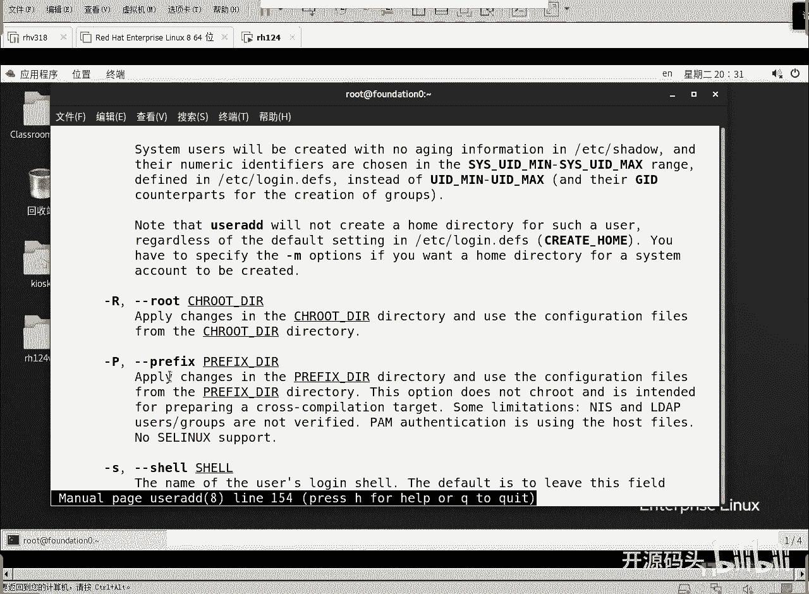

# RHCE RH124 之6 Linux用户管理(2) - P1 - 开源码头 - BV1WN4y1F775

啊，这就是所谓的啊用户账户库看到了吧？在里面存的这些东西。呃，有问题来了，那你说的这个称储位置，难道是让我们添加用户的时候，让我们手工去写吗？让我们手工的去去编辑这个文件吗？当然不是啊。

这个只是让大家看一看。然后呃既然是看嘛，我们再来看看这个。ETT下载什么文件呢？沙头。啊，shale这个文件啊，这是这个字面意思这影子说明它隐藏度很高是吧？说明它的安全性要求也很高。

这里面其实就是所有用户的这个呃密码的信息啊，你root用户有没有密码，有，这就是它的密码啊，那这是他加密过的密码。这个密码呢是不可逆方式加密进去的啊，就是散列运算的这种方式啊，把它算好了。

把我们的密码真正的密码算好了，放在这个位置。那么这个地方呢就是让你看你看到你也没有办法去破解啊，然后面这几个数字呢是一个密码的有效期。后面我们专门会聊一下啊，密码的一个时长啊，密码的。

寿命周期等等这些信息。

OK好，这是密码库。有兴趣的可以看看，对吧？啊，那我们创建一个用户的时候，既涉及到用户名日信息，又涉及到什么密码信息。手工编辑这些库。理论上是可行的啊，但是呢肯定是不合适啊，所以说我们还是什么还是。

还是用这种啊命令的方式来实现，是吧？好，我们后面看。啊，一个最直接的就是user and。对吧user end userer end的意思就是字面意思，用户添加。就开始添加一个用户，对吧？然后呢。

针对这个用户呢设置他的密码。我们还可以把一个用用户啊设置为一个组的管理员。从而呢这个用户可以管理这个组的成员。啊，可以把一些用户呢组织到一个组里面，然后给这个组能复权，对吧？等等这些操作康。啊。啊。

添加一个用户啊呃比如说添加一个用户叫张三。OK一个用户就创建好了ID张3。我们可以查询这个张三的这个账户信息。比如说他的用户ID是11001。我们知道1000号是那个KSK嘛，对吧？root是零号。

对吧？啊那。阻碍地呢？注意啊，这个张三这个阻ID并不是用火啊，这个是组啊。既然说到组啊，我们来呃。再添加一个组吧，group and。比如说销售组。我们就用拼音，好吧，销售组啊嗯这个组呢。

它会创建在什么地方？它会存到ETT下的啊。G。GROUP是吧。重复率很高的情况下，一次性打不全是吧？OUP。啊，这是组的信息。你会发现几乎每一个用户都有对应的组名。

哎KIIK用户它的主业叫KSK啊呃张三用户。他的祖也叫张三。这是张三组的组名啊，然后销售组啊销售组是1002号组。O。啊，我们创建了用户，创建了组。然后在现在呢。看这个张三信息的时候。张三的主组。

这是张三的用户ID这是张三的主组ID。啊，那么张三所属的属祖。张三现在只属于张三组。啊，如果说我现在张三还是销售组的成员呢啊，我们这么操作一下，user modify啊。

用户修改修改的时候呢啊我们修改的是附属组是销售。那么要修改哪个用户呢？修改的用户是张三。我们要修改一个张三用户，让他的附属组，这个杠大G是代表的是usurer modify的选项。附属组附属组是销售。

好，回去。ID张三再次查看的时候，你会发现啊啊张三的用户ID张三的主组ID以及张三的所属组。你会发现他除了属于自己的主组之外，还属于另外一个组叫销售组，对吧？销售科，他是销售科的成员。

那他自然也就属于销售组，对不对啊，那有人说哎打的这个命令挺简单是吧？啊，看一下啊，也是3四行开始的啊，3四行开始啊。我们。添加一个用户叫张三。检查一下张三的这个账户信息，又添加了一个组叫销售。啊。

然后呢。修改张三。属于销售组。但是呢。他不是主组的组，都是复数组啊都是复数组。只有一个组是主组啊。好，我们又重新检查一下张三，对吧？金叹号啊，40行，我们重新执行一下4十行命令啊，回车。啊。

这里看的很清楚啊，呃，这是用户的ID，这是主组的ID。因为一个用户只能属于，而且只能属于一个主组，所以说他就这两个是一一对应的。这两个必须是一一对应的啊，有人说张三可不可以把他的主组改成李四呀。

或者是呃销售呀。啊，可以啊，但是一般情况下，我们还是让张三的主组就是张三组最好啊。有些同学说，我没有看见你创建张三组，在创建一个张三用户的时候，张三组自然就会被创建啊，不但会创建一个张三组。

而且还会创建张三的加目录。我们来看一下LLhome下面是不是有个名字叫做张三的目录啊，这个目录呢只允许张三。只属于张三和张三组啊。只允许张三去访问。这就是它的加目录啊，这些东西都是优er案的一个命令啊。

连锁出来的东西啊。所以说创建个用户啊，不要去直接修改那个什么用户库啊，密码库啊啊，我们用user end就可以了，是吧？那其实呢user end。还有很多选项可以用啊，manuuser and。啊。

我们刚刚在第四章的时候聊过自我帮助是吧？用了按命看。

啊。添加用户的命令啊，这个用户呢创建一个新的用户，或者是更新默认用户信息。有很多可用的选项啊，它的命令行的格式啊，Uend，然后呢是登录名啊，就是你的账户名，然后中间呢是可选的。

中括号扩制的是你可选的选项。

科学选项就包括了下面这些东西啊，比如说啊它的基础目录，这个不常用啊，比如说杠C它的描述啊，它的说明这个呢呃你可以写啊，就是这个用户，比如说这个用户是什么什么情况，你可以给他加一些注释。

还有呢杠D代表的是什么？直接控制用户的加目录。我们刚才看了张三是不是直接创造了一个名字叫做张三的加目录啊？对。默认就会创建。如果你不喜欢，你可以干预它啊，用杠D呢去创建另外一个目录作为张三的加目录啊。

杠大D。默认选项的更改啊呃我们可以去改变很多选项的默认值是吧？但是呢一般采用默认值就是最好的选择啊。

杠小一。过期的日期啊，一个账户呢应该给他配置一个过期日期是吧？哎，这个账户呢啊从创建开始到什么时候过期？啊，这个格式呢可以是年月日，也可以是加做上窗时间，对吧？

这是过期日期。啊，那还有呢是呃控制它的阻ID啊，杠小这什么是它的主组的ID。如果你不控制它，它会自动的往上累加是吧？根据现在的已有的数字，已有的ID值自动往上累加。那么杠大G呢啊是它的辅属组啊。

小G是主组。

大G是什么呢？复数组，所谓的复数组就是除了主组以外的。主存员身份对吧？张三属于张三的主组，但是张三还属于一个副组，是张三的副组，那个组是什么呢？销售组啊。

我们通过user modifyified去修改的。好在什么呢？usermodify那个杠大G和user and的杠大J这两个命令的杠大G是同一个含义。

好，杠Hhelp等等等等啊，呃我们想控制它的bu的话呢是什？

啊嗯。

杠S。对吧我们可想控制它的shall。没啊默认的shop不就是呃BIN下面的bu吗？那我们想让我们的账户呢作为一个系统账户。不想让它有交互式登录的界面，那就把sha定为SBIN目录下的no logo。

这样的话呢，这个账户呢就无法登录啊，无法交互式登录。就是没有办法得到那个交互式环境。

OK好，杠一小U是什么？是设置用户的UID这个也是如果你设置了跟别的不重复啊，跟已有的数字不重复，它就可以用。如果重复了啊，那报错是吧？那如果你不设置。

它会在在现有的数排序的这个数字基础之上继续往后加啊，自动的就。

这些信息都自动的就创建好了，对吧？O好，Q退出。

