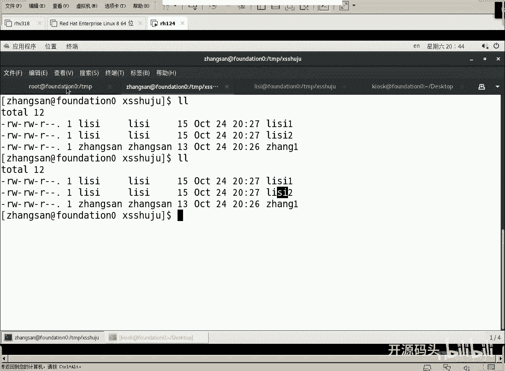
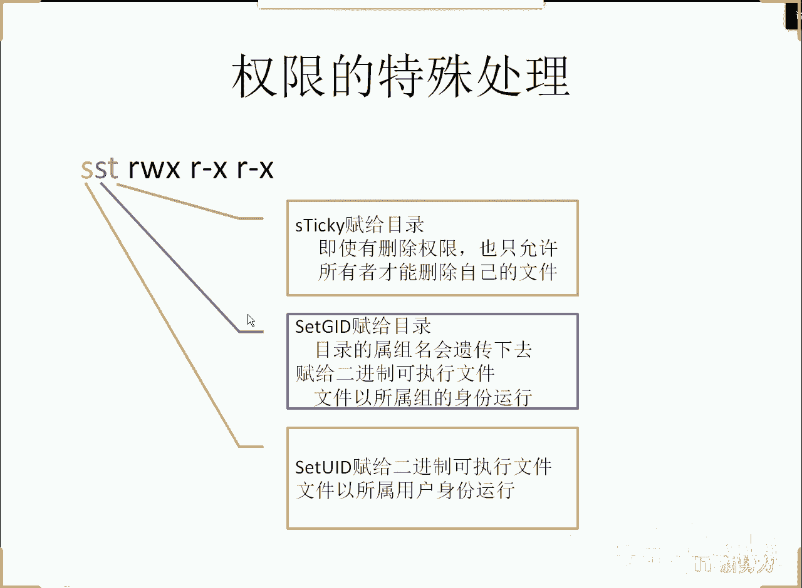
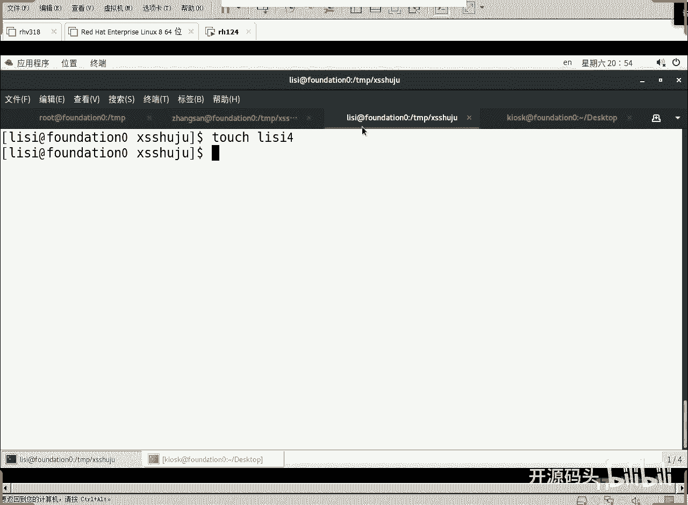

# RHCE RH124 之7 Linux 权限及特殊处理(5) - P1：7 权限及特殊处理(5) - 开源码头 - BV1TG4y1Y7GT

你看啊现在呢呃我们的这个李四的文件是不是完全属于李四，既属于李四用户，又属于李四的主组。张三呢也是属于既属于张三，又属于张三的主组。我说能不能这样，不管你是李四还是张三，你们创建的这个销售数据。

是不是无条件都得属于我们销售部门。那么如果说你们创建的还是属于你自己，但是组呢我让它全部变成销售组，是不是更好一些？不管你是李四的文件还是张三文件，最后都是什么，都是A李四组的啊，不是不是。

都是销售组的组名，都属于销售组。这样是不是这个文件的所有所有者？更加的理想和完美。对吧因为什么我们是我们再到用root身份再来看一下啊。你看他这个组名是不是叫销售。

我们让这个组呢组名给他什么给它遗传下去。就是任何在这个目录下创建的新文件啊，你李四创建的当然属李四，张张三创建都是呃属于张三。但是呢不管你李四张三创建的都属于销售组。

是不是这个文件的所有所属关系变得更加完美。好，我们接着来啊。第哪一个位啊？

哪一个位啊是不是第二位啊？如果这位之腰。那我们原始的这个001就变成了011了是吧？第一位不管了啊。这个SV制1是不是个1T我们刚才已经知要了是吧，是不是011011等于十进制的解。

3对吧后面的770还不变，是不是整个权限就是377。Ling。

对吧哎，试一把。好吧。那有人是说你能你你就不能用一个描述的方法去写吗？描述的方法，我们刚才聊了，是不是将会在这个未来显示？那我们试着用描述方法写啊，不写数字了，要写数字就是多少，chan着猫的多少？

3770。啊，销售销售数据。对吧377所谓的三就是。既保持了tick，又设置了主ID。又设置了组的这个地方的这个呃就设置这个阻ID遗传。啊，设置这个阻 IDD遗传下去啊。

它的显示应该在组的这个位来显示是S啊。好，这是一种数字表示法。我们用描述法来写，好吧，描述法怎么写呢？就是组加上个S。就可以了。组加个S就可以了。在现有的权限基础之上，给组加一个S。这个特征就可以了。

是吧？啊，我们回撤LL的杠D看一下。え？这个原来的X变成什么S，并且这个S是什么小写的那就意味原来有没有X有。啊，小写的S代表原来有X。如果是大写S的，代表原来没有X啊，所以说并不会。减少这个信息量啊。

并不减少信息量。好了，有了这个特性之后啊，set组ID的设置之后呢，就意味着这个组名会遗传给目录里所有的新建对象。好，我们张三开始创建了啊，张三ECHO又开始。嗯。增加数据了啊，张三文件。好。

李四也来一个。ECHO里哩哩哩。追加到李四。三文件。好，我们LL看一下啊。看。章个的第三个文件，李的第三个文件默认的属组都变成了什么？销售组。好。啊，就是这些文件的属组默认都属于销售组。啊。

这个属组的关系就非常的完美了啊，为什么说完美了呢？哎，李四的文件啊，既是属于李四的，又是属于销售组的。张三的文件，既是属于张三的，又是属于销售组的。这个属组关系是不是很完美？对吧哎。虽然完美了，但是又。

迎来了一个问题。啊，这个销售组的名字就遗传下来了啊啊好，那么又引来的问题是什么呢？我们来看一下张三和李四是不是都属于销售组的，而组的权限呢？变成可写的了，那也就意味着什么？张。

可以修改李的李呢也可以修改章的。啊，我们现在用李的身份试着修改一下章的啊ECHO。啪啦啦啦啦是吧，随便，然后追加到我是李四啊，我给他追加到张三这个文件里面。唉，cut一下张三。哎，你会发现。

李四是可以改张三的销售数据？为什么呢？因为很简单，因为属主的。变过来了啊，所以说他的那个权限就不是这个了，权限就不是other权限了，而变成了什么主权限啊。因为对于这个李4三这个文件来讲。

张三属于他的销售组，张三的销售组的权限是这个。那么怎么去设置这个权限问题？就是让这个销售组的权限给他是吧，也做成R，不要W。啊，其实很简单，我们把U mask改一下，不管是张三还是李四。

你们的U mask都是多少呢？都是022，而不是002。因为我们的U mask原来是不是002只给只给他减了个2，只给阿减2，没有给这个group减2。我们是002。

现在我们把这个U mark改成022，是不是把这个二也减了，把这个二也减了。好，怎么去处理，还是由root上面来做啊。VIM。波浪号张三。张三用户加目录下面啊，波浪号张三代表张三用户加目录。

然后有个点80RC。好，我们在82C的这个末尾。O加一行you mask多少呢？022。张三的you mask是022啊，同样的道理，李四的you mask。

shift g dream末尾O开始加一行you must022。因为张三和李四的那个ID号都是10001002，对于大于等于199的这些账户的话，它都是002。我们现在强制给他改回022好吧？好。

这样我们张三看一下you must啊，看一下you must。哎，还是002不是022呀。好，退一下。重新再记一下。counttr，然后再来看一下Um。变了没变了吧？022好，李四一样啊。

先退出去exXID退一下，重新进一下。因为什么？因为当我们。每次打开终端的时候，就会初始化我们的环境。初始化环境过程当中就会把youm重新定义啊，我们来看一下Um是多少。02好了。

我们呢重新进入这个目录TMP下面的呃销售销售数据。进来啊，李四进来再探是一个李44李44文件啊，同样的道理，张三呢也进来TMP下面的。销售数据。啊，然后呢。EC c a o。呵呵呵呵呵。追下大。张四啊。

张四的文件名。好，现在呢我们来检查一下。完美了吗？李四啊李四的文件属于李四用户，属于销售组张四的文件啊，张四这个文件。啊，他也是属于张三，也是属于销售组，属组关系很漂亮。但而且呢权限也变了，对吧？

销售组对于文件的权限呢变成了什么，变成了制度，没有写了。啊，以后创建都这样。那么做样做完之后呢，哎ECHO。现在是张三峡破坏是吧？呦呦呦。追加到礼。44文件里面。是不是权限被禁了？很完美了是吧。

张三啊创建的文件，张三可改。销售组共享李四创建的文件，李四可改销售组共享。OK了，对不对？有些人说，那这个阿有没有存在的意义了？啊，没有存在的意义了啊，因为能进入这个目录的只有什么销售组的成员。

而销售组一进来。自动第二列就把它全匹配了。第二列的权限第二列的权限就全配盘，轮不着other。所以other这部分呢，那就可有可无了，是吧？你可以把它写成什么，写成就可以把U must写成。

写成006好了。啊，或者是026啊026的话，是不是把后面这权限就全去了，是阿er永远都是空的。所以说阿er这个权限在这个目录里头基本上是没有任何人能用到的啊，因为什么能进入这个目录的人。

除了root之外啊，都是销售组的人。😡，那么销售组的人呢，他呃在这里面创建目录没有问题啊呃创建文件创建目录都可以。然后呢哎他们。都会轮到group这个环节上就完事了。因为所有的新建的文件名都是销售组的。

然后他的销售组的权限呢就是轮到第二部分，就轮不到第三部分。啊，就不是as了，对吧？提前了啊，原来。如果说张三的文件是张三组，李四文件李四组，这个时候我们的互相看对方就属于对方的阿er。

但是我们如果把组名遗传下来的话。那都是销售组，的自然而然。就轮到group权限这部分了啊，所以说我们用U mask给它改一下啊，我们刚才改的怎么改呢？

