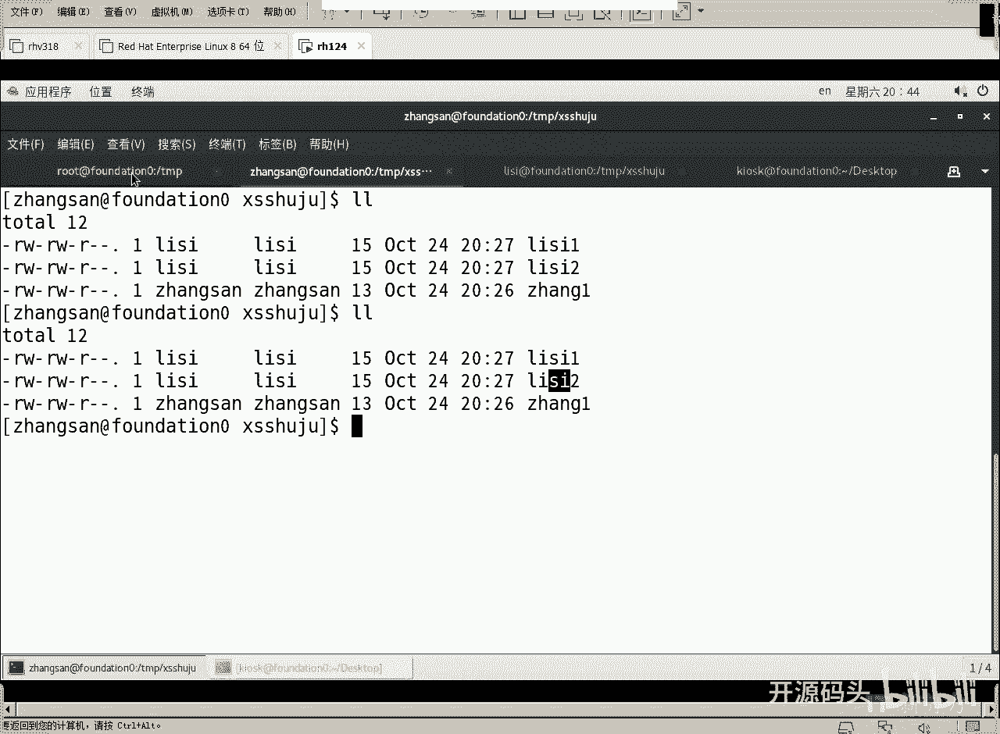
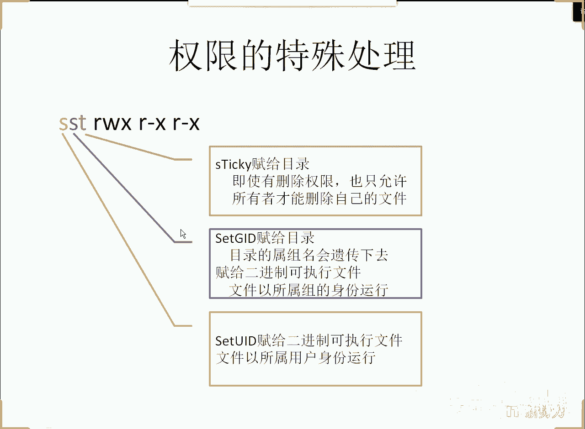
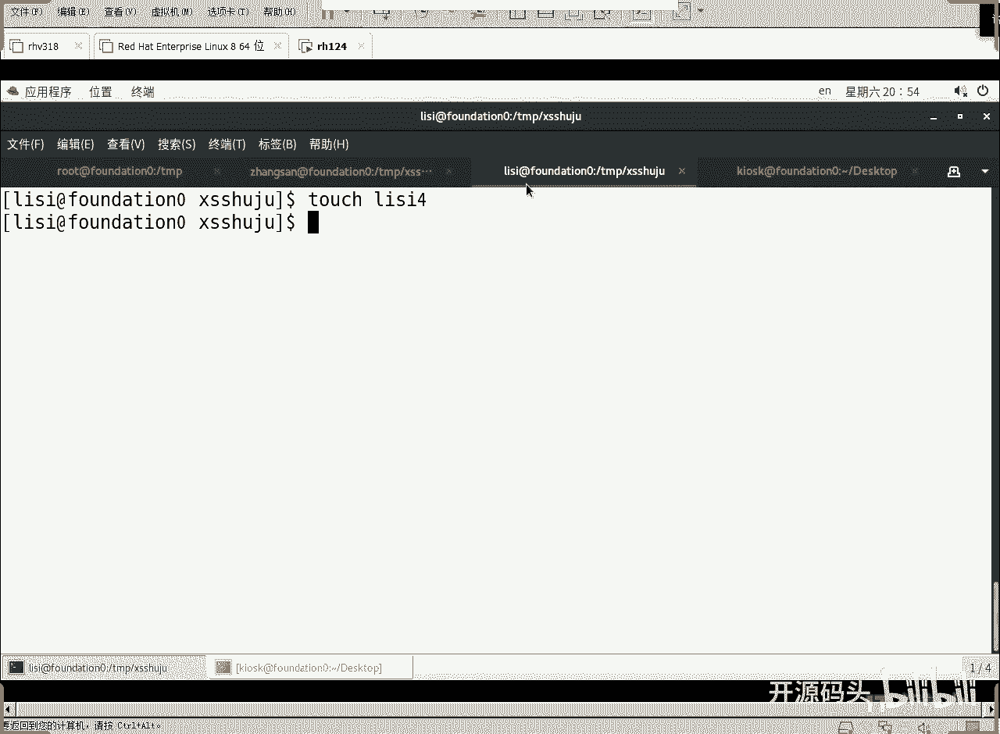

# RHCE RH124 课程：7：Linux 权限及特殊处理(5) - 设置组ID（SGID）

## 概述
在本节课中，我们将学习一个重要的特殊权限——设置组ID（SGID）。通过设置SGID，我们可以让在特定目录下创建的新文件自动继承该目录的属组，从而实现更理想的文件所有权管理。这对于需要团队协作共享文件的场景非常有用。

---



## 现有文件所有权的问题
上一节我们讨论了基本的文件权限。现在来看一个常见的协作场景：用户“张三”和“李四”都属于“销售”组，他们在一个共享目录中创建文件。默认情况下，张三创建的文件属于张三用户和张三的主组，李四创建的文件属于李四用户和李四的主组。这导致文件虽然在同一目录下，但属组不同，不利于组内成员协作管理。

理想的情况是：无论张三还是李四创建的文件，其属主（用户）保持不变，但属组都统一为“销售”组。这样，文件的所有权关系就变得更加清晰和便于管理。



## 解决方案：设置组ID（SGID）
为了实现上述目标，我们需要使用“设置组ID”（Set Group ID，简称SGID）这一特殊权限。当对一个目录设置SGID后，任何用户在该目录下创建的新文件或子目录，其属组将自动继承该目录的属组，而不是创建者自身的主组。

SGID权限位于权限位的第三组（即“组”权限的执行位`x`）。如果该位被设置，在长格式列表（`ls -l`）中，组的执行位`x`会显示为`s`。

以下是设置SGID的两种方法：

### 方法一：使用数字表示法
权限数字表示法由四位数组成：`特殊权限` `用户权限` `组权限` `其他权限`。
*   特殊权限位：SUID=4，SGID=2，Sticky Bit=1。
*   设置SGID，就是在原有权限数字前加上`2`。

例如，要将目录 `/tmp/销售数据` 的权限设置为 `drwxrws---`（即用户和组可读、写、执行，其他用户无权限，并设置SGID），计算如下：
1.  基础权限 `rwxrwx---` 对应的数字是 `770`。
2.  加上SGID（值为2），完整的权限数字是 `2770`。

执行命令：
```bash
chmod 2770 /tmp/销售数据
```

### 方法二：使用符号表示法
符号表示法更直观。在现有权限基础上，为“组”（g）增加“设置组ID”（s）权限即可。

执行命令：
```bash
chmod g+s /tmp/销售数据
```

设置后，使用 `ls -ld /tmp/销售数据` 查看目录详情，可以看到组的执行位变成了 `s`（如果原来有`x`权限）或 `S`（如果原来没有`x`权限）。小写 `s` 表示同时拥有 `x` 和 SGID 权限。

## 验证SGID效果
设置SGID后，当张三和李四在 `/tmp/销售数据` 目录下创建新文件时，这些文件的属组将自动变为“销售”组。

例如：
1.  张三创建文件：`echo “张三数据” > 张三文件.txt`
2.  李四创建文件：`echo “李四数据” > 李四文件.txt`

使用 `ls -l` 查看这两个文件，你会发现它们的属主分别是“张三”和“李四”，但**属组都是“销售”组**。这实现了我们最初的目标：文件用户所有权独立，但组所有权统一。

## 随之而来的新问题与解决
虽然SGID解决了属组统一的问题，但引入了一个新情况：由于这些文件现在都属于“销售”组，而目录的组权限默认是`rwx`（可读、写、执行），这意味着**同组的任何成员（如张三和李四）都可以随意修改或删除对方创建的文件**。这通常不是我们期望的协作方式。

我们希望的效果是：每个人可以自由修改自己的文件，但只能读取同组其他人的文件。

解决方案是**调整用户的默认掩码（umask）**。umask决定了新建文件时的默认权限。默认的umask（如0022）会赋予组写权限。我们需要将其修改为阻止组写权限。

对于用户张三和李四，我们可以修改他们的shell配置文件（如 `~/.bashrc`），将umask从`002`改为`022`。`022`表示新建文件时，不给“组”和“其他用户”写（`w`）权限。

操作步骤如下（以root身份）：
1.  编辑张三的配置文件：
    ```bash
    vim /home/张三/.bashrc
    ```
    在文件末尾添加一行：`umask 022`
2.  同样地，编辑李四的配置文件：
    ```bash
    vim /home/李四/.bashrc
    ```
    在文件末尾添加一行：`umask 022`
3.  让配置生效：张三和李四需要退出当前终端会话并重新登录，或者执行 `source ~/.bashrc` 命令。

修改umask后，张三和李四在SGID目录下创建的新文件，其组权限将只有读（`r`）和执行（`x`，如果是目录）权限，而没有写（`w`）权限。这样，张三可以修改自己的文件，但只能读取李四的文件，反之亦然。

## 关于“其他用户”权限的说明
在设置了SGID且仅限销售组成员访问的目录中，“其他用户”（other）的权限部分实际上变得无关紧要。因为能进入此目录的非root用户都是销售组成员，他们的访问权限在“组权限”阶段就已判定，不会轮到检查“其他用户”权限。因此，你可以将目录的“其他用户”权限设置为`---`（无任何权限），这不会影响销售组成员的正常使用。

## 总结
本节课我们一起学习了如何利用设置组ID（SGID）特殊权限来优化团队协作中的文件所有权管理。关键步骤包括：
1.  **识别需求**：在共享目录中，需要统一新建文件的属组。
2.  **设置SGID**：使用 `chmod 2770 目录名` 或 `chmod g+s 目录名` 为目录设置SGID权限。
3.  **验证效果**：新创建的文件将自动继承目录的属组。
4.  **调整权限**：通过修改用户的 `umask`（例如改为`022`）来控制新建文件的组权限，防止组内成员随意修改彼此的文件，实现“本人可写，组员只读”的安全协作模式。



通过结合SGID和恰当的umask设置，可以构建出既安全又高效的团队文件共享环境。