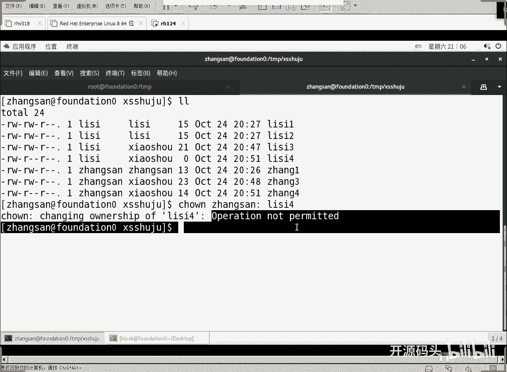

# RHCE RH124 之7 Linux权限及特殊处理(6) - P1 - 开源码头 - BV1eG4y1a7hv

VM加目录底下的巴RC在巴沙德的最末尾重新定一下U must啊，因为什么？因为它在这里调用是不是？在这里调用的时候，U must还是002啊，等它一句一句执行到这最末尾。

U mask由002又被改成了022啊，022就是我们要的。

对吧好，张三李四解决权限的方式基本上是完美了是吧？销售部的数据啊，任何销售部的人员创建的文件自动都属于销售组。然后这个销售组呢都可以互相看对方的写字己的。能不能删对方的文件？删文件早就解决了吧。

啊删文件是怎么解决的？stake嘛，是这个解决的嘛啊组名遗传是这个解决的嘛。对不对？OK好，那呃这样呢基本上就解决的非常完美了啊。比如说张三想山李四。李4四文件啊，小山回撤yes。啊，那是不允许的是吧？

你张三想三李四的不可以是吧？OK好了，那这样的话呢，我们的所有的解决方案呢就趋近于完美啊，这里还如果说对于。那种完美主义者来讲的话啊，那就是这个阿er呢是多余的是吧？这个阿权限轮也轮不到。

就因为能进入这个目录的人，就不存在销售组以外的人。所以说任何人的权限都不会轮到阿。阿权限呢可有可无了是吧？在这里来讲究other权限就算是废掉了啊。OK好，基本上就这个样子啊呃。

我们的特殊权限处理的。就有用了是吧？哎，我们用了两位啊，一位这个一位这个。好。

我们在幻灯片里面给他做一个描述，好吧。呃，练习是吧？好，那这样做完之后呢，我们又做了一些什么操作？又做了什么操作？设置。这是完美度啊，就是所谓的补呃补充啊。补充操作啊。

补如除了我们上面所做的这些操作之外，补充操作啊就是设置tick。设置这个为啊。STICKY是吧，take。设置stick位。啊呃。只允许。删自己的文件。这是第一个第一个处理是吧？啊，那么第二个处理呢？

设置。し。st GID位。啊，设置职业地位啊，让这个呃。让目录的主ID。遗传给。文件。啊，一开这个目录里的文件。内部的文件。那，我们这样补充完之后呢啊还做了一个操作。啊，修改。

用户配置文件you must设置为022。啊，我们做了这么几个补充之后。基本上我们的那个目录下的数据呢基本上趋于完美。这个权限解决方案趋于完美是吧？每个人都可以创建自己的文件。

修改自己的数据啊嗯那么所有的文件呢都属于销售组。啊，因为除了属于用户，还得属于一个组，都属于销售组。然后呢，呃我们每个人呢都可以看对方的文件。啊，都可以看别人的别的销售组成员的文件。

但是不能改人家的数据。啊，这样的话这个这个整个权限的设置呢趋于完美的解决啊，也就是说我们除了那个呃除了我们的那个什么基本的优质权限之外，我们又动用了三个操作，一个是tick way。

一个是set GID位是吧？一个是什么呢？有m。又动用了三个操作，这三个操作补充完之后。这个销售部的销售数据的保存基本上去于一个完美的解决方案。啊，好了呃，还有一个我也没说。第一个位对吧？

就是我们的那个三个特殊处理的。第一个位啊，这个部分我们暂时不管它哈，这个部分我们没有多大用途啊，可以付给一个可执行文件，但是没多大用途啊。这个为的做这个用途呢和这个位的用途是类似的。

只不过呢体现在体现到用户身上，更加明显，而不是体现到组身上啊。这个功能体现到用户身上是最明显的。😊，那么这个位呢和我们之前讲的那个权限的那个案例啊，这个练习案例呢没有关系啊，一点关系都没有啊。

这个主要是做什么用呢？这个主要是二进制。如果说把一个可制性文件。把一个二进制的可视性文件啊，如果设置了这个。这个位叫setUID位啊，我们刚刚这个位是叫set GID啊，这个位叫sUID。

如果设置了用户IUID的这个这个位数的话呢。啊，当然也只能付给二进制的可制性文件啊，批处理就是那种脚本都不行啊，必须是二进制可制性文件。因为这个代码是不可再分。我们的脚本的话，每一行命令都是独立的。

但是二进制代码呢，它里面呢就是一个整体的一套代码是吧？只能付给这种文件啊。然后呢，这个文件呢会以文件会以所属用户身份来运行。文件会以所属用户的身份来运行。什么意思？我们来看一下这个实例就可以了啊。

看啥呀。啊，我们不用啊，看到D退了，呃，留个root好吧，留个root看D。Comedity。count dcount着 d counter d退啊，count着 d退只留一个root。

只留一个窗口就可以了啊。好，我们来看一下这个这个命令啊，我们找一下这个命令，which大家还记不记得那个呃。pass word这个命令。这个命令是不是修改密码的命令？修改密码问件是不是？

我们root可以给任何用户改密码。但是用户自己可可不可以给自己改密码？我们在任何系统里面，是不是用户都得给自己改名，都可以给自己改名码。哎，所以说呢。这个时候面临这么一个问题。如果说。

我张三可以改自己的密码。那就意味着张三是不是可以。对这个密码库进行写入。就沙豆，这是不是密码库啊？如果我张三可以改我张三的密码，是不是意味着张三就可以把这个沙特文件里的自己的密码那一行改掉。

那么你既然能对这个沙的文件进行更改。那你是不是可以更改杀道里的任何行，包括李四的密码也可以改了。啊，但是实际上我们看到了沙头这个文件对于用户的权限是什么？任何人对这个文件都是没有任何操作权的。

包括root在内。当然，root受限嘛？root是不受限的，但除了root之外呢。张三李四，他们能读这个文件内容吗？读都读不了。啊，就是对于。任何人的权限就是UGO权限全是空。那么。

我们张三如果用password改自己密码的时候，怎么就把这个。就调用这个pasword的改密码，怎么就把这个里头的张三自己的行就给改了呢？我们来看一下。我们刚才不是找到pas word这一个命令吗？

找到它在这里吧。😡，在这里啊LL看一下它的权限。这个二进制可执行文件毫无疑问，是改密码的文件吧，改密码的可执行文件。它的权限呢，你看设置了一个用户的SV。也就是它设置的UID了，setUID设置了。

那么这个UID设置完之后，作用是什么呢？就是这个命令一旦执行起来，不管谁用这个命令，都是以这个文件的所有者。他的身份在运行。啊，都是root身份在运行。那么既然张三调用了pass word改密码。

张三是不是就理所当然的？Shi。这个这个命令一旦运行起来，要改密码，是不是就是以root身份再改密码了，就不是张三在改了。李四仪样李四要运行是不是也是一。一旦运行这个命令来改自己的密码。

是不是就变成root设份在运行？就这个命令本身并不是李似运行的，是root的运行。对吧这样的话就可以改这个杀豆里的。明白了。那那有些人就说那这样不是李四就照样可以改张三密码，张三照样可以改李四密码。

no，这个命令本身还做了一个属性操作，counttr shift T啊，conl shift T，然后呢竖杠到竖杠到张三。密码是red hot123shiftft123。是吧还记得昨天我们改的密码。

张sonreaddhead123shift123是吧？好，张三进来之后呢，你看啊PWD。😊，回去。当前密码回答，然后改成什么密码回答是吧，这是不是张三把自己的密码就改了。哎，张三坏心眼来了。张三说。

我想把李四的密码给他改掉。回 up。好。password这个文件本身又做了一个编程的上面的一个规范，就是说只允许root指定后面的用户名。如果你不是root的话呢，你只能用这个命令，而不能用这个命令。

而不能用后面加里四的这个命令。因为只有root用户在调用password的时候，才可以在后面指定用户名哎。这就解决了那个张三改不了李四。呃，李四也改不了张三的问题了是吧？

就是解解决了那个张三想改李四改不了，想改李四，李四想改张三，但是呢你改不了，为什么？因为调用者。调用这个文件的人啊，虽然这个文件运行起来之后是李是root身份。

但是你调用者呢必须是root才可以在后面加李四这个名字啊。如果不能加，你只能打这个，只打这个就只能改自己的密码。好好吧，嗯，到点了啊到点了。好，那我们。set UID的作用就是这个样子，好吧。

set uID作用就这个样子。那，我们能不能可以给它做一个示例出来啊，做一个示例出来。好，我们再来看一下呃。我们以张三的身份来做一个操作啊，CTMP下面的。呃，销售数据啊。

当然这个跟我们的那个原来那个案例没有任何关系了，我们就是以张三的身份去想做一个操作。比如说张三想把这个呃李四的文件改成改成。张三啊。榨菜会这么做啊，清洁熬的。张三冒号张啊，当然后面我们就不写了。

后面还是销售吧。好吧，我们要把李四四这个文件的所有者改成张三。李四想改这个呃，张三想删除李四四文件嘛，对吧？哎，张三呢就想了个办法，不是只有所有者才可以删除这个文件嘛。

我把我我把他的所有者改成张三不就行了吗？亲骄。张三啊主部管啊，冒合后面的主部管，然后呢。历史。李四四的这个文件，我把李四文件的所有的改成状态，但是能改吗？操作是不允许的。

然后呢，张三就请root呢吃了顿饭。root就给张三想了个招。啊，root怎么做的？首先我得找一下那个称之mod的啊。首先我们找一下changemod啊，WHICHchangemod啊。

changeown啊，changeown这个命令这个命令呢在这里是吧？LL看一下这个命令的权限是什么样子的。很正常，是不是哎，任何人都有X权啊，那么这个这个命令。只有root可以调用了。

你张三是无权做这个特权使用的对吧？那我root呢给张三开了个小后门啊，root告诉你，告诉这个呃，张三，你以后呢，你就用这个名字叫改。改名儿。啊，就是改名一这个命令改名一，然后把它改成张三冒号李44。

你就用这个命令啊，用改名一来，这个命令也只有我root和你张三能够能够有这个交情，我我给你专门做一个命令。那root怎么做呢？root是这。把这个文件拷到这个USR下面的BIN下面的什么改名一。

然后LL再看一下默认权限，是不是还是原来权限来了，轻之什么 change之model。啊，然后给这个一给这个U加上个S。再来看一下。这个是不是设置了UID了？啊，注意啊。

这个改名一这个文件名只能张三指导，其他任何人都可以调用的。因为什么？一旦任何人调用这个改名一这个命令的时候，都都变成了谁在运行，都变成了root的权限是吧？所以说他就能运行成功啊，然后张三就开始玩了。

回车。😊，竟然不报错，然后再看一下。哎，李思思的所者变成张三了。啊，这就是请人家root吃顿饭，root给张三开了个小小命令，这个小命令其实就是还是那个changeown啊。

因为它是呃把这个change owner。考了一个新的执行命令啊，这个执行命令呢无非就是给它加了一个什么加了一个。set UID哎，一加这个okK好了。啊，任何人都可以掉。

但但是呢root告诉你这个命令就你知道啊，你不敢告人，你告人了就完蛋了。然后张三把这个李四问李四的所有者改成张三之后，可不可以删除李四了？RM044黑车。连问都不问，回车，李思思还在吗？不在了。

因为张三是在删自己的文件。啊，李四四是张三的所有者，张三就删自己是所有者的文件，一下就删掉了是吧？就把这个李四删掉了啊，那这种命令是什么东西呢？啊，原始命令是不允许。原始命令是正常的权限啊。

读写执行对执行是吧？好，那么当呃有管理员希望让某个人可以使用这个特权操作的时候，那就是说你调用这个命令的时候，以你的所有者的身份运行，就是把你这个X变成什么S。二进制可执行代码设置了UID之后。

那么这个命令的运行将是以它的所有者的权限在运行。啊，就是root的权限在运行，所以说就能改了啊，能改真改了是吧？他先改了，先改了李四的文件名啊，先把李四的所有者改成张三，然后就删了这个李四4。好。

这就是但这个这个软件敢不敢泛滥泛滥出去，李四也会用啊。李四呃知道了，你你用改名一这个命令来改名字，我也能改啊。我把这个你的章的所有的名字都改成李四，然后我咔咔咔全给删了是吧？

所这东西都不能不能这么乱用啊，所以说不要轻易的设置什么，不要轻易的设置一个二进制可执性文件的UID一旦设置了，那就是root身份可以运行了是吧？任何人调用这个命令，都不是这个人的身份了。

而是root身份在运行，那root可以做任何修改的，对吧？那这个命令的权限，命令的操作权不受任何限制啊。

好，这个set uID啊set uID呃，这样的话权限特出理就完了啊，我们这个权限的描述也就完了啊，整个权限呢也就这么多东西啊，知道了这个东西之后呢。

我们就可以呃完美的解决我们企业应用过程当中的各种需求是吧？再加上Um的加持，这个更完美，是不是啊，那么如果有人说哎呀，我这个权限就就比这个UJO多。比如说我想让张三李四王五三个人各有各的权限。哎。

这个解决不了，我们需要下一本书讲那个什么ACL啊，讲ACL就是在这个9位权限，这应该不是9位了，再加三个特殊处理应经共成12位了，在12位的基础之上再加主体。除了UGO3主体之外的，其他的主体啊。

那么再加主体的话呢，这个权限就变成。ACL权限就不是标准权限了啊。我们今天这本书第一本书讲的是标准权限以及标准权限的特殊处理啊，标准权限的特殊处理是吧？好，这节课结束。

沉默对。いめた。