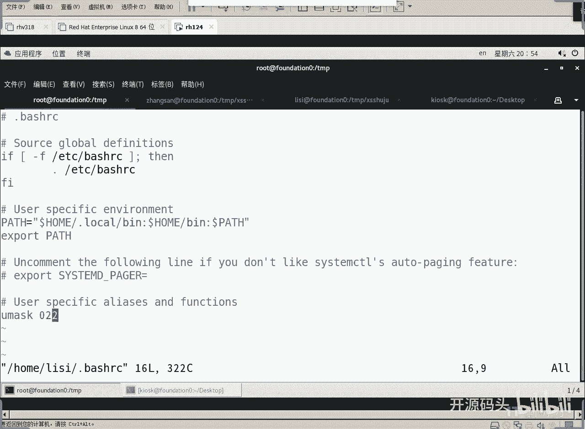
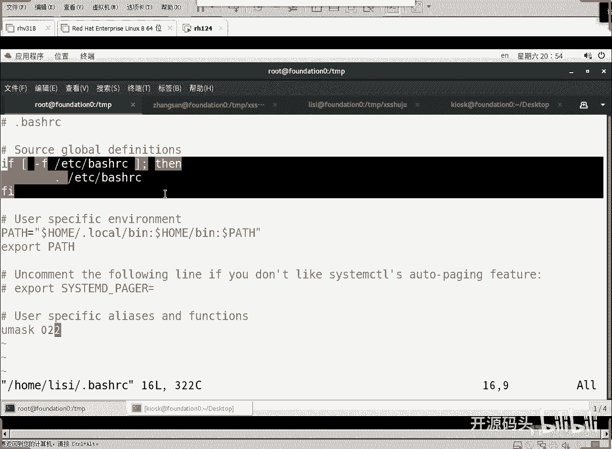
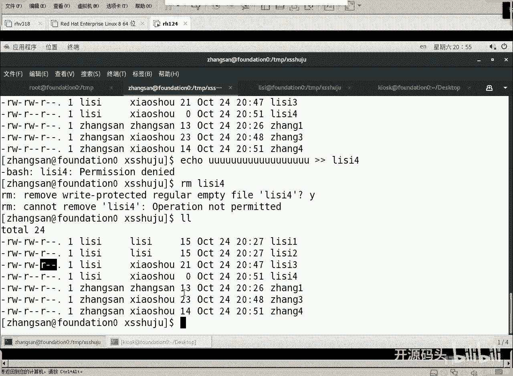
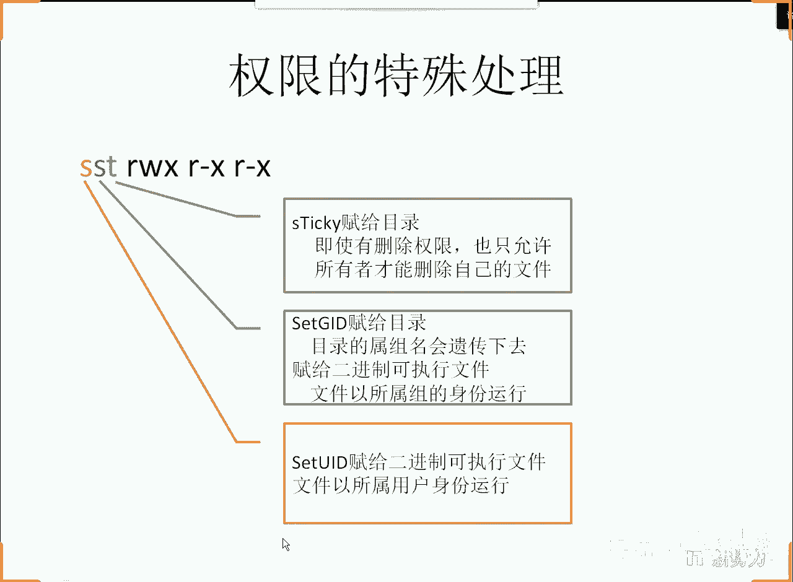
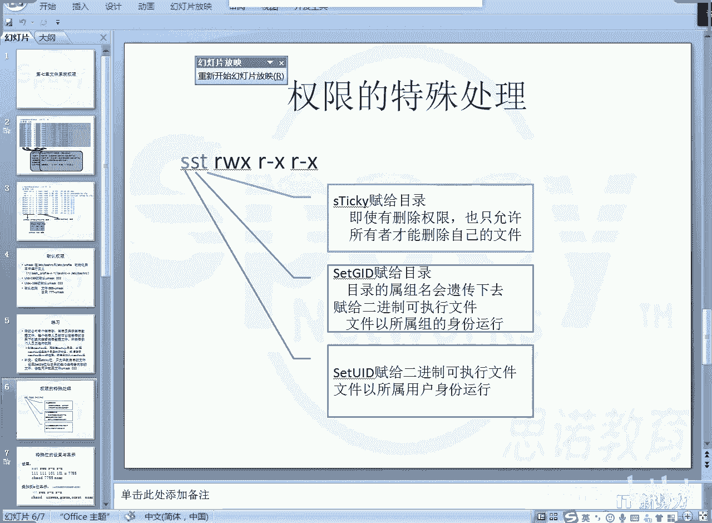
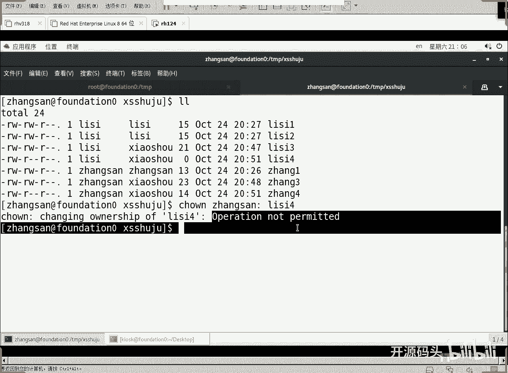
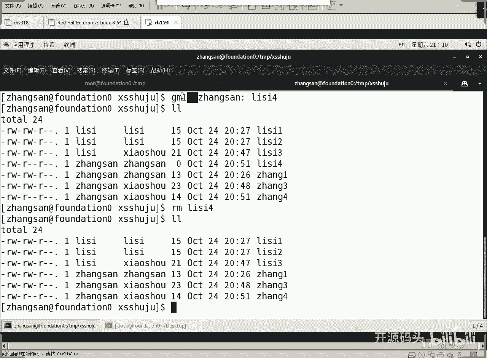
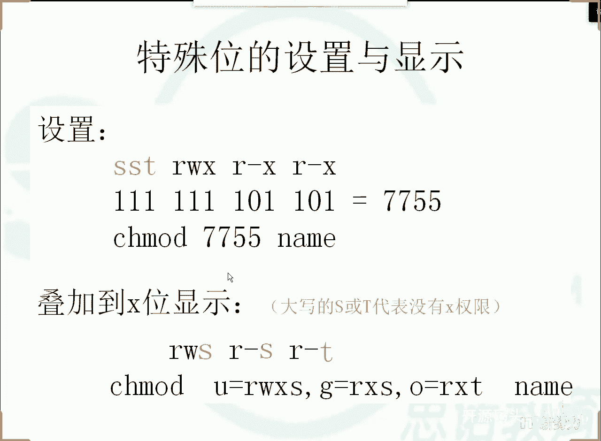

# RHCE RH124 课程：7：Linux权限及特殊处理(6) - P1





在本节课中，我们将要学习Linux权限管理的进阶部分，特别是如何利用特殊权限位（如Sticky Bit和Set GID）以及Set UID来构建更精细和安全的文件共享与访问控制方案。我们将通过一个销售部数据共享的案例，深入理解这些特殊权限的实际应用和配置方法。



---



## 权限解决方案的完善

上一节我们介绍了如何通过设置目录的组所有权和权限来满足基本的共享需求。本节中我们来看看如何通过特殊权限位使解决方案更加完善和安全。

在销售部数据目录的案例中，我们通过设置目录属组和权限，实现了组内成员可以互相查看文件。但为了确保成员只能删除自己的文件，并且新创建的文件能自动继承目录的属组，我们需要引入特殊权限。

以下是实现更完善权限控制的两个关键操作：

1.  **设置Sticky Bit位**：此权限位设置在目录上，其作用是**只允许文件所有者删除自己的文件**。即使其他用户对该目录有写权限，也无法删除不属于他们的文件。
2.  **设置Set GID位**：此权限位同样设置在目录上，其作用是让在该目录下**新创建的文件自动继承目录的属组**，而不是创建者的主要组。



通过执行以下命令，我们为销售部数据目录应用了这些设置：
```bash
chmod g+s,o+t /tmp/sales_data
```
同时，为了确保新创建的文件具有合理的默认权限（例如，组内成员可读写，其他人只读），我们修改了用户的umask值。
```bash
# 在用户配置文件中设置
umask 022
```
经过这些补充操作，销售部的数据共享方案趋于完美：组内成员可以自由创建、查看自己的文件，并能查看他人的文件，但无法修改或删除他人的文件。

---

## Set UID 权限详解

在完善了目录共享方案后，我们来看另一个强大的特殊权限：Set UID。这个权限主要应用于**二进制可执行文件**，而非脚本文件。

Set UID 的作用是：当一个设置了Set UID位的可执行文件被运行时，该进程将**以文件所有者的身份运行**，而不是以调用者的身份。

### Set UID 的经典案例：`passwd` 命令

`passwd` 命令是理解Set UID的最佳例子。用户需要能修改自己的密码，这涉及到向系统文件（如 `/etc/shadow`）写入数据。然而，`/etc/shadow` 文件对普通用户没有任何读写权限。

1.  查看 `passwd` 命令的权限：
    ```bash
    ls -l /usr/bin/passwd
    ```
    输出中权限字段包含 `-rwsr-xr-x`，其中的 `s` 就代表设置了Set UID位，并且文件所有者是 `root`。
2.  **运行机制**：当用户张三执行 `passwd` 命令时，由于该命令设置了Set UID，实际运行进程的身份是 `root`。因此，该进程拥有修改 `/etc/shadow` 文件的权限。
3.  **安全限制**：`passwd` 命令的程序逻辑会进行检查：如果调用者不是root，则只允许修改调用者自己的密码。这防止了用户张三通过此命令修改用户李四的密码。



### Set UID 的演示示例

我们可以通过一个简单的例子来演示Set UID的威力。假设管理员root希望临时授予用户张三更改文件所有者的特权，但又不想直接给张三root密码。

1.  root用户创建一个特殊的命令副本并设置Set UID：
    ```bash
    cp /usr/bin/chown /usr/local/bin/changeowner_special
    chmod u+s /usr/local/bin/changeowner_special
    ```
2.  此时，任何用户执行 `changeowner_special` 命令时，都将以root身份运行。
3.  用户张三就可以使用这个命令来更改文件的所有者，例如将李四的文件改为自己所有，进而删除它。

**重要警告**：Set UID权限非常强大，如果设置不当，会带来严重的安全风险。因此，**不要轻易对任何可执行文件设置Set UID位**，除非你完全清楚其后果。

---

## 课程总结

本节课中我们一起学习了Linux权限管理的进阶内容，重点在于利用特殊权限位来构建复杂且安全的访问控制方案。



我们首先回顾了通过设置Sticky Bit和Set GID位，完善了销售部共享目录的权限模型，确保了文件删除安全和属组自动继承。接着，我们深入探讨了Set UID权限，理解了它如何让普通用户以文件所有者的身份执行特定程序，并以 `passwd` 命令为例分析了其工作机制与安全考量。



至此，我们已经掌握了Linux标准权限（9位）及其三种特殊处理位（共12位）的所有知识。这些工具足以解决企业环境中绝大多数权限管理需求。对于更复杂的、需要为特定用户或组设置独立权限的场景，则需要使用ACL（访问控制列表），这将在后续课程中介绍。