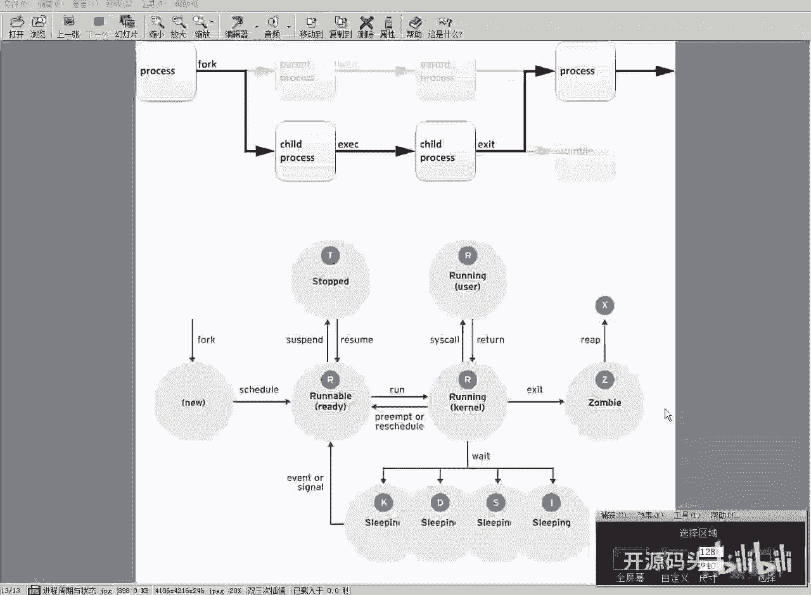
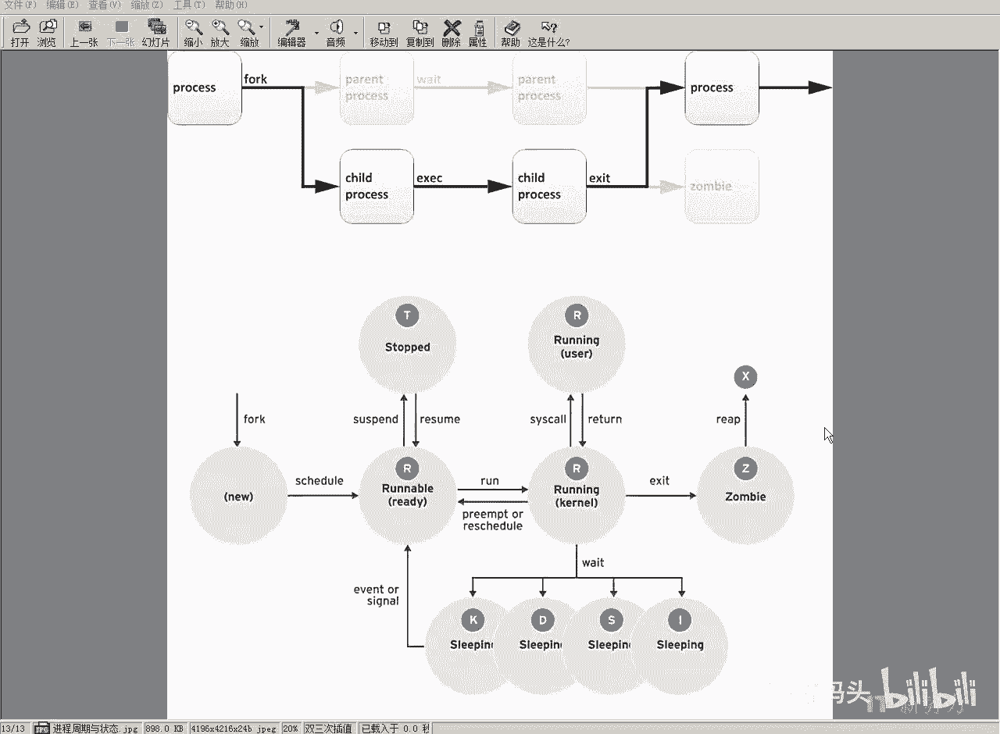
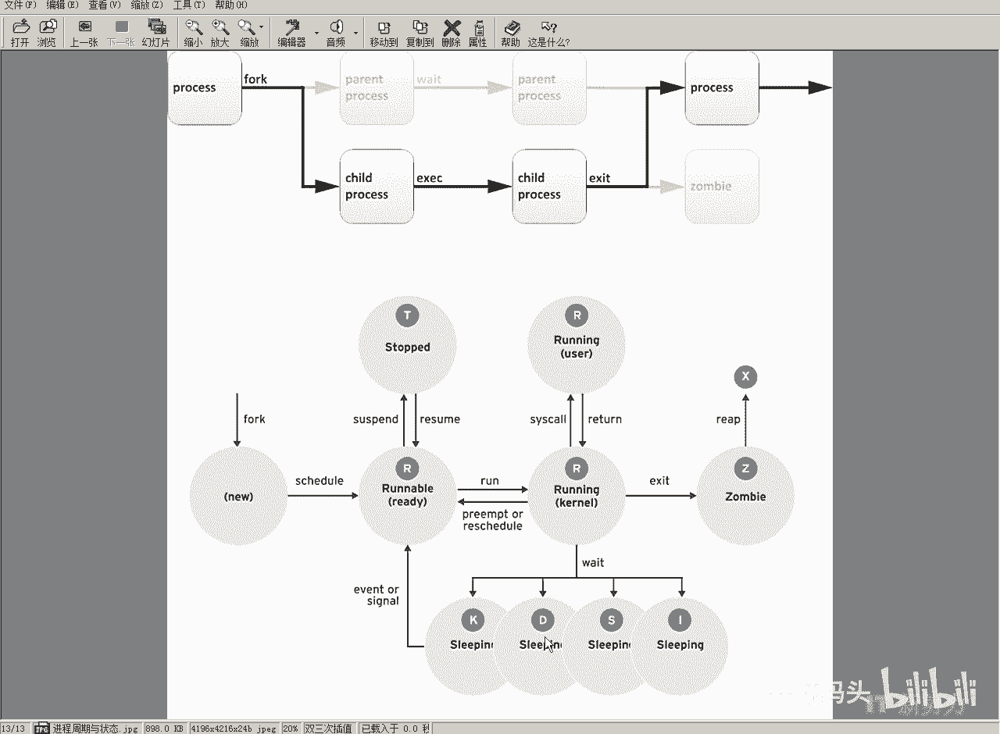

# RHCE RH124 之8 Linux进程管理(1) - P1：8 进程管理(1) - 开源码头 - BV1vW4y1b7h1

好我们接下来看一下这个进程管理啊，当我们编好的程序啊。

编译好的程序呃，二进制代码放在这个磁盘上的时候呢，它叫程序，那么如果说我们在这个shell环境当中进入这个程序的名字一回车，那么我们的shell就会自动的把那个二进制代码啊调到内存当中啊。

然后呢按照这个代码的顺序依次去执行，那么这个时候呢我们的代码呢就开始有了动作了啊，啊控制这个cpu去做什么事情，控制i o操作什么，这个过程当中呢就有了流程了对吧，操作流程。

那么一个程序代码的驱动cpu的这么一个操作流程，我们就把它想象成一个进程，那么进城呢最开始的那个进程啊，是内核里面那个主控进程啊，1号进程天字。

那所有的进程都是由c c m d直接或者间接的通过folk功能啊，通过这个我们的裂变功能裂变出来的附近城在运行，那么在附近程的代码里面，我们可以创建一个新的进程，退出又把资源呢交还给附近厂啊。

那么对于一个进程来讲啊，我们应该规范它的什么参数或者是什么属性，一般情况下呢啊我们首先一个进程要占用一个独立的存储空间啊，就是内存空间啊，还有什么呢，还有相关的这个安全环境由谁来调用它。

那么它的操作能力就是谁的这个操作能力啊，就是安全属性啊，凭证就是它是由哪一个用户激活的对吧，他就会获得这个用户的操作权限，还有一个进程的状态啊，就跟下面这个这个图示一样啊。

就是一个进程他在工作过程当中啊，他会有状态，那我们如何去跟踪一个进程的，最直观的一种方法就是进程id给每一个进程，当它被fork出来的时候呢，给它分配一个唯一的标识。

然后我们按照这个唯一标识呢作为一个句柄，或者作为一个把柄去对它一个相关属性进行探探索进行探讨对吧，那么一个程序呢当被，就是通过这个fox的新新新建运行的时候啊，它有一个就绪状态对吧，就绪状态。

那么如果可运行了就绪啊，那么就是他的状态就是running状态啊，running ball呃，呃等到他的时间片轮到的时候，有些人说还有个时间片的概念吗，我们的操作系统呢大部分操作系统都是分时操作系统。

因为呃从这个历史演进原来看，呃这个情况来看呢，呃我们的cpu呢一开始只有一个cpu是吧，只有一套这个执行指令的这么一个控制单元，那么这个呢呃在这个控制单元里头呢，我们可能同时要运行。

让它运行好多个应用程序啊，好多个进程对吧，那么这个时候的话他宏观上啊让每个进程的都得到一个时间片，然后他呃先给第一个进程运行几个代码，然后再给第二个进程运行一些代码。

这样的话呢宏观上这个进程呢就好像同时在运行一样啊，但是从最微观的角度来讲，我们的那个cpu的核只有一核的情况下，我们会把cpu的时间分成片，分时间片分配给不同的进程啊，然后呢宏观上进程好像同时运行一样。

不过最近几年呢我们的这个多核的cpu越来越多是吧，就比如说现在这个i7 啊，或者是什么都是什么大合的，是大核的cpu呃，物理的四合什么呃逻辑的呃，什么四核八线程是吧啊。

这个我们一般情况下的一个就是说呃硬件的这个一个县城啊，就称其为一个河呃，你买回来的i7 啊，或者是i5 的这种cpu是八核的，或者是呃甚至于现在有16核的，那这个盒多的话呢，那我们就不存在这个什么竞争。

如果在和呃在这个内核比较多的情况下，我们同时处于运行状态的那个进程呢就会多对吧，你要有八核，那么同时处在运行状态的那个代码的可能就有可以有八个，那这样的话呢呃整个这个机器的效率就会很高，对吧好。

那么呃我们处在可运行状态的就绪之后呢，轮到他的时间片，它就开始运行啊，他一开始运行啊，那么直到这么一直分时片，分尸片一直运行完啊，到运行完成之后呢，他退出啊。

退出以后呢就会把资源全部什么交还给我们的这个附近厂啊，其实我们整个系统的附近城是谁啊，这个进程呢他负责生成所有其他的进程，以及了监控所有进程呃，退出之后呢呃停止啊，然后呢释放资源啊。

这样最后这个信息就这个进程就算是使命完成对吧啊，那么在这个运行可运行状态或者是运行状态的时候呢，我们的系统呢可能会对它进行一些什么，进行一些这个呃所谓的叫信号啊，或者是中断啊。

你比如说啊我们可以让一个已经分配了资源的进程，让他暂停资源，他占用，但是呢不运行它啊，不是去run的方向，而是去什么呢，去休眠这个方向，对吧啊，暂停啊，处在暂停状态的这个进程的啊，他是占用资源。

但是呢没有这个执行代码，那么我也可以恢复它执行恢复执行之后呢，马上就开始让内核去执行它对吧，ok好那呃运行状态的程序呢，他有可能什么事都不做啊，他有可能是等待用户的这个调用，或者是等待什么呢。

等待这个呃就是呃系统的中断，io的这个信息中断信号过来是吧，我们比如说网卡也好，或者是什么键盘也好啊，像这种事情的话，就是如果有人输入信号，如果有信号有信息要过来啊，他才会从这个被中断，被中断之后呢。

才会什么才会去取数据，才会去运行，那么大部分情况下呢，它在等待这个事件的发生，对吧啊，所以说实际上一个程序它真正占用cpu的这个时间片是非常非常短的，除非你给他一个就是批量的任务。

或者是大量的数据读写是吧，那这种情况下看到cpu的就是在做io的时候呢，一般用的还不是cpu的这种呃时间片啊，它一般就是什么io，有专门的这个板卡去去负责，然后数据交流完成之后呢，给cpu一个中断。

让这个cpu去处理这些数据啊，所以说真正的cpu占用的时间片段其实是很少很少的啊，就是一个进程占用cpu的时间片的量是很少很少的，大部分时间都在什么等待的用户的这个呃动作啊，或者等待一个什么磁盘的动作。

或者等待一个别的啊网卡呀，声卡呀等等这些信息是吧，麦克风的信号，那这些东西都有专门的呃板卡拿来负责的i o，然后呢io完成之后呢，给cpu一个信号，让cpu继续处理就可以啊。

所以说呢在等待的这个时间量上，从用户角度来看的话呢，其实用户感觉自己没没有停啊，他一直在说话或者一直在说，其实呢我们的机器是非常轻松的，就可以把你的事情，把你的数据呢啊给您现代化呃，接收下来。

然后呢都接收到一定的我们约定的量之后才会激活什么，激活这个程序进入run的状态，才会处理你的数据对吧，所以说我们那个大部分情况下都是sleep状态啊，就是这种休眠的状态，那么s状态是什么呢。

是等待某一个条件的这种发生是吧，比如说呃硬件请求系统资源访问的，或者是呢呃系统给他发送过来一些信号啊，要求它进行操作的一些信号啊，那么当这个事件或者信号满足条件的时候呢。

那这个进程呢就会返回到可运行状态，被调度运行，那么还有一些不常见的，比如说d啊，d这种状态呢呃是什么，是不会响应信号，就是你给他发送信号的时候，他不服，他不管你啊。

他在呃就是顽固的去等待自己的那些硬件的中断或者是其他事件发生，但是你给他信号的时候，他不不反应，也就是说如果这种情况的话，你想让他退出的话，你给他一个退出的信号。

他是不会退出的。