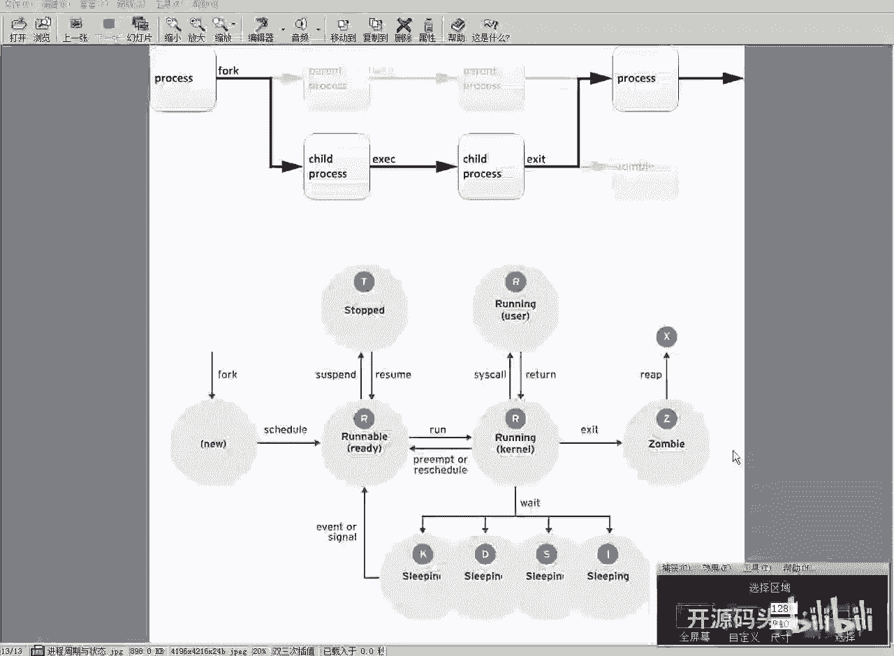
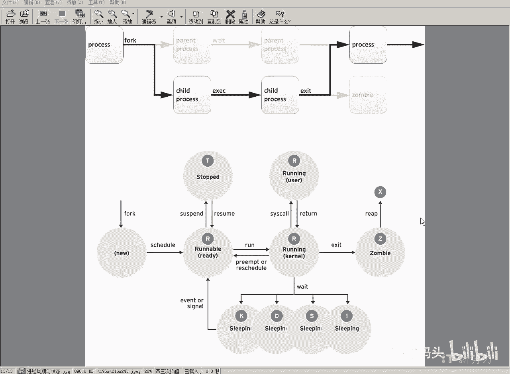
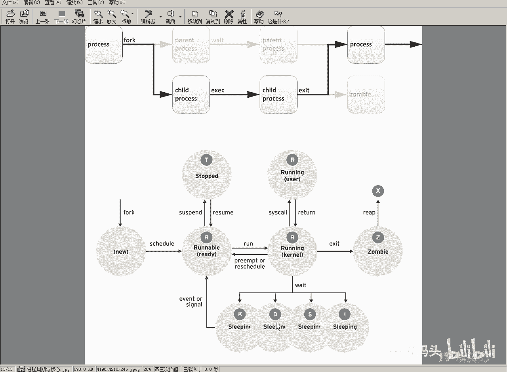

# RHCE RH124 课程：8：进程管理(1) 🖥️

## 概述
在本节课中，我们将要学习Linux系统中进程管理的基础知识。我们将了解什么是进程、进程的生命周期以及其基本状态，为后续深入学习进程控制打下基础。

---

## 什么是进程？
当我们编写好的程序，经过编译后生成的二进制代码存储在磁盘上时，它被称为**程序**。

如果我们在Shell环境中输入该程序的名字并回车，Shell会自动将该二进制代码加载到内存中。

随后，系统会按照代码的顺序依次执行指令。此时，代码开始驱动CPU执行操作，控制I/O等，这个过程就形成了操作流程。

一个程序代码驱动CPU的操作流程，我们称之为**进程**。

---

## 进程的起源与创建
系统中最开始的进程是内核里的主控进程，即**1号进程**（通常是 `systemd` 或 `init`）。

所有进程都是由这个初始进程直接或间接地通过 `fork()` 功能“裂变”产生的。子进程在运行时，其父进程的代码可以创建一个新进程。当子进程退出时，它会将占用的资源交还给父进程。

---

## 进程的属性
对于一个进程，我们需要规范其参数或属性。主要属性包括：

*   **独立的存储空间**：每个进程占用独立的内存空间。
*   **安全环境与凭证**：进程的安全属性取决于调用它的用户。进程会获得激活它的用户的操作权限。
*   **进程状态**：进程在工作过程中会处于不同的状态。

---

## 进程标识与状态跟踪
我们跟踪进程最直观的方法是使用**进程ID（PID）**。每个进程在被 `fork` 出来时，系统会为其分配一个唯一的标识符。

我们可以通过这个PID作为“句柄”，来查看和操作进程的相关属性。

一个程序通过 `fork()` 新建并准备运行时，首先进入**就绪状态**。

当它获得CPU时间片，可以开始执行时，状态变为**运行状态（Running）**。

---

## 时间片与并发执行
我们的操作系统大多是分时操作系统。从历史演进看，早期CPU通常只有一个核心（一套执行单元），但却需要同时运行多个应用程序（进程）。

系统会将CPU时间划分成极短的**时间片**，轮流分配给各个进程执行。这样从宏观上看，多个进程就像在同时运行。

不过，现代CPU多为多核（例如四核、八核甚至更多）。每个核心可以独立执行一个线程。因此，在有多个核心的情况下，可以真正同时有多个进程处于运行状态，从而大幅提升效率。

---

## 进程的生命周期
进程从就绪状态获得时间片后开始运行。

它持续运行直至任务完成，然后**退出**。退出后，进程会将其占用的所有资源释放并交还给父进程。

系统中负责生成所有其他进程、并监控它们退出的初始进程，就是所有进程的最终父进程。

---

## 进程的等待与休眠
处于运行或可运行状态的进程，可能会被系统暂停。此时，进程仍然占用资源，但不再执行代码，进入**休眠/暂停状态**。

之后，我们可以恢复其执行，内核会继续运行它。

运行中的进程也可能在**等待某个事件发生**，例如等待用户输入、等待网络数据或等待磁盘I/O完成。在等待期间，它基本不占用CPU时间片。

实际上，一个进程真正占用CPU进行计算的时间非常短。大部分时间它都在等待各种事件。例如，进行I/O操作时，通常由专门的硬件负责，完成后再通过中断通知CPU处理数据。

因此，从用户角度看操作是连续的，但系统实际处理起来很高效。

---

## 特殊的进程状态
除了常见的运行、就绪、休眠状态，还有一些特殊状态：

*   **可中断睡眠状态（S）**：进程在等待某个条件发生，例如硬件请求或系统信号。当条件满足时，进程会返回到可运行状态。
*   **不可中断睡眠状态（D）**：进程在等待某些硬件中断，但在此状态下**不会响应任何信号**。这意味着即使你向它发送终止信号，它也不会退出，会顽固地等待自己的事件完成。

---

## 总结
本节课中，我们一起学习了Linux进程管理的基础概念。我们明确了程序与进程的区别，了解了进程是如何从初始进程衍生出来的，并认识了进程的核心属性（如PID、内存空间、用户凭证）。我们还详细探讨了进程的生命周期和几种关键状态（运行、就绪、休眠、不可中断睡眠），理解了多核CPU与时间片调度如何影响进程的并发执行。这些知识是后续进行进程查看、控制和调优操作的基石。