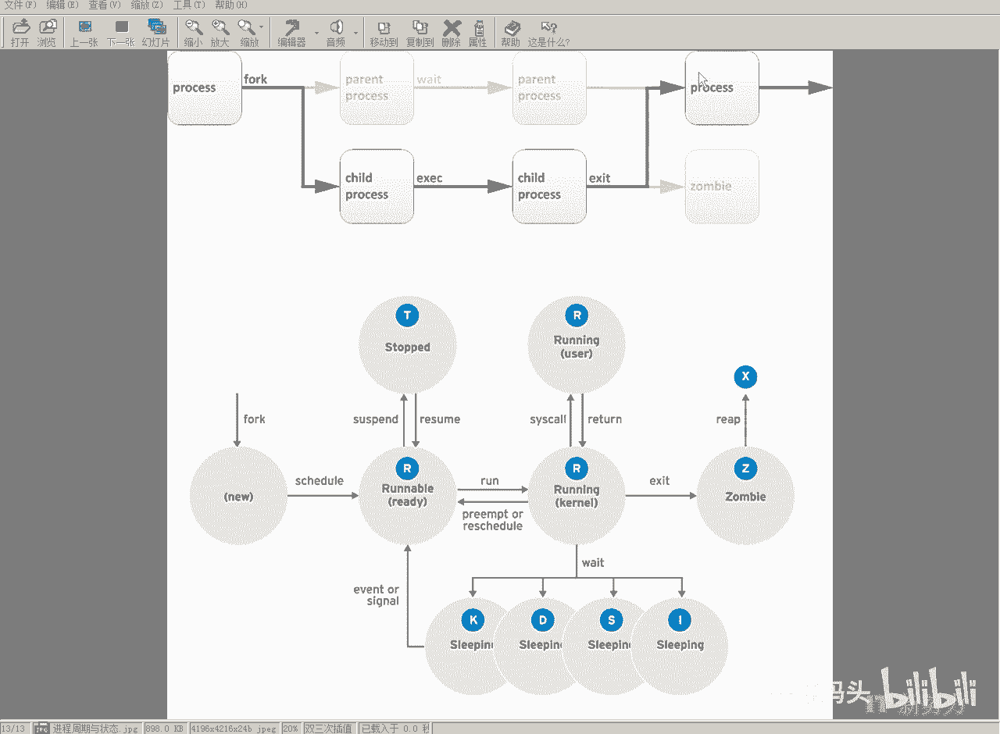
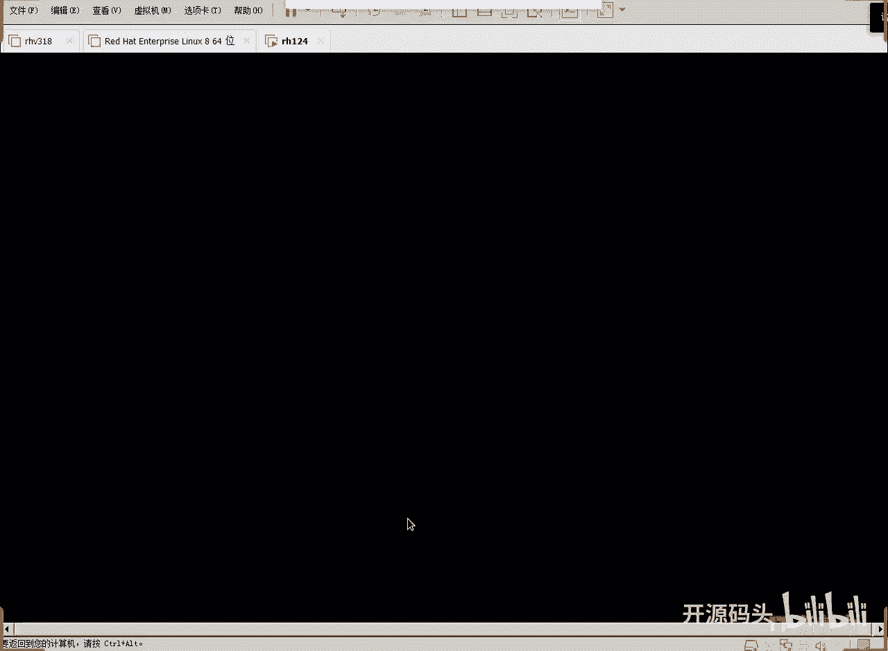
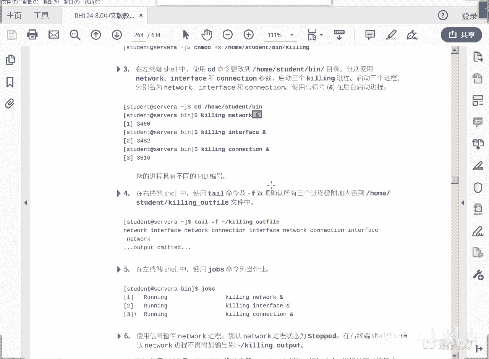

# RHCE RH124 之8 Linux进程管理(2) - P1 - 开源码头 - BV1tG411b7WH

啊，还有一种就是K状态啊，K状态的话呢。可以接收。退出的信号。啊，就是说呃它跟地差不多啊，但是呢他可以接受这种呃退出啊，就是你给他一些呃。中断退出信号的时候呢，它是可以响应的。

也就是说比D呢稍微火一点是吧？啊，还有一个是I啊，后面这个I这个状态，那么处在I状态的这种休眠呢呃是等待状态啊啊它是属于一个什么属于一个也是属于一个非正常的一个呃D的一个相当于一个子集啊啊就内核在做这个。

统计我们的这个复核的时候呢啊它不统计这些进程啊，一般情况下呢，这应该是这种状态呢，应该是给予给于那些呃内核本身这些线程用的啊，内核本身所呃分出来的那些子进程或者县程用使用的。但是呢他也接受这种呃。

意外发生的这候这种致命的这种中断信号啊。所以其实这些等待状态，sleep是最正常的，其他状态呢可能会呃除了D不影响我呃不响应我们的信号之外，其余的其他状态呢其实还是可以响应的。

响应意外事件和退出这种重要信号，呃，希望它不要过于就是过于封闭啊，免得我们给它给它就是发送信号的时候呢，它不至于呃一天反应都没有啊。当然，这种进程往往是内核级别的比较重要的进程啊。

不允许呃轻易的被干扰的这种。呃，内核进程。那么在程序退出的时候呢啊还有两个状态，一个是Z，一个是X是吧？呃，这个Z呢是呃紫禁城啊向这个附禁城呢发出退出信号然后呢，仅仅是等待附禁城给他一个回应，说好。

我知道了。那么在这段时间量上呢，他是不占用资源的啊，资源全部已经释放，只剩下一个什么进程ID啊，就是自己已经其实已经退出了，但是呢还在等待附禁城给他一个确认啊，那么如果附禁城呃。知道之后呢，附近城会呃。

复核一下，就是紫禁城的资源是否呃回收彻底。啊，那么如果说已经呃没有任何事就是意外是吧？就是说附近附近城把紫禁城所占有的资源全部回收。啊，呃全部清理。那这个时候呢就彻底释放啊。

这个状态就是X那这个状态应该是看不到是吧？因为它已经处于那种。退出的状态啊X。

Okay。啊，刚才描述了一个进程的生命周期。那么下面呢我们从任务管理的角度来认识一下linux的进程管理。什么是任务？用户在同一个终端中。注意是一个终端里头啊，可以起好多个进程。啊。

那么我们把这个用户启动的进程称为什么？任务。在一个终端中，用户可以启动一个或者多个进程。那么这个时候我们把每一个进程称为一个什么任务啊，当然一个任务呢有可能再去调用别的进程，这个时候就成了什么？

一个或者多个进程可以构成一个任务。啊，那么。任务管理呢其实就是用户管理自己的作业。或者用户管理自己的启动的命令，对吧？那么由于是在一个终端窗口里面，所以说同一时刻应该只有一个终端呢有IO。啊。

或者是O out输出，有可能呢别的程序也能输出到终端上啊，但是输入的话呢。确定就只能有一个啊，就是用户启动多个任务之后呢，同一时刻只能有一个进程啊。

可以占有这个input占有输入的这个终端在终端里面占有输入。那么终端一旦有人输入的话，为一个进程解决输入的时候呢，别的进程肯定不能占有这个终端。啊吧，所以说呢这种进程属于什么？

占有终端的这种进程就是前端进程。啊，叫做前端作业。那么。一若干作业里头应该有一个是占有的是吧？那么占有的这个叫前端，那么不占有终端的这个这些作业呢，都属于后端啊。

那我们呢今天呢来简单的就是说呃演示一下怎么样能够实现多个终端啊，多个作业呃，前端后端的这种调用，好吧。好，我们来看一下。

启动虚机。好，我们来看一下这个课程。8。0中版124。好，我们来看一下啊，呃它需要在work Z上运行一个processq start这么一个准备啊，准备脚本看能不能进去啊。

sSit works station。好，现在呢我已经登录了workation的这个。登录到work stationation的这个界面里面了是吧？然后哦我这个可能刚才还需要两需要两个两个终端窗口是吧？

control shift T开两个啊。好，第一个登录到servASERVR。啊，如果要用student确定用student，那我们就写一下，好吧，tudent的时候A。登录进来啊。

然后呢另外一个窗口也是啊SSH啊。啊，然后呃我们编辑这个脚本啊，VIM啊先创建一个目录，好吧，makeDRBIN。然后CDBIN。VM。Killion。啊，回去。呃呃，井号惊叹号。要。

BIN下面的bu士。啊，这句话的意思是什么呢？就是以下的语句要求用BN下的buss这个呃解释器来解释执行。当然你也可以把bus换成python，那就是说下面都是python指令了，对吧？啊。

我们还不涉及那多啊，我们就用我们的buss指令就可以了，好吧，然后嗯will。处e。啊，然后度。大。这是一个循环体，在循环体里面啊，我们。在循环题里面呢，我们就是呃加一个。你看它是一它这个度呢没有换行。

是不是有个分号分开了，一行里面有多个命令用分号分开。我刚才换行了是吧？然后一口一个什么东，一口一个doart，那么do了打头的其实都是变量。我们把这个doar加个空格，然后输出了一个文件，好吧好。EQ。

杠N杠N代表输入完输出完这个内容之后不换行啊，引号引住里面呢呃用个呃要叫做呃doller art。到了二台这个特殊的符号呢代表的是我们脚本调用的时候，后面加了一个参数，这个就是参数。

把参数呢显示的追加到夹目录下面的叫做。Q in。哎，就这么个操作啊，很简单啊，那么以后我们会详细的聊怎么样呃做这个脚本编程啊，但是这个脚本编程呢其实也很简单是吧？这是一个唯有循环。

唯有循环就是在度度和档中间的循环体，它在不断的去做循环。对了？我们这样去做的话，速度会非常快是吧？机器全力以赴做这个事情，速度超级快，所以说我们应该什么让它每做一次呢休眠上什么5秒钟。好吧。

OK存盘退出。来来着我看一下啊，这里是不是有个。呃，有个文件是吧？有个我们做好的脚本文件change mode所有的主体都加一个X权。啊，这个时候再看一下，哎呦呦呦。

我们能看到任何人都可以执行这个命令是吧？好，我们呃用那个呃。可用student的身份来调用一下啊。点撇当前目录下的Q in这个指令啊这个命令。然后我们第一个是什么？呃，第一个我们给他写一个。

它是network嘛，是吧？啊，net work。啊，就这个单词仅仅就是个单词而已，它会把这个单词呢输出到我们的一个文件里面，我们开始输出啊，飞车哎。我们没有写那个鱼，它就是前端运行是吧？

前端运行占有我们的光标是吧，这个时候。我就没法再做别的操作了是吧？好，我们ctrol C给它中断它啊，ctrl C看到吗？就可以中断一个程序运行啊，我们这边呢呃我们重来啊后面加一个什么，加一个余。

也就代表这个程序是后台运行。其实这是第一个作业。这是它的进程号，1246它的进程号。我们从另外一个窗口里面。他要杠F。他要杠F的意思是持续查看一个文件的最后的信息。

加目录下面的那个que in out file是不是回车，你看每隔5秒钟输出一个network，对不对？好，继续我们再来一个，把network换成别的单词。他的第二个是什么单车？

他用的第二个是什么interface connection啊吧？再来啊。还有一个conogniition。好，那么一共三个作业啊一共三个作业啊，然后呢进程号分别是这个。啊，我们这边你发现了没有？

network interface connection。Network interface connection。是不是把三个字母都都加到这个文件里面来了？我们持续的监控这个文件的内容是吧？好。

三个后台作业。都在往这个文件里写东西。啊么下面我们来调度一下啊。首先呢我们在打命令的时候，如果想释放光标，就让它后台运行。后台运行的时候加一个什么于是吧？加一个余号，它就会后台运行啊，然后啊呃。

作业好，进程好啊。