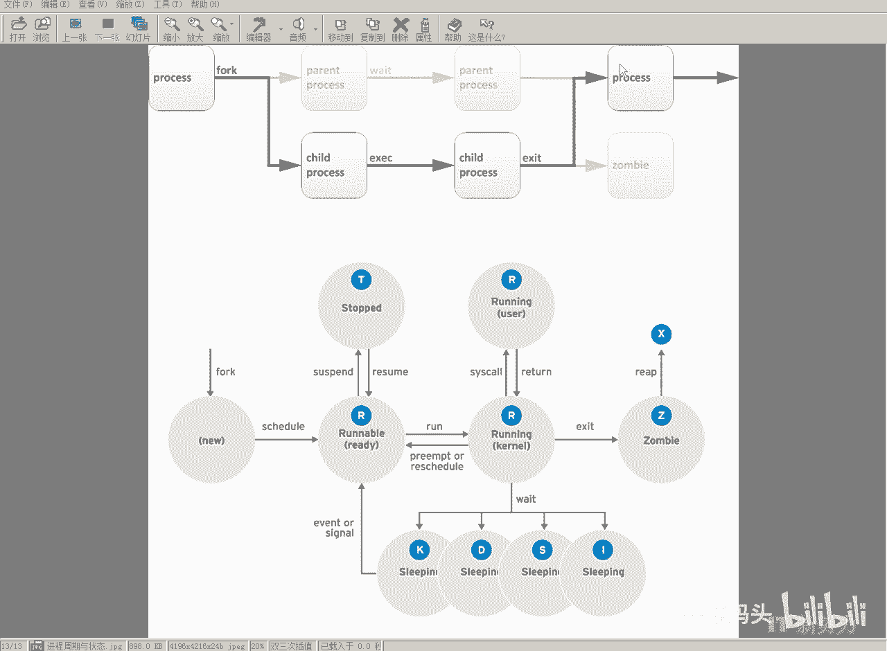
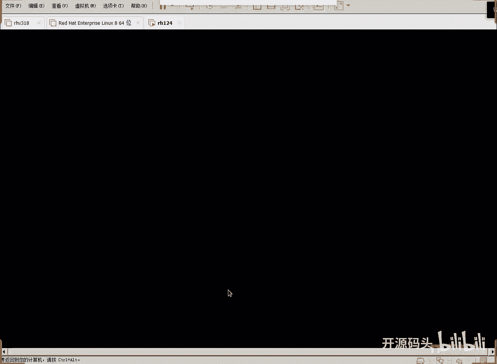
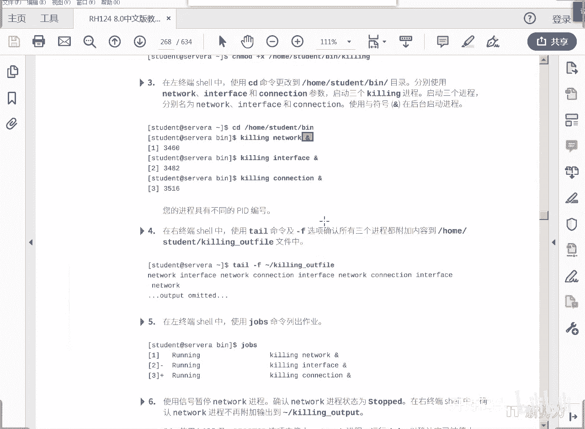

# Linux进程管理：8.2：进程状态与任务管理

在本节课中，我们将深入学习Linux进程的几种特殊状态，并了解如何在终端中进行任务管理，包括前台与后台作业的切换与控制。

上一节我们介绍了进程的基本概念和生命周期，本节中我们来看看进程的一些特殊状态以及如何管理用户启动的多个任务。

## 进程的特殊状态

除了常见的运行（R）和可中断休眠（S）状态，Linux进程还存在几种特殊状态。

**K状态**：该状态与不可中断休眠（D）状态类似，但可以接收退出信号。当向其发送中断或退出信号时，进程可以响应。它比D状态更灵活一些。

**I状态**：该状态属于等待状态，是D状态的一个子集。内核在进行系统负载统计时，通常不计算处于此状态的进程。此状态一般预留给内核自身的线程使用。与K状态类似，它也能响应意外发生的致命中断信号。

综上所述，在休眠状态中，S状态是最正常的。其他状态中，除了D状态不响应信号外，其余状态（如K、I）实际上都可以响应意外事件和重要的退出信号。这样设计是为了避免进程过于封闭，导致在需要发送信号时完全无响应。通常，这些进程是内核级别的重要进程，不允许被轻易干扰。



## 进程的退出状态

在程序退出时，还有两个关键状态。

**Z状态（僵尸状态）**：当子进程向父进程发出退出信号后，会进入此状态，等待父进程确认。在此期间，子进程已不占用任何系统资源（资源已全部释放），仅保留其进程ID。它实际上已经退出，只是在等待父进程的最终确认。

**X状态（死亡状态）**：如果父进程确认并彻底回收了子进程占用的所有资源，子进程就会进入X状态，表示已完全退出。此状态通常无法被观察到，因为进程此时已彻底消失。

## 任务管理

刚才我们描述了进程的生命周期。下面我们从任务管理的角度来认识Linux的进程管理。

**什么是任务？** 用户在同一个终端会话中可以启动多个进程。我们把用户启动的每一个进程（或由该进程调用产生的进程组）称为一个**任务**。因此，一个或多个进程可以构成一个任务。



任务管理本质上是用户管理自己启动的作业或命令。由于所有操作发生在同一个终端窗口内，同一时刻只能有一个任务占用终端的输入（stdin）。输出（stdout）则可能被多个后台任务共享。

以下是任务分类的核心概念：

*   **前台作业**：当前占用终端输入的任务。用户可以直接与之交互。
*   **后台作业**：不占用终端输入，在后台运行的任务。用户无法直接向其输入数据。

今天，我们将演示如何在一个终端中管理多个作业，并实现前台与后台作业的切换与控制。

## 实践：创建与管理后台作业

我们通过一个简单的脚本来演示如何创建和管理后台作业。

以下是创建演示脚本的步骤：

1.  使用 `mkdir` 命令创建一个目录。
    ```bash
    mkdir ~/bin
    ```
2.  进入该目录并使用 `vim` 编辑器创建脚本文件。
    ```bash
    cd ~/bin
    vim qin
    ```
3.  在 `vim` 中，输入以下脚本内容：
    ```bash
    #!/bin/bash
    while true
    do
        echo -n "$1 " >> ~/qin_outfile
        sleep 5
    done
    ```
    *   **`#!/bin/bash`**：指定使用Bash解释器执行此脚本。
    *   **`while true`**：开启一个无限循环。
    *   **`echo -n "$1 "`**：将脚本的第一个参数（`$1`）输出到文件 `~/qin_outfile` 中，`-n` 参数表示输出后不换行。
    *   **`sleep 5`**：每次循环后暂停5秒，以控制输出速度。
4.  保存并退出 `vim`，然后为脚本添加可执行权限。
    ```bash
    chmod a+x ~/bin/qin
    ```

## 运行与监控作业

脚本准备完毕后，我们开始运行和监控作业。

1.  **在前台运行作业**：直接执行脚本会占用当前终端。
    ```bash
    ./qin Network
    ```
    此时终端被占用，可按 `Ctrl+C` 中断该进程。

2.  **在后台运行作业**：在命令末尾添加 `&` 符号，使作业在后台运行。
    ```bash
    ./qin Network &
    ```
    系统会返回该后台作业的编号（如 `[1]`）和进程ID（PID）。

3.  **监控输出文件**：在另一个终端窗口，使用 `tail -f` 命令持续查看输出文件的内容。
    ```bash
    tail -f ~/qin_outfile
    ```
    你将看到每隔5秒，文件末尾会追加一次“Network”。

4.  **启动多个后台作业**：我们可以启动多个作业，让它们同时向同一个文件写入不同的内容。
    ```bash
    ./qin Interface &
    ./qin Connection &
    ```
    现在，三个后台作业（Network, Interface, Connection）会同时向 `~/qin_outfile` 文件写入数据。在监控窗口可以看到交替出现的单词。

## 作业控制命令

以下是一些常用的作业控制命令：

*   **`jobs`**：列出当前终端会话中的所有作业及其状态（运行中、已停止等）。
*   **`fg %n`**：将后台作业编号为 `n` 的作业切换到前台运行。例如，`fg %1`。
*   **`bg %n`**：将已停止的后台作业编号为 `n` 的作业在后台继续运行。
*   **`kill %n`**：终止作业编号为 `n` 的后台作业。

## 总结



本节课中我们一起学习了Linux进程的几种特殊状态（K, I, Z, X），并重点掌握了如何在终端中进行任务管理。我们通过创建脚本、在后台运行作业以及监控其输出，实践了前台与后台作业的创建、查看和基本控制。理解这些概念和操作，是有效管理系统任务和资源的基础。