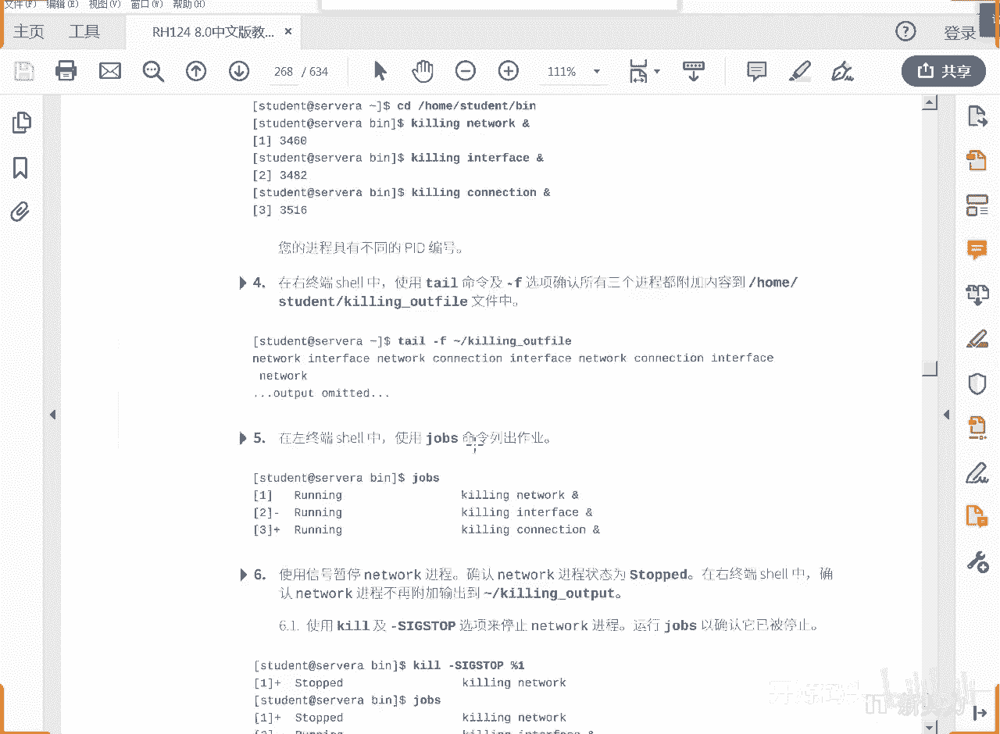

# RHCE RH124 之8 Linux进程管理(3).mp4 - P1：8 进程管理(3).mp4 - 开源码头 - BV1YB4y1V7pZ

然后我们来看一下drops命令，drops呢就是来看一下我们现在运行的所有的啊。

就是作业啊，或者叫所有的任务，我们这边想退出也是ctrl c才能退出是吧，ctrl c从tr里面退出啊，我们来看一下，从这个终端上看dps有吗，是不是这个drop跟什么相关，跟我们的终端相关。

就是一个用户从一个终端进来，另外一个用户呢用相同的用户名从另外一个终端进来，他们的作业应该是互不干扰的是吧，所以说我们是这样定义作业的啊，一个用户打开了在一个终端中打开了一个或者多个进程的时候。

就启动了多个作业，不在一个终端里，虽然是一个用户名，但是他们是互不干扰的是吧，好啊继续啊，那我们这边是不是能看到有三个作业对吧。

三个作业啊，来看一看他玩了一些什么东西啊，看到三个作业之后呢，啊我们想停止第一个作业啊，把network这个停止掉，是不是想停止第一个作业。

想贴纸怎么办呢，q啊用q命令来发送这个来发送信号，发送一个什么信号，三个s i g信号，stop stop，不是退出啊，stop就是暂停好吧，q s i g s t o p stop信号给谁呢。

给百分号一，有人说我写这个1246可不可以啊，可以你写1246就不用百分号了，因为百分号代表的是作业号啊，百分号代表的作业好，而呃直接写然是1246呢代表的就是进程号啊，就是金称号啊，ok好，q掉了啊。

然后啊q呃并不是q掉，把它暂停了，那我们再来看这个东西的时候，你看interface connection，interface connection network停了，network已经不工作了是吧。

输出network的那个进程已经不工作了，我们再来看一下js，你看他已经停止啊，这个中文翻译过来不好，应该是已经暂停好吧，已经暂停啊，呃如果说退出它叫已经终止啊，终止的单词叫terminal。

我们发的不是terminal，我们发的是暂停，ok好继续啊。

他把一个任务给暂停了，然后继续他在看那个内容的时候呢，哎没有network，只有the face了是吧，ok好继续啊，我们把2号作业呢给他什么，给他terminal调啊。

这才是terminal终止一个进程，这就彻底就退出了啊，ko什么kgsor top啊，我们用第二种方法啊。

kg 15 q杠15，然后呢百分号二把2号作业给他一个15号信号，有些人说你你不是写这个吗，森格特命的吗对吧，sgo，然后呢t i m特别的中指是吧，那我用个15代表什么意思，我们用杠l来看一下q杠l。

你看一下刚才的stop是几号，找一下stop stop在哪里，是不是这个信号，我现在要给他的是几号信号，15号信号了啊，看啥呀，q杠15，然后呢，百分好二走drops，已经被终止，已经被终止。

还会显示吗，再来看一下，已经不现实了是吧，就是刚刚被终止的时候，还能看到那么一会儿终止的现场，一旦他退出之后，那就什么都没了，这个时候呢应该network是停的，interface已经被退出了。

就只剩下一个什么抗那个神了是吧，只剩下一个抗那个神。

ok好，这就是对作业或者是对进程的一种控制，给他一个信号就可以了啊，给他一个信号就可以呃，然后呃，把1号3号都给退出了，都退出，那就没戏了，是不是啊，那就没有了，我们，留不留跟他一样嘛，也退出吧。

好吧啊，这就没没有什么太太多的新东西是吧，q还是我们的那个三个terminal是吧，把1号3号也都终止掉。

那就终止吧，按他的顺序走好吧，q25 1/500 3%，drops是不是正在退，三一退出来，时间长了就没了，再看的时候就没了，三个作业全停了。

三个作业停了，你看这边不输出了，这边一个都马上不动了，因为没有人往这个文件里填东西了啊，没有人往这个文件里面填东西了，好这就算全退了，那全退了他他要干啥啊，他要看哦，这个tl进程还在是吧。

他要进程不在我的这个终端里面，但是呢是我们所有的进程里面的之一，所有运行进程里面之一，那么怎么去看呢，哎p杠e f ps杠e就是查看所有的进程啊，ps杠e就是查看所有的进程呃。

我在昨天给大家发的视频讲过啊，常用的组合是a u x是吧，那我们e f呢是另外一种就是带带横杠的这种效果呢。

想看所有的进程就是杠1f f是什么意思呢，f是这个列按照我们的要求的格式去输出就可以了，我们来看一下啊。

ps杠ef如果光是个e的话，你看他这个列比较少，带个f。

它显示的列就比较多了啊，所以说呢显示更多的列啊，高ef这是我们等同于ios的命令，那a ox那种命令是b s d的这种风格，他是不要这个横杠引出的啊，直接就是a u x就可以了是吧，效果是一样的。

ok我们从所有的进程输出里面抽取出我们的ta，右边这个tail命令，tail命令的运行，你看一下是不是已经出来了，tgf啊，他一直在看，持续的在看进程号是几，进号是1336。

那么这个后面这个1205是什么呢，1205是附近厂啊，父进程就是tie这个进程的父进程，我们可想而知，现在这个命令的附近城是不是就是80，因为bus调用了它把我们用户打一个命令。

那bus就把这个命令启动了，是不是啊，所以说的1205呢应该是81 336呢应该是他自己呃，我就不把那个状态行给大家显示出来了啊，如果要显示的话，就是第一行嘛，他第一行的状态行用户进程号复进程号是吧。

这些东西啊，最后这一点很重要，最后这些叫command，就是我启动这个进程的命令是什么，呃，我们还要啊用另外一个命令删除掉一个进程，这个进程的删法是什么，pk pq呢是删除一个命令啊。

就是以tail命令启动的这种呃进程全部都被q掉啊，有些同学说诶这个是什么啊，这个是自己，这个是我们显示gr一拼命进程的，自己就是本身看进程的时候把自己也显示出来了，是不是ok好，我们就不管这个了啊。

管上面这个就可以了，1336啊，不好吗，我们用pk删除一个程序名就行了，tap回车来到这边看一下是不是退出了，对不对，退出了啊，已经还到，已经把我们的光标还给我们了啊，因为这个程序已经退出。

我们是给他发了一个信号啊，就是q信号，我没有写这个gsl termina，没有写，默认就是他就是那个15号信号呢是默认的好吧，好继续啊，从两个窗口退出，退出完成，我这这就完成了啊。

这个这个讲的稍微有点少啊，我们继续啊，我们再来加点这个花样好吧。

history啊，开启开启多个作业，然后用q呢给它传信号啊，用这个呃pq给他传信号，对吧啊，q传的信号是作业号或者是进程号，pq传的是什么程序名，就是他用这个命令启动的，我就删这个命令。

如果有人说tl tl 45个，我起四五个终端，每个终端里面都起tl，你是不是能看到四五个tail，那我用pq一个tao就可以把四五个进程全部关掉了啊，就是它只按程序名，只要你程序名是tl，我都给你关啊。

他他不会管你进程号是几个好，我们再来一下，我们调用一下这个8号好吧，静态号8号行就是8号命令行，9号命令行好吧，静态号八金代号九，这又重新开始了。

