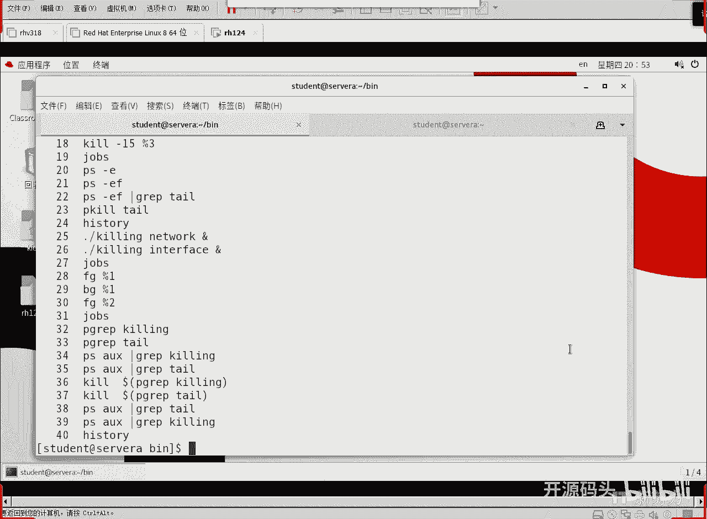
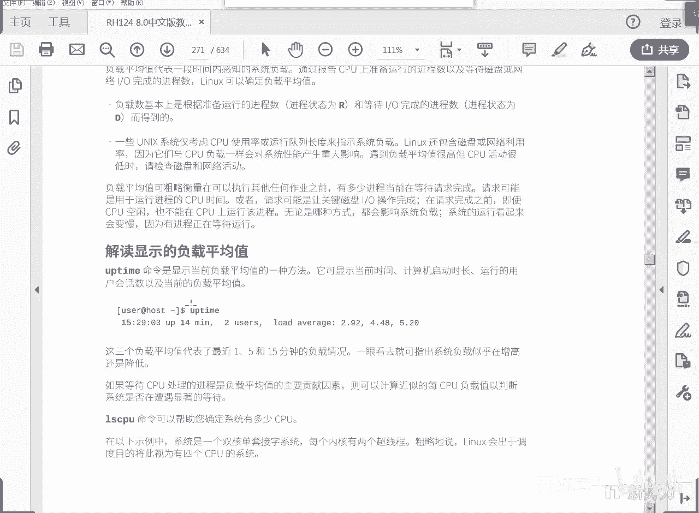
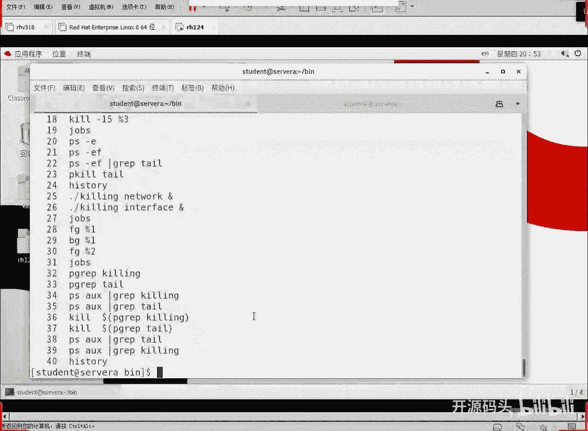
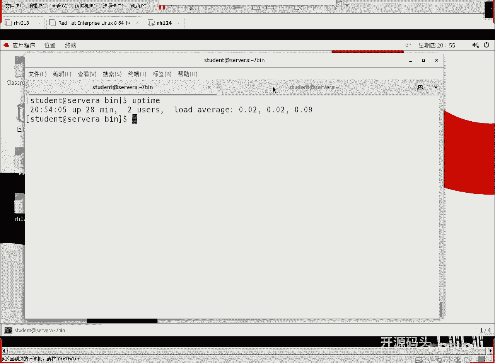
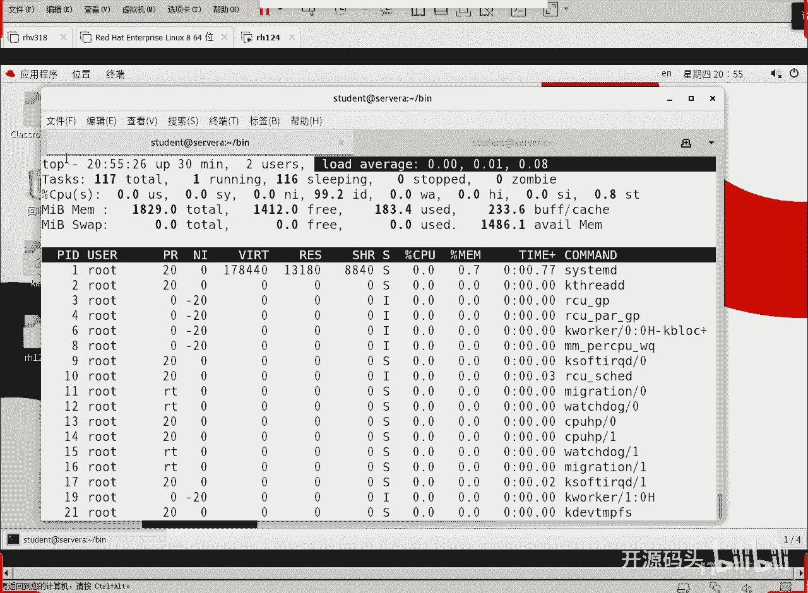
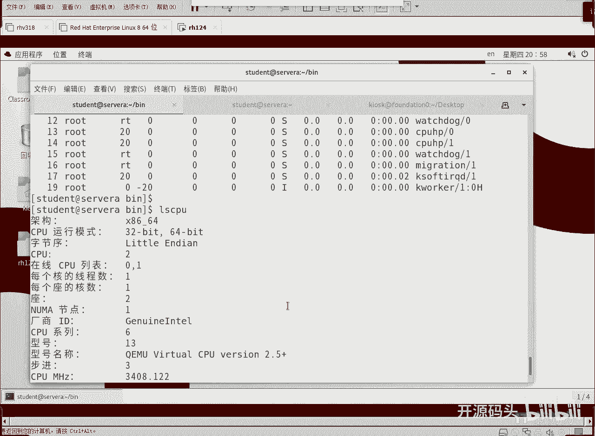

# RHCE RH124 之8 Linux进程管理(4).mp4 - P1：8 进程管理(4).mp4 - 开源码头 - BV1Hg411r7UT

啊如果像监控的话呢，我们照样可以监控，你会发现它下面的network interface又开始了，那么后台的能不能调到前台来呢，我们试一下好不好，f d百分和一啊。

for the ground就是前端运行百分好几回车，它就调到前端了，一调到前端，是不是就是一个终端当中只有一个进程可以接收，就是前端的输入，那么这个进程就是前端运行，它占有着光标对吧。

但是我们不输东西，他也不接收东西，但是它就占有了这个光标，所以它称为前端程序啊啊不管是前端后端，它后它的运行内容是不变的啊，network一直在true啊，network一直在true好。

那么调到前端以后，我就后悔了啊，我怎么能把它又放到后端去了，有个键盘的快捷指令叫ctrl z，ctrl z呢叫暂停，刚才说有人说诶，你不是19号信号吗，发生一个19号信号，它不就停止了吗。

啊这个作用呢等同于19号信号，但是ctrl z呢是另外一个叫做键盘终端的啊，键盘暂停信号是呃，在q当中不是19号啊，然后这是什么，已停止吧，一停止，那当然network就没了。

光剩下in the face了，那停止之后呢，我又想让它运行起来，而且想让它后端继续运行，background bg百分号一回城，就是继续后端运行，继续你在后端运行看一下，那我可就出来了吧。

ok好这是一个操作啊，就是我们看到所有的后端作业之后呢，用f g可以把一个作业调到前端来，用ctrl z可以把它暂停，暂停之后呢，光标就还给我们了，光标一旦还给我们，我们就把它这样从后端重新调用。

后端一调用它就不占用光标，继续运行对吧，这么一个过程啊，那我们继续哈，forward ground百分号二，是不是把第二个也调到前面来了啊，然后呢我ctrl c ctrl c不一样啊。

ctrl c是什么呢，是退出键盘中断退出，这个时候interface那个被我被我退出了是吧，然后我们来看一下是不是光剩network了，没有interface了，对不对，ok好。

这就是所谓的那个前端后端的调用，好吧，前端后端好，现在呢我们再来一下drums，还有一个是吧，我们来来看一下这个啊，gr e p，我们知道g r e p是抽取又做了行，那么进场的j r e p呢。

我kin，然后或者是tell，是不是翻出一个进程号啊，它发回的是我这个这个命令的进程号，也就是说后面这个tell一直在不断显示的这个胎儿是什么，1447号进程，而这个q音这个这个后台进程是什么。

是1439号进程进程号我们通过这个方式也能显出来，当然有人说这样不如我们刚才的p我们用不要用ef了，好吧，我们用什么a ox好不好啊，a x啊，所有有终端没中断的啊，a是有终端的，x是没终端的。

然后u呢类似于f也是显示一种以用户名为主的这种格式，然后竖杠抽取出来一个什么呢，kin再抽取出来一个tell，这跟我们刚刚那个演示是一样的是吧，能不能看出它的进程号啊。

啊kill in金证号是不是1439啊，然后呃那个tl gf进程号是不是14471样的效果是一样的是吧，pg ip反而是什么更更简洁一些，那我们甚至于可以什么pk，dollar。

然后里面是pgr p就是说抽取出我们的kill in这种进程号，抽取出这个进程号，1439，然后呢去q这个1439呃，那就不能用p q了，用q是吧，q1439 ，有人说你不打那个呃，什么信号。

15了吗啊不打，默认就是15好吧，除了15之外都得打啊啊再来一个什么tail，太好，那我们再来找一下这个进程还有吗，他要没了是吧，然后q音，没了这个显示出来的是我们本命令啊，我本命令的这个进程号啊。

就是我本命令打命令的时候，本命令也显示出来，ok好了，那么我们的这个进程操作或者叫作业的操作也就这么多是吧，哎刚才给大家演示了一个什么前端后端前端后端调用是吧。

还有个pg i p查看某一个应用程序对应的进程号，某一个应用程序就是用这个名字启动的应用程序对应的进程号，拿到进程号，我们照样可以用q去q他啊，这是什么变量引用吧。

我们用把命令得到的这个进程号直接当成一个变量，传个q那q的就把这个进程号删掉了啊，ok好这个就退出了啊，透明导的已经被退出了啊，因为我们那边已经用了什么q这个了，你把它推出了，ok各种方法都可以去找。

对不对，ok好了啊，关于进程管理呢，我们我们这基本上就差不多是吧啊，如果说呃再去看一些东西的话呢。

那我们后面他又聊了一个什么，聊了一个呃就说负载负载平均值的这么一个概念。

其实这个东西呢呃我们在很多命令里面负载的就能看啊。

单独看啊，叫uptime是吧，就是上线时间，啊上线时间显示就是几点开的，几点开的这个机子啊，然后到现在为止呃，多长时间啊，终端用户有几个啊，我们这现在是两个是吧，然后负载平均值，负载平均值一分呃。

五分呃，还有个15分啊，就是按照几分钟时间给我们显示出来一个平均值，我们从这个五分一分和五分上来看的话，一开始好像这个负载并没有太大增加，然后后面呢就增加稍微提高了是吧，负载慢慢在增加啊。

这个负载其实非常非常小啊，非常小啊，呃我们就说不大于一的时候，说明我们的任务没有合数多啊，就是cpu的核数比任务多，说他要上不了一，但是一旦说上了一，那就是为什么有了负载，有了这个队列。

任务有排队的这种情况了，这个时候就是大家大量的任务呢，这争抢征用啊，cpu的时间片，这个时候就会负载就会增加，这是专门看一下cpu的东西啊，top。

top命令其实第一行就显示的就是这东西，那他他也是啊。

从什么时候开始啊，到什么时候，这里面有统计是吧，一共多少个任务，我们来q退一下ctrl啊，l s c p u，我这个cpu呢是呃，两个是吧，两个啊，每个cpu我是双核的。

你看一下你的和你的核如果少的话呢，值就稍微大一点，因为它被调用的时间是时间多嘛是吧，cpu列表是0号cpu和1号cpu，我这个是双核的啊，你看一下你的cpu是几核的好不好，这是server a的啊。

我们回到如果回到真机上，ctrl shift t再开个窗口啊，我们看一下这个最外层的那个续集是吧啊of time啊，你看这个就比较比较高，刚开机还比较厉害，现在慢慢的降下来了啊。

刚开机那阵子可能是什么正在开飞机啊，所以说不管io什么都很高，慢慢的续集启动之后呢，i o就变少了是吧，就会变低，这是往下降，这是我的最外层的foundation。

这个机器的啊啊它的负载平均值这东西不大于一都非常非常小，就大于一也没关系啊，因为我们呃真正的这个呃实际在处于running状态的程序是非常非常少的，但是对于单核cpu来讲的话，1。06就代表有了队列了。

哎我们我们这个foundation它这个状态是这样的对吧，呃然后呃ios cpu看一下它的cpu个数多少个，一个一个cpu模拟出了双核的cpu，我我我的真心是八核，我这个是i7 的。

我这个真机就是windows外头最外头这个windows机器的系统是八核的cpu啊，然后创建随机的时候呢，是创建一个单核的单核cpu，但是这个单核的fdation里面我们模拟出来的那个cia是什么。

是双核的，所以说这个值可信吗。

这个词就是一个参考，好吧，就是一个参考啊，并不是特别可信啊，你看每个程序啊，top程序top就是程序本身吧，你看每个程序它的cpu使用量有多少啊，几乎都不到零点几是吧，非常非常少啊，0%几。

0%几特别特别少，因为处在running的状态的这个时间是很少很少啊，那cpu本身的监控程序这个i就代表了什么啊，呃不可中断啊，但是紧急退出是可以的啊，紧急事件是呃可以中断他的啊，正常情况下它不会中断。

这个都是内核的一些操作啊，安全内核的一些操作，而且统计是不统计这种就是符合统计是不统计他们这些进程的啊，处于s这个是处于r状态啊，这个处于r状态除同一时刻除以r状态的并不是很多是吧。

如果说同一时刻超过两个，我现在这个机器是不是两个cpu，那么如果说超过超过了两个以后呢，他对cpu的百分比还比较大的话，那么他们累加起来就可能复合就超一，本身一个cpu时间根本都用不完。

因为一个cpu其实可以同时起1000多，2000多个甚至于两三千个这种进程的，况且我们是双核对吧，它使用的cpu比率非常非常之低，但是如果说你做了一个呃大量的数学运算。

因为我们知道cpu本身是在做逻辑运算和数学运算的，对不对，其实数学运算这个环节应该是处于严格来讲是属于运算器的啊，但是大量的数据运算需要什么，需要cpu去调度。

去把这个数字来回在cpu内部进行什么暂存调度，暂存计算角度展成这些角度，所以说呢进行大量的数学运算的时候，cpu的比例就会非常高啊，高到什么程度呢，啊甚至高到就说快到100的这个程度。

这个top命令呢啊就是可以实时的top啊，可以实时的查看我们的cpu的这个使用状态啊，这是什么进程id，这个是当前用户，这个是优先级nice值是吧，唉优先级我们还没聊是吧。

优先级就是程序的以呃中等优先级的方式启动啊，如果说我们希望让它快一些，多占一些时间片，我们把这个数值给它调得小一点啊，pr的优先值区间是0~39，ni的优先值区间是-20~19，这两个都是优先级值。

而且是一对一的，然后显示成两列是不同的技术标准，不同的数字标准，但是呢基本上是相同的啊，就是代表的优先机制是一样的，就是这边的零和那边的-2是代表的是一样的啊，一样的这个优先级好，这是虚拟内存。

这是什么常驻内存，共享内存的使用量，这些东西就是个数字啊，你说我相对能看出什么端倪来，以任何程序它对内存的使用都不一样对吧，它的i o过程不一样，它的内存变化也很大。

所以说这个东西几乎没有什么实际的价值，这个状态还有的说是吧，cpu使用率是使用这个意义是很很很重要的啊，内存使用率啊也很重要啊，它的时间啊，它总共占的cpu的时间是多多少很少是吧。

就是大部分都在sleep，sleep就不计时了是吧，sleep的时候就不计时了，ok啊这是总共的内存是吧，总共这个机器应该是2g内存啊，18291829兆的内存对吧，这个是大招，那就是1024算出来的。

对不对，就是22g的内存，还有剩多少内存没用，用了多少内存，这都是啊，其实内存使用动态变化太快了，几乎看不出什么太大端倪啊，除非有些就是吃内存的这种东西，你看的时候它持续很大啊，这还有有的说是吧。

正常情况下很少，ok好用top命令来看一些。