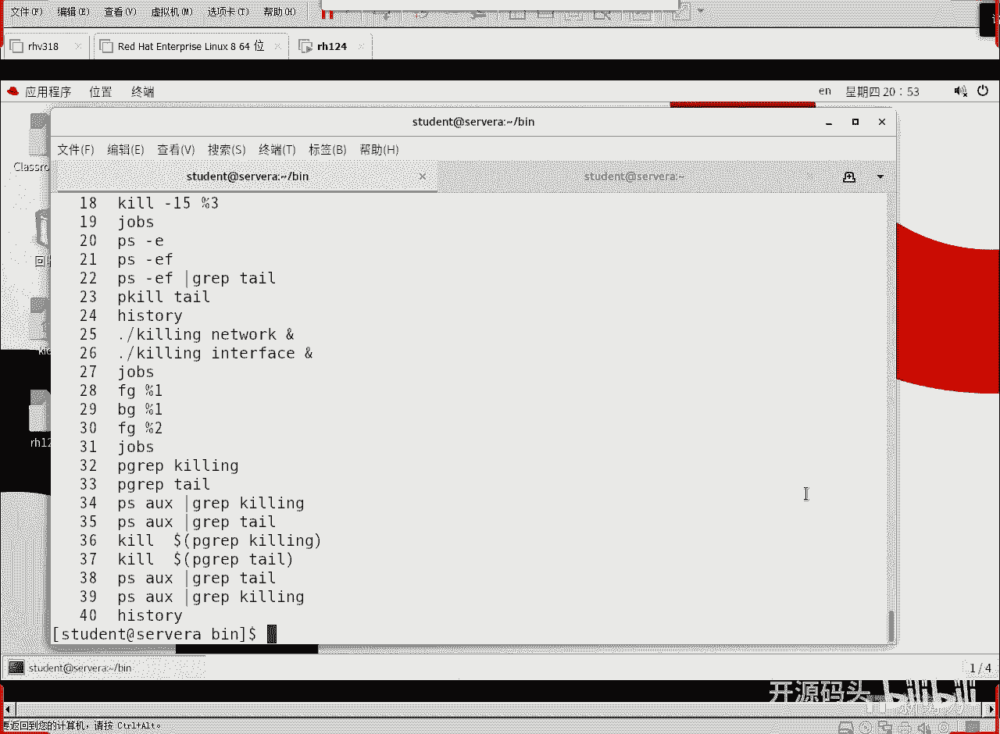
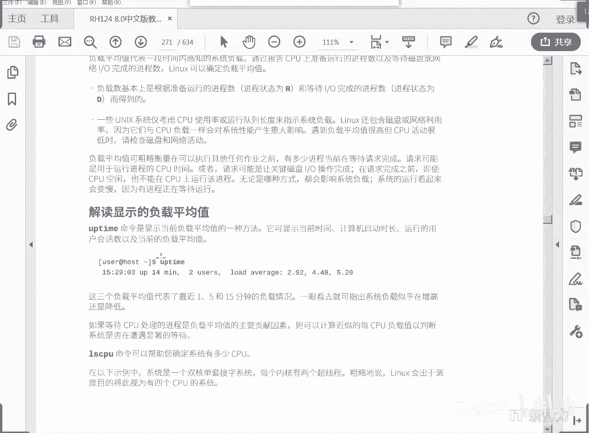
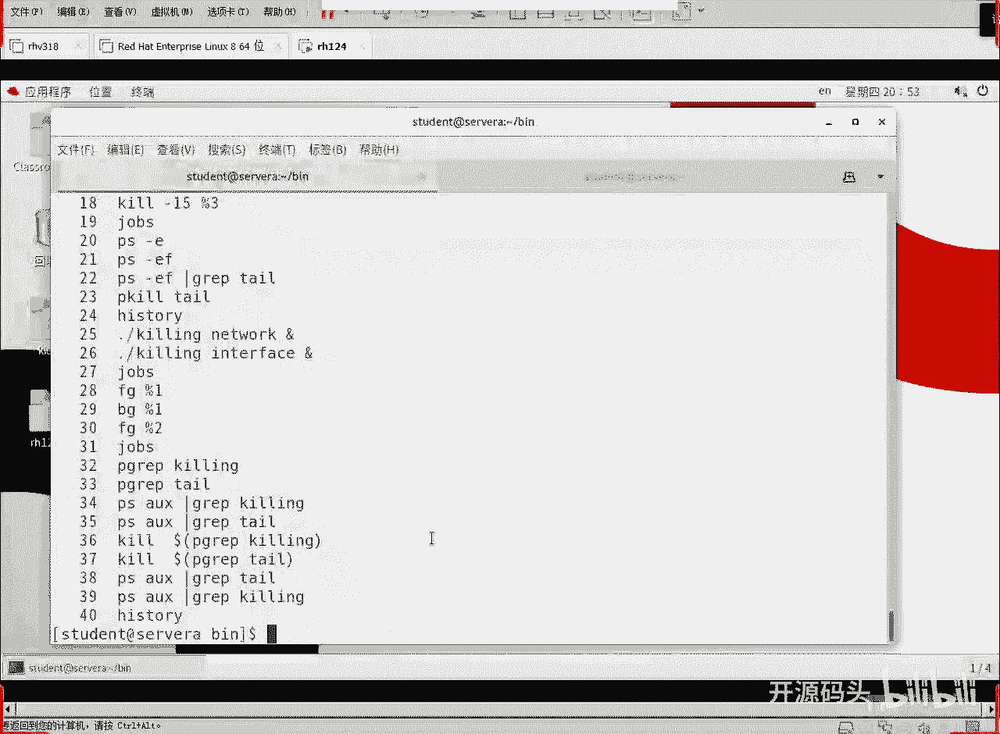
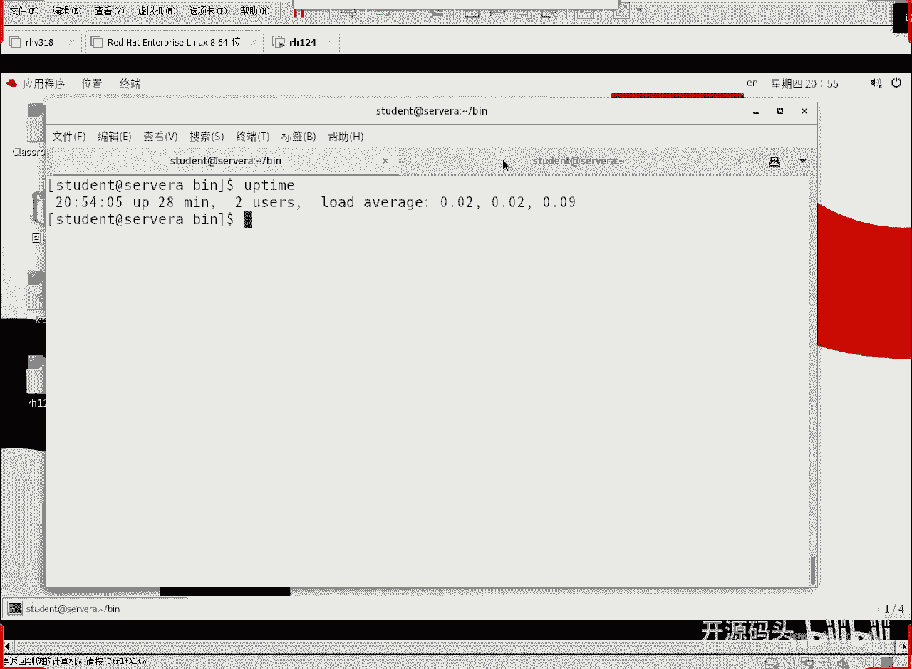
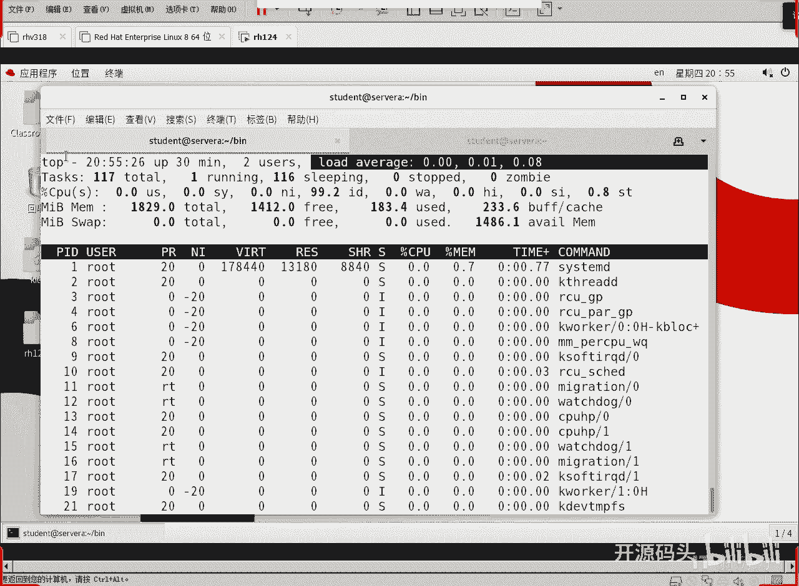
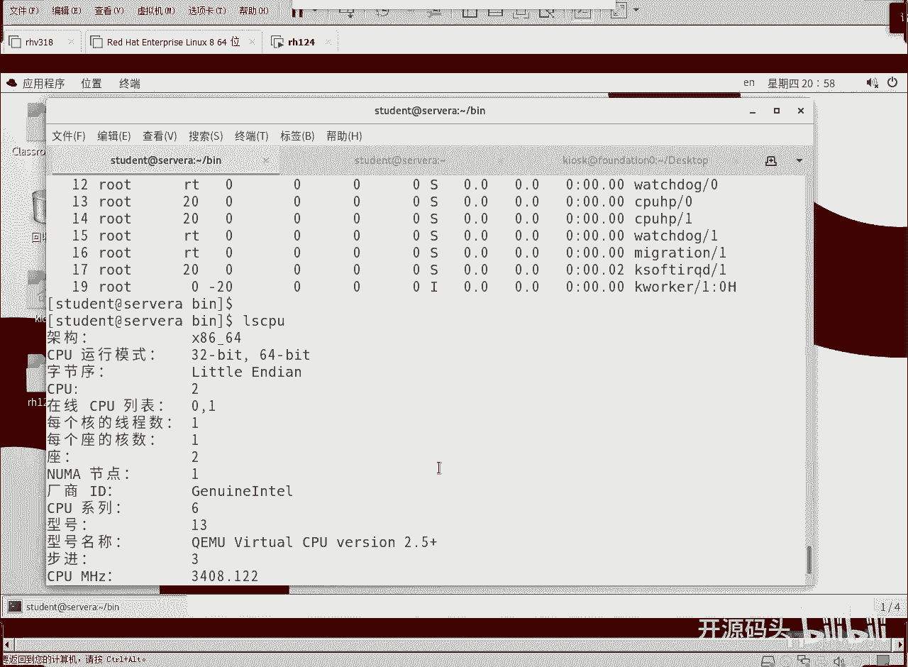

# RHCE RH124：8：进程管理(4) 🖥️

在本节课中，我们将学习如何在前台与后台之间管理进程，使用命令查看和终止特定进程，并了解系统负载与CPU使用率的基本概念。

## 前台与后台进程管理 🔄

上一节我们介绍了进程的基本概念和查看方法。本节中我们来看看如何在前台和后台之间灵活地切换和控制进程。

后台进程可以调到前台运行。使用 `fg` 命令加上作业号即可实现。

```
fg %1
```

执行上述命令后，编号为1的后台作业将切换到前台运行。前台进程会占用当前终端的光标和输入。

将进程调到前台运行后，可以使用 `Ctrl+Z` 将其暂停。这个操作等同于向进程发送19号（SIGSTOP）暂停信号。

进程暂停后，控制权会返回给终端。此时，可以使用 `bg` 命令让该进程在后台继续运行。

```
bg %1
```

以下是进程前后台切换的完整操作流程：
1.  使用 `fg` 将后台作业调到前台。
2.  使用 `Ctrl+Z` 暂停前台进程。
3.  使用 `bg` 让暂停的进程在后台恢复运行。



需要注意的是，`Ctrl+C` 是键盘中断退出信号（SIGINT），它会终止前台进程，与 `Ctrl+Z` 的暂停作用不同。





## 查找与终止特定进程 🎯

除了使用 `ps` 命令，我们还可以使用 `pgrep` 命令更简洁地查找特定应用程序对应的进程号。

```
pgrep tail
```





该命令会返回所有名为 `tail` 的进程的PID。结合变量引用和 `kill` 命令，可以快速终止进程。

```
kill $(pgrep tail)
```

这条命令的含义是：先执行 `pgrep tail` 获取进程号，然后将结果传递给 `kill` 命令以终止该进程。默认情况下，`kill` 发送的是15号（SIGTERM）终止信号。

以下是查找和终止进程的几种方法：
1.  使用 `pgrep [进程名]` 直接查找进程PID。
2.  使用 `ps aux | grep [进程名]` 组合命令查找。
3.  使用 `kill [PID]` 或 `kill $(pgrep [进程名])` 终止进程。

## 系统负载与CPU监控 📊



进程管理不仅涉及单个进程，还需要关注系统的整体负载情况。`uptime` 命令可以快速查看系统运行时间、用户数和平均负载。

```
uptime
```

命令输出中的“负载平均值”分别显示了系统在过去1分钟、5分钟和15分钟内的平均负载。对于多核CPU系统，负载值低于CPU核心数通常表示系统运行流畅；若持续高于核心数，则表明任务可能需要排队等待CPU资源。

要查看更详细的实时系统状态和进程信息，可以使用 `top` 命令。

```
top
```

在 `top` 命令的界面中，第一行信息与 `uptime` 类似。关键信息区域包括：
*   **任务状态**：显示运行中（`R`）、睡眠中（`S`）等状态的进程数量。
*   **CPU使用率**：显示用户空间（`us`）、系统空间（`sy`）、空闲（`id`）等CPU时间占比。
*   **内存使用**：显示物理内存和交换空间的总量、使用量及空闲量。
*   **进程列表**：实时显示各个进程的PID、用户、CPU使用率、内存使用率、优先级（`PR`/`NI`）和状态。

其中，进程的优先级（Nice值）范围是-20到19，数值越小优先级越高，获得的CPU时间片可能越多。`top` 是监控系统资源使用和发现高负载进程的强大工具。

## 总结 📝

本节课中我们一起学习了Linux进程管理的进阶操作。我们掌握了如何在后台与前台之间切换进程，使用 `pgrep` 和 `kill` 命令精准查找并终止进程。最后，我们了解了通过 `uptime` 和 `top` 命令监控系统整体负载与CPU使用情况的方法，这些是系统性能监控的基础。