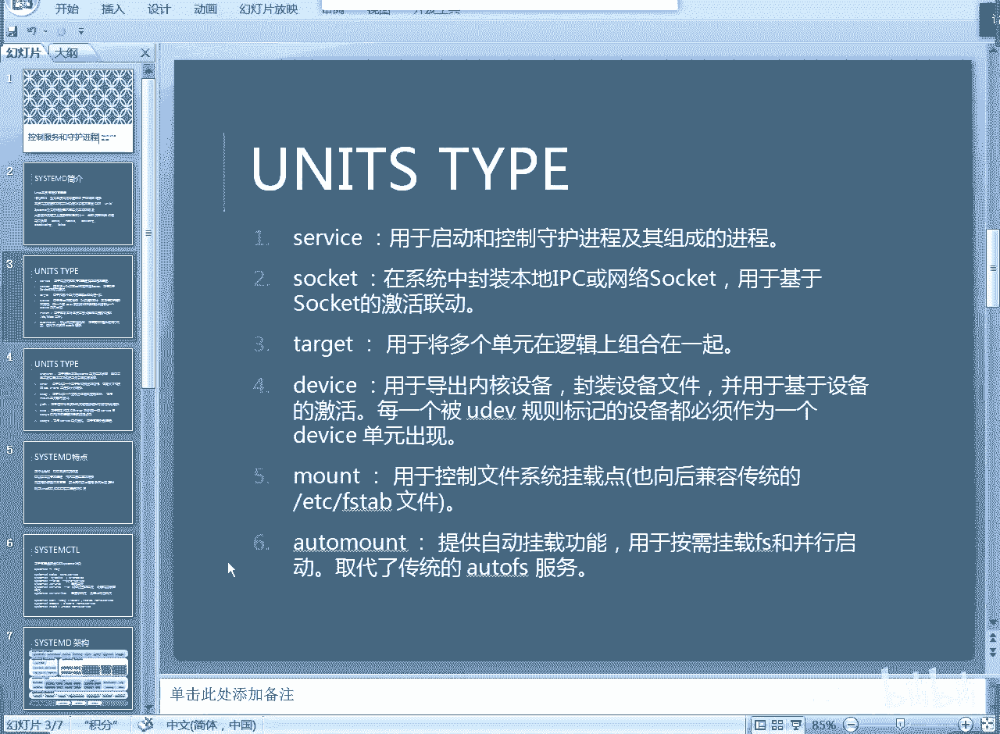
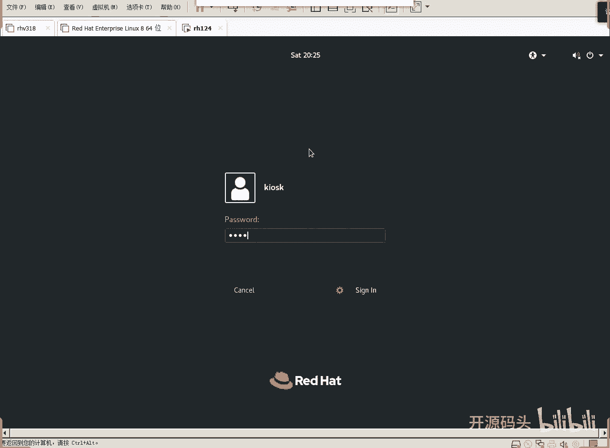
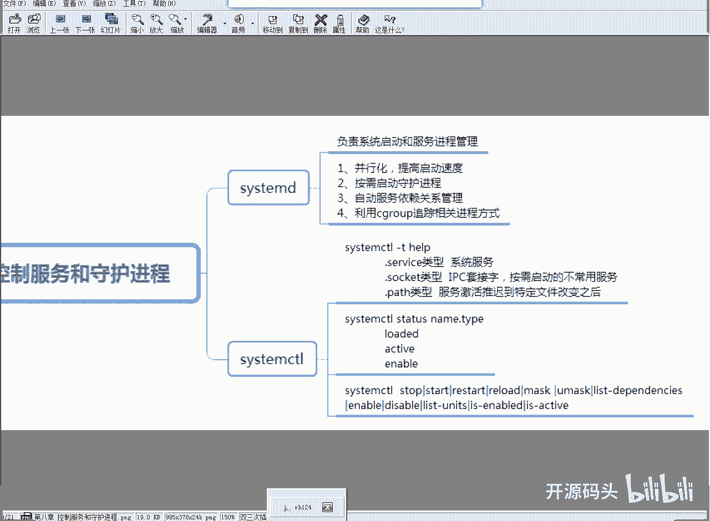
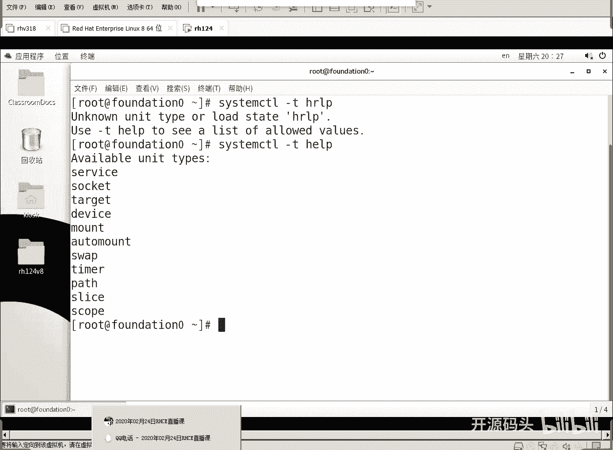
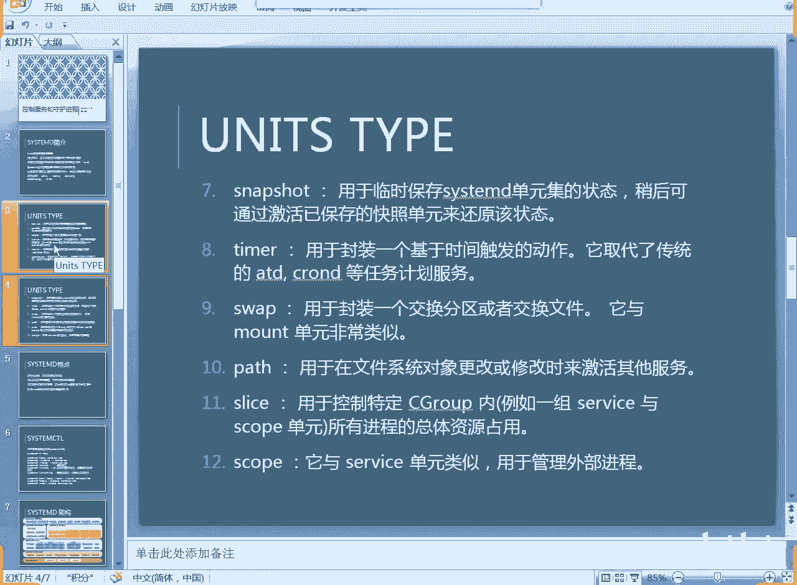
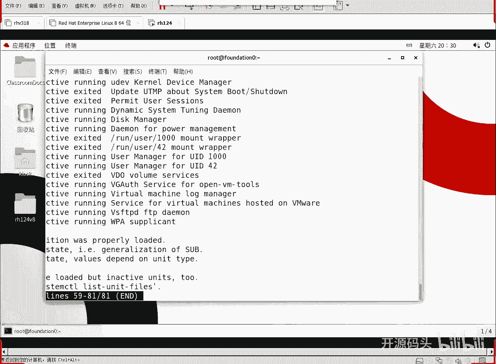
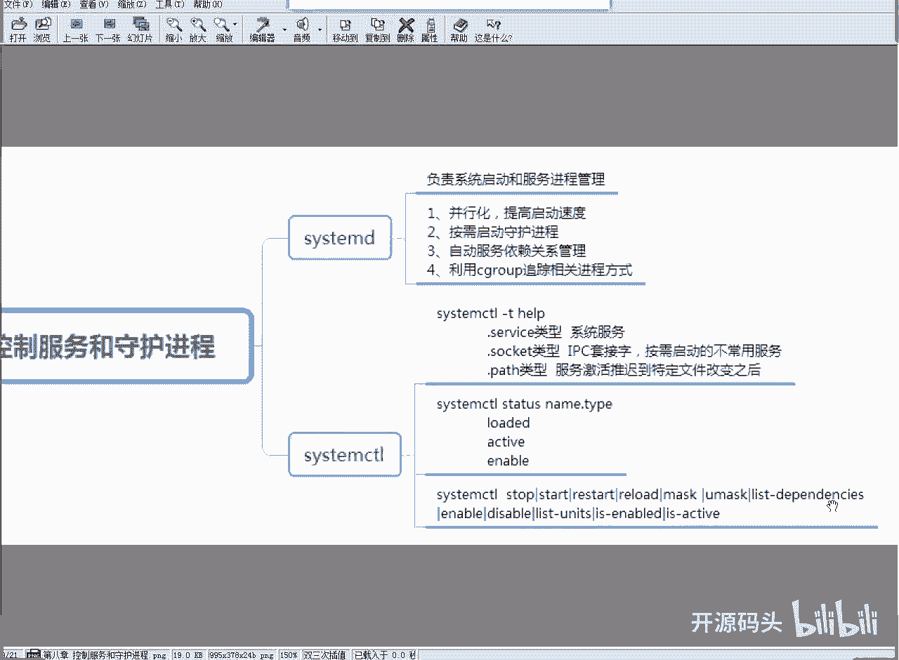
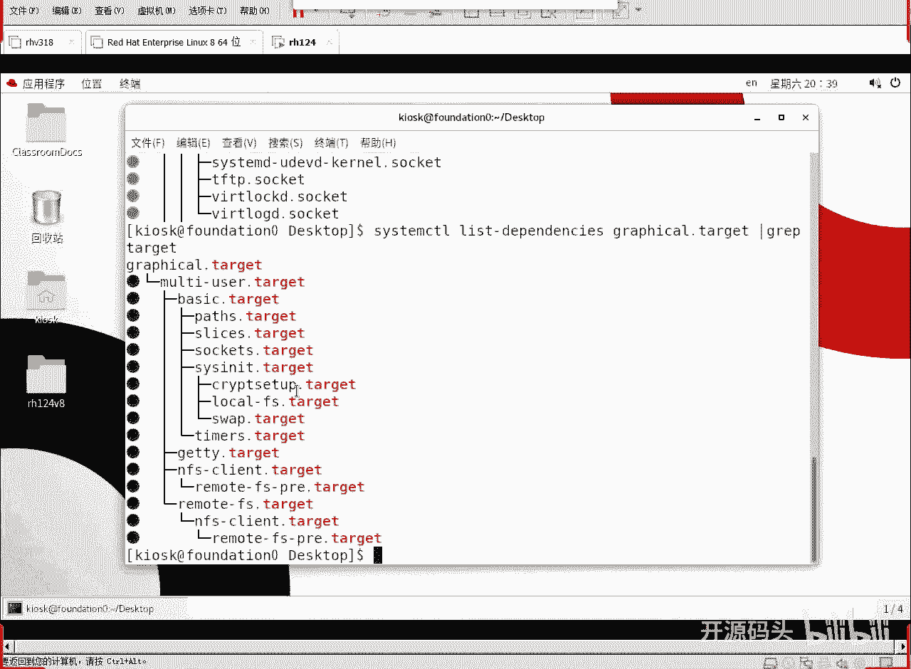

# RHCE RH124 之9 Linux systemd进程管理(2) - P1 - 开源码头 - BV1xe4y1f7tG

我们启动了之后呢，我们可以进来简单看一下是吧，我们就看我们这个就在我们这个真实际上去做就可以了。

你看这个图片就是我们课本上讲的，我们课本上讲的非常少啊，他只讲了三四种类型对吧，他就讲了这个三四种类型呃，要想显示出来就是呃cm control gt help，那就可以看到所有的类型。

然后我们就可以选择某一种类型啊，然后还可以什么呢，还可以，这个就是列出所有的单元，就像这个命令list unit是吧，好我们试一下啊。

开启一个窗口，如果做这个操作，最好是用什么做呢，因为你涉及到涉及到我们的那个系统管理，是不是最好是用root身份来做对吧，好打开一个终端啊，然后呢，好进入root身份，然后呢。

system control啊，对于c tmd这种呃进程的这个通话，我们需要通过一个c m control的命令来实现啊，我们可以去打个杠t呃，类型是吧，help，这里有几种可用的单元类型是吧。

12345678 90 11 11，少了个什么，pass time swap out to mount device，target，so。

我这个是把所有的单元全列出来了，我这里是12位。

少了个snapshot是吧，少了个少了个，这里面是不是少了个snapshot，少了个那个快照单元对吧，呃我们现在这个机器里面可用的，现在没有snapshot啊，没有这个系统的快照好，这是说的单元类型啊。

然后呢我们可以用这个命令来看一下啊，嗯li list it，s就行了好吧，然后竖杠啊，wc杠l看看有多少行，200行，对不对啊，200行还不是很多是吧，那我们可以用呃，直接看吧，200行。

那这200行里面你看这是什么啊，这个比较容易，这个比较容易懂，这是什么东西，tm p是不是临时文件，临时文件的清理计数器对吧，临时文件清理计数器，那就顾名思义，这是什么东西，这个计数器时间一到。

它就要干啥，清理我们的临时目录对吧，临时目录下的东西是不是全是临时文件，它就要清理这个东西啊，这是那个timer这种，那我们如果说觉得他太多的话，我们干脆一个一个看吧，好不好，一个看啊，打个q退出。

这个窗口太大了，超出了那个图形范围好，那我们可以什么呢，lisgt什么的，或者是杠杠tap，用ta，这都是计数器单元吗，啊计数器单元里面的具体的具体的计数器都有什么q退出。

然后再来一个什么service，service的实力很多是吧，service实力比较多啊，这就包括了呃我们的那个，嗯我们常见的设备有哪些呢，nf n f s的f是server对吧。

n f s这个呢这个是dn，还有呢，这个是那个呃是ntp是吧，是那个始终同步服务器，有没有外边有没有找到外边哎，这个是吧，web服务器是吧，各种各样的服务，有些我们认识，有些我们呢可能就不认识。

那这些这些东西都是属于什么那种开机等待别人来访问的，这种这种淡雅类型。

我们左右还可以移动，把这个呃右边没有显示出来的东西呢，显示显示全是吧，左右移动一下，可以看一下先显示的内容啊，就是没显示出来的那些内容，qq推出放在那里，我们还可以看到什么socket，黑波线能引出来。

这是socket，这些socket的话一般都是系统内部的啊，像这种都是如果是等待外部访问的话，大部分都成为service啊，如果是系统内部进程之间的通信，那我们一般都是以socket方式来存在。

其实socket的一个特例就是service，只不过是service，是我们用的比较喜闻乐见的一种方式啊，但socket呢其实包括了所有可能的这种网络通信啊，包括进程间通信都可以啊。

你看这个t f t p的就是socket，它不是那个服啊，它不是一个独立的服务存在啊，它是一个什么，就是socket激活啊，有人访问这个tf t p端口吗。

我才会启动tf t p工作去呃呃这个程序去运行是吧，这是属于socket类型的，啊底下的状态啊也写得很也写的很明确是吧，啊这个你看加载的活动的是吧，正在监听啊，正在运行等等等等。

他的工作状态上面有什么加载情况，活动状态啊，子状态啊，好这是我们对启动啊，linux启动过程当中所有可能碰到的事情的分类的一个理解，每一个类别下面都有大量的实例存在啊，还有一个什么呢，target是吧。

ta rgbt，光启动到各种各样的模式，就有这么多模式，就是这么多模式啊，那我们还可以还可以做一个什么操作呢，还可以列出啊，就是列出我们的那个箱相依性关系啊，这个list depend啊。

这个东西是做什么的，就列出它的相应性关系，我们现在这个工作模式是不是一个图形模式对吧，我们现在这个工作模式就是呃default a graf。target，这就是图形。

我现在这个界面是不是就是图形模式啊，所以说我们现在其实我看一下到我这个图形模式的情况下，相依性的就是他之前需要做一些什么样的模块，顺序是什么样子的，这里看得很清楚啊，搁这看清楚啊，包括什么，包括先启动。

先启动一些基本的什么service，然后呢启动到multiuo的target里面，那multiurotk里面呢就是有这么多service，由这么多service单元构成了一个什么。

构成了一个target啊，然后呢继续往后继续完后在这个basic这个tx后面继续往继续往上走啊，我们这里没显示完啊，如果我们抛开service。

抛开service或者是socket这些不同类型的这种资源类对象不显示，我只看这个target之间的关系的话，就先到哪个tx才能到我，我们就可以给他什么来个jr a p抽取抽取ta啊。

这一题我只看target的类型的这种相应性关系啊，我们可以看出来是吧，那graph之前应该起到什么，应该起到multi usumulti，usual之前起应该起到什么。

起到basic basic就是所谓的最基础的内核部分的功能了是吧，就是分这个这些功能都不能独立启动了啊，这些功能都是合起来构成了一个什么基本的target。

基本target的他也可能只是一个系统的基本功能啊，甚至于连个什么都没有，连个就所谓的那个终端都不会启动啊，那我们呢再加上这些后面的终端相关相相关的一些功能，合起来就构成了一个什么multi user。

而mi ui这种多用户模式就是我们以前传说中的那种文本模式啊，它的所有的功能都都不缺，都起了，然后呢就是一种什么哎，这就是所谓的啊没有图形界面的做用户模式啊。

然后再multi user多用户模式基础之上，把那些图形的相关功能再启动，才能进入到什么graphy target，我们现在就目前就工作在coc他在里面。

所以这就这我们就可以通过这个方式都能看出啊target之间的一种什么，一直就是pass或者叫一层关系啊，这个叫相依性关系，你要起到这得先起到哪，要起到这得先起到哪，先起哪，先一个一个的就过来了是吧。

像这些tt都不能单独去什么，像这种tt都不能单独去启动的啊，你像我这专门做起一个加密的，他给它功能是有了，但是你能交流吗，你没有终端，你没有办法跟他交流。

所以说最终呢我们要起到这个模式下才能算是一个比较啊，就是人性化的一个模式啊，那么target是什么，明白了吗，target就是所谓的启动模式，我们把大量的service socket或者是别的东西啊。

别的类型的资源，全单单元资源把它们综合在一起，要起的东西啊，要启动的东西综合在一起，构成一个target，那我们把若干它给它合在一起，就形成一个完整的工作环境。

它就是这么一个逻辑。