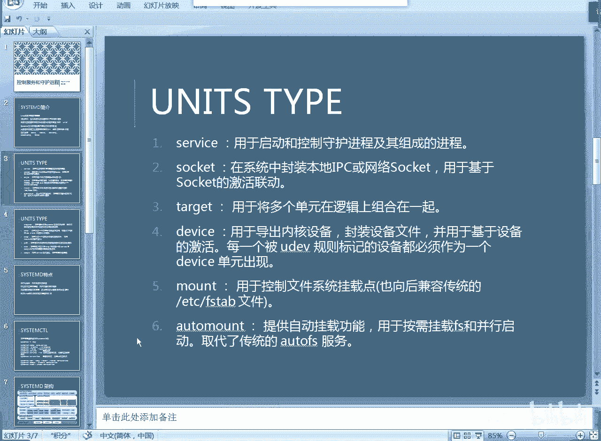
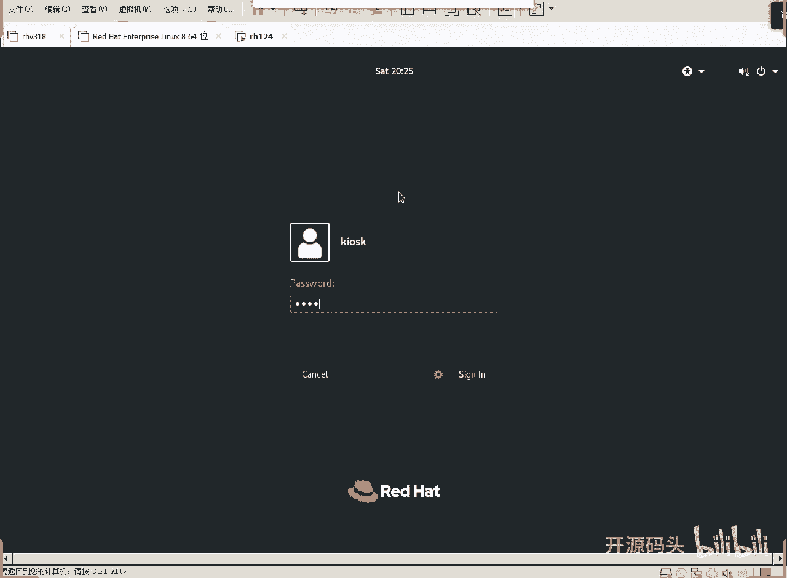
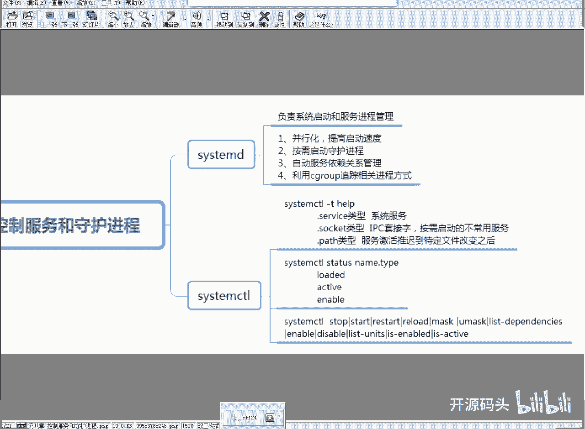
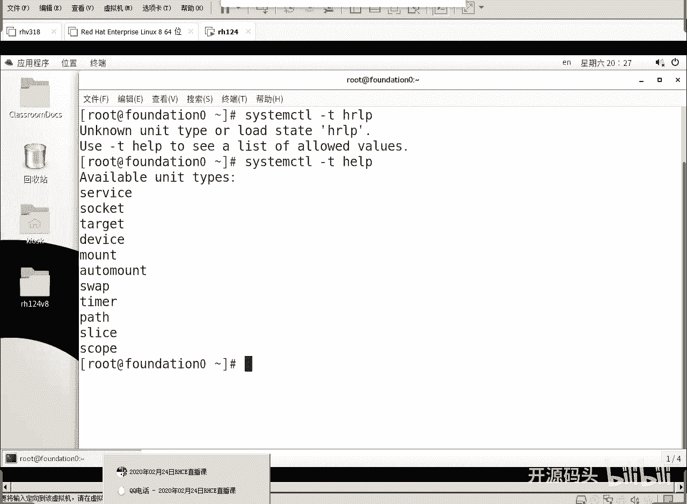
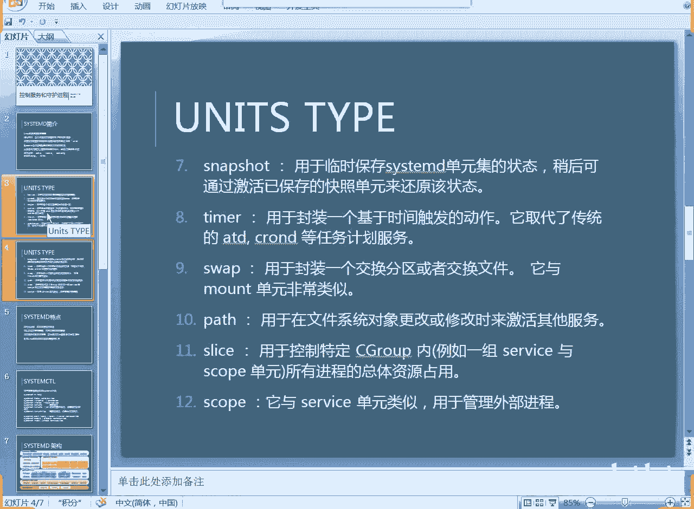
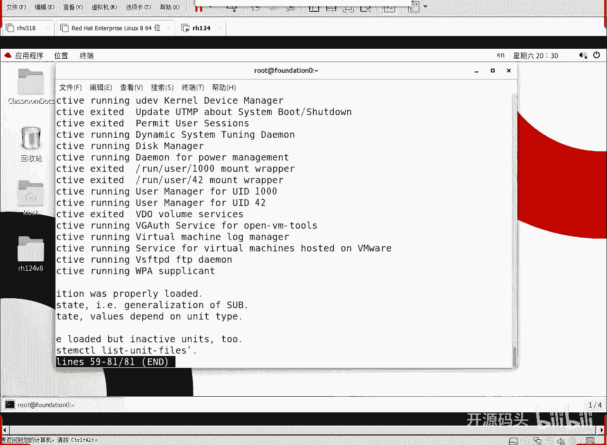
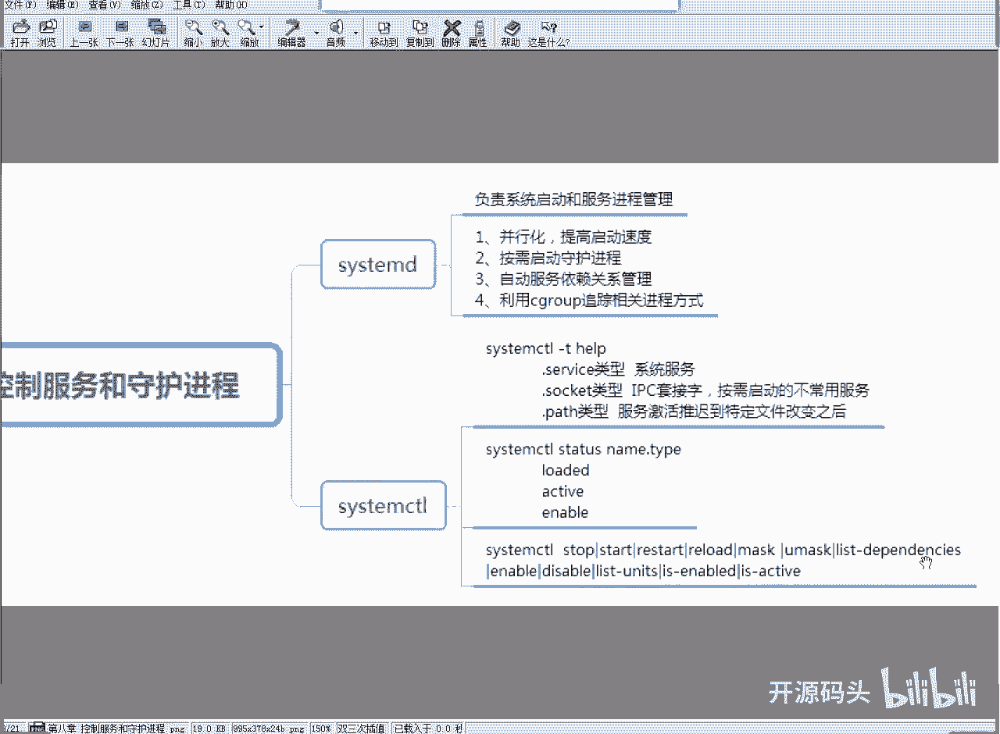
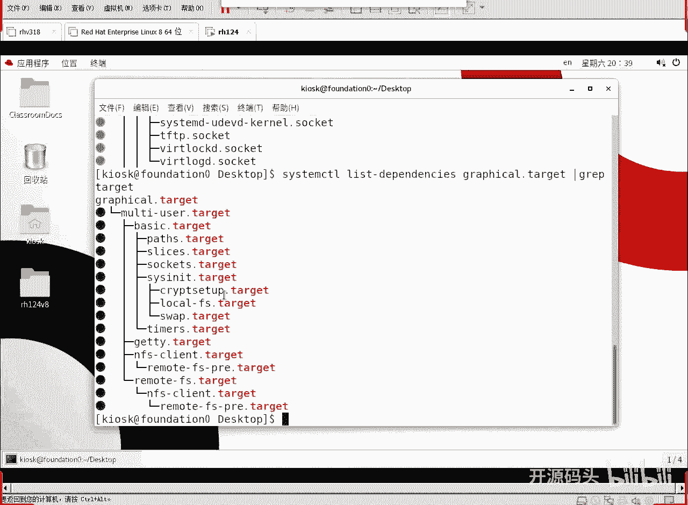

# RHCE RH124 课程：9：Linux systemd进程管理(2) - P1





## 概述
在本节课中，我们将深入学习Linux systemd进程管理。我们将探讨systemd中的单元类型、如何查看系统单元及其状态，并理解target（目标）之间的依赖关系，从而掌握系统启动和服务管理的核心概念。

---



## 单元类型概览
上一节我们介绍了systemd的基本概念，本节中我们来看看systemd中具体的单元类型。systemd将系统启动和管理过程中涉及的所有对象都归类为不同的“单元”类型。

我们可以使用 `systemctl` 命令查看所有可用的单元类型。



```bash
systemctl -t help
```



执行此命令后，会列出当前系统支持的单元类型，例如：
*   service
*   socket
*   target
*   timer
*   mount
*   device
*   snapshot
*   swap
*   path
*   slice
*   scope

---

## 查看系统单元
以下是查看系统中所有单元的方法。我们可以使用 `list-units` 命令。

```bash
systemctl list-units
```

此命令会列出所有已加载的单元及其状态。输出行数可能较多，我们可以通过管道命令 `wc -l` 来统计数量。

```bash
systemctl list-units | wc -l
```



---

### 按类型查看单元
为了更清晰地查看特定类型的单元，我们可以使用 `--type` 或 `-t` 参数。

以下是查看所有 `timer` 类型单元（定时器）的示例：
```bash
systemctl list-units --type=timer
```
定时器单元用于在特定时间触发任务，例如清理临时文件。

以下是查看所有 `service` 类型单元（服务）的示例：
```bash
systemctl list-units --type=service
```
服务单元是我们最常接触的类型，它代表后台运行的服务，如Web服务器（httpd）、NFS服务器（nfs-server）、DNS服务器（named）和时间同步服务（chronyd）。

以下是查看所有 `socket` 类型单元（套接字）的示例：
```bash
systemctl list-units --type=socket
```
套接字单元用于进程间通信或网络通信。一个典型特点是“按需激活”，例如TFTP服务（tftp.socket），只有当有客户端连接其端口时，才会启动对应的服务进程。

列表会显示每个单元的加载状态、活动状态和子状态等信息。



---

## 理解Target与依赖关系
在了解了各类单元后，我们来看看如何将它们组织起来。`target`（目标）单元的作用就是将多个其他单元（如service、socket）组合在一起，共同构成一个完整的工作环境或系统运行级别。

我们可以使用 `list-dependencies` 命令来查看一个target的依赖关系，即启动它之前需要先启动哪些其他单元。

例如，查看当前图形界面模式（graphical.target）的依赖关系：
```bash
systemctl list-dependencies graphical.target
```

这个命令会显示一个树状结构，清晰地表明启动顺序。为了更专注于target之间的层级关系，我们可以过滤掉其他类型的单元。

以下命令只显示 `graphical.target` 所依赖的 `target` 类型单元：
```bash
systemctl list-dependencies graphical.target | grep target
```

通过输出，我们可以理解典型的启动层级：
1.  **basic.target**：包含系统最基础的核心功能。
2.  **multi-user.target**：在basic.target基础上，添加了多用户登录和文本终端支持，构成传统的“文本模式”。
3.  **graphical.target**：在multi-user.target基础上，再添加图形界面相关服务，构成完整的“图形模式”。

因此，`target` 定义了系统的启动模式。系统通过依次满足这些target的依赖关系，最终进入一个可用的工作环境。

---

## 总结
本节课中我们一起学习了：
1.  使用 `systemctl -t help` 查看systemd支持的单元类型。
2.  使用 `systemctl list-units` 及其 `--type` 参数查看特定类型的单元状态。
3.  理解了 `service`（服务）、`socket`（套接字）和 `timer`（定时器）等单元类型的作用。
4.  掌握了 `target`（目标）单元的概念，它用于组合多个单元以定义系统运行状态。
5.  使用 `systemctl list-dependencies` 命令分析target之间的依赖关系，从而理解系统从基础核心到图形界面的启动流程。



通过本节学习，你应该对systemd如何管理系统资源和服务有了更深入的认识。