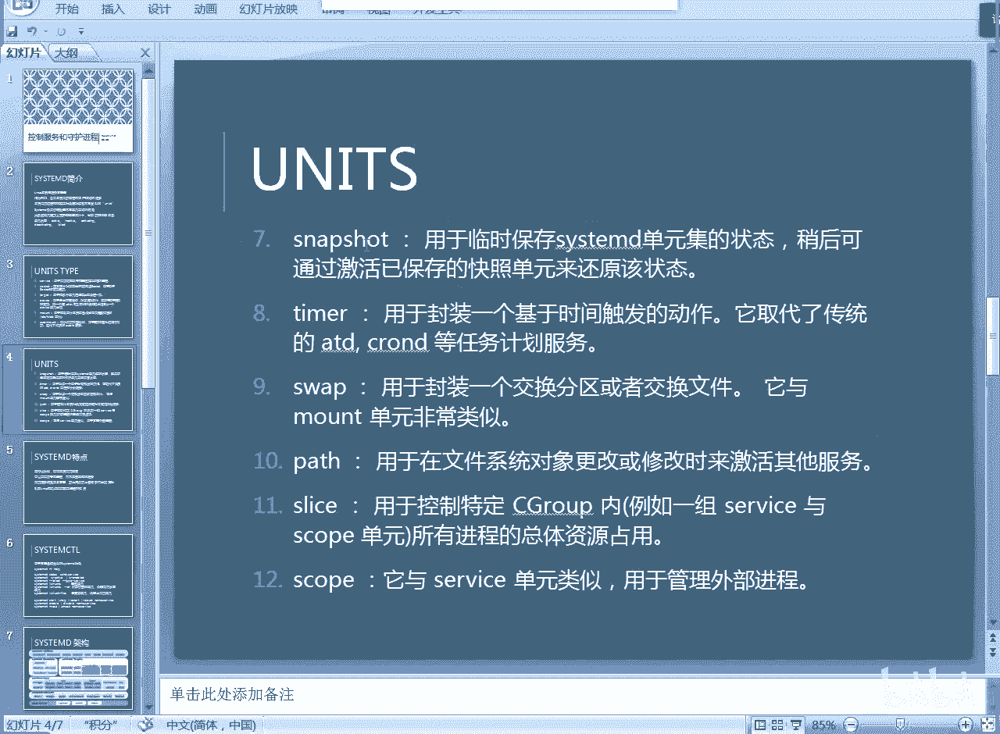

# RHCE RH124 之9 Linuxsystemd进程管理(1) - P1 - 开源码头 - BV1FV4y1x7x7

第八章呢呃我们聊了一个什么东西啊，聊了一个进程管理是吧？那么进程管理呢是从这个操作系统资源控制的角度，我们看了一个机器当中可以运行呃各种各样的我们的功能性的程序啊，然后功能性的进程对吧？

那么这所有进程的副进程是谁呢？是一个叫做CTMD的这个进程啊，那么CTMD这个进程呢，其实就是我们所有其他进程的一个副进程，或者叫祖先。所有的进程都是从CM地区延生出来的对吧？

我们之前有个什么道德经里面有个说法，就什么呃呃道圣一一生二。二胜3三生万物是吧？那么就是这个cemD呢，就是所有其他进程的一个原点，就是从这个地方呢开始裂变出大量的其他进程啊，或者叫调用其他的进程啊。

那么ctD是个什么东西呢？啊，它其实就是一个系统与服务的管理器啊，就linux的里面的所有的系统功能以及服务功能的一个管理器。

啊，他来负责的呃，我们呃系统启动过程当中，所有的启动单元，就是那些常驻内存的，或者是启动启动的时候需要做一下的事情，对吧？有些事情就是不是有些事情呢，它是启动的时候需要需要操作一下，然后呢。

他就可以退出了。但有些东西呢，它是一定要什么。一直启动，并且呢一直等待别人的访问啊，你比如说服务啊服务就是那种啊，就是我启动了之后呢，我就不能退啊，我就一直等着别人来访问。

啊，一个最直接的最常用的服务就是外部服务，对吧？当人们访问这个外外部服务的时候呢，外部服务随时都得。

就说响应这个用户的请求。所以说呢那就像那种呃。驻留在常驻在这个系统内存里面，然后呢等待什么等待客户来访问激活的这种进程，就是服务。啊，当然这个服务的启动之前呢，我们其实有很多功能都要做啊。

一个机器启动过程当中，它需要碰到各种各样的这个启动单元，对吧？或者叫做呃要做各种各样的事情。啊，所是这个C来做CTND来做，对吧？啊，呃我们把这个系统启动和维护的相关对象啊。

就是启动过程当中和需要维护的那些应用程序啊，进程啊，对吧？啊，把它可以什么呢？可以把它根据功能区分成一个一个的单元。

哎，我们要处理什么单元啊，我们主要处理一个什么单元，对吧？哎，要就是做成各种各样的单元。

那么CTMD呢协调处理这些单元之间的这种依赖关系啊，呃它在机器启动过程当中啊，应该先做什么后做什么啊，每一个事情都是独立的单元，我们把这些单元呢给他什么？全部给它协调起来啊，CtMD就做这个事情。

大多数的单元啊，它是定义在静态配置文件当中啊，然后呢也可以动态。创建生产对吧？也就是说什么东理呢？就是呃。我们CTMD启动的时候呢，几乎所有的单元都是我们的配置文件决定的。啊。

就是我们它要加载每一个进程，它在加载每个子进程的时候，这个子进程都会被定义在这些配置文件当中。那么当然也有极少数啊，它比如说呃运行时的这些数据，它就是动态创建生成的啊，也有这些东西啊。

就是CMD的来负责。

动态创建，并且维护它。啊，呃单元呢有很多工作状态是吧？最常见的就是active活动状态啊，或者是什么失活状态是吧？或者它属于那种呃正在活动啊，这些东西就是我们的服务单元的，我们不是服务单元啊。

服务是一种单元类型啊，还有很多其他的类型啊，所以说新目的是做什么用的？说白了它就是负责机器启动的。我们的内核起呃加载完之后，内核把它的那个呃。就是呃资源管控的这套东西全部设置完成之后。

然后就交由CT目地来负责基于。

内核提供的这种资源管理的逻辑，开始对系统启动过程当中所有的要做的事情啊，进行什么统筹和协调，然后让这些事情呢尽量的以最快的速度启动。啊，就这么个东西啊，那我们来看一下单元。

啊，我们的那个系to地址和管理的单元呢，它还分的不同的类型啊，我们这里把所有的单元类型全部列出来了啊，呃，书上可能没这么全。但是我在这里给大家简单的过一遍，好吧。

就是说系统启动过程当中可能会碰到各种各样的单元类型。啊，比如说啊我们最常用的其实就是service服务单元。服务单元呢就是说白了就是我们网络上所常见的各种各样的服务是吧？

这些服务的有个特点就是它什么它要守护。

啊，他要守候在我们的那个系统里面，等待着客户的请求，等待着客户的访问啊，就是。守护进城这种管理。啊，那么还有一些是什么呢？还有一些就是网络通信。

那网络通讯其实service其实也是网络通讯的一一个什么一个具体的表现。但是网络通讯呢应该不止service是一种东西。对吧我们也有那种什么就是远程进程呼叫或者叫远程进程调用。近程间过程调用的这种操作。

就是我们系统之间马上就要通讯的那种啊，就是网络端口号socket，类似于这种东西啊，类似于说就是跟网络端口号很接近的一个一个概念啊，就是。

在通讯过程当中啊，在网络的通讯过程当中，我们要呃对sockcket这种类型的单元进行控制。

啊，就是用于基于基于网络端口号的激活联动啊这些部分其实有很大一部分就是什么？就是service，但是也有的比service工作的更加特别一些。你像service就是我们的等待别人来访问。

但socket不见了set可能就是我们马上就要互动。啊，这些东西。这是第二种啊scket的类型。啊，这是单元的类型，并不是说就一个单元一个service也有很多。

就是在这个service这种类型的单元里面，也有很多什么也有很多不同的service。好，那么socket是所有的网络通信。其中有一部分网络通讯就是我专门在这个端口号上等着别人的访问。

那么这就是service是吧？sckit是所有网络通信。那么网络通讯的一种就是service。

我们就把它分成不同类型的单元了啊，呃不同类型的不同t啊，不同类型单元。然后呃tucket。他给的这种单元是什么东西呢？他给的这种单元就是呃我们呃。将多个单元逻辑上组合在一起。

从而构成一个什么完整的启动内容。说白了他给的就是什么东西，就是我们启动的那个模式。比如说有些人呢喜欢呃图形界面，那么他要他给他就要把这个图形界面里面相关所有的单元都要启动。

但是有些人呢觉得图形界面的效率很低，那很可能我们就不起图形界面，我们就只起到什么命令行。那么这个时候我们几会就可能比图形界面要少起很多东西。

啊，少起很多这种呃什么图形图形的这个服务呀，或者是呃网络通信的一些服务了啊，会少起很多东西啊，尤其是什么？像我们的这个呃图形界面，它是个呃基于什么？基于客户和服务端的这么一种图形显示的模型。

那么它在本机上面就模拟客户端和服务器段要进行很多数据通信。

那如果说我们不起图形键面的话呢啊相关的socket，相关的service有可能就不用起。啊，那么target呢就是我们把多个单元逻辑上组合在一起，形成一个tt。taret的里面的具体的内容。

具体的tet的形式就是或者值有很多。比如说就像我刚才说的呃呃这个所谓的命令行界面就是一种tet。图形界面就是另外一种tge。

啊，我们把这个呃多个单元组合在一起，形成一个整体化的一个环境的这么一组组合，就称为一个tt。

是吧那他给的也算是一种单元类型，这种单元类型是组合别的别的单元。啊，还有就是设备，很明显我们的大量的设备都是什么？都是要加载驱动的，是不是？那么我们的设备加载驱动也算是一个环节，给什么设备加载什么驱动。

就只归为设备环节。啊，那么第五个我们也比较常见挂载。把一个目录挂在了一个呃挂载到一个设备上啊，或者反过来把一个设备挂在了一个目录上。对吧啊，那么就是把它们映射的映射一下。映射以后呢。

我们就可以从这个目录上进入这个设备的内容。啊，用于控制文件系统挂载是吧？这个啊以前呢我们的挂载是一个静态文件的方式FStable文件的方式来做的那以后的话我们可能是另外一个配置文件，这是一个挂载的配置。

但是具体的挂载谁来调用呢？是由CMD来负责调用的对吧？就是开机挂载的这些操作。那当然还有什么自动挂载是吧，这个自动挂载就是所谓的所谓的就是说按需挂载，需要的时候就连上了。当用户想连这个目录。

它就连挂上了，不连这个目录的时候，他就不挂。

啊，就是这个自动挂载啊，像这些东西。其实我们平常在机器开机之后，我们有时候也要做的对吧哎。就是说说这些都是开机过程当中所碰到的这各种各样的类型的工作。我们一。一定的把这些东西全部列出来，让大家看一下。

好，第7个。呃，这这个叫什么？这个叫快照啊，临时保存单元状态啊，稍后通过激活已保存的快照单元来还原该状态啊，这个就是说有些呃有些单元的操作呢啊它呃可能处在一种资源被锁定的状态。

或者还没有呃条件不成熟的这种状态。那我们可以给他什么给他做一个sniap shot啊，然后到通过稍后呢呃条件满足或者是解锁之后，我们可以呢啊通过激活这个快照单元来重新重新开始。

啊，这就是一个呃sleep short这么一个单元。这种单元类型目的就是为了实现保留现场是吧？

好，还有就是计数器单元，对吧？计数单元啊，这个主要是基于时间触发的一些操作啊，我们用计数器单元这种类型的单元类型来操作。当然我们的计数器不止一个，对吧？计数器又非常非常多。

只要我们有需要用时间需要在某个时间量上，时间点启动的这种作业，我们统统的都要基于timer去做。

啊，都要基于这个计数器去做啊，因为我们所有的操作都是时间到了就去做。所有跟时间相关的这种操作。就是明确一下我们什么时候做一个什么事情，这种操作都需要给予太mo啊，以前的话呢它是。呃。

不属于我们的那个呃系统进程去管理啊，就是到时候它就它是一个常驻常驻服务啊，现在的话呢都归到这个计数器上去管了啊。还有就是什么交换分区的管理啊，就是虚拟内存的管理，对吧？启动虚拟内存对不对啊。

协调虚拟内存，就是屋内外部内内就是虚拟内存和真实内存之间的一种什么映射。那这些操作。当然是CM的要做的了，对吧？就是系统启动过程中要做的事情是吧？还有呢嗯还有就是呃。我们pass啊。

我们的这个呃启动路径。什么是启动路径呢？就是说一个东西做完了啊，才会触发另外一个东西来操作。这是不是第一个东西做完才能做。第二个，第二个做完才能做这三第三个。就是这些单元，我们的各种各样的单元。

它启动的过程必须按照一定的顺序去操作的东西。那么这就是遵循一个pass。就是你必须按照一定的顺序去操作的这些这几个单元，我们就可以把它规定成一个pass，对吧？一个路径启动路径。

啊，还有就是什么呢？啊片段啊，这个片段呢主要是控制什么，控制资源。

啊，控制资源的这个边界。就是你有很多有很多这种服务呀，进程呀，他们操作的时候呢，我们可能不希望把整个机器整个系统的所有的资源全给他。我们可能给他限制。比如说他想用CPU那我们可以呢给他使用给他。

只给他一个一个时间片，只给他一个时CPU的百分之多少的时间片。是吧像这种资源的这种所谓的这种分片啊，资源的这种呃控制啊，就是给他一个资源的使用的一个部分资源给他用啊，他认为他得到全部的资源。

但是我只是给他一个什么给他一个一部分啊，实际上就是整个机器我只有一部分给他，但是他所有的资源全部用完，他其实是把我们的这部分资给他的资源用完，但是别的部分呢还没，他根本就不知道这个部分存在。

啊，用于控制特定的C group啊，C group的功能就是为了实现资源的隔离。啊，对吧所有进程的总体资源的占用情况啊，就是我把这个资源给你分割成一个一个的小小片段，你只能用一个小片段。

别的片段不归你不归你，你也看不到。这就是我们资源控制的一个呃小片段的这么一个概念sins是吧？还有就是scope啊，scope是什么的那个？啊，类似于就这是个作用域的表面意思是作用域，对吧？

它和那什么它和service单元比较类似。因于管理这个外部进程啊，只不过就是什么呢？就是service是我们的系统本身内置的一些东西啊。如果说我们有外加的东西，我们用scope给它一个作用范围。

让它在这个范围内啊，让它在另外一个范围上啊，不在我们的那个呃系统范围的工作，把它当成一个普通程进程去对待。

对为scope范围。是吧所有的这些东西其实无非就是涉及到什么linux启动过程当中的各种各样的。

启动的那种呃需要做的事情，对吧？我们把所有做的事情总共分了12个单元，12种类型的单元。而每种类型里面呢都有大量的实体存在实例存在。我讲的这个这个部分呢呃是可能比我们的书上会稍微多一些啊。

因为书上可能讲的时候仅仅就是简单的说一下啊，说啊这是一个系统启动的这个维呃启动和维护的一个总进程，它可能就这么一句话就带过了啊，我们从不同类型的，从这些资源类型上，其实我们也能想象到一个linux系统。

它启动过程当中要做的所有的事情都有一些什么事情，对吧？首先这是分类的每种类型里面都不止一个实例，对吧？比如说service这种类型里面就有大量的serviceFTP服务，哎外包服务邮件服务是吧？

打印服务各种各样的服务都属于service这种类型的东西。

啊，那么我们呃就是X窗口启动的过程当中啊，就是这个呃桌面渲染部分和这个后台的这个呃所谓的叫我们把它叫做画画部分啊，就是作图部分和前面的前端的渲染部分。他们之间需要通过这个进程间通信来实现。

那么这个时候就要可能要涉及到sckit。虽然说它不是主机和主机之间的通信，但是它是什么？属于进程和进程之间的这种通信啊，也可以归到sockit这种插接口的这个里面来。

对吧s就是插槽接口的意思是吧？啊，那么我们系统要进入不同的工作模式，比如说啊只有命令呃命令行或者是命令行加图形是吧？这个都是什么？我们把各种各样的需要的单元组合在一起后构成一个完整的工作环境。

那么就一1个一套工作环境就有可能是一个target，这里面就包括了什么救援的tart，包括了图形模式的target，命令行模式的tt等等等等，是吧？所以说我们这里类型，每一个类型里面都有大量的实例。啊。

就是单元类型，我们有这么多，每种类型里面又有大量的具体的例子去有实例要让我们去起。啊，那么我们这些东西全部都以配置文件的方式存储在我们的系统里面，然后由谁来负责统统筹调配，答案是cem的，对不对？

