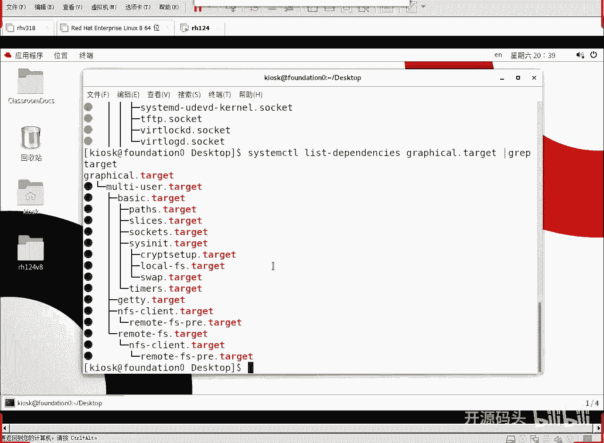
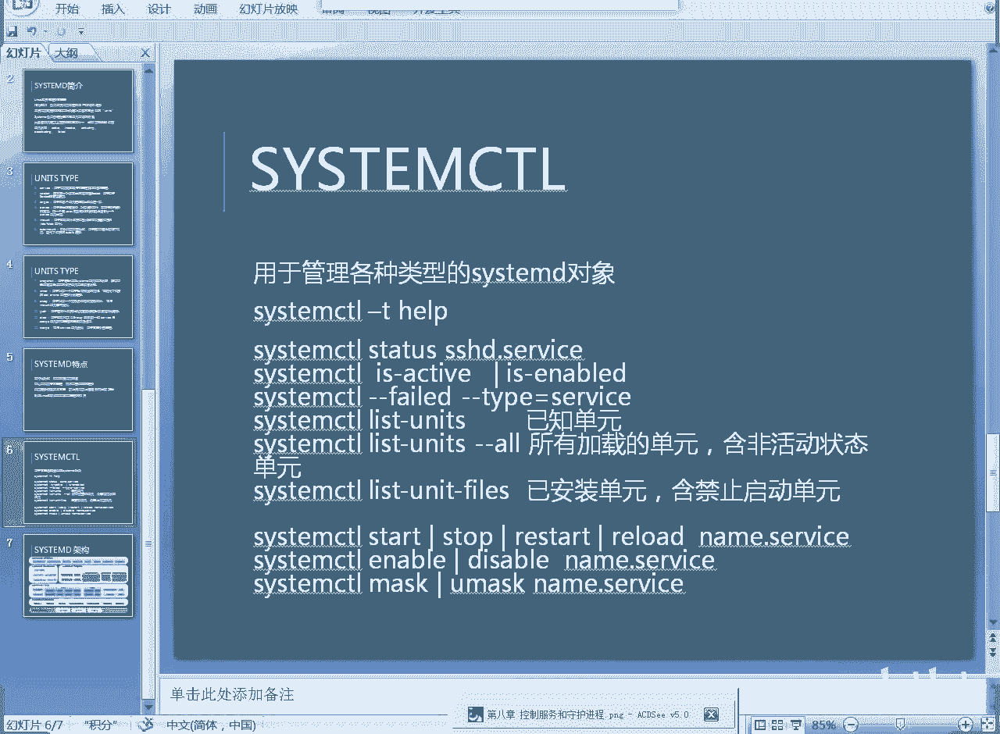
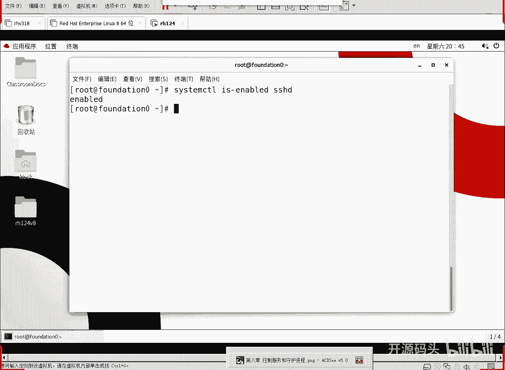
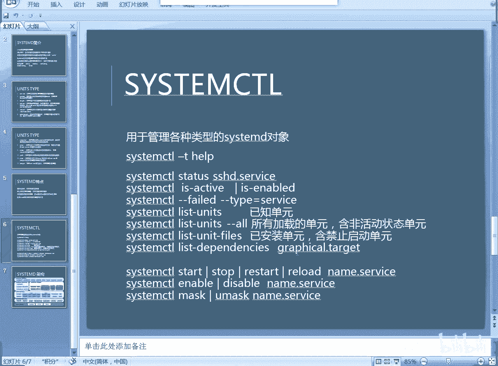
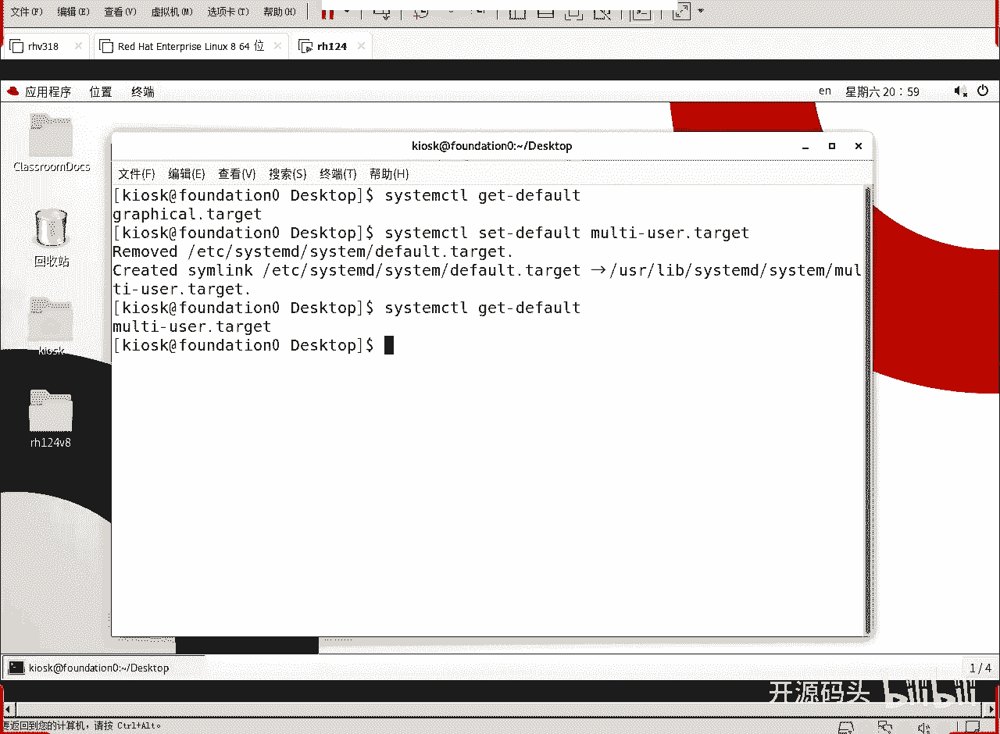
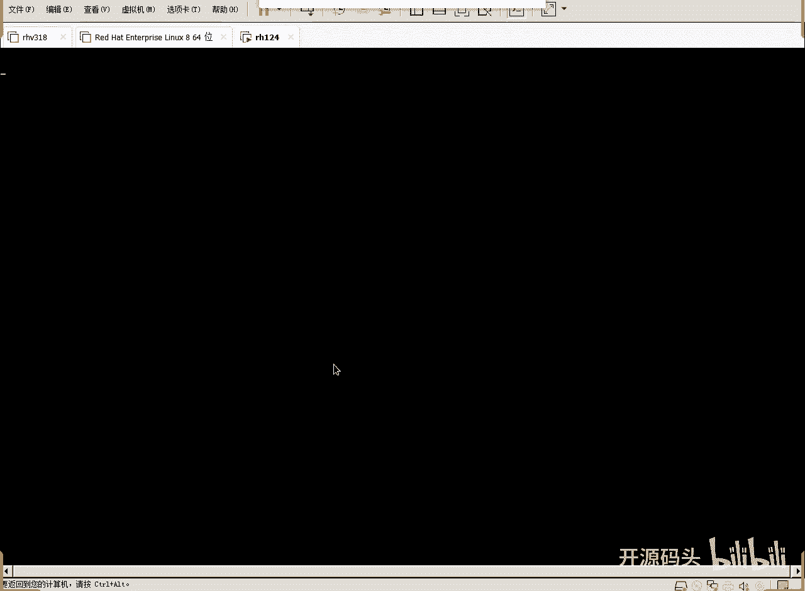
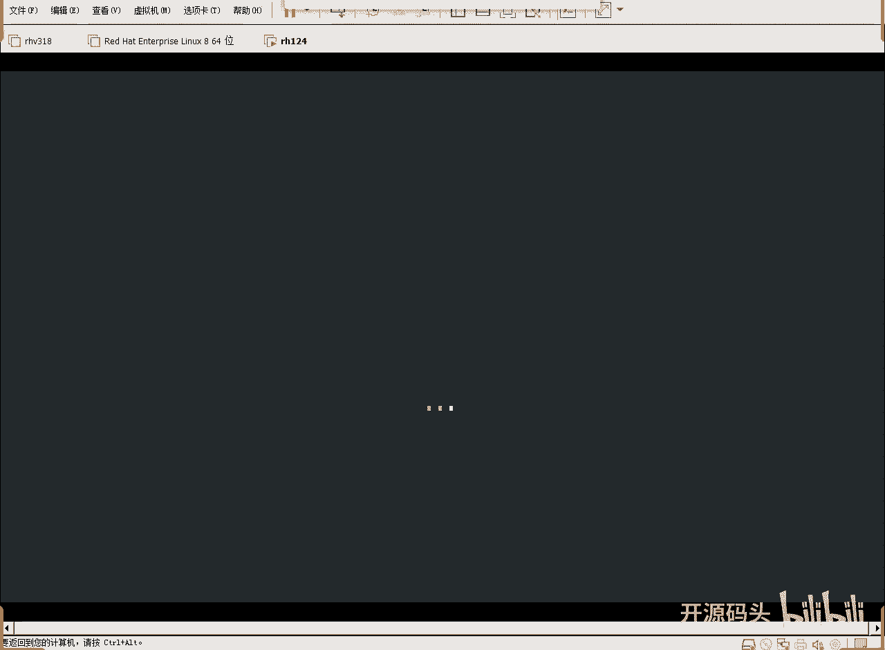
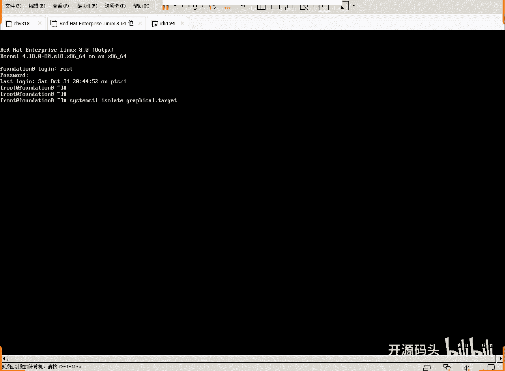
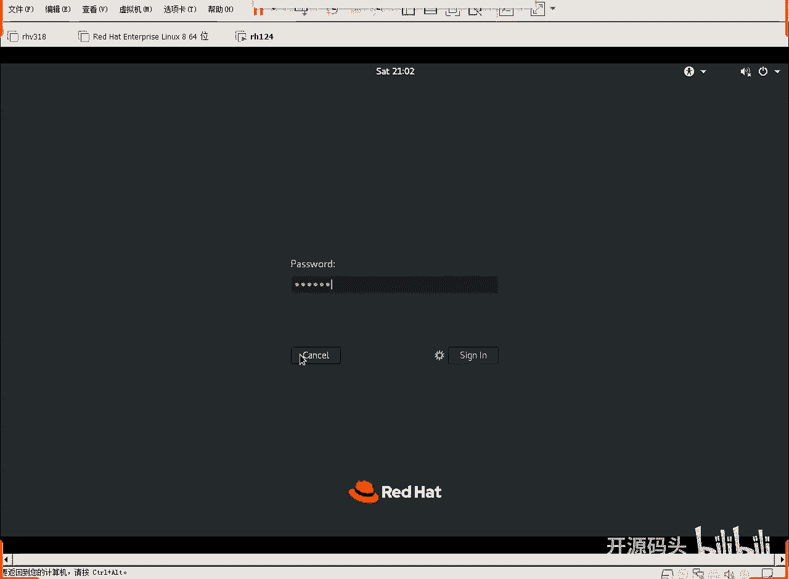
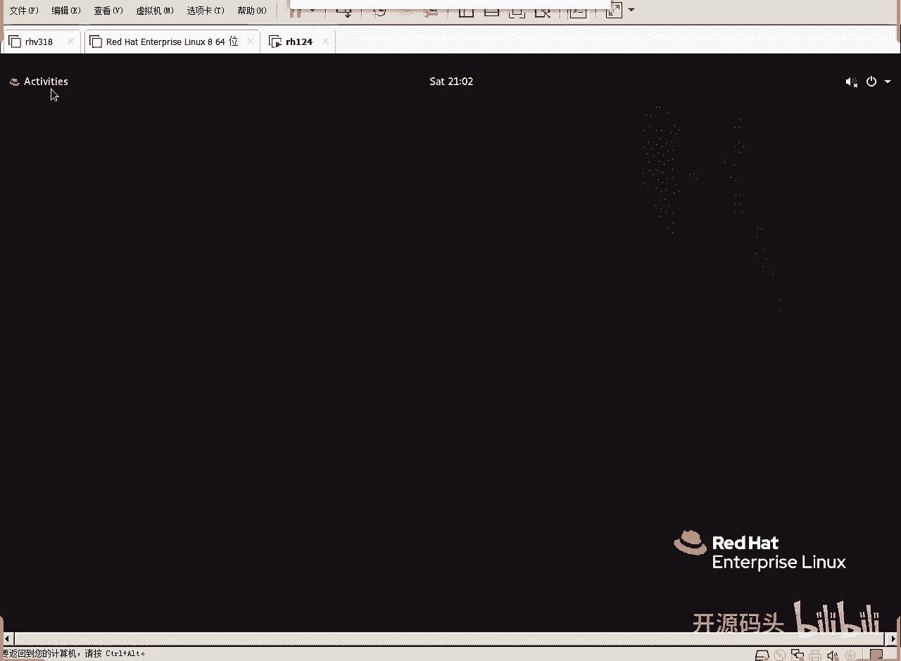

# RHCE RH124 之9 Linuxsystemd进程管理(3).mp4 - P1 - 开源码头 - BV1NB4y1z7xu

OK好，我们继续看一下这个幻灯片。啊，这是我们的单元类型啊，有可能有些单元类型我们没听说过啊，甚至于说觉得它嗯嗯无所依赖是吧？这个东西哎，这些东西是什么概念啊？但整个这个描述完之后。

我们应该对系统启动呢有一个概念，就是它启动过程当中一。有很强的顺序性，对吧？二呢，系统启动之前要做的那些准备工作，它全做了。三呢我们的服务它是啊就是。一个他的是linux系统的一个灵魂操作。

所以说服务这种类型呢也是。比较多是吧？一个是比较多，再一个呢呃比较常见，就是系统启动的时候就要把一些服务给他什么启动了。那有些不常见的呢，其实也不多用它是吧？我们整本书里边。呃。

我们的我们的操作涉及到的就是service。就整个课程里面services涉及到呃target涉及到呃mount涉及到onto mount涉及到啊，还有什么后面的计数器。涉及到啊。

还有什么swipe涉及到啊，别的这些东西呢，我们知道它的存在就可以了啊，我们也也很少有需求去控制这些别的别的环节。啊，呃反而就是什么？就是接近于用户管理和维护的这个操作比较多一些，对吧？

这种类型的东西我们这种类型的资源我们经常会看对吧？比如time，我们刚才已经看了是吧？作为一个计数器的这么一种类型，那它里面有很多计数器，对不对？我们刚才看见就三个是吧？啊，然后service是比较多。

service最多是吧？set次职对不对？好，这就是所谓的各种各样的什么。启动任务啊都由CT的来统筹起调用调度啊统筹调度。那么Ct的特点是什么呢？啊，我们呃。把它区别于之前的系统啊，第一。

Ctem D呢并行化功能很高啊，它可以提高系统的启动速度。虽然说呃我们使用了CtemD的系统，启动的单元数比以前的更多了啊，但是呢启动速度比原来快了，因为什么它是并行化启动啊。

我们cemD之前的那个主进程叫什么叫unitINIT。啊，呃初始化进程那个进程的话呢，它是串新的啊，它是一个事情做完再做另外一个事，再做第三个事。即使说这些事情之间没有必然的这种先后关系啊，相应性关系。

它也是按照这个流程去走。当然它那个特点就是容易排错啊，而我们CTMD的特点呢是用各种各样的单元啊，通过统筹协调各个单元之间的一个关系啊，如果没有。肯定的那种pass联系啊，如果没有这种pass规范啊。

那么它就是并行启动啊，没有相应性关系的话，它就是并行启动。啊，可以呃。按需启动服务进程啊嗯。可以按需启动这个。守护进程啊。而不需要单独的服务。什么意思啊？就CtMD可以直接对服务对这个服务进行控制啊。

不需要单独的这个服务程序啊。自动服务依赖关系管理，防止先启动上层服务而出现超时。啊，就是说这些呃。并行化东西呢又不失什么？不失依赖关系的控制。利用lininux控制组。啊。

就是那个C group来追踪相关进程的情况啊，CTM的呢可以呃追踪到每一个进程工作的详细情况。其实它就是所有进程的副进程啊，从资源管理角度来讲，CT目的是没有任何。障碍去管理所有其他进程的对吧？

所以他可以追踪各个进程的工作情况，而且呢它会有什么专用的这个啊所谓的叫控制组的这种组部件啊去做这个事情。那我们常用的操作也就这些了啊，刚刚刚刚我也演示了是吧，sem d controltl杠T是吧？

sem states啊，这是查看某一个service单元的一个什么工作状态啊，这个其实SSD我们。经常碰是吧？我们没同学们之间去，我登录到对方机器，登录对方登录到我的机器，用的都是SSHH。啊。

这种服务对吧？啊啊，我们可以判断一下这个服务是活动的吗？或者是判断一下这个活动是开机就启动的吗？啊，这叫许可的吧。is enable是许可的吗？啊，我们可以看一下，好吧呃。

数。好。SSTM。按错。嗯，is an keyboard board，然后谁呢SSHGD。好吧。有人说你没有打点service啊，因为service是涉及最多最频繁的一个服务一个呃单元类型。

所以说我们呃不写，它默认就是后面就是service。我们可以看出来这个SSGD这个服务啊，就是我们接入别人登录这个机器的服务呢啊开机就是启动的，是许可的。我们就可以看到这个状态是吧？

啊，还有什么啊，还有我们list on啊，list查列出所有已知单元。后面如果加个杠杠or啊，就是列出所有加载的单元，包括那些非活动状态的单元都能显示出来啊。

这个可能就会比原来那个list unit就怎吧就多一些，是吧？呃，列出呃单元文件啊，就是已安装的单元啊，还有这个禁止启动的这些单元，就是你装到你的机器上的所有的单元啊，不但是这个单元，而且是单元的文件。

就什么没有启的单元也算是吧？禁止不允许启的单元，它也写也算。啊，对于服务的控制，启动一个服务。停止一个服务，重启一个服务，重新加载一个服务的什么配置啊吧，这些东西都是比较常见的操作啊。

所以他们 controltl enableable disable一个服务。musask mask什么意思呢？哎，对一个服务进行什么呃掩盖。有些服务我们不想让它启动。啊。

不想让用户通过ctstar system controll start启动。那我们可以把这个服务呢给他什么给它掩盖mask。啊，给它遮盖起来。这样的话它起的时候呢就会得到一个提示啊，这个服务呢是被。

屏蔽掉。你是不能起他的，除非什么呢？管理员you must把它解了封，解了屏蔽，解了屏蔽的话，这个服务才能启动啊，像这些操作都是比较常见的。但是我们这张呢仅仅就是了解一下嗯CD有这么一个东西啊。

并且呢我们能看到所有的单元啊，而且能看到什么呃不活动的单元，或者是啊装上了并被禁用的那些单元啊，我们都可以去看对不对？啊，这些东西呢，我们就通过list呃命令啊，各种呃单元查看。可以看到是吧？

所以说这些我刚才也给大家演示了一个那个什么就是相应性关系啊，这里面没有这里面没有写那个命令是吧？Ct controltl啊，list。然后我们当时后面加了一个什么grury fish吧。啊。这是列出的。

到某一个单元的相依性的单元有些什么，我们就能看出它的那个先后顺序是吧？啊，那么这些规范应该是pass的规范是吧？pass的属性，对不对？好。

我们第八章呢是一个就是讲解CtemD这种呃ctD的这种天字一号进程，它所负责任务，他所负责的内容的一个呃。概述是吧？啊，我们呢理理解了它里面的不同类型的单元啊，然后呢如何去使用它，调用它啊这些东西。

那这个呢是CtMD的一个呃架构图啊，这个架构图啊，你比如说它的单元单元这里面只列了几个。12345678是吧，8个单元啊，其中target。啊，他就要负责启动target，对吧？

在启动tarett到m euroer之前，先把这些tet先像这个basic得先起了，有了basic才能到m euroer，有了 multi euroer才能到什么grface是吧？

啊这些他各各种不同的tet啊，还有什么呢？还有这些呃。所谓的叫demand进程。啊，dey进程的控制。这种dey进程控制就是所谓的服务服务控制啊，nettwork服务是吧？

登录服务、用户绘画服务、日志服务等等等等各种服务。啊，它这里就没有写我们最常见的一些什么HTP啊什么乱七八糟对吧？啊，还有呢就是这是内核部分是吧？从内核部分，然后它的基础它的工作基础是什么呢？

底层的这些libary。就CtM这些什么函数库啊，像这个库很明显，这是什么东西啊，加密是吧？这个呢。通讯设设置或者叫通讯呃，我们把它叫做通讯的安全封装啊，跟防火墙的作用类似啊。CT嘛他要工作。

他肯定是基于这个东西启动的啊，那么内核先于CT目的启动啊，内核里面呢已经实现了的资源的一种呃管控和什么呃和整理啊，有了这种Cgroup可以对资源进行限制。然后我们启动CTMDCTMD基于这些基本的。

库library库函数库启动之后呢啊去负责解决这些问题。啊，加载相应的配置单元啊，然后基于这些配置单元呢去启动相应的不同的target也好，启动不同的service也好，对吧？这些东西。

那么对于用户来讲啊，用户呢可以通过上面这些命令啊来跟CTMD的主进程进行对话。从而呢能够对CMD所控制的这些单元进行相应的管理，或者是啊修改。啊，就CCTM的应用程序，对吧？

像我们后面会讲这个啊jo controlrl来对日志进行控制管理，对不对啊嗯。loggo in controltl是吧？这些东西有的呢我们可能会讲，有的呢就呃空过了，不讲了啊，但总的来讲。

这就是CTMD的整体来讲他要做的事情是吧？先是科诺把资源呢进行相应的梳理和管控。因为任何一个内核，它都要对资源有一套自己的管理办法管理或者资源的控制思路。我们必须基于他所提供的这种资源啊去使用它。

那么谁来负责维护这个东西呢，维护资源的一个维持资源的一个可持续性。CtMD啊，CTMD本身工作有他自己的一些什么函数库，启动之后，基于我们的那个内核级别的这种配置。启动各个不同的单元的内容。啊。

而我们想对CTD的工作进行。呃，干预我们就需要通过这个CTMD的相关的应用程序。跟他进行对话，从而呢对他所控制的资源进行相应的什么修改或者是控制。啊，那我们这张其实只讲了一个命令。

就是CTM controlttrol。那么ta给我们也了解一下，ta给就是什么？就是所谓的呃。图形界面命令行界面。

那我们就起到某一种tet，那就意味着一种模式是吧？Ct controlrl啊，get default。回车我们能看到我们现在默认的这个状态，就是图形的状态，启动的默认就是图形状态。

那我们可以呢st set come set default把它设置为什么mo user。啊，那么KLK在做这个事情的时候啊，没没权利做啊，需要一个什么？需要一个root密码。这就做操作成功了啊。

也就是说下一次启动，比如说我们get default的时候，下一次启动的时候默认就是命令行模式，而不是图形模式。

我们重启一下吧。

root密码是什么呢？ASIMOV。这是不是就是所谓的命令函模式？对吧命行模式，然后呢我们sstem controll isolator啊。

我们要独立起到greeface这个模式回车这个时候呢图形模式就会被加载起来。

我们现在换一个用户。用root用户登录。root密码是red high，不是不是。A S I M OV。

好，通讯界面登录成功。OK我们今天呢就讲这么多啊，主要是讲那个内核进程CtMD的管理。

